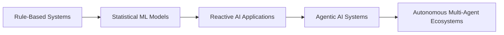
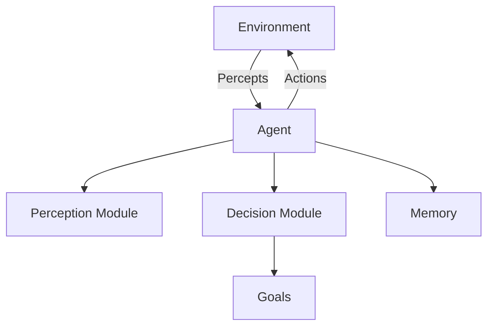
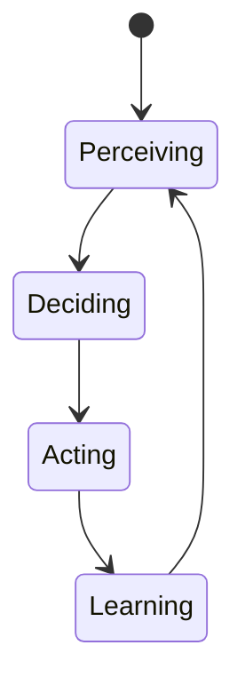
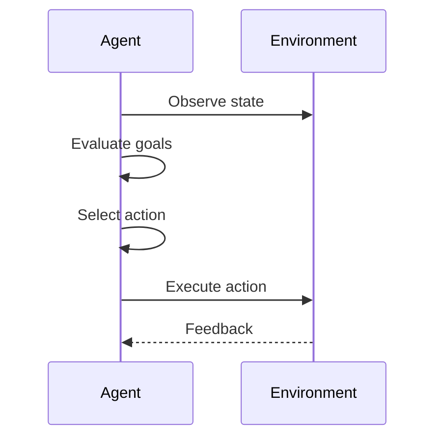

# Introduction to Agentic AI and Autonomous Systems: What Is Agentic AI?

## Learning Objectives

- Define Agentic AI using accepted academic and industry terminology
- Identify at least five core characteristics of agentic systems
- Differentiate agents from non-agent AI applications
- Explain how goal-driven behavior influences agent design
- Recognize real-world examples that qualify as agentic systems

---

## Introduction

This chapter introduces the formal definition of Agentic AI and explains the core characteristics that distinguish agents from conventional AI systems. It sets the conceptual baseline for the entire course.

---

---

Artificial Intelligence has evolved far beyond systems that simply respond to predefined inputs with predefined outputs. Today, we increasingly encounter AI systems that **act**, **decide**, **adapt**, and **pursue goals over time**—sometimes with minimal human intervention. These systems schedule meetings on our behalf, trade stocks autonomously, explore physical environments, manage cloud infrastructure, and even collaborate with other AI systems to solve complex problems.  

This chapter introduces **Agentic AI**, a paradigm that represents a fundamental shift in how we design, understand, and deploy intelligent systems. Instead of viewing AI as a passive tool that executes isolated tasks, Agentic AI frames AI as an **agent**: an entity that exists within an environment, perceives its surroundings, makes decisions, and takes actions to achieve objectives over time.

Understanding Agentic AI is essential because it sets the conceptual foundation for modern autonomous systems, multi-agent architectures, AI copilots, and self-directed software systems. Without a clear mental model of what makes an AI system *agentic*, it becomes difficult to reason about responsibility, safety, scalability, evaluation, and long-term behavior.

This chapter establishes that foundation. We begin by tracing the historical evolution from early rule-based systems to modern agentic systems. We then introduce formal definitions of agents, explore their defining characteristics, explain goal-driven behavior and environmental interaction, and examine real-world examples. Finally, we address common misconceptions that often confuse learners encountering Agentic AI for the first time.

---

By the end of this chapter, you will be able to:

- Define **Agentic AI** using accepted academic and industry terminology  
- Identify **at least five core characteristics** of agentic systems  
- Clearly **differentiate agentic systems from non-agent AI applications**  
- Explain **how goal-driven behavior shapes agent design and architecture**  
- Recognize **real-world systems that qualify as agentic AI** and justify why  

---

## Historical Evolution from Rule-Based Systems to Agentic AI

Early artificial intelligence systems were not designed to *act independently*. Instead, they were built to follow explicit instructions provided by human designers. These systems, often called **rule-based systems**, operated using fixed “if–then” logic. For example, an expert system for medical diagnosis might contain rules such as: *If the patient has symptom A and symptom B, then suggest diagnosis X*. While powerful in narrow domains, these systems had no understanding of goals, no awareness of context beyond encoded rules, and no ability to adapt once deployed.

As computing power increased and data became more abundant, AI research shifted toward **statistical and machine learning approaches**. Systems learned patterns from data rather than relying entirely on handcrafted rules. Supervised learning models could classify images, recognize speech, or predict outcomes with impressive accuracy. However, despite their sophistication, most of these systems were still **reactive**. They performed a task only when prompted and did not initiate actions on their own.

The limitations of reactive AI became increasingly evident as AI systems were deployed in complex, dynamic environments. Consider a recommendation system that predicts what movie you might like. While useful, it does not *decide* when to intervene, adapt its long-term strategy, or coordinate with other systems. Engineers began to realize that many real-world problems—robot navigation, logistics optimization, financial trading, game playing, and digital assistants—require AI systems that can **operate continuously**, **make decisions over time**, and **balance competing objectives**.

This realization led to the resurgence of **agent-based models** in AI research. Influenced by fields such as robotics, control theory, cognitive science, and economics, researchers began framing AI systems as agents embedded in environments. Instead of asking, *“What is the correct output for this input?”*, the guiding question became, *“What action should this agent take now to best achieve its goals?”*

Modern Agentic AI integrates multiple advances:
- Machine learning for perception and prediction  
- Planning algorithms for decision-making  
- Reinforcement learning for learning through interaction  
- Memory systems for persistence over time  
- Tool use and API integration for real-world impact  

Together, these components allow AI systems not just to respond, but to **act autonomously**, making Agentic AI the natural evolution of intelligent systems.

### Evolution Timeline

| Era | Dominant Approach | Key Limitation |
|---|---|---|
| 1950s–1980s | Rule-based expert systems | No adaptability, brittle logic |
| 1990s–2010s | Machine learning models | Reactive, task-specific |
| 2010s–present | Agentic AI systems | Increased complexity and control challenges |

### Conceptual Shift Visualization

This evolution reflects a shift from **static intelligence** to **dynamic, situated intelligence**—a defining feature of Agentic AI.

---

## Formal Definitions of Agents and Agentic Systems

To understand Agentic AI rigorously, we need precise definitions. In academic literature, particularly in artificial intelligence and multi-agent systems, an **agent** is commonly defined as:

> *An entity that perceives its environment through sensors and acts upon that environment through actuators to achieve goals.*

This definition emphasizes three essential elements: perception, action, and goals. An agent is not merely a computational process—it is a system that is **situated** in an environment and capable of influencing it. The environment may be physical (a robot navigating a warehouse) or digital (a software agent managing cloud resources).

An **agentic system**, therefore, is an AI system designed around this agent paradigm. It is structured to continuously observe, decide, and act, often over extended periods of time. Unlike traditional software, which executes a predefined sequence of steps and then terminates, agentic systems are typically **persistent** and **event-driven**.

Different fields emphasize different aspects of agency. In robotics, physical embodiment and sensorimotor control are central. In software agents, autonomy and decision-making are more prominent. In economics and game theory, agents are defined by preferences and utility maximization. Agentic AI unifies these perspectives by focusing on **intentional action under uncertainty**.

Importantly, not all AI systems are agents. A sentiment analysis model that labels text as positive or negative does not qualify as an agent because it:
- Has no goals of its own  
- Does not choose actions  
- Does not persist or adapt beyond inference  

By contrast, an autonomous customer support agent that monitors incoming tickets, decides when to escalate issues, learns from past interactions, and optimizes response strategies **is agentic**.

### Agent vs Non-Agent Systems

| Dimension | Non-Agent AI | Agentic AI |
|---|---|---|
| Execution | On-demand | Continuous |
| Goals | Implicit or external | Explicit and internalized |
| Environment | Abstract or static | Dynamic and interactive |
| Adaptation | Limited | Ongoing |
| Initiative | None | Proactive |

### Structural View of an Agent

This structure highlights that agentic systems are **architectural commitments**, not just behavioral descriptions.

---

## Key Characteristics: Autonomy, Persistence, and Adaptability

One of the most important ways to recognize Agentic AI is by identifying its defining characteristics. Among many possible traits, three stand out as foundational: **autonomy**, **persistence**, and **adaptability**. Together, these characteristics distinguish agentic systems from traditional AI applications.

### Autonomy

Autonomy refers to an agent’s ability to operate **without continuous human control**. An autonomous agent can make decisions independently, selecting actions based on its goals and perceptions rather than explicit instructions at every step. This does not mean the agent is uncontrolled or ungoverned; rather, its behavior is guided by internal decision-making processes.

Autonomy exists on a spectrum. Some agents operate within narrow constraints, such as an email filtering agent that autonomously categorizes messages. Others, like autonomous drones, make complex decisions in real time under uncertainty. What unites them is that humans define **objectives and constraints**, not step-by-step actions.

### Persistence

Persistence means that an agent **exists over time**. It maintains internal state, remembers past interactions, and continues operating even when no immediate task is assigned. This is a crucial departure from traditional programs that execute and terminate.

Persistence enables long-term strategies. A personal finance agent, for example, tracks spending patterns over months, adjusts savings strategies, and anticipates future expenses. Without persistence, such behavior would be impossible.

### Adaptability

Adaptability is the ability to **change behavior based on experience or environmental changes**. This can involve learning new policies, updating beliefs, or revising plans when conditions shift. Adaptability allows agents to operate in environments that are unpredictable or partially observable.

An adaptive agent might:
- Learn that a particular action consistently leads to poor outcomes  
- Adjust its strategy when goals conflict  
- Incorporate new tools or data sources dynamically  

### Characteristics Comparison Table

| Characteristic | Why It Matters | Example |
|---|---|---|
| Autonomy | Reduces need for human micromanagement | Autonomous scheduling assistant |
| Persistence | Enables long-term planning | Smart home energy manager |
| Adaptability | Handles uncertainty and change | Self-learning trading agent |

### Agent Lifecycle Visualization

These characteristics are mutually reinforcing. Autonomy enables persistence; persistence enables adaptation; adaptation strengthens autonomy. Together, they form the behavioral core of Agentic AI.

---

## Goal-Driven Behavior and Environment Interaction

At the heart of Agentic AI lies **goal-driven behavior**. Unlike traditional software that executes predefined workflows, agents are designed to **optimize outcomes** relative to explicit or implicit goals. A goal can be simple (“deliver this package”) or complex (“maximize long-term user satisfaction while minimizing cost and risk”).

Goals serve as the organizing principle for agent behavior. They influence perception (what the agent pays attention to), decision-making (which actions are preferred), and learning (what outcomes are considered successful). In many systems, goals are encoded as **reward functions**, **utility functions**, or **objective hierarchies**.

Interaction with the environment is equally critical. An agent does not operate in isolation—it continuously exchanges information and actions with its surroundings. The environment provides:
- Feedback on actions  
- Constraints on behavior  
- Opportunities for learning  

Environments can be:
- **Fully observable** (e.g., a chessboard)  
- **Partially observable** (e.g., financial markets)  
- **Stochastic** (outcomes involve randomness)  
- **Dynamic** (conditions change over time)  

Designing an agent requires careful consideration of how it perceives and acts within its environment. Sensors may be APIs, databases, or user inputs. Actuators may be API calls, messages, physical movements, or configuration changes.

### Goal-Action Loop

### Goals vs Tasks

| Concept | Description | Example |
|---|---|---|
| Task | One-time instruction | “Translate this document” |
| Goal | Ongoing objective | “Maintain accurate multilingual documentation” |

Understanding goal-driven behavior is essential because it explains **why agents behave differently** from conventional AI. They are not just responding—they are **pursuing**.

---

## Examples of Agentic Behavior in Modern AI Systems

Agentic AI is not theoretical—it is already embedded in many modern systems. One prominent example is **autonomous customer support agents** used by large technology companies. These agents monitor incoming requests, categorize issues, decide when to respond automatically, when to escalate to humans, and how to learn from feedback.

Another example is **autonomous trading systems**. These agents continuously monitor markets, assess risk, execute trades, and adjust strategies based on performance and changing conditions. They operate persistently, adapt to new data, and pursue explicit financial goals.

A third example is **robotic warehouse systems**. Each robot functions as an agent that navigates the environment, avoids obstacles, coordinates with other robots, and optimizes delivery routes. The system as a whole is a **multi-agent ecosystem**.

### Case Study: Autonomous IT Operations Agent

## Case Study: Autonomous IT Operations in a Global SaaS Company

### Context
In the late 2010s, a global Software-as-a-Service (SaaS) provider faced increasing operational complexity. The company operated hundreds of microservices across multiple cloud regions, serving millions of users worldwide. Human operators struggled to monitor system health, respond to incidents, and optimize resource usage in real time.

### Problem
Traditional monitoring tools generated alerts but did not act. Engineers were overwhelmed by false positives, slow incident resolution, and escalating cloud costs. Manual intervention could not scale with system complexity. The company needed a system that could **observe**, **decide**, and **act autonomously**.

### Solution
The company developed an autonomous IT operations agent. The agent continuously monitored metrics such as latency, error rates, and resource utilization. It was given goals: maximize uptime, minimize cost, and reduce human intervention. Using reinforcement learning and rule-based constraints, the agent learned when to scale services, restart components, or reroute traffic.

### Results
Incident response times dropped by over 40%. Cloud costs were reduced through smarter scaling decisions. Most importantly, human engineers were freed to focus on strategic improvements rather than firefighting.

### Lessons Learned
The project demonstrated that agentic systems excel in complex, dynamic environments. However, careful constraint design and transparency were essential to maintain trust and safety.

---

## Common Misconceptions about Agentic AI

Despite growing interest, Agentic AI is often misunderstood. One common misconception is that agentic systems are **fully autonomous and uncontrollable**. In reality, well-designed agents operate within carefully defined constraints, policies, and oversight mechanisms.

Another misconception is that **any AI that uses machine learning is agentic**. As discussed earlier, learning alone does not make a system an agent. Without goals, persistence, and action, a system remains non-agentic.

A third misunderstanding is that agentic AI requires physical embodiment. While robots are classic examples, many agentic systems are purely software-based.

### Myth vs Reality

| Myth | Reality |
|---|---|
| Agents are uncontrollable | Agents operate within constraints |
| All ML systems are agents | Only goal-driven, persistent systems qualify |
| Agents must be robots | Software agents are common |

Understanding these misconceptions helps prevent overhype and supports responsible design.

---

## Summary

Agentic AI represents a fundamental shift from reactive tools to autonomous, goal-driven systems. By tracing its historical evolution, defining its formal structure, exploring its core characteristics, and examining real-world examples, we establish a clear conceptual baseline. Agentic systems are autonomous, persistent, adaptable entities that interact with environments to pursue goals over time. Recognizing what truly makes an AI system agentic is essential for designing, evaluating, and governing the intelligent systems of the future.

---

## Reflection Questions

1. In what ways does persistence change how an AI system should be evaluated?
2. Can a system be partially agentic? Why or why not?
3. How do goals influence ethical considerations in agent design?
4. What risks arise when agent autonomy increases?
5. Identify a system you use daily—could it be redesigned as an agentic system?