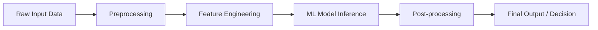
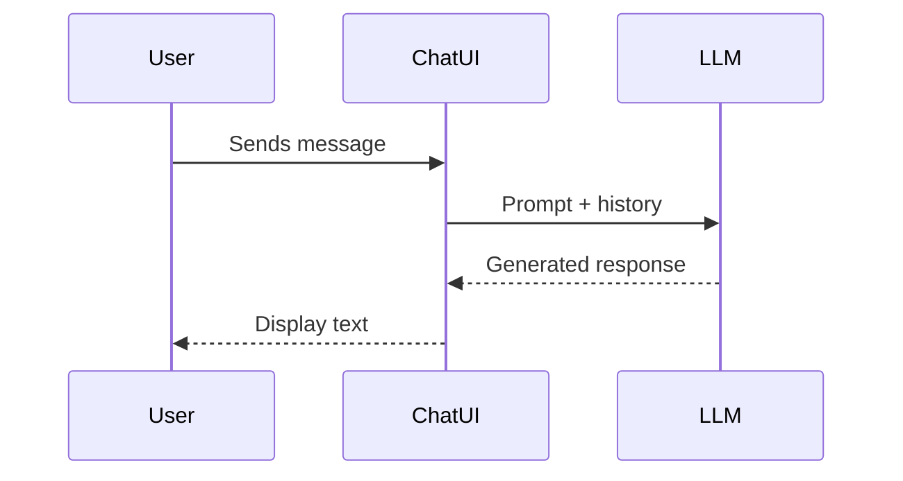
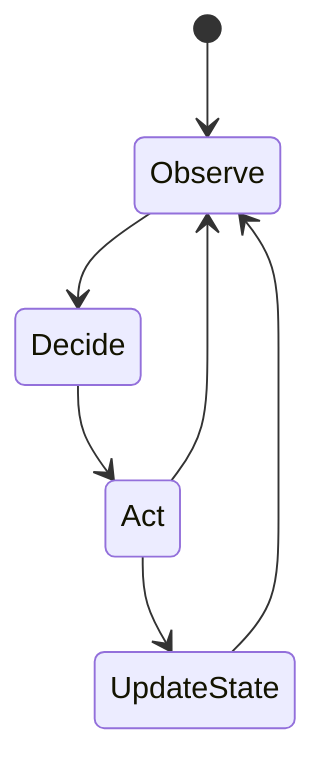
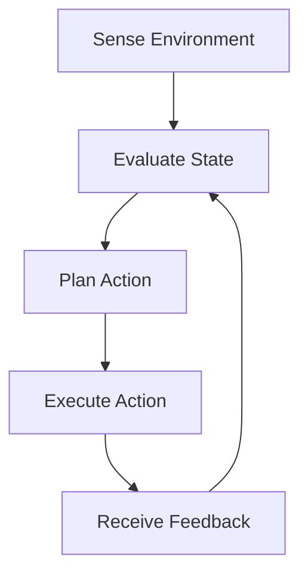
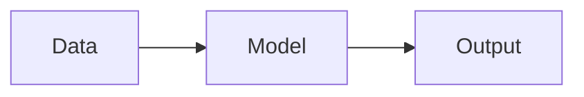
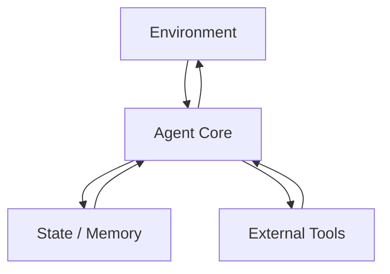

# Agentic AI vs Traditional AI and LLM Applications

Artificial Intelligence has evolved through several distinct paradigms over the past decades. Early AI systems focused on rigid rules and symbolic reasoning. Later, machine learning introduced data-driven models capable of recognizing patterns and making predictions. Most recently, large language models (LLMs) and agentic AI systems have pushed AI beyond static prediction into the realm of dynamic reasoning, planning, and autonomous action.

This chapter is designed to help you **clearly distinguish agentic AI systems from traditional AI pipelines and chat-based LLM applications**. While all of these systems may appear similar on the surface—accepting inputs and producing outputs—their **architectural foundations, control flows, and behavioral capabilities** are fundamentally different. Understanding these differences is critical for designing effective AI solutions and avoiding inappropriate or over-engineered systems.

We will start with the simplest paradigm—traditional task-specific AI pipelines—then progressively move toward chat-based LLM applications, and finally to fully agentic, stateful, autonomous systems. Along the way, we will explore why agentic AI is powerful, when it is unnecessary or harmful, and how to reason about the right approach for a given problem.

By the end of this chapter, you will be able to:

- Compare traditional AI pipelines with agentic architectures at both conceptual and architectural levels  
- Identify key limitations of chat-based LLM applications  
- Explain why statefulness is a foundational requirement for agentic systems  
- Analyze how decision flow differs across traditional AI, chat-based systems, and agentic AI  
- Select appropriate use cases where agentic AI is beneficial—and where it should be avoided  

---

## Traditional AI Pipelines and Task-Specific Models

Traditional AI pipelines represent the **most established and widely deployed form of AI in industry today**. These systems are typically designed to solve a *single, well-defined task* using a structured flow of data processing and inference. To understand why agentic AI is fundamentally different, we must first deeply understand how traditional AI systems work, why they were successful, and where their limitations lie.

### Concept and Historical Context

Traditional AI pipelines emerged from the need to automate **specific, repeatable decisions**. Examples include classifying emails as spam, detecting fraud in transactions, predicting customer churn, or recognizing objects in images. These systems gained popularity because they were **predictable, measurable, and controllable**, which aligned well with enterprise and regulatory requirements.

Historically, these pipelines evolved alongside supervised machine learning. Engineers would:
1. Define a task
2. Collect labeled data
3. Train a model
4. Deploy the model
5. Monitor performance

The emphasis was always on **accuracy for a predefined output**, not on autonomy or reasoning.

### How Traditional AI Pipelines Work (Step-by-Step)

A traditional AI pipeline typically follows a linear and deterministic flow:

- **Input acquisition**: Raw data is collected (e.g., images, transactions, sensor readings)
- **Preprocessing**: Data is cleaned, normalized, and transformed
- **Feature extraction**: Relevant attributes are derived from raw data
- **Model inference**: A trained model produces an output (classification, prediction, score)
- **Post-processing**: Results are formatted or thresholded
- **Action or decision**: A downstream system consumes the output

This pipeline does **not change its structure during execution**. It always follows the same steps, regardless of the outcome.

### Key Characteristics

Traditional AI pipelines share several defining traits:

- **Stateless execution**
  - Each inference is independent
  - No memory of previous interactions
- **Fixed control flow**
  - No branching decisions based on reasoning
- **Task specificity**
  - One model, one task
- **Human-defined objectives**
  - The system never redefines its goals
- **Low autonomy**
  - The system does not initiate actions

### Practical Examples

1. **Credit Scoring System**  
   A bank uses a model that takes customer data and outputs a risk score. The system does not ask follow-up questions, explore alternatives, or revise its decision.

2. **Manufacturing Quality Control**  
   A computer vision model flags defective items on a conveyor belt. Each image is processed independently.

3. **Recommendation Engines (Early Versions)**  
   Systems that recommend products based on static features without exploration or long-term planning.

### Advantages and Limitations

| Aspect | Strengths | Limitations |
|------|-----------|-------------|
| Predictability | Highly predictable outputs | Cannot adapt dynamically |
| Governance | Easy to audit and regulate | Limited reasoning |
| Performance | Efficient and scalable | Narrow intelligence |
| Maintenance | Stable once deployed | Requires retraining for new conditions |

Traditional pipelines are excellent when:
- The task is stable
- The environment is predictable
- The decision logic does not require iteration or planning

However, they struggle in **open-ended, evolving, or multi-step environments**—a gap that later paradigms attempt to fill.

---

## Chat-Based LLM Applications and Limitations

Chat-based LLM applications represent a major leap forward in **natural language understanding and generation**. These systems feel intelligent because they can converse fluently, explain concepts, and generate creative content. However, despite their apparent sophistication, chat-based applications are **not agentic systems**.

Understanding what they *can* and *cannot* do is crucial to avoiding architectural misconceptions.

### Emergence of Chat-Based LLMs

Large Language Models emerged from advances in deep learning, transformers, and massive-scale training. Chat interfaces made these models accessible by allowing users to interact with them using natural language instead of code or structured inputs.

This led to a widespread belief that conversational ability equals intelligence or autonomy. In reality, chat-based LLMs are still **single-turn inference engines wrapped in a conversational interface**.

### How Chat-Based LLM Applications Work

At a technical level, a chat-based LLM application:

- Receives user input (prompt)
- Optionally prepends conversation history
- Performs probabilistic next-token prediction
- Outputs text
- Ends execution

Each response is generated **without persistent internal state** unless explicitly simulated by external memory.

### Limitations of Chat-Based LLM Applications

Despite their flexibility, chat-based systems have significant constraints:

- **No intrinsic goals**
  - They respond; they do not act
- **No persistent memory**
  - Past interactions are not internalized
- **No control loop**
  - They cannot decide what to do next
- **No environment awareness**
  - They do not observe real-world changes
- **No self-initiation**
  - They wait for user prompts

### Concrete Examples

1. **Customer Support Chatbot**  
   Can answer FAQs but cannot track unresolved issues across sessions without external systems.

2. **Code Assistant**  
   Can suggest code but cannot run tests, debug autonomously, or deploy fixes.

3. **Personal Productivity Chatbot**  
   Can suggest plans but cannot execute tasks or monitor progress.

### Why These Limitations Matter

Chat-based LLMs are often misused as “agents” when they are actually **interfaces**, not autonomous systems. This leads to:

- Overly complex prompts
- Fragile workflows
- Hidden manual steps
- Illusion of autonomy without real execution

| Capability | Chat-Based LLM | Agentic System |
|-----------|---------------|----------------|
| Persistent state | ❌ | ✅ |
| Self-directed actions | ❌ | ✅ |
| Multi-step planning | Limited | Native |
| Environmental feedback | ❌ | ✅ |

Chat-based LLMs are best seen as **powerful reasoning components**, not complete systems.

---

## Control Flow and Statefulness in Agentic Systems

Agentic AI systems represent a fundamental shift: from **responding to inputs** to **controlling behavior over time**. The defining characteristics of agentic systems are **statefulness** and **control flow**.

### What Is an Agentic System?

An agentic system is an AI system that:

- Maintains internal state
- Observes its environment
- Makes decisions over time
- Takes actions
- Evaluates outcomes
- Adjusts behavior

This mirrors how humans operate: we remember, plan, act, and adapt.

### Why Statefulness Is Critical

State allows an agent to:

- Remember past actions
- Track progress toward goals
- Avoid repeating mistakes
- Coordinate long-term strategies

Without state, intelligence collapses into reactive behavior.

### Control Flow in Agentic Systems

Control flow in agentic systems is **dynamic**, not predefined. Decisions influence future decisions.

Key elements include:

- **Perception loop**
- **Decision policy**
- **Action execution**
- **Feedback integration**
- **State update**

This enables behaviors such as exploration, retries, escalation, and self-correction.

### Practical Examples

1. **Autonomous IT Remediation Agent**
   - Detects system failures
   - Attempts fixes
   - Monitors outcomes
   - Escalates if unresolved

2. **Research Agent**
   - Plans research steps
   - Searches sources
   - Refines hypotheses
   - Produces a final report

3. **Game-Playing Agent**
   - Maintains game state
   - Plans moves
   - Reacts to opponent strategies

---

## Continuous Decision-Making vs Single-Turn Inference

One of the most important distinctions between agentic AI and other systems is **time**. Traditional and chat-based systems operate in discrete moments. Agentic systems operate continuously.

### Single-Turn Inference

Single-turn inference systems:

- Process input once
- Produce output
- Terminate execution

This is computationally efficient but behaviorally limited.

### Continuous Decision-Making

Agentic systems operate in loops:

- Sense
- Think
- Act
- Learn
- Repeat

This allows adaptation to changing environments.

### Comparison Table

| Dimension | Single-Turn Systems | Agentic Systems |
|---------|--------------------|----------------|
| Time horizon | Instant | Long-term |
| Adaptability | None | High |
| Feedback usage | Minimal | Core |
| Autonomy | Low | High |

---

## Architectural Comparison Through Diagrams

Visualizing architectures makes differences concrete.

### Traditional Pipeline Architecture

### Chat-Based LLM Application Architecture

### Agentic AI Architecture

| Architecture | Flexibility | Autonomy | Complexity |
|-------------|-------------|----------|------------|
| Traditional | Low | None | Low |
| Chat-Based | Medium | Low | Medium |
| Agentic | High | High | High |

---

## When Not to Use Agentic AI

Agentic AI is powerful—but **not always appropriate**.

### Situations Where Agentic AI Is a Bad Fit

- Stable, well-defined tasks
- Strict regulatory environments
- Cost-sensitive systems
- Low-risk decision-making
- Simple automation needs

### Risks of Overusing Agentic AI

- Increased system complexity
- Harder debugging
- Unpredictable behavior
- Higher operational costs

### Rule of Thumb

> If a system does not need memory, planning, or autonomy—do not make it agentic.

---

## Case Study: From Chatbot to Autonomous IT Operations Agent

### Context

A mid-sized SaaS company operated a cloud-based platform serving thousands of enterprise clients. Their infrastructure was complex, consisting of microservices, databases, and third-party integrations. System outages, while infrequent, caused significant customer dissatisfaction and revenue loss.

Initially, the company deployed a **chat-based LLM assistant** for on-call engineers. The assistant could explain logs, suggest fixes, and summarize incidents. Engineers interacted with it during outages to speed up diagnosis.

### Problem

Despite its usefulness, the chatbot could not:
- Monitor systems proactively
- Track unresolved issues
- Execute fixes
- Learn from past incidents

Engineers still had to manually intervene at every step. During major incidents, the chatbot became a passive reference tool rather than an active participant.

### Solution

The company transitioned to an **agentic AI system**:

1. The agent continuously monitored metrics and logs.
2. When anomalies were detected, it formed hypotheses.
3. It executed safe remediation actions.
4. It observed outcomes and retried if necessary.
5. It escalated to humans only when needed.

The LLM became a **reasoning module inside the agent**, not the system itself.

### Results

- Mean time to resolution dropped by 45%
- On-call engineer load reduced significantly
- System reliability improved
- Incidents became learning opportunities

### Lessons Learned

- LLMs are powerful components, not complete agents
- State and control flow unlock real autonomy
- Agentic AI should augment—not replace—human oversight

---

## Summary

In this chapter, we explored the evolution from traditional AI pipelines to chat-based LLM applications and finally to agentic AI systems. We learned that:

- Traditional AI excels at narrow, well-defined tasks
- Chat-based LLMs provide powerful language interaction but lack autonomy
- Agentic systems introduce state, control flow, and continuous decision-making
- Architectural differences determine behavioral capabilities
- Agentic AI should be used thoughtfully and selectively

Understanding these distinctions is essential for designing AI systems that are **effective, maintainable, and appropriate for their context**.

---

## Reflection Questions

1. What risks arise when chat-based LLMs are mistakenly treated as autonomous agents?  
2. How does statefulness change the nature of decision-making in AI systems?  
3. Can you identify a system in your organization that should *not* be agentic? Why?  
4. What trade-offs would you consider before deploying an agentic system in production?  
5. How might agentic AI change the role of human operators over time?