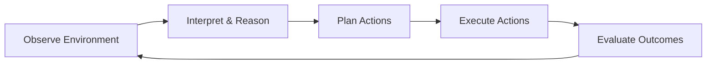
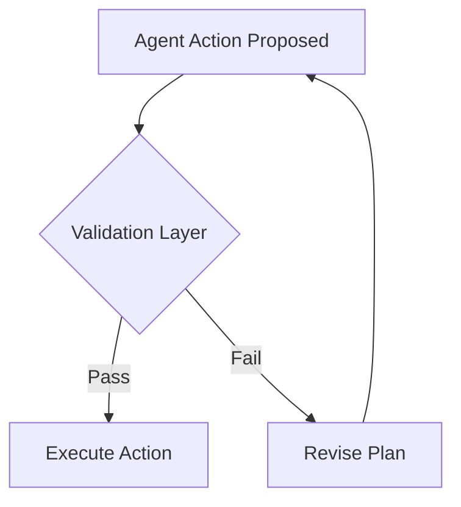
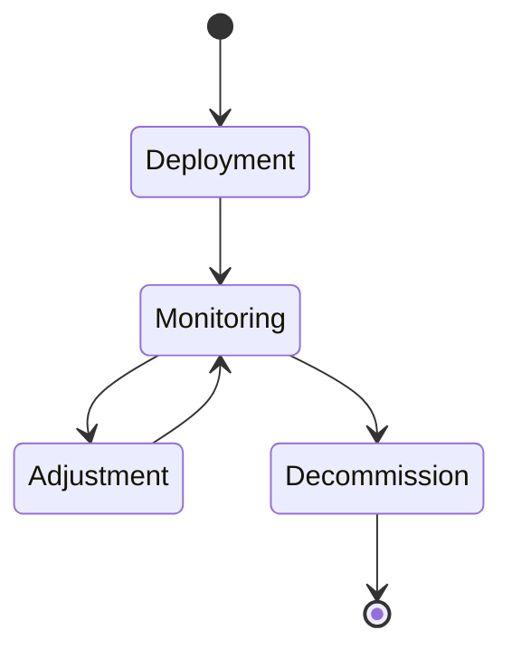

# Real-World Use Cases and Current Limitations

Over the past decade, artificial intelligence has moved from being a largely passive tool—responding to user queries or executing predefined scripts—toward something far more dynamic and autonomous. This shift has given rise to **Agentic AI**: systems designed not only to generate outputs, but to *act*, *decide*, *plan*, and *adapt* toward achieving goals in complex, real-world environments. These systems are often described as **autonomous agents** because they operate with a degree of independence from direct human control.

Agentic AI now appears in many familiar places: research assistants that design experiments, enterprise agents that coordinate workflows, and consumer tools that book travel, manage finances, or control smart homes. At the same time, these systems raise significant questions. Can we trust an agent to act reliably? What happens when it fails? How do latency, cost, and uncertainty limit real-world deployment? And how do humans feel about delegating meaningful decisions to machines?

This chapter surveys **real-world applications of Agentic AI** while critically examining their **technical, operational, and ethical limitations**. Rather than focusing only on what is possible, we will explore what is *actually deployed today*, what works well, what breaks down, and why. By the end of this chapter, you should have a balanced, realistic understanding of Agentic AI—not as science fiction, but as an evolving technology with both promise and constraints.

By the end of this chapter, you will be able to:

- Identify at least three real-world applications of Agentic AI across research, enterprise, and consumer domains  
- Analyze the strengths and weaknesses of deployed agentic systems  
- Explain key technical limitations of current agents, including reliability and latency  
- Assess operational risks and maintenance challenges in real-world environments  
- Summarize future directions and open research problems in Agentic AI  

---

## Agentic AI in Research, Enterprise, and Consumer Tools

Agentic AI systems differ from traditional AI tools in one crucial way: they are **goal-directed and action-oriented**. Instead of producing a single output and stopping, an agent observes its environment, decides what to do next, takes action, evaluates results, and iterates. This loop—often called *sense–think–act*—is what enables agents to function in complex, changing contexts.

Historically, early AI systems were either rule-based (explicit if–then logic) or narrow machine learning models trained for specific tasks. The emergence of large language models (LLMs), reinforcement learning, and tool-invocation frameworks made it possible to build agents that can reason in natural language, plan multi-step tasks, and interact with software systems. As a result, agentic AI began to appear simultaneously in research labs, enterprises, and consumer products.

### Agentic AI in Research Environments

In research settings, agentic AI often acts as an **intellectual collaborator**. These agents assist scientists and engineers by automating repetitive cognitive tasks, exploring hypotheses, and coordinating experiments.

Common research applications include:

- Literature review agents that continuously scan new publications and summarize findings  
- Experimental design agents that propose hypotheses and parameter sweeps  
- Simulation agents that run thousands of scenarios to explore design spaces  

For example, in materials science, agents are used to autonomously propose new material compositions, simulate their properties, and refine proposals based on results. The agent behaves much like a junior researcher: it does not “understand” chemistry in a human sense, but it can iteratively search a vast space faster than any person.

Why this matters is scale and speed. Research domains are increasingly data-rich and computationally intensive. Agentic AI helps researchers move from *manual exploration* to *continuous discovery*. However, these systems still require careful oversight, because they can confidently pursue flawed assumptions if initial goals are poorly defined.

### Agentic AI in Enterprise Systems

In enterprise contexts, agentic AI is often embedded in **workflow automation and decision support**. Unlike traditional automation, which follows rigid scripts, agents can adapt to exceptions, negotiate trade-offs, and coordinate across systems.

Typical enterprise use cases include:

- Customer support agents that resolve tickets end-to-end  
- Supply chain agents that monitor inventory, forecast demand, and place orders  
- IT operations agents that detect incidents, diagnose root causes, and trigger fixes  

An enterprise agent may monitor dashboards, query databases, call APIs, and escalate to humans only when uncertainty or risk is high. This is particularly valuable in large organizations, where information is fragmented across tools and teams.

However, enterprise environments expose limitations quickly. Data may be inconsistent, APIs may fail, and organizational rules may conflict. An agent that works well in a demo can struggle in production without extensive guardrails and monitoring.

### Agentic AI in Consumer Products

For consumers, agentic AI often appears as **personal assistants**. These agents aim to reduce cognitive load by handling everyday tasks autonomously.

Examples include:

- Travel agents that plan trips, book flights, and handle changes  
- Financial agents that track spending and optimize budgets  
- Smart home agents that adapt lighting, temperature, and energy usage  

A useful analogy is a human assistant who understands your preferences and acts proactively. However, unlike a human assistant, today’s AI agents lack deep contextual awareness and emotional intelligence. They rely on probabilistic reasoning, which can lead to surprising or frustrating behaviors.

Despite these challenges, consumer agents are popular because even imperfect autonomy can save time. The key trade-off is convenience versus control: users must decide how much authority to delegate.

### Comparing Agentic AI Across Domains

The following table highlights how agentic AI differs across research, enterprise, and consumer settings:

| Domain        | Primary Goal                     | Environment Complexity | Risk Tolerance | Human Oversight |
|--------------|----------------------------------|------------------------|----------------|-----------------|
| Research     | Accelerate discovery              | High (open-ended)      | Medium         | High            |
| Enterprise   | Optimize operations               | Very high (messy data) | Low            | Medium          |
| Consumer     | Convenience and personalization   | Medium                 | Very low       | Low to medium   |

---

### High-Level Agentic AI Loop (Conceptual View)

This loop underlies all agentic systems, regardless of domain. What differs is the environment, the cost of mistakes, and the degree of human supervision.

---

## Case Studies of Deployed Agentic Systems

To move beyond abstract descriptions, it is essential to examine **real deployed systems**. Case studies reveal not only technical design choices, but also organizational pressures, user reactions, and unexpected failure modes.

---

## Case Study: Autonomous Research Agent in Drug Discovery

### Context

In the early 2020s, pharmaceutical companies faced mounting pressure to reduce the time and cost required to develop new drugs. Traditional drug discovery is slow, often taking over a decade from initial hypothesis to approved medication. A mid-sized biotech company partnered with an AI research lab to deploy an **autonomous research agent** to accelerate early-stage drug discovery.

The agent was designed to operate in a highly complex scientific environment. It had access to molecular databases, simulation tools, and internal experimental results. Importantly, it was not meant to replace scientists, but to act as a tireless collaborator that could explore ideas continuously.

### Problem

The central problem was **search complexity**. The number of possible molecular structures is astronomically large, far beyond what human teams can explore manually. Traditional computational pipelines required experts to specify each step, creating bottlenecks.

Additionally, human researchers struggled with cognitive bias. They tended to explore familiar molecular families, overlooking unconventional but promising candidates. The company needed a system that could explore broadly, learn from results, and adjust strategies dynamically.

### Solution

The solution was an agentic system built around a planning-and-feedback loop. The agent:

1. Generated hypotheses about promising molecular structures  
2. Ran simulations to predict binding affinity and toxicity  
3. Ranked candidates based on multiple objectives  
4. Proposed laboratory experiments for validation  
5. Incorporated experimental feedback into future plans  

Crucially, the agent was constrained by **scientist-defined guardrails**. It could not schedule experiments without approval, and its reasoning traces were logged for review. This hybrid approach balanced autonomy with safety.

### Results

Within six months, the agent identified several novel candidate molecules that human teams had not considered. Simulation throughput increased dramatically, and researchers reported spending more time on interpretation rather than setup.

However, limitations were evident. The agent sometimes optimized for simulation metrics that did not translate well to real-world lab results. Latency between experiments slowed learning loops, and scientists had to intervene frequently to adjust objectives.

### Lessons Learned

The key lesson was that **agentic AI excels at exploration, not judgment**. When paired with human expertise, it expanded the search space and surfaced new ideas. When left unchecked, it could pursue misleading objectives.

This case illustrates a broader principle: agentic systems are most effective when designed as *partners*, not replacements.

---

## Technical Limitations: Reliability and Latency

Despite impressive demonstrations, today’s agentic AI systems face fundamental technical constraints. Two of the most significant are **reliability** and **latency**. These limitations arise not from poor engineering alone, but from the probabilistic nature of modern AI models and the complexity of real-world environments.

### Reliability: Consistency and Correctness

Reliability refers to an agent’s ability to behave consistently and correctly across situations. Unlike traditional software, agentic AI systems often rely on stochastic models. This means the same input can produce different outputs at different times.

Several factors undermine reliability:

- **Model uncertainty**: LLMs generate plausible responses, not guaranteed truths  
- **Tool failures**: APIs, databases, or external systems may be unavailable  
- **Goal misinterpretation**: Ambiguous objectives can lead to unintended actions  

An analogy is a highly capable intern who sometimes misunderstands instructions but speaks confidently. Without supervision, mistakes can propagate quickly.

### Latency: Time-to-Action

Latency is the delay between observation and action. In agentic systems, latency accumulates across multiple steps:

1. Interpreting input  
2. Reasoning and planning  
3. Calling tools or APIs  
4. Waiting for responses  

In consumer tools, latency affects user experience. In enterprise or safety-critical systems, it can make agents unusable. For example, an incident-response agent that takes minutes to diagnose a problem may be worse than a human operator.

### Trade-offs Between Reliability and Speed

Improving reliability often increases latency. Adding verification steps, human approval, or redundant checks slows the system. Conversely, optimizing for speed may reduce safeguards.

| Design Choice             | Improves Reliability | Increases Latency |
|---------------------------|----------------------|-------------------|
| Human-in-the-loop         | Yes                  | Yes               |
| Multiple model consensus  | Yes                  | Yes               |
| Single fast model         | No                   | No                |

Designers must choose trade-offs based on context and risk tolerance.

---

### Reliability Control Flow (Simplified)

---

## Operational Risks and Maintenance Challenges

Deploying agentic AI in the real world introduces operational challenges that go far beyond model accuracy. These systems are **living systems**: they interact with changing environments, evolving data, and human organizations.

### Continuous Monitoring and Drift

One major risk is **behavioral drift**. As environments change, an agent’s learned strategies may become suboptimal or dangerous. For example, a pricing agent trained on historical data may behave poorly during market shocks.

Operational teams must monitor:

- Action distributions over time  
- Failure rates and near-misses  
- Alignment with business or ethical goals  

This requires infrastructure, not just models.

### Maintenance and Cost

Agentic systems are expensive to maintain. They often rely on multiple models, external tools, and orchestration layers. Each component can fail independently.

Costs include:

- Compute and API usage  
- Human oversight and review  
- Updating prompts, rules, and constraints  

Without careful design, maintenance costs can outweigh benefits.

### Security and Abuse Risks

Agents with action capabilities can be abused. A compromised agent might leak data, execute harmful actions, or be manipulated via prompt injection. This makes security a central operational concern.

---

### Agent Lifecycle in Production

---

## Human Trust and Usability Concerns

Even if an agent works technically, it must be **trusted and usable** by humans. Trust is not automatic; it emerges from consistent, transparent, and understandable behavior.

### The Trust Gap

Users often either over-trust or under-trust agents. Over-trust leads to complacency, while under-trust negates benefits. This is known as the *automation trust gap*.

Factors influencing trust include:

- Explainability of actions  
- Predictability of behavior  
- Ease of intervention  

### Usability and Cognitive Load

Ironically, poorly designed agents can increase cognitive load. Users may spend more time supervising than doing the task themselves. Clear interfaces, meaningful summaries, and simple controls are essential.

### Ethical and Emotional Dimensions

Humans attribute intent and personality to agents. This can lead to emotional attachment or misplaced responsibility. Designers must be careful not to mislead users about an agent’s capabilities or understanding.

---

## Future Directions and Open Research Problems

Agentic AI is still in its early stages. Many open research problems remain, spanning technical, social, and philosophical dimensions.

### Toward More Reliable Agents

Future research focuses on:

- Formal verification of agent behavior  
- Hybrid symbolic–neural reasoning  
- Better uncertainty estimation  

### Scaling Autonomy Safely

As agents gain more autonomy, governance becomes critical. How do we set boundaries? Who is accountable when things go wrong?

### Human–Agent Collaboration

The most promising direction is **co-adaptation**: systems that learn not only about tasks, but about human preferences, trust levels, and feedback styles.

---

## Summary

Agentic AI represents a significant shift from passive tools to active, goal-directed systems. Today, these agents are already deployed in research, enterprise, and consumer contexts, delivering real value while exposing serious limitations. Through detailed case studies, we saw how autonomy can accelerate discovery—but also how reliability, latency, and operational complexity constrain real-world use.

Crucially, agentic AI is not just a technical challenge. It is a socio-technical system that must balance autonomy with oversight, efficiency with safety, and convenience with trust. Understanding these trade-offs is essential for anyone designing, deploying, or using agentic systems.

---

## Reflection Questions

1. In which domains do you think agentic AI provides the most immediate value, and why?  
2. How should designers balance autonomy and human oversight in high-risk environments?  
3. What factors most influence your personal trust in an autonomous system?  
4. Which current limitations do you think are primarily technical, and which are social or organizational?  
5. How might agentic AI change the nature of human work over the next decade?