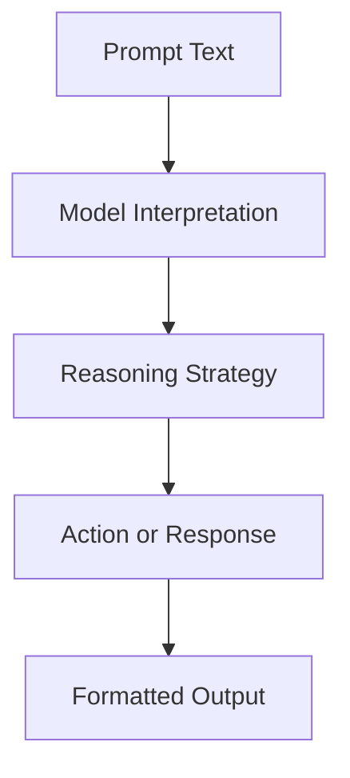
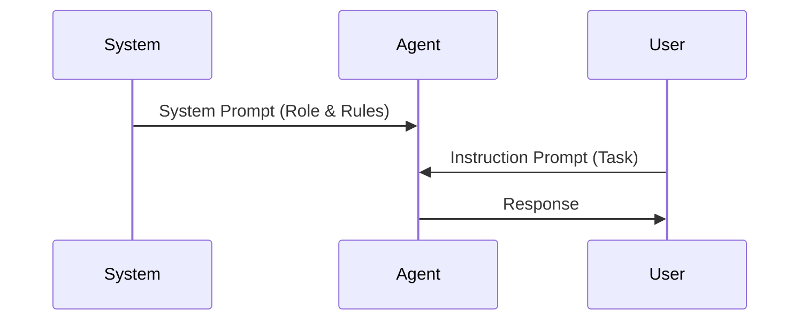
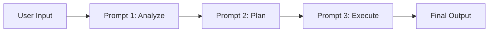

# Core Components of an AI Agent: Prompting as Control Logic

## Learning Objectives

- Explain how prompts function as control logic
- Design structured prompts for agent reasoning
- Differentiate prompt types and their roles
- Apply prompt chaining to complex tasks
- Evaluate prompt quality using defined criteria

---

## Introduction

This chapter explores how prompts act as the primary control mechanism for LLM-based agents, shaping reasoning and behavior.

---


---


When people first encounter large language models (LLMs), prompts often look deceptively simple—just text instructions typed into a box. However, as LLM-based systems have evolved from single-turn chatbots into autonomous or semi-autonomous agents, prompts have taken on a much deeper and more powerful role. In modern AI agents, prompts are not merely inputs; they act as *control logic*, shaping how the agent reasons, plans, reacts to errors, and interacts with tools and users.

This chapter explores a central idea: **prompts function as implicit programs** that govern the behavior of LLM-based agents. Unlike traditional software, where control flow is expressed through explicit code constructs like loops and conditionals, LLM agents rely on carefully designed prompt structures to guide reasoning, decision-making, and action. Understanding prompting as control logic is essential for anyone designing agents that must operate reliably, transparently, and safely in real-world environments.

We will start with foundational concepts—what it means to think of prompts as programs—then gradually move toward more advanced techniques such as structured prompting, prompt chaining, failure handling, and evaluation. Throughout the chapter, you will find detailed explanations, real-world analogies, practical examples, visual diagrams, and a comprehensive case study that ties these ideas together. By the end, you should be able to design, analyze, and evaluate prompts not as ad-hoc instructions, but as first-class components of an intelligent system.

---


By the end of this chapter, you will be able to:

- Explain how prompts function as control logic in LLM-based agents  
- Describe prompts as implicit programs and reason about their structure  
- Differentiate between system prompts, instruction prompts, and their roles  
- Design structured prompts and reusable templates for agent reasoning  
- Apply prompt chaining and task decomposition to complex problems  
- Handle failures and uncertainty through robust prompt design  
- Evaluate prompt effectiveness using clear, practical criteria  

---

## Prompts as Implicit Programs

Prompts are often described casually as “instructions,” but this description understates their importance in agent-based systems. In practice, a prompt operates much like a *program*: it defines goals, constraints, allowable actions, and reasoning strategies. The key difference is that this program is written in natural language rather than a formal programming syntax.

Historically, this idea emerged as practitioners noticed consistent patterns in model behavior. Early users of LLMs found that small changes in wording could drastically alter outputs. Over time, these observations led to the realization that prompts encode *control flow*. For example, telling a model to “think step by step” introduces a reasoning loop, while instructing it to “verify your answer before responding” introduces a form of self-checking logic. These are not just stylistic preferences—they are computational controls.

From a conceptual standpoint, prompts as implicit programs work because LLMs are trained to predict text conditioned on context. When you include instructions, examples, constraints, and formatting rules, you are shaping the probability space in which the model operates. The prompt becomes a *soft program*:  
- The **goal** is defined by the task description  
- The **constraints** are expressed as rules (“do not hallucinate sources”)  
- The **control flow** is suggested through ordered steps or reasoning cues  
- The **output format** acts like a type signature  

An analogy can help here. Imagine a highly skilled human assistant who follows instructions extremely literally but has no memory beyond what you tell them. The quality of their work depends almost entirely on how clearly you describe:
- What they should do  
- How they should think  
- What they should avoid  
- How they should present results  

In this sense, prompting resembles writing a detailed job manual rather than giving a casual request.

### Example: A Prompt as a Program

Consider the difference between these two prompts:

- *“Summarize this document.”*  
- *“Summarize this document in three bullet points, focusing on risks and assumptions. If information is missing, explicitly state what is unknown.”*

The second prompt embeds:
- A formatting rule (three bullet points)  
- A prioritization strategy (risks and assumptions)  
- A failure-handling policy (explicitly state unknowns)  

That is already a small program.

### Why This Matters for Agents

In agentic systems, prompts often replace traditional control structures:
- Instead of `if/else`, we use conditional language (“If the user intent is unclear, ask a clarifying question.”)
- Instead of loops, we use iterative reasoning (“Repeat until the answer is consistent.”)
- Instead of exceptions, we use fallback instructions (“If you cannot complete the task, explain why.”)

The implication is profound: **prompt design becomes a form of software engineering**. Poorly designed prompts lead to brittle agents, while well-designed prompts lead to robust, adaptable behavior.



---

## Instruction Prompts vs System Prompts

As LLM platforms matured, prompt design became more structured. One key development was the separation between **system prompts** and **instruction prompts**. Understanding their differences is crucial for controlling agent behavior reliably.

System prompts define the *identity, role, and global behavior* of the agent. They are typically set once at the beginning of a session and remain constant. Instruction prompts, on the other hand, define *what the agent should do right now*—they are task-specific and change frequently.

Historically, this separation mirrors concepts from operating systems. The system prompt is like the operating system kernel: it defines core rules and capabilities. Instruction prompts are like user-level applications: they request specific tasks within those rules.

### System Prompts: The Agent’s Constitution

System prompts answer questions such as:
- Who are you?  
- What is your role?  
- What rules must you always follow?  

They are especially important for:
- Safety constraints  
- Tone and communication style  
- Tool usage policies  

For example, a system prompt might state that the agent is a “careful financial analyst” who must avoid speculation and clearly label assumptions. This instruction influences *every response*, even when not explicitly referenced.

### Instruction Prompts: Task-Level Control

Instruction prompts are more tactical. They specify:
- The immediate task  
- The required output format  
- Any task-specific constraints  

These prompts often include examples, step-by-step instructions, or domain context. Unlike system prompts, instruction prompts are expected to change frequently as the agent handles different tasks.

### Comparison Table

| Aspect | System Prompt | Instruction Prompt |
|------|---------------|-------------------|
| Scope | Global, persistent | Local, task-specific |
| Purpose | Define identity and rules | Define what to do now |
| Frequency of change | Rare | Frequent |
| Safety impact | High | Medium |
| Example | “You are a medical assistant…” | “Summarize this patient note…” |

### Practical Implications

Confusing these roles leads to unstable agents. If safety rules are placed in instruction prompts, they may be forgotten or overridden. Conversely, if task details are placed in system prompts, flexibility is lost.



---

## Structured Prompting and Templates

As agent complexity increases, ad-hoc prompts become unmanageable. Structured prompting emerged as a response to this problem. Instead of writing free-form text each time, designers use *templates* with clearly defined sections, placeholders, and reasoning scaffolds.

Structured prompting borrows ideas from traditional programming and technical writing. Just as APIs enforce structure to reduce ambiguity, structured prompts reduce uncertainty for the model. They also make prompts reusable, testable, and easier to debug.

A typical structured prompt might include:
- Role definition  
- Task description  
- Inputs (clearly labeled)  
- Step-by-step reasoning instructions  
- Output schema  

This structure matters because LLMs are sensitive to context ordering and clarity. When information is clearly segmented, the model can allocate attention more effectively.

### Example Template

```text
Role: You are an expert legal analyst.
Task: Evaluate the contract clause below.
Criteria:
- Identify risks
- Suggest improvements
Output Format:
- Risk Summary
- Suggested Revisions
```

This template acts like a function signature in code.

### Advantages and Limitations

**Advantages**
- Consistency across tasks  
- Easier evaluation and debugging  
- Improved reasoning reliability  

**Limitations**
- Can become verbose  
- Over-structuring may reduce creativity  

### Table: Unstructured vs Structured Prompting

| Dimension | Unstructured | Structured |
|---------|--------------|------------|
| Flexibility | High | Medium |
| Reliability | Low | High |
| Reusability | Low | High |
| Debuggability | Low | High |


---

## Prompt Chaining and Decomposition

Prompt chaining is a technique where a complex task is broken into multiple smaller prompts, executed sequentially. Each prompt handles a subtask, and its output feeds into the next prompt. This mirrors *functional decomposition* in software engineering.

The need for prompt chaining arises because LLMs have limited context windows and may struggle with multi-step reasoning in a single pass. By decomposing tasks, we:
- Reduce cognitive load on the model  
- Improve interpretability  
- Isolate errors  

For example, instead of asking an agent to “analyze a market and produce a strategy,” we might chain:
1. Market summarization  
2. Risk identification  
3. Strategy generation  
4. Strategy critique  

Each step has a focused prompt.

### Practical Example

In customer support automation:
- Prompt 1 classifies the issue  
- Prompt 2 retrieves relevant policy  
- Prompt 3 generates a response  

This modularity allows targeted improvements without rewriting the entire system.



---

## Failure Handling through Prompt Design

No agent is perfect. Failures—hallucinations, ambiguity, incomplete data—are inevitable. Prompt design is the first line of defense. Rather than trying to eliminate failures entirely, good prompts *anticipate and manage* them.

Failure-aware prompts explicitly instruct the model on what to do when:
- Information is missing  
- Confidence is low  
- Instructions conflict  

For example, telling the model to “ask a clarifying question if uncertain” transforms uncertainty from a silent failure into an interactive loop.

Common failure-handling strategies include:
- Explicit uncertainty disclosure  
- Fallback behaviors  
- Self-checking instructions  

These strategies align with human professional norms: experts say “I don’t know” when appropriate.

### Table: Failure Types and Prompt Strategies

| Failure Type | Prompt Strategy |
|-------------|-----------------|
| Hallucination | Require citations or say “unknown” |
| Ambiguity | Ask clarifying questions |
| Overconfidence | Add confidence calibration step |

---

## Evaluating Prompt Effectiveness

Evaluating prompts is essential because prompts *are code*. Yet unlike traditional code, prompts lack compilers or unit tests by default. Evaluation therefore relies on systematic criteria and empirical testing.

Effective prompt evaluation considers:
- Task success rate  
- Consistency across runs  
- Robustness to edge cases  
- Interpretability of reasoning  

One useful approach is to treat prompts as hypotheses and test them against a suite of representative inputs. Small changes can then be compared empirically.

### Evaluation Criteria Table

| Criterion | Description |
|---------|-------------|
| Accuracy | Correctness of output |
| Robustness | Performance on edge cases |
| Clarity | Ease of understanding outputs |
| Safety | Avoidance of harmful behavior |

---

## Case Study: Designing a Prompt-Controlled Research Agent

### Context
In 2024, a mid-sized consulting firm sought to build an internal AI research agent to support analysts. The agent needed to summarize reports, identify risks, and flag missing data. Analysts complained that earlier chatbot tools produced confident but unreliable summaries.

### Problem
The core challenge was control. The model often hallucinated data and failed to disclose uncertainty. Analysts needed an agent that behaved like a cautious junior researcher, not a persuasive writer. Traditional fine-tuning was too costly and slow.

### Solution
The team redesigned the agent around prompt-based control logic. A strong system prompt defined the agent’s role and epistemic humility. Structured instruction templates enforced step-by-step analysis. Prompt chaining separated summarization from risk analysis. Failure-handling rules required explicit uncertainty statements.

### Results
Within weeks, analysts reported higher trust in outputs. Hallucinations dropped significantly, and reviews became faster. While the agent was sometimes slower, its transparency outweighed speed concerns.

### Lessons Learned
The team learned that prompts are not UI text—they are architecture. Investing in prompt design delivered system-level improvements without model retraining.

---

## Summary

Prompts are the backbone of LLM-based agents. They act as implicit programs that define goals, constraints, reasoning strategies, and failure behaviors. By understanding different prompt types, structuring prompts carefully, chaining them for complex tasks, and evaluating them systematically, we can design agents that are robust, transparent, and trustworthy. Prompting is not an art alone—it is a disciplined form of control logic.

---

## Reflection Questions

1. In what ways are prompts similar to and different from traditional code?  
2. How would you redesign a brittle prompt you’ve used before using structured templates?  
3. What failure modes are most dangerous in your domain, and how could prompts mitigate them?  
4. How might prompt evaluation become more standardized in the future?