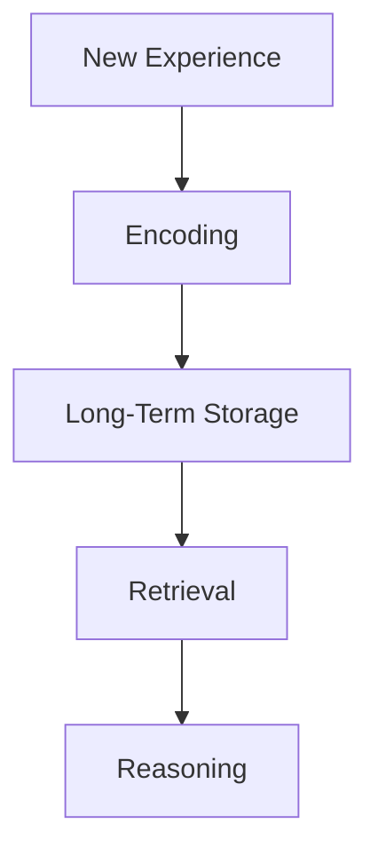
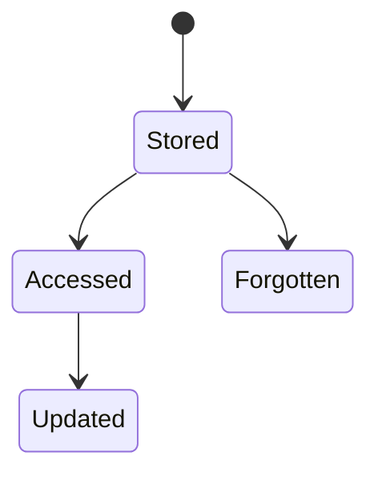
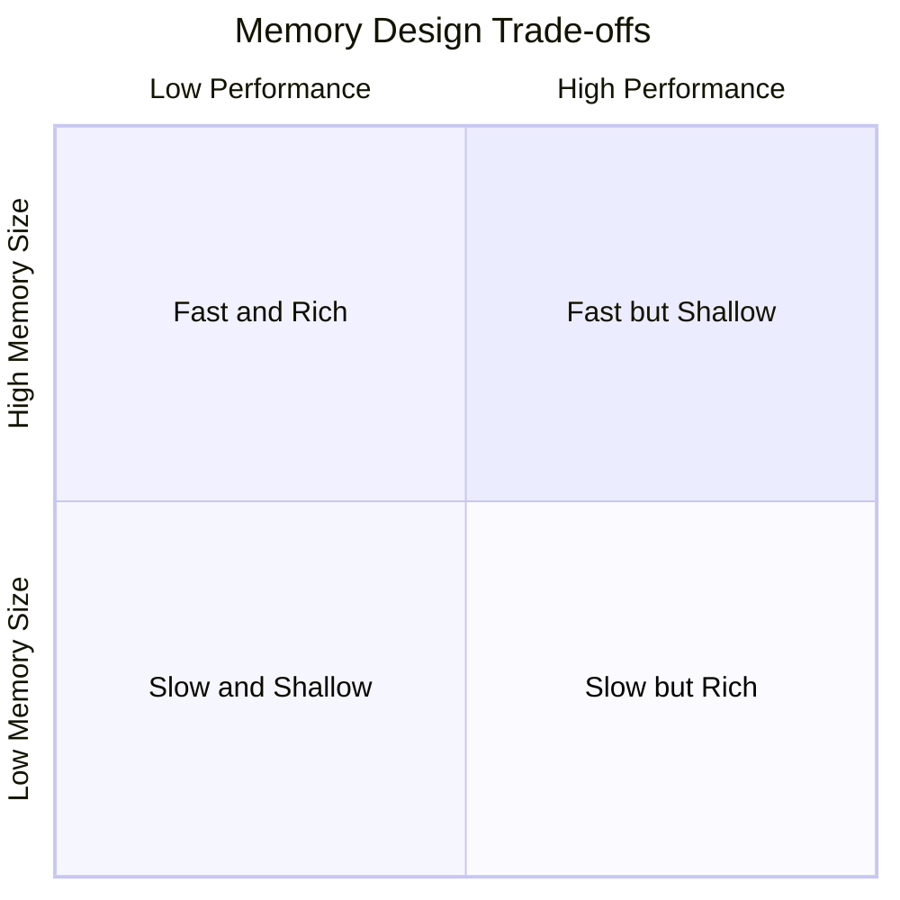

# Core Components of an AI Agent: Memory Systems: Short-Term and Long-Term

## Learning Objectives

- Differentiate short-term and long-term memory
- Design basic memory retrieval mechanisms
- Explain relevance scoring for memory access
- Analyze trade-offs between memory size and performance
- Implement memory update strategies conceptually

---

## Introduction

This chapter focuses on memory architectures that allow agents to retain context and knowledge over time.

---

# Core Components of an AI Agent: Memory Systems — Short-Term and Long-Term

---

When we interact with an intelligent system—whether it is a conversational chatbot, a recommendation engine, or an autonomous robot—we naturally expect it to *remember*. We expect it to recall what we just said, to use information learned earlier, and to improve its behavior over time. This ability to retain, organize, retrieve, and update information is not a luxury feature; it is a **core requirement for intelligent behavior**. At the heart of this capability lies the concept of **memory systems** in AI agents.

Memory allows an AI agent to move beyond reactive behavior and into *context-aware, adaptive, and goal-directed* action. Without memory, an agent would respond to every situation as if it were encountering it for the first time. With memory, the agent can maintain context across interactions, accumulate knowledge over long periods, and make decisions informed by past experience. In human terms, memory is what allows learning, reasoning, and identity. In AI agents, memory plays a similarly foundational role.

This chapter focuses on **memory architectures** that enable AI agents to retain both *short-term context* and *long-term knowledge*. We will explore how short-term memory supports immediate reasoning, how long-term memory enables persistent knowledge and learning, and how agents retrieve, update, and forget information. Throughout the chapter, we will connect theory to practice using concrete examples, detailed case studies, tables, and visual diagrams to make these abstract ideas tangible and intuitive.

---

By the end of this chapter, you will be able to:

- Clearly differentiate **short-term memory** and **long-term memory** in AI agents  
- Explain the **role of memory** in shaping intelligent agent behavior  
- Design basic **memory retrieval mechanisms** conceptually  
- Explain how **relevance scoring** determines which memories are accessed  
- Analyze **trade-offs** between memory size, accuracy, and performance  
- Conceptually implement **memory update and forgetting strategies**  

---

## Role of Memory in Agent Behavior

Memory is not just a storage mechanism; it is an active component that fundamentally shapes how an AI agent perceives the world, reasons about it, and decides how to act. To understand the role of memory in agent behavior, it is helpful to step back and consider what “behavior” actually means in the context of intelligent systems.

At its most basic level, agent behavior is the mapping from **perception to action**. An agent observes its environment, processes that information, and then produces an action. Without memory, this mapping is purely reactive: each decision depends only on the current input. While such systems can be useful (for example, a thermostat reacting to temperature), they fall far short of what we typically consider intelligence. Memory allows the agent to incorporate *past observations, previous actions, and accumulated knowledge* into current decision-making.

Historically, the importance of memory in intelligent behavior emerged from both cognitive science and early AI research. Cognitive psychologists studying human intelligence identified memory as a core mental faculty alongside perception and reasoning. Similarly, early symbolic AI systems relied heavily on knowledge bases and rule memories to simulate reasoning. Modern AI agents—especially those based on machine learning and large language models—continue this tradition, but with more flexible and dynamic memory architectures.

Memory influences agent behavior in several critical ways:

- **Context continuity**: Memory allows an agent to maintain coherence across time, such as remembering what a conversation is about.
- **Learning from experience**: Memory enables the agent to adjust future behavior based on past outcomes.
- **Goal persistence**: Memory helps an agent keep track of long-term objectives and intermediate steps.
- **Personalization**: By remembering user preferences or past interactions, agents can tailor responses.

To illustrate this, consider a virtual personal assistant. Without memory, it would treat every interaction as a new conversation, forcing users to repeat preferences and context repeatedly. With memory, it can remember your meeting habits, preferred communication style, and ongoing tasks, leading to smoother and more helpful interactions.

### Memory as a Bridge Between Perception and Reasoning

Memory acts as a bridge between what the agent perceives *now* and what it has perceived *before*. This bridging function allows the agent to reason over sequences rather than isolated moments. For example, in dialogue systems, understanding a pronoun like “it” often depends on remembering what was mentioned earlier. In navigation tasks, reaching a destination requires remembering previous turns and landmarks.

This bridging role also introduces complexity. Memory must be selectively accessed and efficiently managed; otherwise, the agent risks being overwhelmed by irrelevant information. This leads directly to the need for **structured memory systems**, typically divided into short-term and long-term components.

### Behavioral Implications of Memory Design

The way memory is designed has direct consequences for agent behavior:

- Agents with **limited memory** tend to behave myopically, focusing on immediate rewards.
- Agents with **rich long-term memory** can plan strategically but may suffer from slower decision-making if retrieval is inefficient.
- Agents with **poor memory update strategies** may cling to outdated or incorrect beliefs.

These implications make memory design not just a technical concern, but a behavioral one. Decisions about memory architecture shape how intelligent, adaptive, and trustworthy an agent appears to users.

---

## Short-Term Memory and Working Context

Short-term memory (STM), often referred to as **working memory**, is responsible for holding information that is immediately relevant to the agent’s current task or interaction. This type of memory is transient, limited in capacity, and highly dynamic. It is the cognitive “workspace” where active reasoning takes place.

The concept of working memory originates from cognitive psychology, where it describes the mental space humans use to temporarily hold and manipulate information. For example, when you mentally calculate a tip at a restaurant, you rely on working memory to hold numbers and intermediate results. AI systems adopt a similar concept: short-term memory holds recent inputs, intermediate reasoning states, and contextual variables.

In modern AI agents, short-term memory often includes:

- Recent user inputs or observations
- Intermediate reasoning steps
- Temporary goals or sub-tasks
- Active constraints or rules

This memory is typically cleared or overwritten frequently, making it well-suited for fast access and real-time reasoning.

### Why Short-Term Memory Is Essential

Without short-term memory, an agent would struggle with even basic tasks that require context. For example, consider a multi-turn conversation:

1. User: “I want to book a flight.”
2. User: “From New York to Paris.”
3. User: “Next Monday.”

The agent must remember all three pieces of information together to complete the task. Short-term memory allows the agent to integrate these inputs into a coherent working context.

Short-term memory is also crucial for **reasoning chains**. In problem-solving agents, intermediate steps must be retained while exploring solutions. If these steps were immediately discarded, complex reasoning would be impossible.

### Characteristics of Short-Term Memory

Short-term memory has several defining characteristics:

- **Limited capacity**: Only a small amount of information can be held at once.
- **High volatility**: Information decays quickly unless reinforced.
- **Fast access**: Retrieval is typically constant-time or near-instantaneous.
- **Task-specific relevance**: Content is tightly coupled to the current task.

The table below summarizes these properties:

| Feature | Short-Term Memory | Implication for Agents |
|------|------------------|-----------------------|
| Capacity | Small | Forces prioritization of information |
| Duration | Seconds to minutes | Context resets frequently |
| Access speed | Very fast | Enables real-time reasoning |
| Content | Task-specific | Reduces noise from irrelevant data |

### Practical Examples and Analogies

A useful analogy is a **whiteboard** in a meeting room. The whiteboard holds notes relevant to the current discussion. Once the meeting ends, the board is erased. Similarly, short-term memory holds the “notes” an agent needs right now.

Another analogy is a computer’s **RAM**. RAM stores data and programs currently in use. When power is lost, the data disappears. Short-term memory in AI agents plays a similar role, enabling quick access but lacking permanence.

### Case Study: Conversational AI and Working Memory

## Case Study: Managing Context in a Customer Support Chatbot

**Context**  
In 2022, a mid-sized e-commerce company deployed an AI-powered customer support chatbot to handle order inquiries, returns, and basic troubleshooting. The chatbot was designed to reduce human workload and provide instant responses. Early versions of the system relied on stateless request-response processing, meaning each user message was treated independently.

**Problem**  
Customers quickly became frustrated. They had to repeat order numbers, product names, and issues in every message. The chatbot often gave irrelevant responses because it failed to remember earlier details. This led to longer conversations, lower satisfaction scores, and frequent escalation to human agents. The core issue was the absence of a robust short-term memory mechanism to maintain conversational context.

**Solution**  
The development team introduced a structured short-term memory module. Each conversation session maintained a working context containing recent messages, extracted entities (such as order ID), and inferred intent. This context was updated after every turn and passed into the reasoning module. The team also implemented rules to discard older or irrelevant context to keep memory focused.

**Results**  
After deployment, average conversation length dropped by 30%, and customer satisfaction scores increased significantly. The chatbot could now handle multi-step interactions smoothly. However, the team observed that overly long conversations sometimes exceeded memory limits, requiring additional strategies such as summarization.

**Lessons Learned**  
The case highlighted that short-term memory is essential for coherent interaction but must be carefully managed. Too little memory breaks context; too much memory slows processing. The team learned to balance memory capacity with relevance, a theme that recurs throughout memory system design.

---

## Long-Term Memory and Knowledge Persistence

While short-term memory supports immediate reasoning, **long-term memory (LTM)** enables an AI agent to retain knowledge over extended periods. This includes facts, learned patterns, user preferences, historical experiences, and generalized insights. Long-term memory is what allows agents to *learn* rather than merely react.

Long-term memory has deep roots in both human cognition and AI research. In humans, long-term memory encompasses everything from personal experiences to abstract knowledge like language rules. In AI, long-term memory has evolved from static databases and knowledge graphs to dynamic vector stores and learned representations.

### Purpose and Importance of Long-Term Memory

Long-term memory serves several crucial purposes:

- **Knowledge accumulation**: Storing facts, rules, and learned models.
- **Personalization**: Remembering user-specific preferences and history.
- **Experience replay**: Learning from past successes and failures.
- **Consistency over time**: Ensuring stable behavior across sessions.

Without long-term memory, an agent would be trapped in the present moment, unable to build on previous interactions. For example, a recommendation system without long-term memory could not learn user tastes, and an autonomous robot could not improve navigation based on past routes.

### Types of Long-Term Memory in AI Agents

Long-term memory can take many forms, including:

- **Symbolic memory**: Structured facts and rules.
- **Episodic memory**: Records of past interactions or events.
- **Semantic memory**: Generalized knowledge extracted from many experiences.
- **Procedural memory**: Learned skills or policies.

The table below compares short-term and long-term memory:

| Aspect | Short-Term Memory | Long-Term Memory |
|-----|------------------|----------------|
| Persistence | Temporary | Persistent |
| Capacity | Limited | Large or unbounded |
| Access Speed | Very fast | Slower, indexed |
| Content | Current context | Knowledge & experience |
| Update Frequency | Constant | Periodic or event-driven |

### How Long-Term Memory Works in Practice

Modern AI systems often implement long-term memory using databases, knowledge graphs, or vector embeddings. Information is stored with metadata and retrieved based on similarity or relevance. Unlike short-term memory, which is overwritten frequently, long-term memory requires careful update and maintenance strategies to remain useful.

### Case Study: Personalized Learning Assistant

## Case Study: Building Knowledge Persistence in an AI Tutor

**Context**  
An ed-tech startup developed an AI tutor to help students learn mathematics over several months. The goal was to provide personalized instruction that adapted to each student’s strengths and weaknesses. Initially, the system relied heavily on real-time assessment without persistent memory.

**Problem**  
Students noticed that the tutor “forgot” past mistakes and preferences. A student who struggled with fractions would receive advanced problems the next session, leading to frustration. The lack of long-term memory prevented the system from building a coherent learner model.

**Solution**  
The team implemented a long-term memory system that stored student performance data, misconceptions, and preferred learning styles. This memory was updated after each session and used to tailor future lessons. The system distinguished between episodic memory (individual sessions) and semantic memory (generalized skill levels).

**Results**  
Student engagement increased, and learning outcomes improved measurably. The tutor could now remind students of past challenges and build on previous lessons. However, managing memory growth became a challenge, requiring periodic summarization.

**Lessons Learned**  
The project demonstrated that long-term memory is essential for personalization but introduces complexity in storage, retrieval, and maintenance.

---

## Memory Retrieval and Relevance Scoring

Storing information is only half the challenge; **retrieving the right memory at the right time** is equally critical. Memory retrieval determines which pieces of stored information influence the agent’s current reasoning and behavior. Without effective retrieval mechanisms, even the richest memory system becomes useless or harmful.

### Why Retrieval Is Hard

As memory grows, the agent faces an increasing search space. Retrieving all stored memories is computationally infeasible and cognitively overwhelming. The agent must decide *which memories are relevant* to the current context.

This challenge mirrors human cognition. When asked a question, humans do not recall every fact they know; instead, relevant memories are activated based on context and cues. AI systems attempt to replicate this process through relevance scoring.

### Relevance Scoring Explained

Relevance scoring assigns a numerical value to each memory indicating how useful it is for the current task. Factors influencing relevance include:

- **Semantic similarity** to the current context
- **Recency** of the memory
- **Frequency of use**
- **Importance or confidence score**
- **User-specific relevance**

The agent retrieves the top-ranked memories and ignores the rest.

### Practical Retrieval Techniques

Common retrieval techniques include:

- Keyword or symbolic matching
- Vector similarity search
- Hybrid approaches combining symbolic and neural methods

| Technique | Strengths | Limitations |
|--------|-----------|------------|
| Keyword Matching | Simple, fast | Misses semantic meaning |
| Vector Search | Captures semantics | Computationally heavier |
| Hybrid | Balanced | More complex to implement |

### Case Study: Memory Retrieval in a Legal AI Assistant

## Case Study: Relevance-Based Retrieval for Legal Reasoning

**Context**  
A legal-tech company built an AI assistant to help lawyers search past cases and statutes. The system stored millions of documents, making naive retrieval impossible.

**Problem**  
Early versions returned either too many irrelevant documents or missed critical precedents. Lawyers spent excessive time filtering results, undermining trust in the system.

**Solution**  
The team implemented relevance scoring combining semantic similarity, citation frequency, and recency. The assistant retrieved a small, high-quality set of documents for each query.

**Results**  
Search efficiency improved dramatically, and lawyers reported higher confidence in the AI’s suggestions. However, tuning relevance weights required ongoing expert input.

**Lessons Learned**  
Effective retrieval is not just technical—it requires domain understanding and continuous refinement.

---

## Memory Update and Forgetting Strategies

Memory systems must evolve over time. **Updating memory** ensures that new information is incorporated, while **forgetting strategies** prevent overload and preserve relevance. Forgetting is not a failure; it is a feature.

### Why Forgetting Is Necessary

Unbounded memory growth leads to:

- Increased retrieval costs
- Noise from outdated or incorrect information
- Slower reasoning

Humans forget selectively, retaining what is useful and discarding what is not. AI agents must do the same.

### Common Update and Forgetting Strategies

- **Time-based decay**: Older memories lose relevance.
- **Usage-based pruning**: Rarely accessed memories are removed.
- **Summarization**: Compressing multiple memories into a generalized form.
- **Confidence revision**: Updating belief strength over time.

### Case Study: Memory Management in a Recommendation System

## Case Study: Preventing Memory Overload in Streaming Recommendations

**Context**  
A streaming platform used AI to recommend content based on user viewing history.

**Problem**  
As user histories grew, recommendations became stale and slow to compute.

**Solution**  
The team introduced forgetting strategies that emphasized recent behavior and summarized older data.

**Results**  
Recommendations became more timely and system performance improved.

**Lessons Learned**  
Forgetting is essential for adaptability and efficiency.

---

## Trade-offs in Memory System Design

Designing memory systems involves balancing competing goals: accuracy vs. efficiency, richness vs. speed, persistence vs. adaptability.

### Key Trade-offs

- **Memory size vs. performance**
- **Retrieval accuracy vs. computational cost**
- **Stability vs. adaptability**

| Design Choice | Benefit | Cost |
|------------|--------|------|
| Large memory | Rich knowledge | Slower retrieval |
| Aggressive forgetting | Fast reasoning | Potential loss of info |
| Complex scoring | Better relevance | Higher complexity |

---

## Summary

Memory systems are the backbone of intelligent agent behavior. Short-term memory enables real-time reasoning and context awareness, while long-term memory supports learning, personalization, and knowledge persistence. Effective retrieval and relevance scoring ensure that the right information is used at the right time. Memory update and forgetting strategies keep systems efficient and adaptive. Ultimately, designing memory systems requires thoughtful trade-offs that align with the agent’s goals and constraints.

---

## Reflection Questions

1. How would an AI agent’s behavior change if it lacked long-term memory entirely?  
2. What are the risks of overly aggressive forgetting strategies?  
3. How might relevance scoring differ between a conversational agent and a recommendation system?  
4. Which memory trade-offs would you prioritize in a safety-critical AI system, and why?