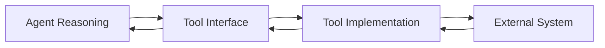
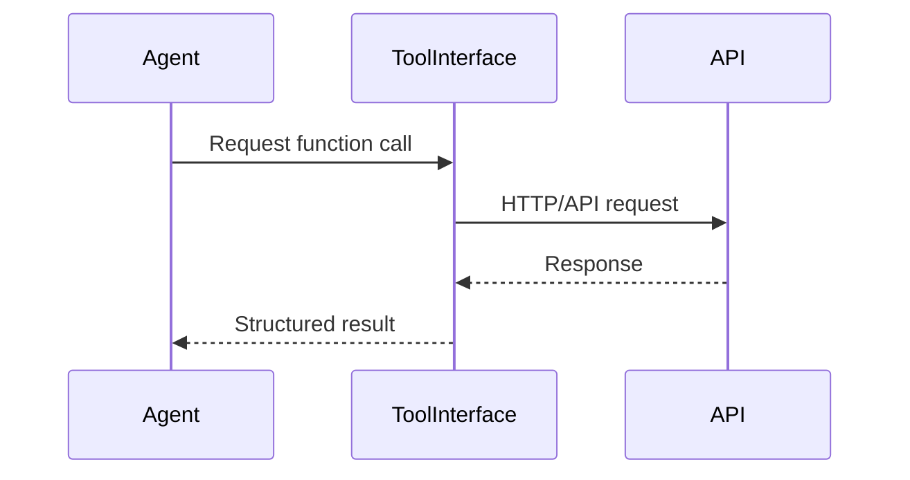
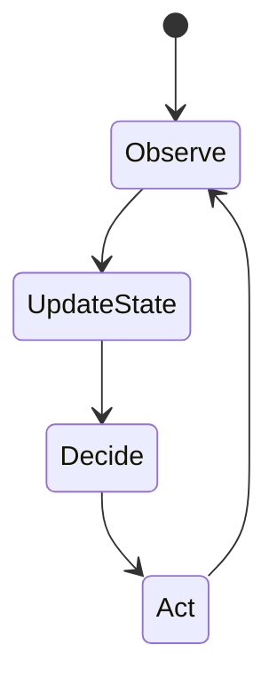
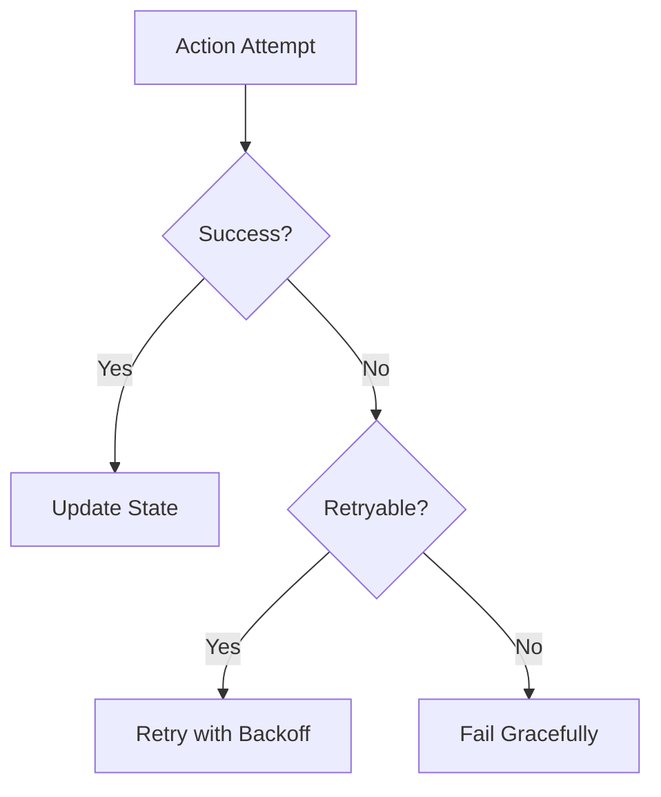
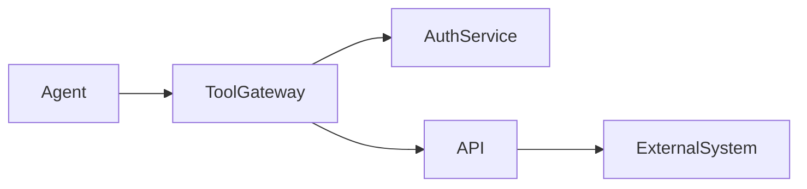

# Tools, APIs, and Environment Interaction

Modern AI agents are no longer confined to answering questions or generating text. They are increasingly expected to **act** in the real world: booking flights, updating databases, controlling software systems, monitoring environments, or coordinating workflows across multiple platforms. To do this effectively, an AI agent must interact with external systems through **tools**, **APIs**, and **environment representations**. These components form the bridge between an agent’s internal reasoning and the outside world where real consequences occur.

Understanding how this bridge works is critical. Poorly designed tool interfaces can lead to fragile systems. Unsafe API usage can expose sensitive data or cause unintended actions. Weak error handling can make agents unreliable, while ignoring security considerations can turn helpful agents into serious risks. Conversely, well-designed interaction layers enable agents to be powerful, safe, and trustworthy collaborators.

This chapter focuses on the **core components that enable AI agents to interact with external environments**. We will explore how tools are abstracted, how APIs and functions are called, how environments are represented internally, how errors are handled, and how safety and security are designed into agent actions. Throughout the chapter, we will connect theory with practice using concrete examples, detailed case studies, tables, and diagrams.

By the end of this chapter, you will be able to:

- Explain how AI agents use tools and APIs to perform real-world actions  
- Design clear and safe tool abstractions for agent systems  
- Understand how environment state is represented and updated  
- Handle errors, failures, and retries during environment interaction  
- Assess security risks associated with agent-driven actions  
- Evaluate and improve the reliability and safety of action execution  

---

## Tool Abstraction and Interfaces

Tool abstraction is the foundation of how an AI agent interacts with the external world. At its core, a **tool** is any external capability the agent can invoke: a database query, a web search, a calculator, a file system operation, or an API call to a third-party service. Tool abstraction refers to how these capabilities are represented, described, and exposed to the agent in a structured way.

Historically, early AI systems were tightly coupled to specific environments. Rules were written directly against concrete actions like “open file” or “send email.” As systems grew more complex, this approach became brittle and hard to maintain. Tool abstraction emerged as a way to **decouple reasoning from execution**. Instead of knowing *how* to perform an action, the agent only needs to know *what* the action does and *how to request it*.

A useful analogy is a power outlet. When you plug in a device, you do not need to know how electricity is generated or routed through the grid. You only need a standardized interface (the socket). Tool abstraction plays the same role for AI agents.

### What Makes a Good Tool Interface

A well-designed tool interface clearly defines what the agent can do and what information it needs. It typically includes:

- **Tool name** – A concise, descriptive identifier (e.g., `search_web`, `send_email`)
- **Purpose** – What the tool does and when it should be used
- **Inputs** – Parameters with types, constraints, and descriptions
- **Outputs** – The structure and meaning of results
- **Side effects** – Any real-world changes caused by the tool

These elements are not just documentation; they actively shape the agent’s behavior. If the interface is ambiguous, the agent may misuse the tool or call it in unsafe ways.

### Why Abstraction Matters for Agents

Tool abstraction is critical for several reasons:

- **Scalability**: New tools can be added without retraining or redesigning the agent’s core logic.
- **Safety**: Constraints and validations can be enforced at the interface level.
- **Explainability**: Clear tool definitions make agent decisions easier to inspect and audit.
- **Portability**: The same agent logic can work across different environments with different implementations of the same tool.

Without abstraction, agents become tightly coupled to specific systems, making them fragile and risky.

### Example: Calendar Scheduling Tool

Consider an AI assistant that schedules meetings. A poorly abstracted approach might expose raw database operations like `INSERT INTO events`. A well-abstracted tool would look like:

- Tool: `create_calendar_event`
- Inputs: title, start_time, end_time, participants
- Output: confirmation_id
- Side effects: creates a calendar entry and sends invitations

The agent does not need to know how calendars store events internally. This separation dramatically reduces errors and improves safety.

### Common Mistakes in Tool Abstraction

Despite its importance, tool abstraction is often done poorly. Common issues include:

- Overloading tools with too many responsibilities  
- Exposing low-level implementation details  
- Failing to document side effects clearly  
- Allowing unconstrained inputs (e.g., arbitrary SQL strings)

These mistakes increase the risk of incorrect or dangerous agent behavior.

### Tool Abstraction Overview Table

| Aspect | Poor Abstraction | Good Abstraction |
|------|------------------|------------------|
| Interface clarity | Vague, undocumented | Clear purpose and schema |
| Input constraints | Free-form, unsafe | Typed and validated |
| Coupling | Tightly coupled to system | Decoupled and modular |
| Safety | High risk of misuse | Built-in guardrails |

### Tool Abstraction Flow Diagram

This diagram highlights how abstraction acts as a buffer between reasoning and execution.

---

## API Calling and Function Execution

APIs are the most common way AI agents interact with external systems. An **API call** allows an agent to request information or trigger actions in another system using a predefined protocol. Function execution, in this context, refers to the structured invocation of these APIs as callable functions with defined inputs and outputs.

The rise of web APIs in the 2000s fundamentally changed software integration. Instead of tightly coupled systems, developers could rely on standardized HTTP-based interfaces. AI agents build on this same idea but add an extra layer: the agent must decide *when*, *why*, and *how* to call an API based on reasoning rather than hard-coded logic.

### How Agents Decide to Call APIs

Unlike traditional programs, agents operate under uncertainty. They analyze goals, interpret context, and decide whether an API call is necessary. This decision-making process often involves:

- Identifying missing information (e.g., “I need current weather data”)
- Matching the need to an available tool or API
- Constructing valid input parameters
- Interpreting the response and updating internal state

This makes API calling both powerful and risky.

### Step-by-Step API Execution Flow

A typical agent-driven API call follows these steps:

1. **Intent formation** – The agent identifies a need (e.g., fetch user data).
2. **Tool selection** – The agent chooses the appropriate API function.
3. **Parameter construction** – Inputs are assembled and validated.
4. **Execution** – The API call is made.
5. **Response handling** – Results are parsed and interpreted.
6. **State update** – The agent updates its internal model.

Each step is an opportunity for failure if not carefully designed.

### Example: E-Commerce Price Check

Imagine a shopping assistant that checks product prices across stores. The agent may call APIs like `get_product_price(store_id, product_id)`. If parameters are incorrect or responses are misinterpreted, the agent could present wrong recommendations.

### API Interaction Sequence Diagram

### Comparison of API Execution Styles

| Style | Description | Pros | Cons |
|-----|------------|------|------|
| Synchronous | Agent waits for response | Simple logic | Slower, blocking |
| Asynchronous | Agent continues while waiting | Efficient | More complex state handling |
| Batched | Multiple calls together | Performance gains | Harder error tracing |

---

## Environment State Representation

For an agent to act intelligently, it must maintain an internal representation of the **environment state**. This state includes everything the agent believes to be true about the world at a given moment: current data, past actions, pending tasks, and uncertainties.

Early AI systems relied on symbolic state representations, such as logic predicates. Modern agents often use structured data models, embeddings, or hybrid approaches. The key challenge is balancing **completeness** with **tractability**.

### What Is Environment State?

Environment state answers questions like:

- What has already happened?
- What is currently true?
- What actions are possible next?
- What information is uncertain or outdated?

Without a clear state model, agents act blindly.

### Types of State Representation

Common approaches include:

- **Explicit state objects** (JSON, dictionaries)
- **Event histories** (logs of actions and observations)
- **Belief states** (probabilistic representations)
- **Externalized state** (databases or environment APIs)

Each has trade-offs in complexity and accuracy.

### Example: Smart Home Agent

A smart home agent may track:

- Device states (on/off, temperature)
- User preferences
- Time of day
- Recent commands

If the agent assumes a light is off when it is actually on, its actions may appear irrational.

### State Update Lifecycle Diagram

### State Representation Comparison Table

| Approach | Strengths | Weaknesses |
|--------|-----------|------------|
| Explicit state | Transparent, debuggable | Can grow large |
| Belief state | Handles uncertainty | Harder to reason about |
| External state | Scalable | Latency, dependency risks |

---

## Error Handling and Retries

No interaction with the real world is perfectly reliable. Networks fail, APIs time out, data becomes inconsistent, and permissions change. Robust AI agents must expect errors and handle them gracefully.

Historically, error handling was an afterthought. In agent systems, it is a core design requirement because agents operate autonomously and repeatedly.

### Types of Errors Agents Encounter

Common error categories include:

- **Transient errors** (temporary network issues)
- **Permanent errors** (invalid inputs, missing permissions)
- **Logical errors** (incorrect assumptions about state)
- **Partial failures** (some steps succeed, others fail)

Each requires a different response strategy.

### Retry Strategies

Retries are useful but dangerous if misused. Good retry design considers:

- Maximum retry count
- Exponential backoff
- Error classification
- Idempotency of actions

Blind retries can cause cascading failures.

### Example: Payment Processing Agent

An agent that retries a payment API call without checking idempotency may charge a customer multiple times. Safe design requires transaction IDs and confirmation checks.

### Error Handling Flow Diagram

---

## Security Considerations for Tool Use

When agents are given tools, they are given power. Security considerations ensure that this power is not misused—intentionally or accidentally.

### Threat Models for Agent Tools

Key risks include:

- Unauthorized data access
- Prompt injection leading to harmful actions
- Over-privileged tools
- Leakage of sensitive outputs

Agents must be treated as semi-trusted actors.

### Principle of Least Privilege

Tools should expose only what is necessary. For example, an agent that reads customer data does not need permission to delete it.

### Security Controls Table

| Control | Purpose |
|-------|---------|
| Authentication | Verify identity |
| Authorization | Limit permissions |
| Auditing | Track actions |
| Input validation | Prevent injection |

### Security Architecture Diagram

---

## Designing Safe and Reliable Actions

Safety and reliability emerge from all previous components working together. Designing actions is not just about functionality; it is about **predictability, reversibility, and accountability**.

### Characteristics of Safe Actions

Safe agent actions are:

- Observable (logged and auditable)
- Reversible (where possible)
- Bounded (limited scope and impact)
- Transparent (clear intent)

### Case Study: Autonomous IT Support Agent

## Case Study: Deploying a Safe IT Support Agent in a Large Enterprise

### Context

In 2023, a multinational enterprise with over 50,000 employees faced growing pressure on its internal IT support team. Employees were spread across multiple continents, working in different time zones, and relied on a complex mix of software systems. Password resets, access requests, and software installation tickets overwhelmed human operators, leading to long wait times and frustration.

The company decided to introduce an AI-powered IT support agent capable of handling routine tasks autonomously. The agent would interact with internal tools, identity management systems, and ticketing platforms. While the potential efficiency gains were enormous, leadership was deeply concerned about safety, reliability, and security.

### Problem

The core challenge was trust. Granting an AI agent the ability to reset passwords or change access permissions carried significant risk. A single mistake could lock employees out of critical systems or expose sensitive data. Traditional automation scripts were brittle and required constant maintenance, while human approval for every action would eliminate efficiency gains.

Another problem was error handling. Internal APIs were not always reliable, and partial failures were common. The agent needed to detect failures, retry safely, and escalate when necessary—all without causing cascading issues.

### Solution

The team began by designing strict tool abstractions. Each tool represented a single, well-defined action such as `reset_password` or `grant_application_access`. Inputs were tightly validated, and outputs included explicit success or failure states. Tools were wrapped in a secure gateway enforcing authentication, authorization, and auditing.

Next, the agent’s environment state was carefully modeled. It tracked user requests, approval status, previous actions, and system responses. This allowed the agent to reason about what had already been done and avoid duplicate actions.

Error handling was implemented with layered retries. Transient errors triggered automatic retries with exponential backoff, while permanent errors caused the agent to escalate to a human operator. Every action was logged, and reversible actions were preferred wherever possible.

### Results

Within three months, the agent handled over 60% of IT support requests without human intervention. Average resolution time dropped from hours to minutes. Importantly, there were no major security incidents. Audits showed that tool constraints and logging were critical in maintaining trust.

However, limitations remained. Some edge cases still required human judgment, and the agent occasionally escalated unnecessarily due to conservative error classification.

### Lessons Learned

The project demonstrated that safe agent design is as much about architecture as intelligence. Clear tool abstractions, robust state representation, and thoughtful error handling mattered more than sophisticated reasoning models.

The team also learned that over-restriction can reduce usefulness. Striking the right balance between safety and autonomy required ongoing monitoring and iteration. Future versions planned to incorporate better uncertainty modeling and richer feedback loops.

---

## Summary

In this chapter, we explored how AI agents interact with the external world through tools, APIs, and environment representations. We examined why tool abstraction is foundational, how APIs are called and executed, how environment state is modeled, and why error handling and security are non-negotiable. Finally, we saw how these elements come together to enable safe and reliable action design.

Well-designed interaction layers transform AI agents from passive assistants into trustworthy actors capable of real-world impact.

---

## Reflection Questions

1. What risks arise when tool abstractions are too low-level or too powerful?  
2. How would you design a retry strategy for a non-idempotent API?  
3. What trade-offs exist between detailed environment state and system complexity?  
4. How can auditing and logging improve trust in autonomous agents?  
5. In what situations should an agent refuse to act and escalate to a human?