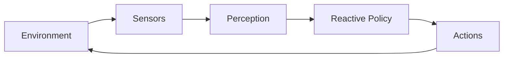
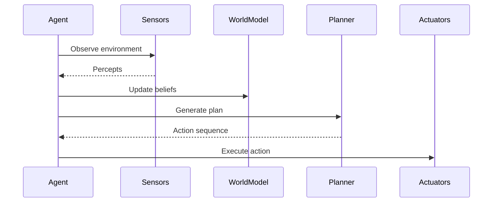
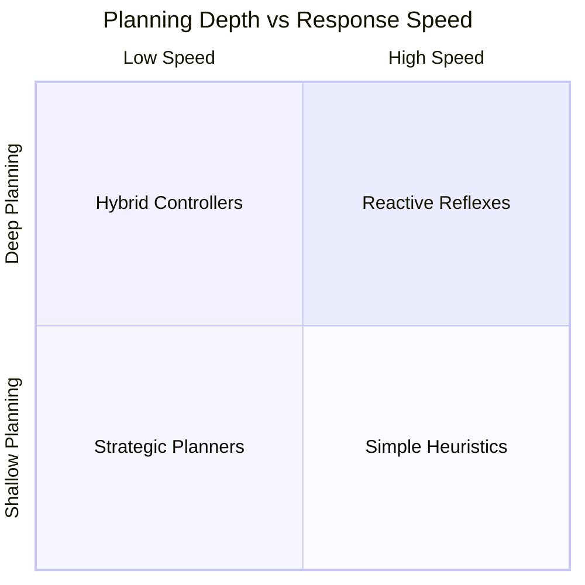
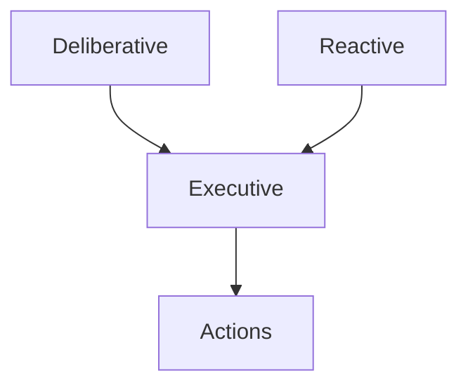

# Agent Architectures and Design Patterns: Reactive and Deliberative Agents

## Learning Objectives

- Differentiate reactive and deliberative agents
- Analyze trade-offs between speed and reasoning depth
- Identify use cases for each architecture
- Design hybrid agent approaches
- Evaluate architecture robustness

---

## Introduction

This chapter compares reactive and deliberative agent architectures and explores their strengths and weaknesses.

---

---

As artificial intelligence systems move from isolated laboratory experiments into real-world environments—self-driving cars navigating busy streets, recommendation systems shaping user behavior, or autonomous robots collaborating with humans—the way these systems *think and act* becomes critically important. At the heart of this capability lies **agent architecture**: the internal design that determines how an intelligent agent perceives its environment, reasons about it, and decides what actions to take.

Two foundational approaches dominate the design of intelligent agents: **reactive architectures** and **deliberative architectures**. These approaches represent fundamentally different philosophies of intelligence. Reactive agents emphasize speed, simplicity, and direct stimulus-response behavior, while deliberative agents prioritize reasoning, planning, and long-term goal optimization. Over time, researchers and practitioners have realized that neither approach alone is sufficient for all situations, leading to the emergence of **hybrid architectures** that attempt to combine the strengths of both.

This chapter provides a deep, structured, and practical exploration of these architectures. We will not only explain *what* reactive and deliberative agents are, but also *why* they exist, *how* they work internally, *when* they succeed or fail, and *how* to choose or design the right architecture for a given problem. By grounding abstract concepts in concrete examples, real-world case studies, diagrams, and comparisons, this chapter aims to build a robust mental model that you can apply in both academic and industrial contexts.

---

By the end of this chapter, you will be able to:

- Clearly differentiate reactive and deliberative agent architectures  
- Analyze trade-offs between response speed and depth of reasoning  
- Identify appropriate real-world use cases for each architecture  
- Design hybrid reactive–deliberative agent systems  
- Evaluate architecture robustness under failure conditions  

---

## Reactive Agent Fundamentals

Reactive agents represent one of the earliest and most intuitive approaches to building intelligent systems. At their core, reactive agents operate on a simple principle: **sense the environment and respond immediately**. There is no explicit internal model of the world, no long-term planning, and no symbolic reasoning. Instead, behavior emerges from direct mappings between perceptions and actions.

Historically, reactive architectures gained prominence in the late 1980s and early 1990s, particularly through the work of Rodney Brooks and his **subsumption architecture**. Brooks challenged the dominant symbolic AI paradigm of the time, arguing that real intelligence does not require complex internal representations. Instead, he proposed that intelligence could emerge from layered, simple behaviors interacting directly with the environment. This perspective was revolutionary, especially in robotics, where real-world uncertainty often made complex planning brittle and slow.

From a functional standpoint, reactive agents typically rely on **condition–action rules**. These rules can be as simple as “if obstacle detected, turn left” or as complex as learned policies encoded in neural networks. What defines them is not simplicity per se, but the *absence of explicit deliberation*. The agent does not ask, “What is my goal five steps from now?” It only asks, “Given what I sense right now, what should I do next?”

Why is this important? In many environments, **speed and robustness matter more than optimality**. Consider a robotic vacuum cleaner navigating a cluttered home. It does not need to compute an optimal cleaning path for the entire house; it needs to avoid obstacles, keep moving, and cover ground. Similarly, reflexes in biological organisms—like pulling your hand away from a hot surface—are reactive because delay would be costly or dangerous.

### How Reactive Agents Work Internally

Although reactive agents appear simple from the outside, their internal design can still be structured and layered. A typical reactive agent processes information through the following pipeline:

1. **Perception**: Sensors capture raw data from the environment (e.g., proximity sensors, cameras).
2. **Feature Extraction**: Relevant signals are derived (e.g., obstacle distance).
3. **Rule or Policy Evaluation**: Predefined rules or learned mappings determine the action.
4. **Action Execution**: Motors or actuators carry out the decision.

This process is often continuous and cyclical, allowing the agent to adapt moment-by-moment.

### Strengths and Limitations

Reactive agents excel in environments that are:

- Highly dynamic  
- Partially observable  
- Time-critical  

However, their limitations become apparent when tasks require memory, planning, or abstract reasoning.

**Advantages:**
- Extremely fast response times  
- Robust to environmental noise  
- Simple to implement and debug  
- Low computational overhead  

**Limitations:**
- No long-term planning or goal reasoning  
- Difficult to handle complex, multi-step tasks  
- Behavior can be myopic or repetitive  

### Everyday Analogies and Examples

- **Human reflexes**: Pulling your hand away from heat is reactive, not deliberative.
- **Thermostats**: If temperature < threshold, turn on heating.
- **Video game NPCs**: Enemies that attack when you enter their range.

---

## Deliberative Agent Reasoning Models

Deliberative agents represent the opposite end of the architectural spectrum. Rather than reacting immediately to stimuli, these agents **think before they act**. They maintain internal representations of the world, reason about future consequences, and choose actions that align with long-term goals. This approach aligns closely with classical notions of intelligence and rationality.

The roots of deliberative architectures can be traced back to early symbolic AI, particularly the **physical symbol system hypothesis**. Researchers believed that intelligence emerges from the manipulation of symbols according to logical rules. As a result, deliberative agents were designed around components such as world models, goal representations, and planners.

At the heart of a deliberative agent lies a **reasoning loop**. The agent perceives the environment, updates its internal model, formulates or revises goals, generates plans, and then executes actions. This cycle may repeat at varying frequencies depending on the environment and task.

### Reasoning Models in Deliberative Agents

Several reasoning paradigms are commonly used:

- **Logic-based reasoning**: Uses symbolic logic to infer actions.
- **Planning algorithms**: Such as STRIPS, HTN, or PDDL-based planners.
- **Decision-theoretic models**: Including Markov Decision Processes (MDPs).
- **Belief–Desire–Intention (BDI)** frameworks.

Each model reflects a different philosophy of how agents should reason under uncertainty and constraints.

### Why Deliberation Matters

Deliberative agents shine in domains where **decisions have long-term consequences**. For example, a logistics planning system must consider costs, deadlines, and resource constraints across days or weeks. Acting greedily or reactively could lead to suboptimal or even catastrophic outcomes.

However, deliberation comes at a cost. Planning takes time, computational resources, and reliable models of the world. In rapidly changing environments, plans can become obsolete before they are executed.

### Comparative Characteristics

| Aspect | Reactive Agents | Deliberative Agents |
|------|----------------|--------------------|
| Response Time | Very fast | Slower |
| World Model | None or implicit | Explicit |
| Planning | No | Yes |
| Robustness to Noise | High | Moderate |
| Optimality | Local | Global |

---

## Planning Depth and Latency Trade-offs

One of the most critical design decisions in agent architectures is determining **how much to think before acting**. This decision directly affects both the quality of decisions and the timeliness of responses. Planning depth and latency are two sides of the same coin: deeper planning generally leads to better-informed actions but incurs higher delays.

Planning depth refers to how far into the future an agent considers possible outcomes. A shallow planner might only consider the next step, while a deep planner might simulate dozens or hundreds of steps ahead. Latency, on the other hand, measures the time between perception and action.

### The Core Trade-off

- **Deep planning**:
  - Pros: Better global outcomes, fewer surprises
  - Cons: Higher computational cost, slower response
- **Shallow or no planning**:
  - Pros: Immediate response, robustness
  - Cons: Short-sighted decisions

This trade-off is particularly visible in time-critical systems such as autonomous driving. An emergency braking system must react instantly (reactive), while route planning can afford seconds or minutes of deliberation.

### Practical Implications

Designers must consider:

- Environmental volatility  
- Cost of mistakes  
- Availability of computational resources  
- Safety requirements  

---

## Hybrid Reactive–Deliberative Systems

Recognizing the limitations of purely reactive or purely deliberative agents, researchers have increasingly adopted **hybrid architectures**. These systems combine fast, reactive components with slower, deliberative layers, allowing agents to respond quickly while still pursuing long-term goals.

A common hybrid pattern involves a **three-layer architecture**:

1. **Reactive Layer**: Handles immediate responses (e.g., obstacle avoidance).
2. **Executive Layer**: Mediates between layers and resolves conflicts.
3. **Deliberative Layer**: Performs planning and reasoning.

### Why Hybrids Work

Hybrids reflect how humans operate. We rely on reflexes for immediate threats, habits for routine tasks, and conscious reasoning for complex decisions. By mirroring this structure, hybrid agents achieve both robustness and intelligence.

### Design Challenges

- Synchronization between layers  
- Conflict resolution  
- Ensuring consistency between plans and reactive behavior  

---

## Use-Case Driven Architecture Selection

Choosing an agent architecture should never be an abstract exercise. It must be driven by **use-case requirements**. Factors such as safety, timing, complexity, and environment dynamics all influence the optimal choice.

| Use Case | Recommended Architecture | Rationale |
|--------|-------------------------|-----------|
| Obstacle Avoidance | Reactive | Requires instant response |
| Strategic Games | Deliberative | Long-term planning critical |
| Autonomous Vehicles | Hybrid | Safety + planning |
| Trading Bots | Deliberative/Hybrid | Forecasting + fast reactions |

---

## Case Study: Autonomous Warehouse Robots

### Context

In the late 2010s, a large e-commerce company faced increasing pressure to improve warehouse efficiency. Human pickers were struggling to keep up with demand, and management decided to deploy autonomous robots to transport goods within massive fulfillment centers. These environments were dynamic, crowded, and safety-critical.

### Problem

Early prototypes relied heavily on deliberative planning. Robots computed optimal paths across the warehouse, considering congestion and task priorities. However, even minor changes—like a human stepping into an aisle—invalidated plans. Robots paused frequently to replan, causing delays and bottlenecks.

### Solution

Engineers redesigned the system using a hybrid architecture. A reactive layer handled immediate obstacle avoidance using sensors and simple rules. A deliberative layer planned high-level routes between zones. An executive layer ensured smooth coordination.

### Results

The new system reduced average task completion time by 30%. Collisions dropped significantly, and overall throughput increased. While routes were no longer globally optimal at all times, the system proved far more resilient.

### Lessons Learned

The case demonstrated that **robustness often matters more than optimality**. By blending architectures, the team achieved a balance between safety, efficiency, and scalability.

---

## Failure Scenarios and Mitigations

No architecture is immune to failure. Reactive agents may enter infinite loops or oscillations. Deliberative agents may suffer from outdated models or planning paralysis. Hybrid systems can experience layer conflicts.

### Common Failure Modes

- **Reactive**: Thrashing between actions  
- **Deliberative**: Overplanning or stale plans  
- **Hybrid**: Conflicting commands  

### Mitigation Strategies

- Add memory or hysteresis to reactive rules  
- Use replanning triggers and timeouts  
- Define clear priority rules between layers  

---

## Summary

Reactive and deliberative agent architectures represent two complementary approaches to intelligence. Reactive agents prioritize speed and robustness, while deliberative agents emphasize reasoning and optimality. Hybrid architectures bridge the gap, offering practical solutions for complex, real-world problems. Understanding the trade-offs, use cases, and failure modes of each approach is essential for designing effective intelligent systems.

---

## Reflection Questions

1. Can you think of a system in your daily life that behaves reactively? How would it change if it were deliberative?
2. What risks arise when deliberative agents operate in highly dynamic environments?
3. How would you design a hybrid agent for a healthcare application?
4. Which failure mode do you think is hardest to detect in hybrid systems, and why?
5. How might advances in hardware change the planning depth vs latency trade-off in the future?