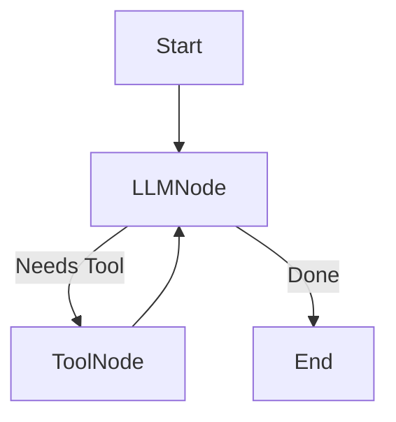
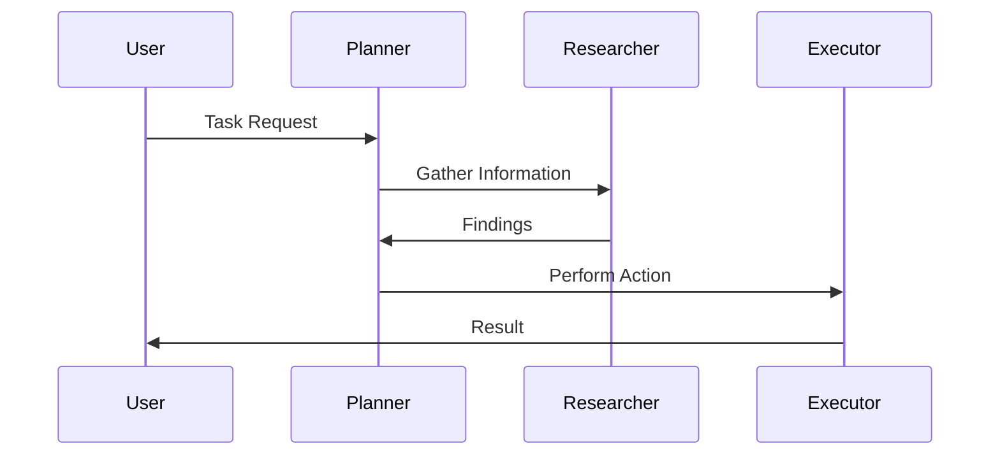
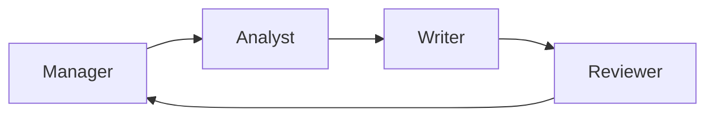
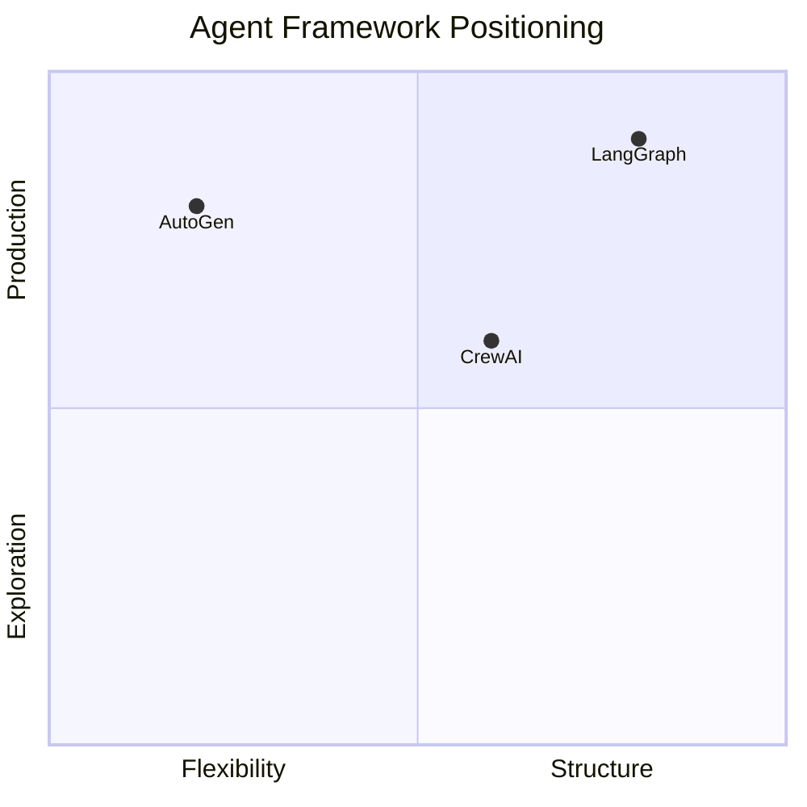

# Overview of Agentic AI Frameworks

Over the past few years, artificial intelligence has moved beyond single-turn question answering and static machine learning models into a new paradigm: **agentic AI**. In this paradigm, AI systems are not just passive responders; they can **plan**, **reason**, **act**, **collaborate**, and **adapt over time** to achieve complex goals. These systems—commonly referred to as *AI agents*—are increasingly used in real-world applications such as autonomous research assistants, software development copilots, customer support automation, and multi-step business process orchestration.

However, building such agents from scratch is extremely challenging. Developers must manage conversation state, memory, tool usage, decision logic, error handling, and often coordination between multiple agents. As agent behaviors grow more complex, ad-hoc code quickly becomes fragile, difficult to debug, and nearly impossible to scale. This challenge has led to the rise of **agentic AI frameworks**—specialized software frameworks designed to structure, orchestrate, and manage intelligent agents in a systematic way.

This chapter introduces three of the most influential modern agent frameworks—**LangGraph**, **AutoGen**, and **CrewAI**—and explains their underlying design philosophies, architectural patterns, and practical trade-offs. Rather than focusing on syntax or API details, we will explore *why* these frameworks exist, *how* they think about agents, and *when* each framework is the right choice. By the end of this chapter, you should be able to reason critically about agent frameworks and select one that aligns with your technical constraints and business goals.

By the end of this chapter, you will be able to:

- Explain why agent frameworks are necessary for building reliable and scalable AI agents  
- Describe the core architectural ideas behind LangGraph, AutoGen, and CrewAI  
- Compare these frameworks in terms of design philosophy, strengths, and limitations  
- Identify which framework is best suited for specific real-world use cases  
- Evaluate trade-offs and risks when adopting an agentic AI framework  

---

## Motivation for Agent Frameworks

The motivation for agent frameworks arises from a fundamental shift in how we use large language models (LLMs). Early LLM applications treated models like advanced calculators: you sent a prompt and received a response. While powerful, this interaction model breaks down when tasks require **multiple steps, long-term memory, conditional logic, or interaction with external tools**. As soon as developers began chaining prompts together, they encountered serious engineering challenges.

One of the earliest problems was **state management**. Consider a simple customer support agent that must remember a user’s issue across multiple messages, query a knowledge base, ask clarifying questions, and escalate to a human if needed. Without a framework, developers often resort to fragile patterns: global variables, ad-hoc JSON blobs, or overly complex prompt engineering. These approaches quickly become unmaintainable, especially when multiple agents or parallel conversations are involved.

Another major driver for agent frameworks is **reliability and control**. LLMs are probabilistic systems, which means they can behave unpredictably. When an agent is expected to perform real-world actions—such as sending emails, modifying databases, or executing code—developers need safeguards. Frameworks provide structured execution models, explicit transitions, and guardrails that make agent behavior more predictable and auditable. This is especially important in regulated industries like finance, healthcare, and enterprise IT.

Finally, agent frameworks address the need for **collaboration and specialization**. Real-world problems are rarely solved by a single generalist. Human organizations rely on specialized roles—analysts, planners, executors, reviewers—and AI systems are increasingly mirroring this structure. Frameworks like AutoGen and CrewAI explicitly model multi-agent collaboration, allowing agents to debate, delegate, and validate each other’s work. This mirrors human workflows and often leads to higher-quality outcomes.

### Why Not Just Use Prompt Chaining?

To better understand the motivation, it helps to compare agent frameworks with simpler approaches.

| Approach | Strengths | Weaknesses | Suitable Use Cases |
|--------|-----------|------------|-------------------|
| Single Prompt | Simple, fast | No memory, no reasoning | FAQs, simple Q&A |
| Prompt Chaining | More capable | Fragile, hard to debug | Small workflows |
| Agent Frameworks | Structured, scalable | Learning curve | Complex, multi-step tasks |

Prompt chaining is like writing a script without functions or error handling. Agent frameworks, by contrast, are more like full application frameworks—they impose structure, but that structure enables scale and reliability.

---

## LangGraph Architecture Overview

LangGraph represents a **state-machine-driven approach** to agent design. Developed as part of the LangChain ecosystem, it addresses one of the biggest pain points in agent development: uncontrolled execution flow. Instead of letting agents “freely roam” through prompts and tools, LangGraph forces developers to define explicit states and transitions.

At its core, LangGraph models agent behavior as a **directed graph**. Each node represents a unit of computation—such as calling an LLM, invoking a tool, or evaluating a condition—while edges define how execution flows from one node to another. This design is inspired by workflow engines and finite state machines, which have been used for decades in distributed systems and business process automation.

The importance of this design becomes clear when agents must handle loops, retries, and branching logic. For example, an agent might repeatedly refine a search query until sufficient information is found, or loop back to a clarification step if the user’s intent is unclear. In LangGraph, these behaviors are not implicit—they are explicitly encoded in the graph, making them easier to reason about and debug.

Another defining feature of LangGraph is its emphasis on **state**. Rather than passing information implicitly through prompts, LangGraph maintains a shared, structured state object. Each node can read from and write to this state, enabling clean separation of concerns. This design mirrors how traditional software systems manage shared memory or context objects.

### How LangGraph Works Step by Step

1. Define a shared state schema (e.g., conversation history, task status).
2. Create nodes that perform specific actions.
3. Connect nodes using directed edges.
4. Specify conditional transitions.
5. Execute the graph and observe state evolution.

### Strengths and Limitations of LangGraph

| Aspect | Strength | Limitation |
|------|----------|------------|
| Control | Highly deterministic | Less flexible |
| Debugging | Clear execution paths | More setup |
| Scaling | Suitable for complex flows | Verbose definitions |

LangGraph is ideal for **production-grade agents** where predictability, observability, and correctness matter more than rapid prototyping.

---

## AutoGen and Conversational Agents

AutoGen takes a fundamentally different approach. Instead of graphs or workflows, AutoGen models agent systems as **structured conversations** between autonomous agents. Each agent is defined by a role, a system prompt, and a set of capabilities. These agents then communicate with each other through messages, much like humans in a group chat.

The historical roots of AutoGen lie in research on **multi-agent systems and deliberative reasoning**. Researchers observed that LLMs often perform better when they are allowed to critique, refine, or build upon each other’s outputs. AutoGen operationalizes this insight by making conversation the primary coordination mechanism.

One of AutoGen’s key advantages is its **naturalness**. Developers do not need to define explicit state machines or transitions. Instead, they specify who the agents are and what they can do, then allow the conversation to unfold. This makes AutoGen particularly appealing for exploratory tasks like research, brainstorming, and code generation.

However, this flexibility comes at a cost. Because execution flow emerges from conversation, it can be harder to guarantee termination, enforce constraints, or debug failures. AutoGen systems often require careful prompt design and monitoring to avoid runaway loops or inconsistent behavior.

### Practical Example: Research Assistant

Imagine a market research assistant composed of three agents: a planner, a researcher, and a writer. The planner breaks down the task, the researcher gathers data, and the writer synthesizes insights. AutoGen excels in this scenario because the task is open-ended and benefits from iterative refinement.

---

## CrewAI and Role-Based Agents

CrewAI introduces yet another perspective by explicitly modeling **teams and roles**. Inspired by organizational theory, CrewAI assumes that complex tasks are best solved by a coordinated “crew” of agents, each with a well-defined responsibility.

In CrewAI, agents are not just conversational entities; they are **workers** with specific goals, tools, and authority. A crew typically includes roles such as strategist, executor, reviewer, and coordinator. This structure aligns closely with how human teams operate, making it intuitive for business users.

One of CrewAI’s distinguishing features is its **task-first design**. Developers define tasks and assign them to roles, rather than letting tasks emerge organically through conversation. This leads to clearer accountability and easier evaluation of outcomes.

However, CrewAI can feel rigid for exploratory or creative tasks. Its strength lies in repeatable, goal-oriented workflows such as content production pipelines, software delivery processes, and business analysis.

---

## Framework Comparison Matrix

The differences between LangGraph, AutoGen, and CrewAI become clearer when viewed side by side.

| Dimension | LangGraph | AutoGen | CrewAI |
|---------|-----------|---------|--------|
| Core Metaphor | State Machine | Conversation | Team |
| Control Level | Very High | Low–Medium | Medium |
| Best For | Production workflows | Exploration | Role-based tasks |
| Debugging | Strong | Challenging | Moderate |

---

## Selecting the Right Framework

Choosing the right framework is less about which one is “best” and more about **context**. Teams building regulated, mission-critical systems will gravitate toward LangGraph. Research teams and innovation labs may prefer AutoGen’s freedom. Business process automation often aligns naturally with CrewAI.

Key questions to ask include:

- How predictable must agent behavior be?
- Will multiple agents collaborate?
- Is the task exploratory or well-defined?
- Who will maintain the system?

No framework is universally superior; each encodes a different philosophy about how intelligence should be organized.

---

## Summary

In this chapter, we explored why agent frameworks are essential for modern AI systems and examined three leading frameworks through the lens of architecture, philosophy, and practical use. LangGraph emphasizes control and determinism, AutoGen embraces conversational emergence, and CrewAI mirrors human organizational structures. Understanding these differences allows you to design agent systems that are not only powerful, but also maintainable and trustworthy.

---

## Reflection Questions

1. How does your current or planned AI project align with the design philosophy of each framework?
2. What risks might arise from choosing a framework that is too flexible or too rigid?
3. How might hybrid approaches—combining frameworks or ideas—address complex requirements?
4. Which framework would you choose for a regulated industry use case, and why?
5. How do agent frameworks change the role of the human developer in AI system design?