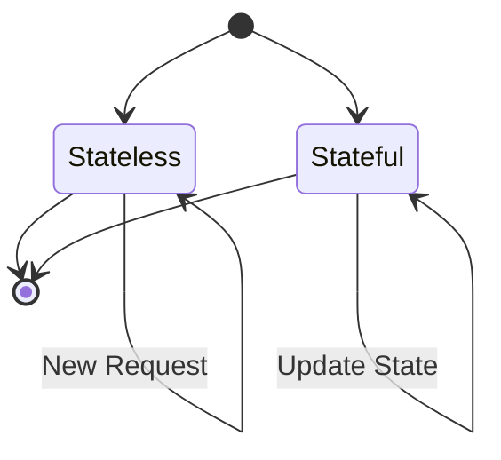
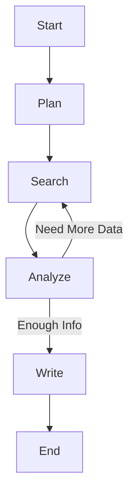
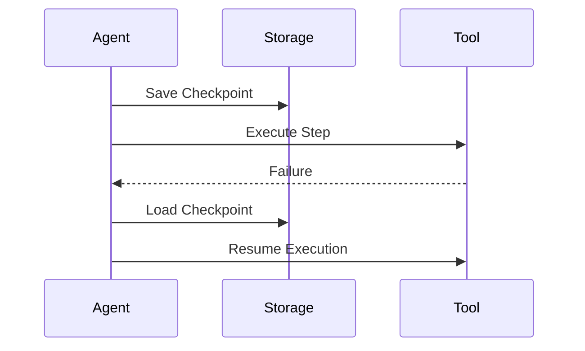
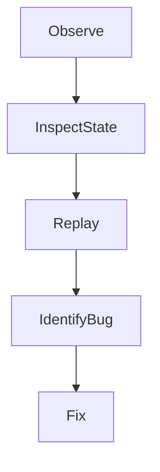

# Building Agents with Modern Frameworks: State Management and Control Flow

## Learning Objectives

- Explain state management approaches
- Implement control flow logic
- Handle agent recovery scenarios
- Debug state-related issues
- Design resilient agent workflows

---

## Introduction

This chapter explores how agent frameworks manage state and execution flow.

---

---

As artificial intelligence systems evolve from simple prompt–response tools into autonomous or semi-autonomous agents, a fundamental challenge emerges: **how do we manage what the agent knows, remembers, and decides over time?** Modern agent frameworks—such as LangGraph, AutoGen, CrewAI, and similar orchestration tools—exist largely to answer this question. At the heart of these frameworks lie two deeply interconnected ideas: **state management** and **control flow**.

In early AI applications, models were often stateless. Each request was independent, and the system had no built-in memory of what happened before. While this approach is simple and scalable, it breaks down quickly when we want agents that can plan, reason across multiple steps, recover from errors, or collaborate with other agents over long periods. Real-world agent use cases—customer support bots, autonomous research assistants, workflow automation systems—require agents that can **persist information**, **make decisions based on prior steps**, and **resume execution after interruptions**.

This chapter explores how modern agent frameworks address these needs. We will move progressively from foundational ideas (stateless vs. stateful agents) to more advanced execution models (graph-based control flows, branching logic), and finally to operational concerns such as checkpointing, long-running execution, and debugging. Throughout the chapter, we will connect theory with practice, using concrete examples, detailed case studies, tables for comparison, and visual diagrams to make abstract ideas tangible.

---

By the end of this chapter, you will be able to:

- Explain different approaches to state management in agent frameworks
- Understand and design graph-based control flows for agent execution
- Implement checkpointing and recovery strategies for resilient agents
- Use branching and conditional logic to handle complex decision paths
- Manage and monitor long-running agents safely and efficiently
- Debug state-related issues and reason about state transitions
- Design robust, resilient, and maintainable agent workflows

---

## Stateless vs Stateful Agents

State management is one of the most fundamental design decisions when building agents. Whether an agent is stateless or stateful affects nearly every aspect of its behavior, scalability, reliability, and complexity.

### Understanding Stateless Agents

A **stateless agent** is one that treats every interaction as independent. It does not retain memory of previous steps unless that memory is explicitly passed in as part of the input. This design philosophy has deep roots in early web architectures and traditional API design, where statelessness was prized for simplicity and scalability.

Historically, stateless systems became popular because they are easier to scale horizontally. If no state is stored between requests, any server instance can handle any request. This same idea carried over into early AI systems, where prompts were self-contained and the model had no awareness of prior interactions unless the entire conversation history was included in the prompt.

From a practical standpoint, stateless agents are appealing because they:

- Are easier to reason about, since there is no hidden memory
- Avoid complex synchronization or persistence mechanisms
- Scale naturally in distributed environments

However, these advantages come with significant limitations. A stateless agent cannot “remember” prior decisions, track progress in a multi-step task, or recover gracefully from failures unless all necessary context is re-supplied on every step. As tasks grow more complex, the burden of managing context shifts to the developer or the calling system.

**Analogy:** A stateless agent is like a goldfish with perfect reasoning skills but no memory beyond the last few seconds. Every time you ask it a question, you must re-explain the entire situation from scratch.

### Understanding Stateful Agents

A **stateful agent**, by contrast, maintains an internal or external representation of its current state. This state may include conversation history, intermediate results, task progress, decisions made, tool outputs, and even error conditions. Stateful agents emerged as a response to the growing ambition of agent-based systems, where multi-step reasoning and long-running tasks are the norm rather than the exception.

Statefulness allows agents to behave more like humans or traditional software processes:

- They can pause and resume work
- They can make decisions based on accumulated knowledge
- They can coordinate with other agents using shared state

Modern agent frameworks often formalize state as a structured object—sometimes called a **context**, **memory**, or **agent state**—that is passed between execution steps. This makes state explicit rather than implicit, which improves transparency and debuggability.

However, statefulness introduces complexity. Developers must decide:

- What data belongs in state?
- How long should state persist?
- Where should state be stored (in-memory, database, distributed store)?
- How do we prevent state corruption or inconsistency?

**Analogy:** A stateful agent is like a project manager with a notebook. They keep track of what’s been done, what’s pending, and what decisions were made yesterday.

### Why the Distinction Matters in Practice

The choice between stateless and stateful agents is not merely academic. It directly impacts reliability, cost, and system design. Stateless agents often require repeated context injection, increasing token usage and cost. Stateful agents reduce redundancy but require careful state lifecycle management.

Consider a customer support agent:

- A stateless version would require the entire conversation history to be included with every user message.
- A stateful version can store conversation context once and update it incrementally.

Over time, most real-world systems converge toward **hybrid designs**, where the core model invocation is stateless, but the surrounding framework manages state explicitly.

### Comparison of Stateless and Stateful Agents

| Aspect | Stateless Agents | Stateful Agents |
|------|------------------|----------------|
| Memory | None between steps | Persistent across steps |
| Scalability | Very high | Requires state coordination |
| Complexity | Low | Higher |
| Error Recovery | Difficult | Easier with checkpoints |
| Use Cases | Simple Q&A, single-step tasks | Multi-step workflows, long-running tasks |

---

---

## Graph-Based Control Flows

As agents become more complex, simple linear execution is no longer sufficient. Modern frameworks increasingly model agent execution as **graphs**, where nodes represent actions and edges represent transitions.

### From Linear Pipelines to Execution Graphs

Early agent implementations often followed a linear pipeline: receive input, call model, process output, return result. This works well for straightforward tasks but quickly becomes brittle when branching, looping, or recovery is needed.

Graph-based control flows emerged from workflow engines and distributed systems. In these systems, complex processes are modeled as **directed graphs**, allowing for branching paths, conditional transitions, and re-entry into earlier steps.

In agent frameworks, a graph-based approach allows developers to define:

- Multiple possible next steps based on agent output
- Loops for iterative reasoning
- Terminal states for completion or failure

### How Graph-Based Control Works

In a graph-based agent:

- **Nodes** represent computation units (LLM calls, tool invocations, evaluators).
- **Edges** represent transitions between nodes.
- **Conditions** determine which edge is taken.

Execution starts at an entry node and proceeds until a terminal node is reached. State is passed along the edges and updated at each node.

This structure makes control flow explicit and inspectable. Rather than hiding logic in code, the agent’s behavior is visible as a graph.

### Why Graphs Improve Reliability and Clarity

Graphs provide a mental model that aligns with how humans think about processes. They also enable powerful features:

- Visualization of execution paths
- Partial execution and replay
- Fine-grained error handling

Frameworks like LangGraph explicitly embrace this model, making graphs first-class citizens rather than an implementation detail.

### Example: Research Agent Graph

This graph clearly shows looping behavior and conditional transitions, which would be much harder to reason about in a purely linear script.

---

## Checkpointing and Recovery

As agents move into production environments, failures become inevitable. Networks fail, APIs time out, models hallucinate, and systems crash. **Checkpointing** is the mechanism that allows agents to recover gracefully rather than starting over.

### What Is Checkpointing?

Checkpointing involves saving the agent’s state at well-defined points during execution. If something goes wrong, the agent can resume from the last checkpoint instead of restarting from scratch.

This idea originated in long-running scientific computations and distributed systems, where restarting from the beginning would be prohibitively expensive.

### Why Checkpointing Matters for Agents

Agents often perform tasks that:

- Take minutes or hours
- Involve many external dependencies
- Accumulate valuable intermediate results

Without checkpointing, a single failure can waste significant time and cost. With checkpointing, recovery becomes a normal part of execution rather than an exceptional case.

### How Checkpointing Works Step by Step

1. Agent reaches a stable execution point
2. Current state is serialized
3. State is persisted to durable storage
4. Execution continues
5. On failure, state is reloaded
6. Execution resumes from the checkpoint

### Common Checkpointing Strategies

| Strategy | Description | Trade-offs |
|--------|-------------|------------|
| Periodic | Save state at fixed intervals | Simple but may lose recent work |
| Event-based | Save after key steps | More precise, more complex |
| Manual | Developer-defined checkpoints | Flexible but error-prone |

---

---

## Branching and Conditional Logic

Real-world tasks are rarely linear. Agents must make decisions, handle ambiguity, and adapt to changing conditions. This is where **branching and conditional logic** becomes essential.

### Why Branching Is Fundamental to Intelligence

Decision-making is at the core of intelligent behavior. Humans constantly evaluate conditions and choose different actions accordingly. Agent frameworks replicate this by allowing execution paths to diverge based on state or outputs.

### Implementing Conditional Logic in Agent Frameworks

Conditions can be based on:

- Model outputs (classification, confidence scores)
- External signals (API responses, user input)
- Internal state (progress counters, flags)

Modern frameworks typically allow conditional edges in graphs, making decision points explicit.

### Example: Customer Support Triage

An agent might:

- Route billing questions to a billing workflow
- Route technical issues to a diagnostic workflow
- Escalate emotionally charged messages to a human

Each branch represents a different control flow path.

### Risks and Best Practices

Branching increases power but also complexity. Poorly designed conditions can lead to:

- Unreachable paths
- Infinite loops
- Inconsistent state updates

Best practices include exhaustive condition handling, clear default branches, and extensive logging.

---

## Managing Long-Running Agents

Some agents are designed to operate continuously or over extended periods. Examples include monitoring agents, research assistants, and autonomous planners.

### Challenges of Long-Running Execution

Long-running agents face unique challenges:

- Resource leaks
- State growth over time
- External dependency changes
- Partial failures

Unlike short-lived scripts, these agents must be designed with operational stability in mind.

### Techniques for Managing Long-Running Agents

- Periodic state compaction
- Heartbeat monitoring
- Time-based checkpoints
- Graceful shutdown and restart

### Case Study: Autonomous Research Agent

## Case Study: Building a Long-Running Research Agent

**Context:**  
A startup building a market intelligence platform wanted an agent that continuously monitored industry news, analyzed trends, and updated internal reports. The agent needed to run 24/7, ingesting new data as it became available.

**Problem:**  
Early prototypes failed frequently. When a single API call timed out, the entire process crashed, losing hours of accumulated analysis. Memory usage also grew unchecked, eventually causing system instability.

**Solution:**  
The team redesigned the agent using a stateful, graph-based framework. They introduced periodic checkpoints after each analysis cycle, capped state size by summarizing older data, and implemented heartbeat monitoring to detect stalled execution.

**Results:**  
System uptime improved dramatically. Recovery from failures became routine, and the agent could resume work within seconds. Operational costs decreased due to reduced redundant computation.

**Lessons Learned:**  
Long-running agents require thinking like a systems engineer, not just an AI developer. Observability, recovery, and state hygiene are just as important as reasoning quality.

---

## Debugging State Transitions

When agents behave unexpectedly, the root cause often lies in state transitions. Debugging these issues requires visibility into how state changes over time.

### Why State Bugs Are Hard to Debug

State-related bugs are often non-deterministic. A small difference in execution order or timing can lead to different outcomes. Without proper tooling, developers are left guessing.

### Techniques for Debugging State

- State diffing between steps
- Visualizing execution graphs
- Logging state snapshots
- Replay from checkpoints

### Common State-Related Errors

| Error Type | Description | Example |
|-----------|-------------|---------|
| Stale State | Using outdated data | Reusing old user intent |
| Inconsistent State | Partial updates | Tool result not recorded |
| State Explosion | Unbounded growth | Ever-growing history |

---

---

## Summary

In this chapter, we explored how modern agent frameworks manage state and control execution flow. We began by contrasting stateless and stateful agents, highlighting why state becomes essential as tasks grow more complex. We then examined graph-based control flows, which provide a powerful and visual way to model agent behavior.

We discussed checkpointing and recovery as critical tools for resilience, explored branching logic for decision-making, and examined the unique challenges of long-running agents. Finally, we addressed debugging techniques for state transitions, emphasizing observability and replayability.

Together, these concepts form the backbone of reliable, scalable, and intelligent agent systems.

---

## Reflection Questions

1. When would a stateless agent be preferable to a stateful one, even for complex tasks?
2. How does modeling agent execution as a graph change the way you reason about control flow?
3. What trade-offs do you see between frequent checkpointing and system performance?
4. How would you design safeguards against infinite loops in branching logic?
5. What debugging tools would you prioritize when building a production-grade agent?

---