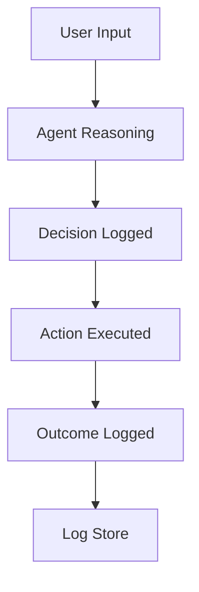
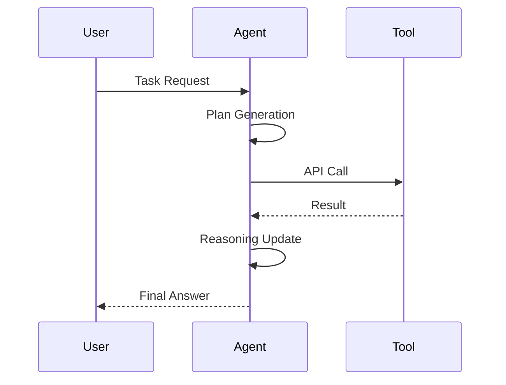
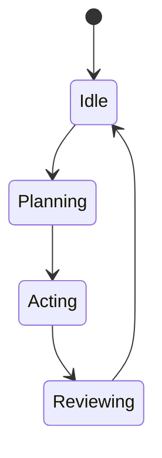
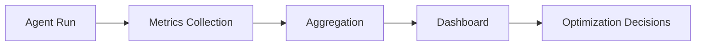
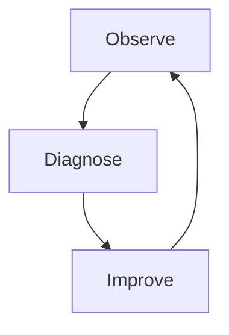

# Debugging and Observability for Agents

As AI agents become more capable and autonomous, they also become more complex, less predictable, and harder to debug. Unlike traditional software systems—where developers explicitly define logic paths—modern agents reason, plan, call tools, and adapt dynamically based on context. This flexibility is powerful, but it introduces a new challenge: **understanding why an agent behaved the way it did**.

Debugging an agent is not just about finding bugs in code. It is about observing decision-making, interpreting reasoning traces, identifying recurring failure patterns, and systematically improving behavior over time. In other words, effective agent development requires **observability**, a concept borrowed from distributed systems engineering and adapted for intelligent, reasoning-driven systems.

This chapter focuses on the practical techniques used to monitor, debug, and improve agent behavior in modern frameworks such as LangChain, AutoGen, CrewAI, and custom agent stacks. You will learn how to instrument agents with logs, traces, visualizations, and performance metrics—and how to turn those signals into meaningful improvements. By the end of this chapter, you should feel confident not only building agents, but also *understanding them*.

By the end of this chapter, you will be able to:

- Implement structured logging for agent decisions and actions  
- Trace and analyze agent reasoning steps without compromising safety  
- Visualize agent workflows and decision paths  
- Identify and categorize common agent failure patterns  
- Profile agent performance across time, cost, and latency  
- Apply systematic, iterative debugging and improvement cycles  

---

## Logging Agent Decisions

Logging is the foundation of agent observability. Before you can debug or improve an agent, you must first *see* what it is doing. In traditional applications, logging often focuses on errors, warnings, and system events. In agent-based systems, logging expands to include **decisions, intentions, intermediate thoughts, tool usage, and outcomes**.

Historically, logging emerged as a way to understand failures in long-running server processes. As systems became distributed, logs evolved into structured, searchable events. Agent systems inherit this legacy but extend it: instead of logging only “what happened,” we also care about **why a decision was made**. This shift reflects the fact that agent errors are often *reasonable but wrong*—the agent followed logic that made sense given its inputs, yet still produced an undesirable result.

### What Should Be Logged in Agent Systems

Effective agent logging is intentional. Logging everything creates noise; logging too little hides critical insight. A balanced approach focuses on key decision points.

Common categories of agent logs include:

- **Input context**
  - User prompts
  - System instructions
  - Retrieved documents or memory snippets
- **Decision events**
  - Chosen plans or strategies
  - Tool selection rationale
  - Branching decisions
- **Actions**
  - Tool calls and parameters
  - External API responses
- **Outcomes**
  - Final responses
  - Success or failure indicators
- **Metadata**
  - Timestamps
  - Token usage
  - Model versions

### Structured vs. Unstructured Logging

Unstructured logs (plain text) are easy to write but difficult to analyze at scale. Structured logs—typically JSON—allow filtering, aggregation, and visualization.

| Logging Style | Description | Pros | Cons |
|--------------|-------------|------|------|
| Unstructured | Free-form text messages | Fast to implement | Hard to query and analyze |
| Structured | Key-value or JSON logs | Searchable, analyzable | Requires upfront schema |
| Semantic Logs | Logs enriched with meaning (intent, confidence) | Ideal for agents | More complex design |

### Example: Logging a Decision Point

Instead of:
> “Agent selected search tool”

Use:
```json
{
  "event": "tool_selection",
  "tool": "web_search",
  "reason": "insufficient knowledge in memory",
  "confidence": 0.82,
  "timestamp": "2026-01-14T10:03:22Z"
}
```

This format allows you to later ask questions like:
- How often does the agent choose the wrong tool?
- Does confidence correlate with success?

### Mermaid: Agent Logging Flow



### Best Practices and Common Mistakes

**Best practices:**
- Log *intent*, not raw chain-of-thought
- Use consistent schemas
- Correlate logs with request IDs

**Common mistakes:**
- Logging sensitive data
- Logging verbose reasoning verbatim
- Ignoring log review until failures occur

Logging is not a debugging afterthought—it is a design decision that shapes how well you understand your agent over time.

---

## Tracing Reasoning Steps

While logging captures discrete events, **tracing** focuses on continuity: how one decision leads to another across time. Tracing is especially important for agents that perform multi-step reasoning, planning, or collaboration.

Tracing has its roots in distributed systems, where a single user request may travel through dozens of services. Similarly, a single agent task may involve planning, memory retrieval, tool calls, and revisions. Without tracing, these steps appear disconnected.

### What Is a Reasoning Trace?

A reasoning trace is a **linked sequence of agent states** that shows:

- The initial goal
- Intermediate assumptions
- Actions taken
- Feedback received
- Adjustments made

Modern frameworks often implement traces as spans, where each step references a parent step.

### Why Tracing Matters for Agents

Tracing helps answer questions that logs cannot:

- Where did the agent get confused?
- At which step did reasoning diverge?
- Did a tool failure propagate downstream?

This is particularly important for **non-deterministic behavior**, where the same prompt may lead to different outcomes across runs.

### Mermaid: Reasoning Trace as a Sequence



### Safe Tracing vs. Chain-of-Thought Exposure

A critical consideration is **safety**. Exposing raw chain-of-thought can leak sensitive reasoning or encourage misuse. Best practice is to trace *abstracted reasoning steps*:

| Approach | Description | Safety |
|--------|-------------|--------|
| Raw Chain-of-Thought | Full internal reasoning | Low |
| Summarized Reasoning | High-level rationale | Medium |
| Decision Trace | Intent + action links | High |

### Practical Example

Imagine an agent that fails to answer a question correctly. Logs show it used the correct tool. Traces reveal the real issue: the agent misinterpreted the tool output *after* retrieval. Without tracing, the bug would remain invisible.

Tracing transforms agent behavior from a black box into a narrative you can follow.

---

## Visualization of Agent Flows

Humans understand complex systems best through visuals. Visualization turns logs and traces into **mental models**—maps of how an agent operates.

Agent visualization emerged as frameworks grew more complex. Single-step chatbots required little visualization; multi-agent systems demand it.

### Types of Agent Visualizations

Common visualization techniques include:

- **Flow diagrams** – show decision paths
- **State diagrams** – show agent modes
- **Graphs** – show agent-to-agent communication
- **Timelines** – show latency and sequencing

### Mermaid: Agent State Diagram



### Visualization Tools in Practice

Modern tools like LangSmith, OpenTelemetry dashboards, and custom UIs allow developers to:

- Replay agent runs
- Inspect decision branches
- Compare successful vs failed executions

### Table: Visualization Techniques

| Visualization | Best For | Limitations |
|--------------|----------|-------------|
| Flowcharts | Decision logic | Can grow large |
| State Diagrams | Agent modes | Less detail |
| Timelines | Performance | Less semantic |
| Graphs | Multi-agent systems | Harder to read |

### Why Visualization Changes Debugging Behavior

Visualization shifts debugging from reactive to exploratory. Instead of waiting for errors, developers proactively explore patterns. This leads to faster diagnosis, better intuition, and improved agent design.

---

## Identifying Failure Patterns

Most agent failures are not unique—they repeat. Identifying **failure patterns** allows you to fix classes of problems instead of individual bugs.

### Common Agent Failure Categories

- **Tool misuse** – wrong tool, wrong parameters
- **Context loss** – forgetting constraints
- **Overconfidence** – hallucinated certainty
- **Under-specification** – vague plans
- **Feedback blindness** – ignoring tool errors

### Table: Failure Patterns and Signals

| Failure Pattern | Observable Signal | Root Cause |
|---------------|------------------|-----------|
| Hallucination | Confident but wrong answers | Missing verification |
| Infinite loops | Repeated actions | No termination criteria |
| Tool thrashing | Rapid tool switching | Poor planning |

### Case Study: Diagnosing a Research Agent Failure

### # Context
A mid-sized consulting firm built an internal research agent to summarize regulatory changes. The agent used web search, document retrieval, and summarization tools. Initially, results looked impressive, and the system was rolled out company-wide.

### # Problem
Within weeks, analysts noticed inconsistencies. Some summaries contained outdated information. Others cited sources that did not support the claims. Traditional debugging revealed no code errors.

### # Solution
The team introduced structured logging and reasoning traces. Visualizations revealed a pattern: when search results conflicted, the agent defaulted to the *most recent* source, not the *most authoritative*. Failure pattern analysis showed this occurred in 38% of runs.

The fix involved:
- Adding a credibility scoring step
- Logging source rankings
- Introducing a verification loop

### # Results
Accuracy improved by 27%. Analysts regained trust in the system. More importantly, the team gained a repeatable method for diagnosing future issues.

### # Lessons Learned
Failures are rarely random. They are signals pointing to missing assumptions or constraints. Pattern recognition turns debugging into system design.

---

## Performance Profiling

Performance is not just speed—it includes cost, reliability, and scalability. Profiling agents helps you understand trade-offs.

### Key Performance Dimensions

- **Latency** – time to response
- **Token usage** – cost proxy
- **Tool call count** – complexity
- **Failure rate** – reliability

### Mermaid: Performance Profiling Pipeline



### Table: Profiling Metrics

| Metric | Why It Matters |
|------|----------------|
| Latency | User experience |
| Tokens | Cost control |
| Tool calls | Efficiency |
| Retries | Stability |

Profiling often reveals surprising insights. For example, adding a planning step may *reduce* total cost by preventing wasted tool calls.

---

## Iterative Improvement Cycles

Debugging agents is never “done.” The most successful teams adopt **iterative improvement cycles** inspired by DevOps and MLOps.

### The Observe–Diagnose–Improve Loop



### Practical Cycle Steps

1. Observe behavior through logs and traces  
2. Identify patterns and bottlenecks  
3. Form hypotheses  
4. Implement targeted changes  
5. Measure impact  

### Case Study: Iterative Improvement in a Customer Support Agent

Over three months, a SaaS company ran weekly improvement cycles. Each cycle addressed one failure pattern. By month three, resolution time dropped by 40%, and escalation rates fell by half.

The key insight was discipline: small, measurable changes outperform large redesigns.

---

## Summary

Debugging and observability are not optional add-ons for agent systems—they are core capabilities. Logging gives you visibility, tracing provides continuity, visualization builds intuition, failure analysis reveals patterns, profiling exposes trade-offs, and iterative cycles turn insight into improvement. Together, these techniques transform agents from mysterious black boxes into understandable, improvable systems.

---

## Reflection Questions

1. Which agent behaviors would you prioritize logging first, and why?  
2. How might tracing change the way you design agent prompts or tools?  
3. What failure patterns have you observed in your own agent experiments?  
4. How would you balance safety and transparency when tracing reasoning?  
5. What metrics best represent “success” for your agent use case?