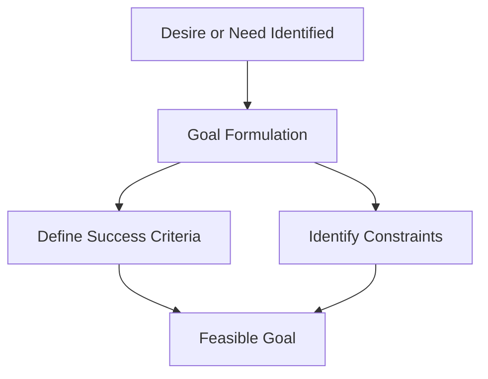
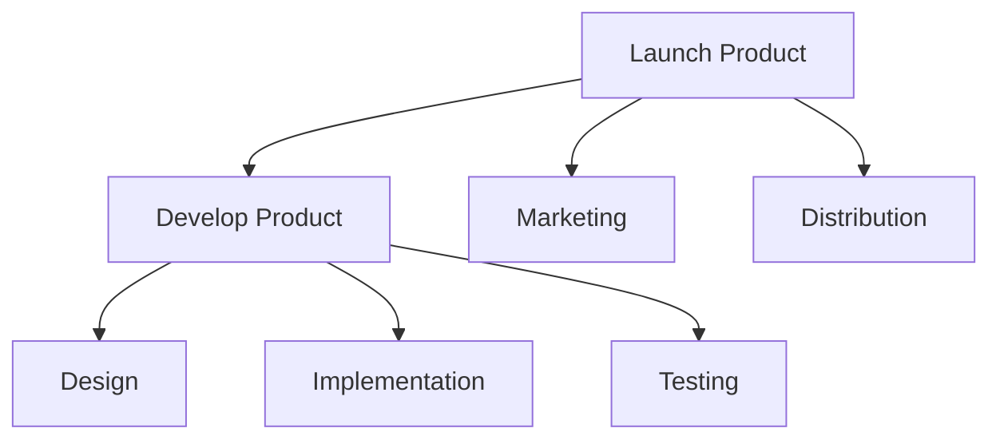
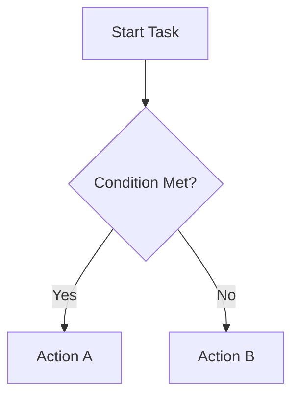
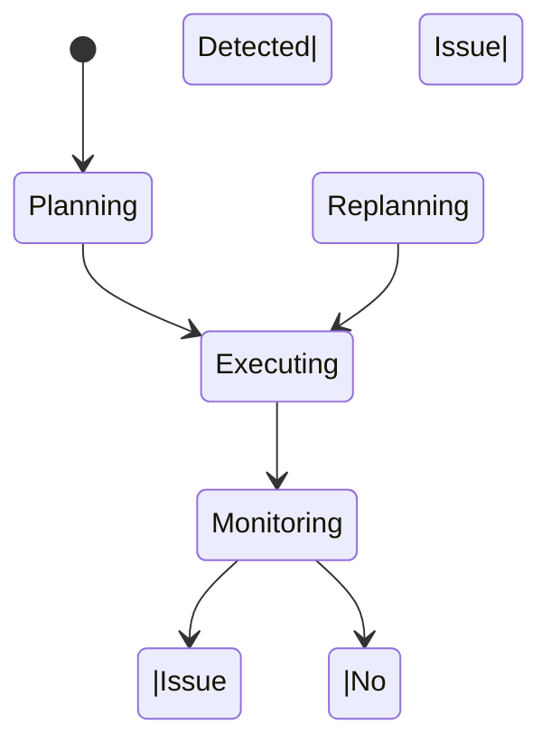

# Task Decomposition and Planning Strategies

Modern intelligent agents—whether humans, software systems, robots, or organizations—rarely operate by reacting to the world one step at a time. Instead, they **plan**. Planning allows an agent to imagine a desired future, reason backward from that future, and organize present actions in a way that increases the likelihood of success. At the heart of planning lies a deceptively simple but powerful idea: **complex goals must be broken down into manageable, executable steps**.

This chapter explores how agents plan effectively by decomposing tasks, managing memory, and making decisions under constraints and uncertainty. You will learn not only *what* planning strategies exist, but *why* they exist, *how* they work, and *when* each approach is appropriate. We will move from foundational concepts like goal formulation to advanced ideas such as dynamic replanning and plan evaluation, always grounding theory in concrete examples and real-world case studies.

Planning is not just a technical skill—it is a cognitive and organizational one. Humans plan vacations, careers, and projects. AI agents plan navigation routes, customer interactions, and manufacturing schedules. Organizations plan product launches and disaster responses. Despite differences in scale and context, all planning systems face similar challenges: limited information, limited resources, changing environments, and the possibility of failure. Understanding planning deeply allows agents to act more intelligently, resiliently, and ethically.

By the end of this chapter, you will be able to:

- Decompose complex goals into smaller, actionable tasks  
- Design and reason about hierarchical plans  
- Compare and select between linear and branching planning strategies  
- Implement dynamic replanning in response to change and uncertainty  
- Recognize, diagnose, and recover from planning failures  
- Evaluate the quality and effectiveness of plans using clear criteria  

---

## Goal Formulation and Constraints

Planning always begins with a **goal**, but not all goals are created equal. A goal is more than a vague desire; it is a structured representation of a desired future state that an agent commits to achieving. Effective goal formulation provides direction, enables prioritization, and determines whether planning efforts succeed or fail. Poorly defined goals, by contrast, lead to wasted effort, confusion, and brittle plans that collapse under pressure.

Historically, goal formulation has been studied across disciplines. In psychology, researchers examined how humans set goals and how specificity improves performance. In operations research and artificial intelligence, goals became formalized as target states in a search space. Across these traditions, one insight remains consistent: **a goal without constraints is not actionable**. Constraints transform abstract wishes into practical plans.

### What Makes a Good Goal?

A well-formulated goal has several defining characteristics:

- **Clarity**: The goal must be unambiguous and clearly understood by the agent.
- **Measurability**: There must be a way to determine whether the goal has been achieved.
- **Achievability**: The goal should be realistic given available resources and capabilities.
- **Relevance**: The goal should align with higher-level objectives or values.
- **Time-boundedness**: Many effective goals include temporal constraints.

Consider the difference between:
- “Improve customer satisfaction”  
- “Increase average customer satisfaction score from 3.8 to 4.3 within six months”

The second goal is vastly more useful for planning because it defines *what success looks like* and *by when*.

### Understanding Constraints

Constraints are the **boundaries within which planning must occur**. They limit the solution space but also make planning tractable and realistic. Constraints can arise from many sources:

- **Resource constraints**: Time, money, energy, computational power
- **Environmental constraints**: Physical laws, regulations, terrain, weather
- **Operational constraints**: Available tools, skills, dependencies
- **Ethical and social constraints**: Safety, fairness, legal compliance

Rather than being obstacles, constraints often *guide* better planning by forcing prioritization and trade-offs.

| Constraint Type | Example | Impact on Planning |
|-----------------|---------|-------------------|
| Time | Deadline in 2 weeks | Encourages parallel tasks |
| Budget | $50,000 limit | Restricts solution options |
| Legal | Data privacy laws | Limits data usage |
| Capability | Limited sensors | Requires inference or redundancy |

### Goals, Constraints, and Memory

Planning is tightly coupled with memory. An agent relies on memory to recall:

- Past goals and whether they were achieved
- Constraints encountered previously
- Strategies that worked or failed

This historical context allows agents to formulate better goals over time. For example, an AI project management agent that remembers consistent deadline overruns may start formulating more conservative goals or adding buffer constraints.

### Visualizing Goal Formulation

This diagram emphasizes that goals emerge from both aspiration and limitation.

### Practical Example: Planning a Product Launch

Imagine a startup planning to launch a new mobile app. An initial goal might be: “Launch the app soon.” Through refinement and constraint analysis, this becomes:

- Goal: Launch version 1.0 of the app on iOS and Android
- Success criteria: Approved in both app stores, 1,000 active users in first month
- Constraints: 3-person team, $20,000 budget, 4-month timeline

Only after this formulation can meaningful task decomposition begin.

---

## Hierarchical Task Decomposition

Once a goal is clearly defined, the next challenge is **breaking it down**. Hierarchical task decomposition (HTD) is the process of dividing a complex goal into smaller subgoals and tasks organized across multiple levels of abstraction. This approach mirrors how humans naturally plan and has deep roots in cognitive science, project management, and artificial intelligence.

At its core, hierarchical decomposition answers the question:  
**“What needs to be done, and at what level of detail?”**

### Why Hierarchies Matter

Complex goals overwhelm agents when treated as flat lists of actions. Hierarchies solve this problem by:

- Reducing cognitive and computational load
- Allowing focus on one level at a time
- Supporting reuse of common subplans
- Enabling parallel execution and delegation

For example, “Organize an international conference” is too large to act on directly. Breaking it into subgoals like “Select venue,” “Invite speakers,” and “Manage registrations” makes planning feasible.

### How Hierarchical Decomposition Works

The decomposition process typically follows a **top-down refinement**:

1. Start with a high-level goal.
2. Identify major subgoals required to achieve it.
3. Decompose each subgoal into tasks.
4. Continue until tasks are executable actions.

This process stops when tasks are small enough that the agent knows *how* to perform them without further planning.

### Cognitive and AI Perspectives

In human cognition, hierarchical planning allows flexibility. A person can abandon or revise a subplan without discarding the entire goal. In AI, this idea appears in **Hierarchical Task Networks (HTNs)**, where tasks are recursively decomposed using predefined methods.

HTNs became popular because they:

- Encode domain knowledge explicitly
- Reduce search complexity
- Produce more interpretable plans

However, they also require careful design and can be brittle if the environment changes unexpectedly.

### Practical Example: Cooking a Meal

Goal: Prepare a three-course dinner.

Subgoals:
- Prepare appetizer
- Cook main course
- Make dessert

Each subgoal decomposes further:
- Chop ingredients
- Preheat oven
- Plate dishes

This hierarchy allows parallel work (dessert chilling while main course cooks) and prioritization.

### Common Pitfalls in Decomposition

- **Over-decomposition**: Tasks become so granular that planning overhead outweighs benefits.
- **Under-decomposition**: Tasks remain vague and non-executable.
- **Rigid hierarchies**: Prevent adaptation when conditions change.

Balancing detail and flexibility is a learned skill.

---

## Linear vs Branching Plans

Not all plans follow a single straight path. Some assume the world behaves predictably, while others explicitly account for uncertainty. This distinction gives rise to **linear** and **branching** plans—two fundamentally different planning strategies with distinct strengths and weaknesses.

### Linear Plans: Simplicity and Efficiency

A linear plan is a **single sequence of actions** designed to achieve a goal. It assumes that each step will succeed as expected.

Advantages of linear plans include:

- Simplicity and clarity
- Low computational overhead
- Ease of execution and monitoring

They work best in stable, well-understood environments.

Example:
- Step 1: Log into system  
- Step 2: Upload file  
- Step 3: Confirm submission  

If nothing unexpected happens, linear plans are efficient and effective.

### Branching Plans: Preparing for Uncertainty

Branching plans incorporate **decision points** where different actions are taken depending on outcomes or observations. They are common in uncertain, dynamic, or adversarial environments.

Branching plans:

- Anticipate multiple futures
- Reduce the cost of surprises
- Increase robustness

However, they are more complex to design and maintain.

### Comparing Linear and Branching Approaches

| Dimension | Linear Plans | Branching Plans |
|--------|-------------|----------------|
| Complexity | Low | High |
| Flexibility | Low | High |
| Best Environment | Stable | Uncertain |
| Design Effort | Minimal | Significant |
| Robustness | Fragile | Resilient |

### Everyday Analogy: Traveling to Work

A linear plan is always taking the same route to work. A branching plan checks traffic conditions and chooses between routes dynamically. The latter requires more effort but avoids major delays when accidents occur.

---

## Dynamic Replanning

Even the best plans fail when the world changes. **Dynamic replanning** is the ability of an agent to revise its plan during execution in response to new information, unexpected events, or internal failures. This capability distinguishes rigid systems from truly intelligent ones.

### Why Replanning Is Necessary

Real-world environments are:

- Partially observable
- Non-deterministic
- Subject to sudden change

Static plans assume away these realities. Replanning acknowledges them.

Examples that require replanning:
- A delivery route blocked by construction
- A missing resource
- A change in user requirements

### How Dynamic Replanning Works

Replanning typically involves:

1. Monitoring execution
2. Detecting deviation from expectations
3. Diagnosing the cause
4. Revising the plan (partially or fully)
5. Resuming execution

This cycle may repeat many times during a single task.

### Trade-offs and Challenges

While powerful, replanning introduces costs:

- Computational overhead
- Risk of oscillation (constant replanning)
- Complexity in evaluation

Effective systems balance responsiveness with stability.

---

## Planning Failures and Recovery

Planning failures are not exceptions—they are inevitable. What matters is **how agents respond** when plans break down. Failure-aware planning treats breakdowns as learning opportunities rather than terminal events.

### Types of Planning Failures

Common categories include:

- **Goal failure**: The goal itself is unachievable.
- **Plan failure**: The plan cannot be executed as intended.
- **Execution failure**: An action does not produce expected results.
- **Assumption failure**: The world behaves differently than expected.

### Recovery Strategies

Agents can recover by:

- Repairing the plan locally
- Switching to alternative subplans
- Reformulating the goal
- Abandoning the goal entirely

Memory plays a critical role here by storing past failures and recovery outcomes.

---

## Evaluating Plan Quality

A plan is not good simply because it exists. **Plan evaluation** assesses how well a plan meets its objectives under given constraints. Evaluation can occur before execution, during execution, or after completion.

### Key Evaluation Criteria

| Criterion | Description |
|---------|-------------|
| Effectiveness | Does it achieve the goal? |
| Efficiency | Resource usage |
| Robustness | Resistance to failure |
| Flexibility | Ease of modification |
| Interpretability | Ease of understanding |

### Quantitative and Qualitative Measures

- Quantitative: cost, time, success rate
- Qualitative: clarity, maintainability, ethical alignment

Strong planners use both.

---

## Case Study: Dynamic Planning in Urban Delivery Robotics

### Context

In 2019, a mid-sized logistics company began deploying autonomous delivery robots in a dense urban environment. The robots were designed to deliver small packages within a five-kilometer radius of local distribution hubs. The city featured unpredictable traffic patterns, frequent construction, and high pedestrian density. Initial trials focused on static route planning based on digital maps.

### Problem

The early deployments revealed significant shortcomings. Robots frequently encountered blocked sidewalks, temporary road closures, and unexpected crowd formations. Linear plans failed often, forcing human operators to intervene. Delivery times were inconsistent, and customer satisfaction suffered. The core issue was not navigation capability, but inadequate planning under uncertainty.

### Solution

The engineering team introduced hierarchical task decomposition and dynamic replanning. High-level goals (“Deliver package”) were decomposed into navigation, obstacle handling, and customer interaction subgoals. Branching plans were added for common disruptions. A monitoring module detected deviations and triggered replanning in real time. Memory stored past failures by location and time of day.

### Results

Within six months, successful delivery rates increased from 82% to 96%. Average delivery time dropped by 18%. Human interventions decreased dramatically. The robots adapted to city rhythms, avoiding known problem areas during peak hours.

### Lessons Learned

The project demonstrated that planning quality depends less on perfect prediction and more on adaptability. Hierarchical decomposition simplified complexity, while replanning transformed failures into manageable events. Most importantly, integrating memory allowed continuous improvement over time.

---

## Summary

Planning enables agents to move from intention to action in complex environments. By formulating clear goals with constraints, decomposing tasks hierarchically, choosing appropriate planning structures, adapting dynamically, recovering from failures, and evaluating outcomes rigorously, agents become more effective and resilient. Planning is not a one-time activity but an ongoing dialogue between goals, actions, and the world.

---

## Reflection Questions

1. Think of a complex goal you recently pursued. How could hierarchical task decomposition have improved your planning?
2. In what situations would a linear plan be preferable to a branching plan, and why?
3. How can memory of past failures improve future planning decisions?
4. What trade-offs do you see between plan robustness and plan simplicity?
5. How would you design a system to evaluate plan quality continuously during execution?