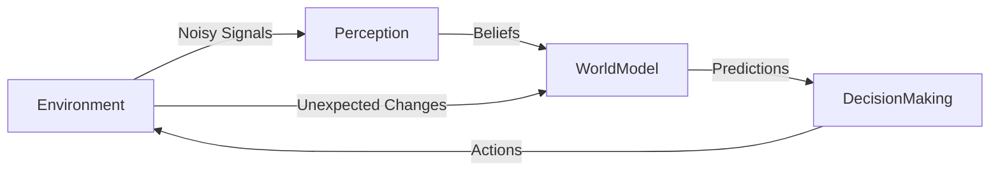
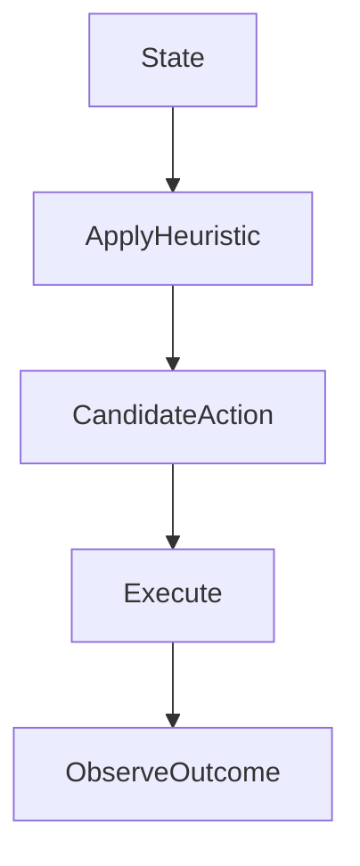
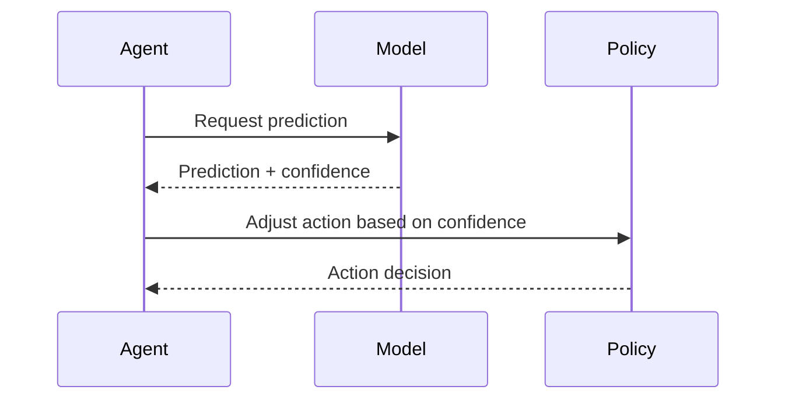
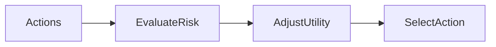
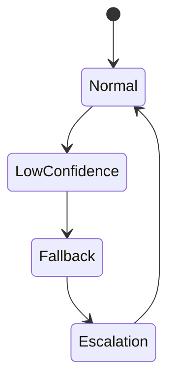

# Decision-Making Under Uncertainty

Decision-making under uncertainty lies at the heart of intelligent behavior—whether in humans, organizations, or artificial agents. Every day, people make choices without knowing all the facts: a doctor diagnoses with incomplete test results, a business invests without knowing future market conditions, and an autonomous vehicle navigates streets where pedestrians behave unpredictably. In artificial intelligence (AI) and agent systems, uncertainty is not an edge case—it is the default condition.

This chapter explores how intelligent agents plan, remember, and decide when the world is uncertain. Rather than assuming perfect information or fully predictable environments, we focus on **probabilistic reasoning, heuristic strategies, confidence estimation, and risk-aware decision-making**. These ideas allow agents to act effectively even when they cannot be certain about outcomes.

Historically, early AI systems struggled outside controlled environments because they relied on rigid rules and deterministic logic. As AI moved into real-world applications—finance, healthcare, robotics, and online platforms—it became clear that uncertainty must be explicitly modeled and managed. This realization led to the development of probabilistic models, heuristics inspired by human reasoning, and mechanisms for evaluating and improving decisions over time.

By the end of this chapter, you will not only understand *what* uncertainty is, but *why it matters*, *how agents cope with it*, and *how decision quality can be evaluated and improved*. The concepts presented here form the foundation for robust, adaptive, and trustworthy intelligent systems.

By completing this chapter, you will be able to:

- Identify and categorize different sources of uncertainty in agent systems  
- Apply heuristic decision-making strategies appropriately  
- Estimate and interpret confidence in decisions  
- Design and justify risk-aware action selection mechanisms  
- Evaluate the quality and effectiveness of decisions over time  

---

## Sources of Uncertainty in Agent Systems

Uncertainty in agent systems arises when an agent lacks complete, accurate, or reliable information about itself, its environment, or the consequences of its actions. This is not a flaw in design—it is an inherent property of operating in complex, real-world settings. Understanding the *sources* of uncertainty is the first step toward managing it effectively.

Historically, classical decision theory assumed that uncertainty could be reduced to known probabilities. However, as agent systems became more sophisticated and autonomous, researchers recognized multiple layers of uncertainty that go beyond simple randomness. These layers interact with perception, memory, learning, and planning, making uncertainty a systemic challenge rather than a single variable.

One major source of uncertainty is **perceptual uncertainty**. Sensors—whether cameras, microphones, or data feeds—are noisy and incomplete. For example, a delivery drone’s camera may misinterpret shadows as obstacles, or a recommendation system may infer user preferences from sparse or misleading data. This uncertainty propagates forward: flawed perceptions lead to flawed beliefs, which influence decisions.

Another important source is **environmental uncertainty**. Even with perfect perception, the environment itself may be unpredictable. Weather changes, human behavior, market fluctuations, and system failures introduce variability that cannot be fully anticipated. This type of uncertainty is often modeled probabilistically, but in many cases, the probability distributions themselves are unknown or shifting.

A third source comes from **model uncertainty**. Agents rely on internal models to predict outcomes, but these models are simplifications of reality. Assumptions may be outdated, incomplete, or wrong. For instance, a traffic prediction model trained before a major city redesign may systematically misestimate congestion patterns.

Finally, **action outcome uncertainty** reflects the fact that actions do not always produce intended results. Mechanical failures, delayed effects, or interactions with other agents can alter outcomes. Even simple actions like “send a message” can fail due to network issues or human interpretation.

### Common Categories of Uncertainty

- **Aleatoric uncertainty**: inherent randomness (e.g., dice rolls, weather variation)  
- **Epistemic uncertainty**: lack of knowledge that could, in principle, be reduced  
- **Adversarial uncertainty**: caused by other agents with competing goals  
- **Temporal uncertainty**: uncertainty about how situations evolve over time  

### Table: Sources of Uncertainty and Examples

| Source of Uncertainty | Description | Real-World Example |
|---|---|---|
| Perceptual | Incomplete or noisy observations | Face recognition errors in low light |
| Environmental | Unpredictable external changes | Sudden stock market shifts |
| Model | Incorrect or outdated internal models | Misestimated demand forecasting |
| Action Outcome | Actions produce variable results | Robot arm slipping during grasp |

### Visualizing Uncertainty Flow in an Agent

Understanding these sources allows designers to choose appropriate strategies—probabilistic models, heuristics, or fallback mechanisms—rather than assuming certainty where none exists.

---

## Heuristic Decision-Making

Heuristic decision-making refers to the use of simplified rules or strategies that guide choices under uncertainty. Unlike optimal decision-making—which attempts to compute the best possible action by exhaustively evaluating outcomes—heuristics prioritize speed, efficiency, and practicality. They are especially valuable when time, data, or computational resources are limited.

The concept of heuristics emerged prominently from cognitive psychology in the 1970s, particularly through the work of Herbert Simon and later Daniel Kahneman and Amos Tversky. Simon introduced the idea of **bounded rationality**, arguing that real decision-makers cannot optimize perfectly because of cognitive and environmental constraints. Instead, they “satisfice”—they look for solutions that are good enough.

In agent systems, heuristics play a similar role. For example, a game-playing agent may use a rule like “control the center early” instead of calculating all future board states. A recommendation system might prioritize popular items rather than exploring the entire catalog. These shortcuts often perform surprisingly well, especially in familiar or structured environments.

However, heuristics are not random guesses. They are typically grounded in experience, domain knowledge, or statistical regularities. For instance, the **availability heuristic** favors options that are easier to recall, while the **greedy heuristic** chooses the locally best option at each step. In algorithms like A* search, heuristics estimate remaining cost to guide exploration efficiently.

### Why Heuristics Matter

- Reduce computational complexity  
- Enable real-time decision-making  
- Provide robustness when models are incomplete  
- Mimic effective human decision strategies  

### Advantages and Limitations

Heuristics shine in environments where exact solutions are impractical. However, they can introduce systematic biases. A heuristic that works well in one context may fail badly in another, especially if underlying conditions change. Therefore, heuristic decision-making must be combined with monitoring, confidence estimation, and evaluation.

### Table: Common Heuristics in Agent Systems

| Heuristic | Core Idea | Typical Use Case | Limitation |
|---|---|---|---|
| Greedy | Choose best immediate option | Routing, scheduling | Can miss global optimum |
| Rule-based | If-then rules | Expert systems | Brittle to novel cases |
| Availability | Prefer familiar options | Recommendation systems | Bias toward popular items |

### Heuristic Decision Flow

Heuristics are not a replacement for probabilistic reasoning—they are a complementary tool that allows agents to act effectively when full reasoning is infeasible.

---

## Confidence Estimation

Confidence estimation is the process by which an agent assesses how reliable its own decisions or predictions are. This concept is critical because acting without knowing *how sure you are* can be as dangerous as not acting at all. Confidence influences whether an agent proceeds, seeks more information, or defers to another system or human.

Historically, confidence estimation grew out of statistics and probability theory, particularly in the form of confidence intervals and Bayesian posterior probabilities. In AI, confidence estimation expanded to include model uncertainty, ensemble disagreement, and calibration techniques.

At a basic level, confidence can be represented as a probability: “There is a 90% chance this diagnosis is correct.” More sophisticated systems consider multiple dimensions of confidence, such as data quality, model agreement, and historical performance in similar situations.

Confidence estimation plays a key role in **human-AI interaction**. A medical AI that reports high confidence may be trusted more, while low confidence can prompt human review. Importantly, overconfidence is a serious risk—systems that appear confident but are wrong can cause harm.

### How Confidence Is Estimated

- Probabilistic outputs (e.g., softmax probabilities)  
- Bayesian posterior distributions  
- Ensemble variance (disagreement among models)  
- Historical accuracy tracking  

### Table: Confidence Estimation Methods

| Method | How It Works | Strength | Weakness |
|---|---|---|---|
| Probability Scores | Direct model output | Simple, fast | Often miscalibrated |
| Bayesian Inference | Posterior uncertainty | Principled | Computationally heavy |
| Ensembles | Compare multiple models | Robust | Resource-intensive |

### Confidence in Decision Pipelines

Effective confidence estimation enables agents to behave cautiously when needed and decisively when appropriate.

---

## Risk-Aware Action Selection

Risk-aware action selection extends decision-making beyond expected value to include potential negative outcomes. While two actions may have the same expected reward, their risk profiles can differ dramatically. A risk-aware agent recognizes this difference and chooses actions aligned with its tolerance for failure.

This idea has roots in economics and finance, particularly in portfolio theory, where investors balance return against risk. In AI, risk awareness became critical as systems moved into safety-critical domains such as healthcare, aviation, and autonomous driving.

Risk can be defined in multiple ways: probability of failure, magnitude of loss, or worst-case outcomes. Risk-aware agents often incorporate **utility functions** that penalize undesirable outcomes more heavily than they reward positive ones.

### Risk Strategies

- **Risk-averse**: prioritize safety and stability  
- **Risk-neutral**: focus on expected value  
- **Risk-seeking**: tolerate uncertainty for higher payoff  

### Table: Risk Profiles Compared

| Profile | Behavior | Suitable Context |
|---|---|---|
| Risk-averse | Avoids high-variance actions | Medical diagnosis |
| Risk-neutral | Maximizes expected reward | Online advertising |
| Risk-seeking | Explores uncertain gains | Game playing, R&D |

### Risk-Aware Decision Flow

Risk-aware selection ensures that agents behave responsibly, especially when stakes are high.

---

## Fallback and Escalation Strategies

Fallback and escalation strategies define what an agent should do when uncertainty becomes too high or confidence too low. Instead of forcing a decision, the agent can switch to safer alternatives or request assistance.

These strategies are common in aviation, where autopilot systems hand control back to pilots under abnormal conditions. In AI, fallback mechanisms prevent catastrophic failures and improve trustworthiness.

Fallbacks may involve simpler models, conservative actions, or predefined safe states. Escalation often means involving a human or a more powerful system.

### Examples of Fallbacks

- Switching to rule-based control  
- Slowing down or stopping movement  
- Asking for human confirmation  

### Escalation Logic

Designing effective fallback strategies requires anticipating failure modes and defining clear thresholds.

---

## Evaluating Decision Outcomes

Evaluating decision outcomes closes the decision-making loop. Without evaluation, agents cannot learn, adapt, or improve. Evaluation involves comparing expected outcomes with actual results and updating models accordingly.

Historically, evaluation metrics evolved from simple accuracy measures to more nuanced concepts like regret, robustness, and long-term impact. In uncertain environments, a single bad outcome does not necessarily imply a bad decision—it may reflect unavoidable randomness.

### Evaluation Dimensions

- Outcome quality (reward, cost)  
- Consistency over time  
- Robustness to uncertainty  
- Alignment with risk preferences  

### Table: Decision Evaluation Metrics

| Metric | What It Measures | When Useful |
|---|---|---|
| Accuracy | Correct vs incorrect | Classification tasks |
| Regret | Missed opportunity | Sequential decisions |
| Utility | Overall value | Multi-objective tasks |

Evaluation informs future planning and heuristic adjustment, making decision-making a continuous improvement process.

---

## Case Study: Autonomous Delivery Robots in Urban Environments

### Context

In the late 2010s, several logistics companies began deploying small autonomous delivery robots on city sidewalks. These robots operated in dense urban environments filled with pedestrians, pets, bicycles, construction zones, and unpredictable weather. The goal was to reduce last-mile delivery costs while maintaining safety and reliability.

The robots were equipped with cameras, lidar sensors, and GPS, and they operated semi-autonomously, with human supervisors monitoring multiple robots at once. From the beginning, uncertainty was a defining challenge.

### Problem

The robots faced constant perceptual uncertainty: sensor noise, occlusions, and ambiguous objects. Environmental uncertainty compounded the problem, as pedestrian behavior varied widely across neighborhoods and times of day.

Early decision systems relied on deterministic rules, which led to frequent stops or overly cautious behavior. In some cases, robots froze in place, blocking sidewalks, while in others they made risky crossings.

### Solution

Engineers redesigned the decision system to explicitly model uncertainty. Probabilistic perception outputs were combined with heuristic navigation rules. Confidence estimation determined when the robot should proceed, slow down, or request human intervention.

Risk-aware action selection was introduced: crossing a street was treated as a high-risk action with strict confidence thresholds. Fallback strategies included pulling over to a safe spot and escalating to a remote operator.

### Results

The new system reduced incidents by over 40% and increased delivery completion rates. Robots moved more smoothly, and human interventions became more targeted and efficient.

### Lessons Learned

- Uncertainty must be embraced, not ignored  
- Confidence estimation enables safer autonomy  
- Fallback strategies are essential for public trust  

---

## Summary

Decision-making under uncertainty is a foundational challenge for intelligent agents. By understanding sources of uncertainty, applying heuristics, estimating confidence, selecting risk-aware actions, and evaluating outcomes, agents can operate effectively in complex, unpredictable environments. These mechanisms transform uncertainty from a barrier into a manageable aspect of intelligent behavior.

---

## Reflection Questions

1. Which source of uncertainty do you think is hardest to manage, and why?  
2. When might a heuristic outperform a fully probabilistic approach?  
3. How can overconfidence in AI systems be detected and mitigated?  
4. What trade-offs arise when designing risk-averse versus risk-seeking agents?  
5. How would you design a fallback strategy for a system you use daily?