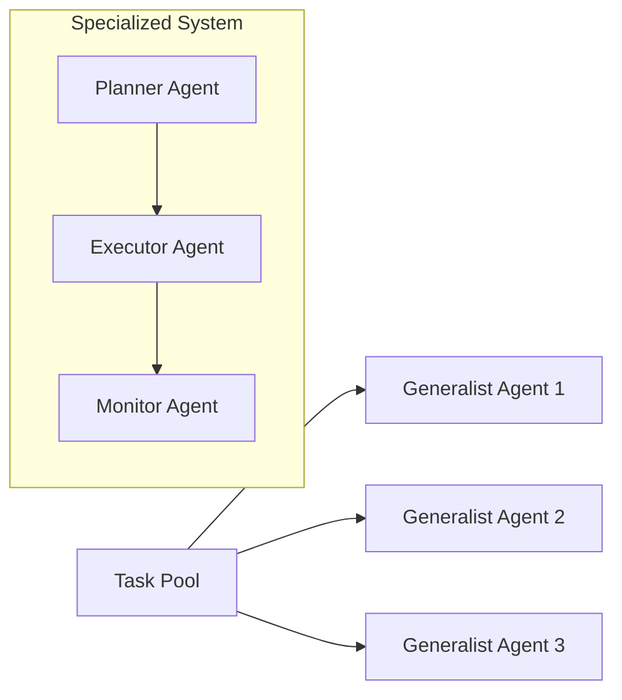
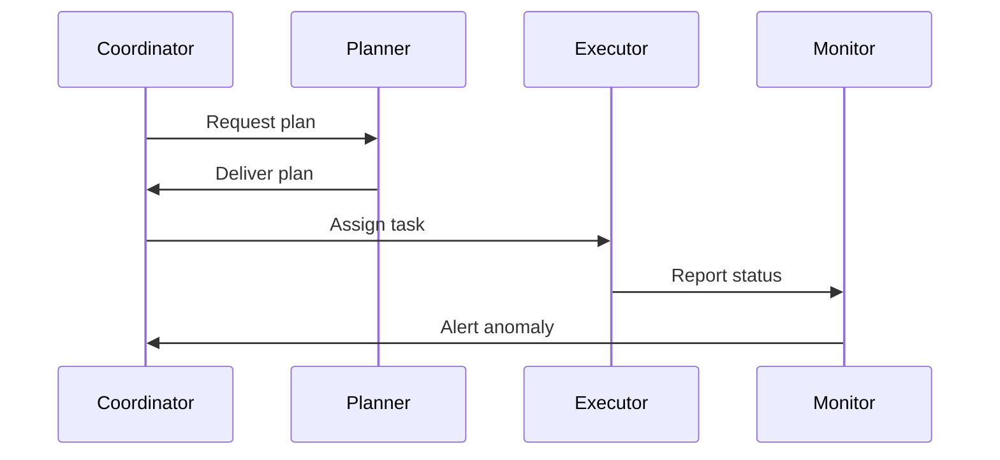
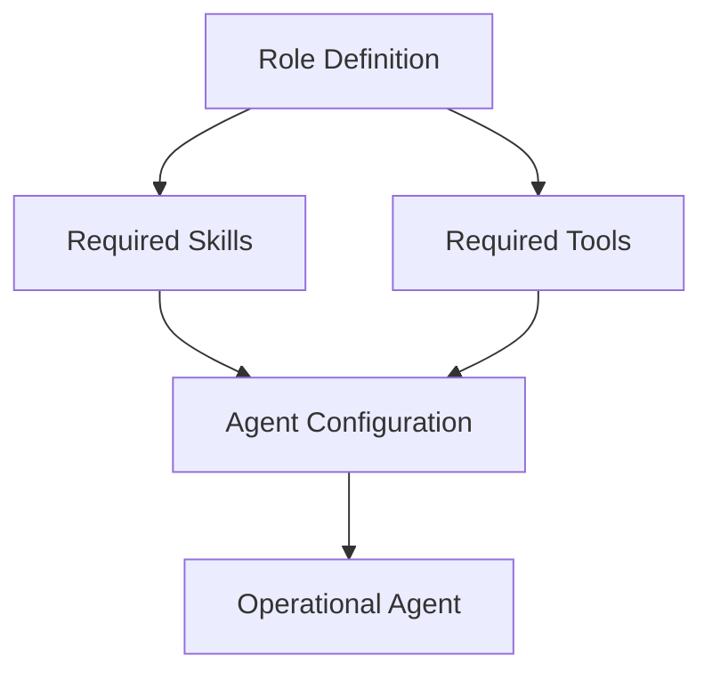
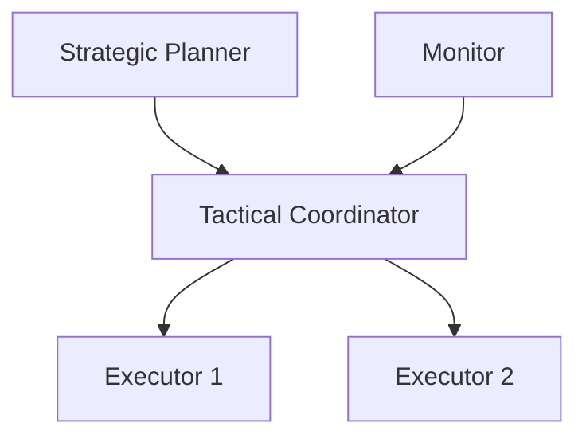
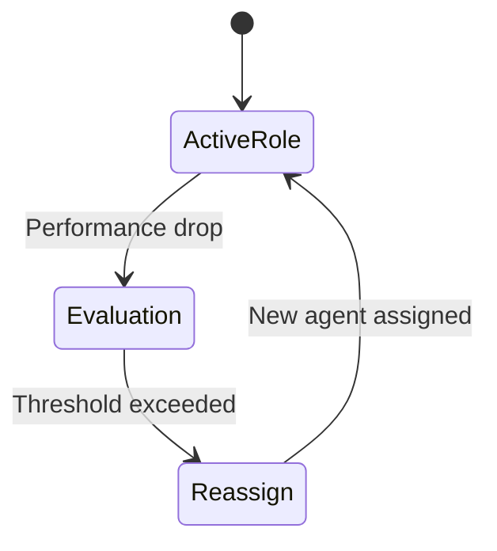

# Agent Roles and Specialization

Modern intelligent systems are rarely built as a single, monolithic entity. Instead, they are increasingly composed of **multiple autonomous agents** that must cooperate, coordinate, and sometimes compete to achieve shared or individual goals. From robotic swarms and distributed sensor networks to enterprise AI assistants and large-scale simulations, **multi-agent systems (MAS)** have become a foundational paradigm for building scalable, resilient, and intelligent solutions.

As these systems grow in size and complexity, a critical design question emerges: *How should responsibilities be divided among agents?* Treating all agents as identical and equally responsible may seem simple at first, but it quickly leads to inefficiencies, coordination failures, and brittle behavior. This is where **role-based design and agent specialization** become essential.

This chapter focuses on **agent roles and specialization as a collaboration strategy** in multi-agent systems. You will learn why role specialization is necessary, how roles are defined and structured, how skills and tools are assigned, how hierarchies emerge, and how roles can dynamically change over time. We will explore not only *what* roles are, but *why* they matter, *how* they are implemented, and *when* they should adapt. Through detailed explanations, real-world analogies, visual diagrams, and an in-depth case study, this chapter aims to give you a deep, practical understanding of role-based multi-agent collaboration.

By the end of this chapter, you will be able to:

- Design effective **role-based multi-agent systems**
- Assign responsibilities and boundaries to agents in a structured way
- Implement **dynamic role changes** based on context and performance
- Analyze and design **role hierarchies** for coordination and control
- Evaluate collaboration efficiency and role effectiveness in agent teams

---

## Motivation for Role Specialization

Role specialization in multi-agent systems is motivated by the same forces that drive specialization in human organizations, biological systems, and engineered infrastructures. At its core, specialization is about **managing complexity**. When a system grows beyond a small number of agents or tasks, expecting every agent to do everything equally well becomes impractical and inefficient.

Historically, early multi-agent systems often assumed homogeneous agents with identical capabilities. This approach was attractive because it simplified design and reasoning. However, researchers and practitioners soon discovered that homogeneous agents struggle when tasks require diverse skills, rapid coordination, or simultaneous execution. For example, in a robotic warehouse, having every robot capable of inventory management, navigation, maintenance, and scheduling leads to unnecessary duplication of logic and slower decision-making. Specialization allows each agent to focus on a narrower set of responsibilities, improving both speed and quality.

From a theoretical perspective, role specialization draws inspiration from **organizational theory** and **distributed systems engineering**. In human organizations, roles such as manager, engineer, analyst, and operator exist because they optimize communication and accountability. Similarly, in computer networks, components like routers, servers, and clients have well-defined responsibilities. Multi-agent systems adopt this principle by assigning agents specific roles that define *what they are responsible for*, *what decisions they can make*, and *how they interact with others*.

Another strong motivation is **scalability**. As the number of agents increases, coordination overhead grows rapidly. If every agent must negotiate every decision with every other agent, the system becomes bogged down in communication. Role specialization reduces this overhead by structuring interactions. For example, only agents in coordination roles may need to communicate globally, while execution-focused agents operate locally. This layered communication pattern makes large systems feasible.

Role specialization also improves **robustness and adaptability**. When roles are explicit, systems can detect failures more easily and reassign responsibilities when needed. If a “planner” agent fails, another agent with similar capabilities can temporarily assume the planning role. Without roles, such reassignment would require deep introspection into agent behavior, which is far more complex.

### Everyday Analogy: A Hospital Team

Consider a hospital emergency room:

- Doctors diagnose and make treatment decisions
- Nurses monitor patients and administer care
- Technicians run tests and manage equipment
- Administrators coordinate logistics and resources

If everyone tried to do everything, patient care would suffer. Clear roles allow parallel work, faster response, and accountability. Multi-agent systems operate under the same principle.

### Key Benefits of Role Specialization

- **Efficiency**: Agents focus on tasks they are best suited for
- **Clarity**: Responsibilities and expectations are explicit
- **Scalability**: Coordination costs are reduced
- **Resilience**: Easier fault detection and recovery
- **Maintainability**: System behavior is easier to understand and modify

---

### Table: Specialized vs Non-Specialized Agent Systems

| Aspect | Non-Specialized Agents | Role-Specialized Agents |
|------|------------------------|-------------------------|
| Task allocation | Ad hoc, dynamic | Structured and predictable |
| Coordination overhead | High | Lower and role-dependent |
| Scalability | Limited | High |
| Fault recovery | Difficult | Easier via role reassignment |
| Design complexity | Lower initially | Higher initially, lower long-term |

---

### Diagram: Why Specialization Improves Coordination

---

## Defining Agent Roles and Responsibilities

Defining agent roles is one of the most critical and delicate steps in designing a multi-agent system. A role acts as an **abstract contract** between the system and the agent: it specifies what the agent is expected to do, what authority it has, and what information it can access. Without well-defined roles, agents may duplicate work, ignore critical tasks, or interfere with one another.

A role typically consists of three core elements: **responsibilities**, **permissions**, and **interaction patterns**. Responsibilities describe the tasks or goals the agent is accountable for. Permissions define what actions the agent is allowed to perform and what resources it can use. Interaction patterns specify how the agent communicates with others—who it reports to, who it coordinates with, and who it can command or advise.

Historically, role definitions in MAS evolved alongside agent-oriented programming languages and frameworks such as JADE and FIPA standards. These frameworks introduced the idea that agents should not only have internal goals but also socially defined roles within a system. This social perspective allowed designers to reason about systems at a higher level, focusing on collaboration patterns rather than individual algorithms.

One common mistake in role definition is making roles either too vague or too rigid. Vague roles (e.g., “helper agent”) lack actionable clarity and lead to inconsistent behavior. Overly rigid roles, on the other hand, reduce flexibility and adaptability. Effective role definitions strike a balance: they are specific enough to guide behavior, yet abstract enough to allow variation in implementation.

### Responsibilities vs Tasks

It is important to distinguish between **responsibilities** and **tasks**:

- Responsibilities are *ongoing obligations* (e.g., “ensure system stability”)
- Tasks are *concrete actions* (e.g., “restart a failed node”)

A single responsibility may involve many tasks over time, and tasks may change while responsibilities remain stable.

### Examples of Common Agent Roles

- **Coordinator**: Allocates tasks and resolves conflicts
- **Planner**: Develops plans or strategies
- **Executor**: Carries out actions in the environment
- **Monitor**: Observes system state and reports anomalies
- **Learner**: Improves policies based on experience

---

### Table: Role Components and Their Purpose

| Role Component | Description | Example |
|---------------|-------------|---------|
| Responsibility | What the agent is accountable for | Maintain global plan |
| Permission | What actions/resources are allowed | Access shared database |
| Interaction | Communication patterns | Reports to coordinator |
| Constraints | Limits on behavior | Cannot modify plans |

---

### Diagram: Role-Based Interaction Model

---

## Skill and Tool Assignment

Once roles are defined, the next step is assigning **skills and tools** that enable agents to fulfill their responsibilities. A role without the necessary skills is merely a label; it becomes meaningful only when supported by concrete capabilities. Skills refer to internal competencies such as reasoning algorithms, learning models, or perception abilities. Tools refer to external resources such as APIs, sensors, databases, or actuators.

The distinction between skills and tools is subtle but important. Skills are intrinsic to the agent—they define *what the agent knows how to do*. Tools are extrinsic—they define *what the agent can use*. For example, a planning skill might involve heuristic search, while a tool might be access to a scheduling API.

Assigning skills and tools should be driven by role requirements, not by agent identity. This promotes modularity and reuse. If the “Planner” role requires optimization and forecasting, any agent assigned that role should be equipped with the corresponding algorithms and data access. This also enables dynamic role reassignment, which we will explore later.

Over-assigning skills is a common pitfall. While it may seem beneficial to give agents many capabilities “just in case,” this increases computational cost, complexity, and the risk of unintended behavior. Minimal sufficiency—providing exactly what the role requires—is usually the better strategy.

### Practical Example: Smart Traffic System

- **Sensor Agents**: Skills in data collection; tools include cameras and IoT sensors
- **Analysis Agents**: Skills in pattern recognition; tools include historical databases
- **Control Agents**: Skills in decision-making; tools include traffic light controllers

Each role has a distinct skill-tool profile aligned with its responsibilities.

---

### Table: Mapping Roles to Skills and Tools

| Role | Core Skills | Key Tools |
|-----|-------------|-----------|
| Planner | Optimization, forecasting | Simulation engine |
| Executor | Action sequencing | Actuators, APIs |
| Monitor | Anomaly detection | Logging systems |
| Coordinator | Negotiation, arbitration | Messaging middleware |

---

### Diagram: Skill and Tool Assignment Flow

---

## Role Hierarchies

As systems grow more complex, roles often organize themselves into **hierarchies**. A role hierarchy defines relationships of authority, dependency, or abstraction among roles. Hierarchies are not about superiority but about **coordination efficiency and control flow**.

In a flat role structure, all roles are peers. This works well for small or highly decentralized systems. However, as the number of agents increases, flat structures can lead to excessive communication and slow decision-making. Hierarchies introduce layers that localize decision-making and reduce global coordination costs.

A typical hierarchy might include strategic roles at the top (e.g., global planners), tactical roles in the middle (e.g., coordinators), and operational roles at the bottom (e.g., executors). Information flows upward, while directives flow downward. This mirrors military command structures, corporate organizations, and even biological systems like ant colonies.

Designing role hierarchies requires careful consideration. Overly deep hierarchies can become rigid and slow to adapt. Shallow hierarchies may not provide enough structure. The key is aligning hierarchy depth with task complexity and environmental dynamics.

---

### Table: Flat vs Hierarchical Role Structures

| Dimension | Flat Structure | Hierarchical Structure |
|---------|----------------|------------------------|
| Decision speed | Fast locally | Faster globally |
| Scalability | Limited | High |
| Fault tolerance | High | Depends on redundancy |
| Coordination cost | High | Lower |

---

### Diagram: Role Hierarchy Example

---

## Dynamic Role Reassignment

Static roles assume stable environments, but real-world systems are rarely stable. Agents may fail, workloads may shift, and goals may evolve. **Dynamic role reassignment** allows a system to adapt by changing which agent performs which role at runtime.

Dynamic reassignment can be triggered by various events: performance degradation, agent failure, environmental changes, or new objectives. The system must detect the need for change, select a suitable replacement, and transition responsibilities smoothly. This process requires meta-level reasoning and often a supervisory mechanism.

One major challenge is ensuring continuity. When a role changes hands, the new agent must acquire the relevant context—state, history, and goals. Poorly managed transitions can cause temporary instability or duplicated effort. Techniques such as shared knowledge bases, checkpointing, and role handover protocols are commonly used to mitigate this.

Dynamic roles also raise governance questions. Who decides when reassignment occurs? Centralized control simplifies decisions but introduces single points of failure. Decentralized negotiation is more robust but harder to design. Hybrid approaches are often most effective.

---

### Diagram: Dynamic Role Reassignment Process

---

## Evaluating Role Effectiveness

Defining and assigning roles is only the beginning. To ensure that a role-based system is functioning well, designers must **evaluate role effectiveness**. This involves assessing whether roles are contributing positively to system goals and whether the collaboration structure remains appropriate over time.

Evaluation can be qualitative or quantitative. Quantitative metrics include task completion time, resource utilization, error rates, and communication overhead. Qualitative evaluation considers clarity of responsibility, ease of maintenance, and adaptability. Both perspectives are important, as numbers alone may not reveal structural issues.

A key concept is **role fitness**—how well a role’s definition, skills, and placement match its operational demands. Poor role fitness may indicate that responsibilities are misaligned or that the role should be split or merged with another.

Evaluation should be continuous rather than one-time. As environments change, roles that were once effective may become obsolete. Periodic reviews and simulations help maintain alignment between roles and system goals.

---

### Table: Role Evaluation Metrics

| Metric | What It Measures | Why It Matters |
|------|------------------|----------------|
| Task latency | Speed of execution | User satisfaction |
| Error rate | Reliability | System trust |
| Communication load | Coordination cost | Scalability |
| Role churn | Stability | Maintainability |

---

## Case Study: Role-Based Coordination in a Disaster Response Drone System

### Context

In the early 2020s, a national emergency management agency began exploring the use of autonomous drones to support disaster response after earthquakes and floods. These disasters often left areas inaccessible to human responders, with damaged infrastructure, unstable terrain, and limited communication. The agency envisioned a fleet of dozens, eventually hundreds, of drones that could collaboratively survey damage, locate survivors, and coordinate aid delivery.

Initially, the design team considered deploying identical drones with the same software stack. Each drone would explore, analyze sensor data, and communicate findings. Early simulations showed promise in small scenarios, but as the number of drones increased, problems emerged. Communication channels became congested, drones duplicated survey work, and critical areas were sometimes overlooked.

The team realized that while the drones were physically similar, the *tasks* they needed to perform were diverse and interdependent. This realization set the stage for a shift toward a role-based multi-agent architecture.

### Problem

The primary problem was **coordination inefficiency**. With no explicit roles, drones made local decisions that were rational individually but suboptimal collectively. For example, multiple drones would converge on visually interesting areas while neglecting less obvious but equally important regions.

Another issue was **decision latency**. Every drone attempted to process raw sensor data, build maps, and plan routes simultaneously. This redundancy consumed computational resources and slowed down response times. When a drone failed or lost connectivity, there was no clear mechanism for another drone to take over its responsibilities.

Finally, the system lacked **accountability**. When coverage gaps were discovered after a mission, it was difficult to determine why they occurred or which part of the system had failed. The absence of defined responsibilities made debugging and improvement extremely challenging.

### Solution

The design team restructured the system around explicit agent roles. They introduced several key roles: *Surveyor*, *Analyzer*, *Coordinator*, and *Relay*. Surveyor drones focused on data collection, Analyzer drones processed imagery and sensor data, Coordinators assigned regions and priorities, and Relay drones maintained communication links.

Roles were defined independently of drone identity. Any drone could theoretically assume any role, provided it had sufficient battery life, sensor health, and computational capacity. Skills and tools were assigned accordingly, with Analyzer drones equipped with more powerful onboard processors and Surveyors optimized for flight endurance.

A hierarchical structure was implemented, with a small number of Coordinators overseeing clusters of Surveyors. Dynamic role reassignment was also added. If a Coordinator’s battery dropped below a threshold, another drone would automatically assume the role, inheriting its state and assignments.

### Results

The role-based system was tested in large-scale simulations and later in controlled field exercises. Coverage efficiency improved significantly, with nearly complete area surveys achieved in less time than before. Communication overhead decreased because only Coordinators needed to exchange global information.

The system also proved more resilient. When drones were intentionally disabled during tests, role reassignment allowed the mission to continue with minimal disruption. Post-mission analysis became easier, as responsibilities were clearly delineated.

However, the team also observed limitations. Role transitions introduced brief delays, and poorly tuned thresholds sometimes caused unnecessary reassignments. These issues highlighted the need for careful evaluation and tuning.

### Lessons Learned

One key lesson was that **roles are design artifacts that require iteration**. Initial role definitions were revised multiple times as the team gained operational experience. Another insight was the importance of balancing hierarchy depth with flexibility—too much centralization reduced responsiveness in fast-changing conditions.

Finally, the project demonstrated that role-based design is not just a technical choice but an organizational one. Clear roles improved not only system performance but also human understanding, trust, and the ability to improve the system over time.

---

## Summary

Role specialization is a cornerstone of effective multi-agent collaboration. By defining clear roles, assigning appropriate skills and tools, structuring hierarchies, enabling dynamic reassignment, and continuously evaluating effectiveness, designers can build systems that are scalable, resilient, and understandable. Roles transform collections of agents into coordinated teams, capable of tackling complex real-world problems.

---

## Reflection Questions

1. How would you decide whether a system needs role specialization or can remain homogeneous?
2. What trade-offs exist between rigid role definitions and flexible, dynamic roles?
3. How might role hierarchies change in highly unpredictable environments?
4. What metrics would you prioritize when evaluating role effectiveness in safety-critical systems?
5. Can you think of a domain where dynamic role reassignment might be risky or undesirable? Why?