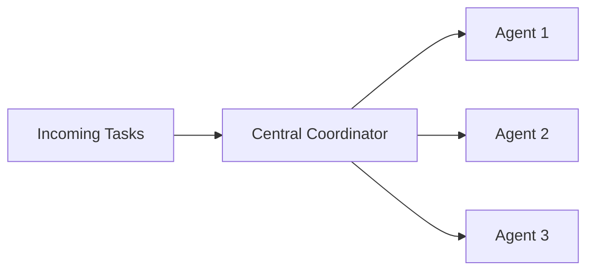
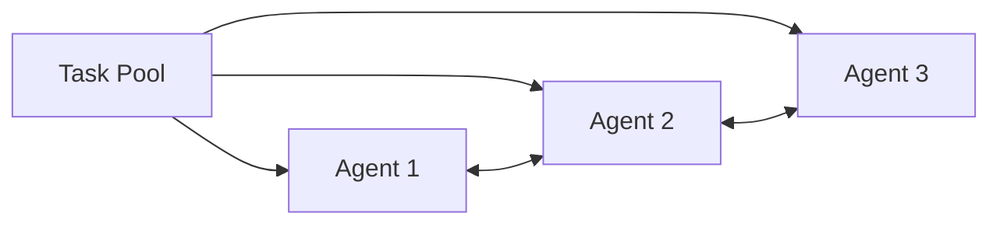
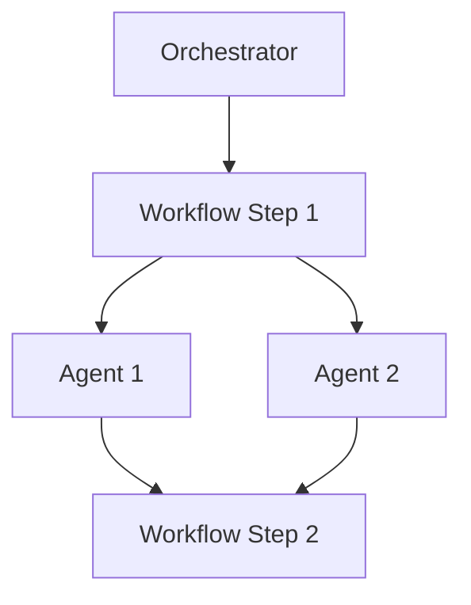
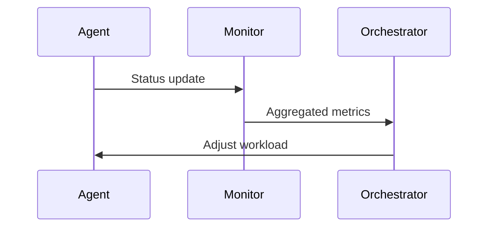
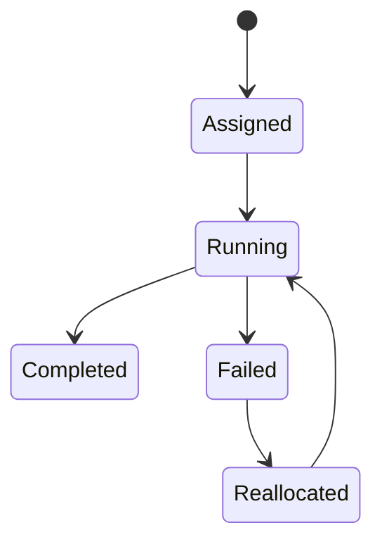

# Task Allocation and Orchestration

Modern intelligent systems rarely operate as a single, monolithic entity. Instead, they are increasingly built as **multi-agent systems (MAS)**—collections of autonomous or semi-autonomous agents that collaborate to achieve shared goals. These agents may be software services, robots, AI models, microservices, or even human-in-the-loop components. What makes multi-agent systems powerful is not just the intelligence of individual agents, but **how work is distributed, coordinated, monitored, and recovered when things go wrong**.

Imagine a busy airport. Air traffic controllers, baggage handlers, pilots, ground crew, and automated systems all work together. No single actor can manage everything. Tasks must be assigned to the right parties, workloads must be balanced, progress must be tracked, and contingency plans must exist for delays or failures. Multi-agent systems face the same challenges—just in digital or robotic form.

This chapter focuses on the **core collaboration problem** in multi-agent systems: **task allocation and orchestration**. We explore how tasks are distributed among agents, how coordination is designed, how workloads are balanced, and how systems adapt when assumptions break. Rather than treating these as isolated techniques, we will see them as interconnected design decisions that shape system performance, robustness, and scalability.

By the end of this chapter, you will be able to:

- Allocate tasks across agents using appropriate coordination strategies  
- Design orchestration mechanisms for multi-agent collaboration  
- Balance agent workloads under dynamic and uncertain conditions  
- Monitor collaborative task progress in real time  
- Recover gracefully from allocation and execution failures  

---

## Centralized vs Decentralized Allocation

Task allocation is one of the earliest and most fundamental problems studied in multi-agent systems. At its core, it answers a simple question: **who should do what, and when?** The two dominant paradigms for answering this question are **centralized** and **decentralized** allocation. Understanding their differences is essential, because almost every orchestration framework is built somewhere along this spectrum.

### Understanding Centralized Allocation

In centralized task allocation, a single coordinating entity—often called a **planner**, **scheduler**, or **orchestrator**—has a global view of the system. This coordinator receives information about tasks, agent capabilities, constraints, and priorities, then computes an allocation plan.

Historically, centralized allocation emerged from operations research and classical AI planning. Early scheduling systems for factories, airline crews, and computer operating systems relied on a central authority because it simplified optimization. With full visibility, the coordinator could aim for globally optimal solutions.

Centralized allocation works roughly as follows:

1. Tasks enter a shared queue or backlog  
2. Agents report their status, capabilities, and availability  
3. The coordinator evaluates constraints and objectives  
4. Tasks are assigned to agents  
5. Execution begins, often with periodic replanning  

This approach is particularly effective when:

- The number of agents is limited  
- The environment is relatively stable  
- Global optimization is critical  

**Analogy:** Think of a restaurant kitchen with a head chef who assigns dishes to cooks based on skill and availability. The chef sees all orders and all staff, making coordinated decisions.

However, centralized allocation has notable downsides. The coordinator can become a **bottleneck**, a **single point of failure**, and a **scalability constraint**. As systems grow or become more dynamic, maintaining accurate global state becomes increasingly difficult.

### Understanding Decentralized Allocation

Decentralized allocation distributes decision-making across agents. Instead of receiving assignments from a central authority, agents negotiate, bid, or self-select tasks based on local information and simple coordination rules.

This paradigm gained popularity with the rise of distributed systems, swarm robotics, and large-scale networked applications. Researchers observed that biological systems—such as ant colonies or bird flocks—achieve remarkable coordination without central control.

A typical decentralized process may involve:

- Tasks being broadcast or advertised  
- Agents evaluating tasks locally  
- Agents bidding, claiming, or negotiating for tasks  
- Conflict resolution through protocols or norms  

**Analogy:** Imagine a group project where tasks are posted on a board, and team members pick tasks based on interest and availability, communicating informally to avoid duplication.

Decentralized allocation excels when:

- The system is large or geographically distributed  
- Communication is unreliable or expensive  
- Robustness and fault tolerance are priorities  

The trade-off is that decentralized systems may produce **suboptimal allocations**, as no single agent sees the full picture.

### Comparison of Centralized and Decentralized Approaches

| Dimension | Centralized Allocation | Decentralized Allocation |
|--------|-----------------------|--------------------------|
| Decision authority | Single coordinator | Distributed among agents |
| Global optimization | Strong | Limited |
| Scalability | Limited | High |
| Fault tolerance | Low | High |
| Communication overhead | Moderate to high | Often lower, localized |
| Adaptability | Slower | Faster |

### Hybrid Models in Practice

In real systems, pure centralized or pure decentralized approaches are rare. Hybrid models combine centralized planning with decentralized execution. For example:

- A central planner defines high-level goals  
- Agents locally decide how to achieve them  
- Replanning occurs only when thresholds are crossed  

This balance reflects a deeper insight: **allocation is not just about efficiency—it is about trust, control, and resilience**.

---

## Capability-Based Task Assignment

While allocation strategies define **who decides**, capability-based task assignment defines **how decisions are made**. At its heart, this approach recognizes a simple truth: **not all agents are equally suited for all tasks**.

### What Are Capabilities?

Capabilities represent the skills, resources, permissions, or competencies an agent possesses. They may include:

- Computational abilities (e.g., GPU access, memory limits)  
- Domain expertise (e.g., language translation, vision processing)  
- Physical attributes (e.g., speed, reach, payload capacity)  
- Contextual permissions (e.g., access to sensitive data)  

Early MAS research treated agents as homogeneous. Over time, it became clear that heterogeneity is the norm, not the exception.

### Why Capability-Based Assignment Matters

Assigning tasks without considering capabilities leads to inefficiencies, failures, or unsafe behavior. A task that exceeds an agent’s capabilities may stall execution or degrade system performance.

**Analogy:** Assigning a legal contract review to a graphic designer is as inefficient as assigning image recognition to a text-only model.

Capability-based assignment ensures:

- Higher success rates  
- Better resource utilization  
- Predictable performance  

### How Capability Matching Works

A typical capability-based process includes:

1. Task decomposition into requirements  
2. Agent capability modeling  
3. Matching or scoring  
4. Constraint checking  
5. Assignment decision  

Capabilities are often represented as vectors or structured profiles, enabling algorithmic matching.

### Example: AI Assistant Collaboration

Consider a system with three agents:

- Agent A: Natural language understanding  
- Agent B: Data analysis  
- Agent C: Visualization  

A report-generation task is decomposed into subtasks aligned with each capability. Rather than assigning the entire task to one agent, the system orchestrates collaboration.

| Task | Required Capability | Assigned Agent |
|----|--------------------|---------------|
| Summarize data | NLP | Agent A |
| Analyze trends | Statistics | Agent B |
| Create charts | Visualization | Agent C |

This approach naturally connects to orchestration, load balancing, and monitoring.

---

## Load Balancing Strategies

Even with perfect allocation and capability matching, systems can fail if workloads are uneven. Load balancing addresses **when and how much work each agent should handle**.

### Why Load Balancing Is Critical

Uneven workloads lead to:

- Agent overload and failure  
- Idle resources  
- Increased latency  
- Reduced system lifespan  

In human teams, burnout is a familiar concept. In multi-agent systems, overload manifests as timeouts, errors, or degraded performance.

### Common Load Balancing Strategies

Load balancing strategies vary in sophistication:

- **Static balancing**: Tasks assigned upfront based on estimates  
- **Dynamic balancing**: Continuous adjustment based on runtime metrics  
- **Reactive balancing**: Redistribution triggered by overload  
- **Predictive balancing**: Anticipates future load using models  

### Push vs Pull Models

- **Push-based**: The orchestrator assigns tasks proactively  
- **Pull-based**: Agents request tasks when ready  

Pull-based systems often scale better, as they naturally adapt to agent availability.

### Comparative Overview

| Strategy | Adaptability | Complexity | Best Use Case |
|--------|--------------|------------|---------------|
| Static | Low | Low | Stable environments |
| Dynamic | High | Medium | Variable workloads |
| Reactive | Medium | Medium | Burst handling |
| Predictive | Very high | High | Mission-critical systems |

Load balancing is deeply connected to monitoring and reallocation, which we explore later.

---

## Orchestration Frameworks

Orchestration frameworks provide the **infrastructure and rules** that bind allocation, capability matching, and load balancing into a coherent system.

### What Is Orchestration?

Orchestration is the coordination of multiple agents to execute tasks in the correct order, with appropriate dependencies, data flows, and recovery mechanisms.

Historically, orchestration emerged in workflow systems and later in cloud computing (e.g., Kubernetes). In MAS, orchestration extends beyond execution—it governs **collaboration logic**.

### Core Components of Orchestration Frameworks

- Task models and workflows  
- Agent registries and discovery  
- Communication protocols  
- State management  
- Failure handling  

### Centralized vs Distributed Orchestration

Just like allocation, orchestration can be centralized or distributed. Centralized orchestrators simplify reasoning, while distributed orchestration enhances resilience.

### Practical Example: Cloud-Native MAS

In cloud-native AI platforms, orchestration frameworks manage model inference, data preprocessing, and result aggregation across microservices. These systems rely heavily on declarative orchestration.

---

## Monitoring Task Progress

Allocation and orchestration are meaningless without visibility. Monitoring provides **situational awareness**, enabling informed decisions and timely interventions.

### What Should Be Monitored?

Effective monitoring covers:

- Task state (pending, running, completed, failed)  
- Agent health (latency, errors, resource usage)  
- Workflow progress  
- System-level KPIs  

### Why Monitoring Is More Than Logging

Monitoring is not just record-keeping. It enables:

- Adaptive load balancing  
- Failure detection  
- SLA enforcement  
- Trust in autonomous systems  

### Monitoring Architectures

Monitoring can be:

- Centralized dashboards  
- Distributed event streams  
- Hierarchical aggregation  

### Human-in-the-Loop Monitoring

In high-stakes systems, humans remain part of the loop. Visualization and explainability are essential for trust.

---

## Reallocation and Recovery

No allocation plan survives first contact with reality. Reallocation and recovery mechanisms allow systems to **adapt under failure and uncertainty**.

### Types of Failures

- Agent crashes  
- Communication breakdowns  
- Capability mismatches  
- Environmental changes  

### Reallocation Strategies

Reallocation may involve:

- Task reassignment  
- Task decomposition  
- Redundancy and replication  
- Graceful degradation  

### Recovery vs Restart

Recovery focuses on preserving progress, while restart sacrifices partial work for simplicity. Choosing between them depends on cost and risk.

---

## Case Study: Coordinating Autonomous Warehouse Robots

### Context

In the late 2010s, large e-commerce warehouses began deploying fleets of autonomous mobile robots to handle picking, packing, and transportation. A single warehouse might operate hundreds of robots, each with different battery levels, speeds, and payload capacities. The challenge was not building robots—but coordinating them.

Initially, warehouse operations relied on centralized scheduling systems inherited from traditional logistics software. These systems assumed predictable conditions and limited agent diversity. As robot fleets grew, these assumptions began to break down.

### Problem

The centralized scheduler became a bottleneck. Task assignments lagged behind real-time conditions, leading to traffic congestion, idle robots, and missed delivery targets. When a robot failed or required charging, the system struggled to adapt quickly.

Moreover, not all robots were equal. Some were optimized for heavy loads, others for speed. Ignoring these capabilities resulted in inefficiencies and increased wear.

### Solution

Engineers redesigned the system using a hybrid multi-agent orchestration approach. High-level goals—such as daily throughput—were defined centrally. Task allocation and routing decisions were decentralized.

Robots advertised their capabilities and current load. Tasks were broadcast, and robots bid based on proximity, battery level, and capacity. A lightweight orchestrator resolved conflicts and ensured global constraints.

Dynamic load balancing allowed robots to pull tasks when ready, reducing idle time. Monitoring dashboards tracked task progress, congestion, and failures in real time.

### Results

The new system reduced average task completion time by over 30%. Robot utilization increased significantly, and failure recovery times dropped from minutes to seconds. Importantly, the system scaled gracefully as new robots were added.

### Lessons Learned

The case demonstrated that **collaboration beats control** at scale. Centralized visibility combined with decentralized decision-making produced a resilient and efficient system. Capability-based allocation and continuous monitoring were key enablers, not optional features.

---

## Summary

Task allocation and orchestration form the backbone of multi-agent collaboration. Centralized and decentralized approaches offer different trade-offs, and most real systems blend both. Capability-based assignment ensures tasks align with agent strengths, while load balancing prevents overload and inefficiency. Orchestration frameworks provide structure, monitoring ensures visibility, and reallocation enables resilience.

Together, these concepts transform collections of agents into **coherent, adaptive teams**.

---

## Reflection Questions

1. When would you prioritize decentralization over global optimization in task allocation?  
2. How might capability modeling evolve as agents become more autonomous and adaptive?  
3. What monitoring signals are most critical for enabling safe reallocation?  
4. How would you design recovery strategies for tasks with irreversible side effects?  
5. In what ways do human team dynamics mirror multi-agent orchestration challenges?