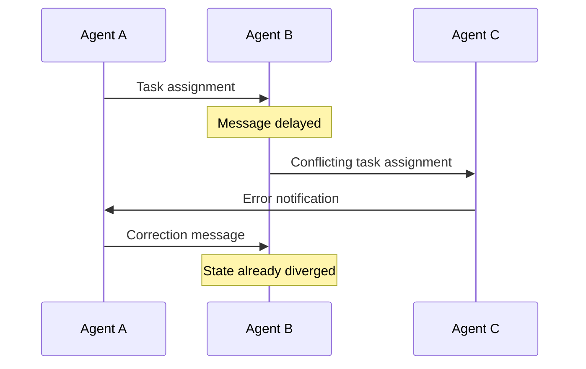
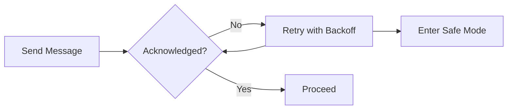
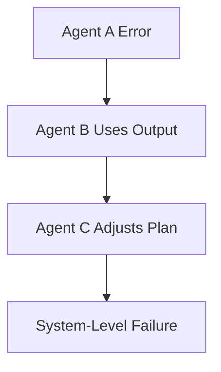
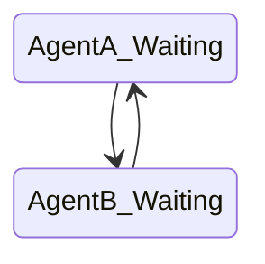
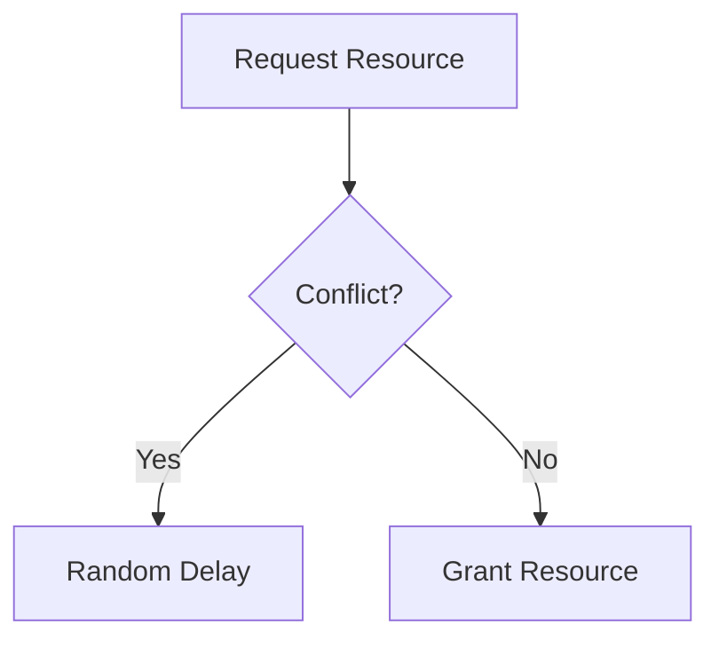
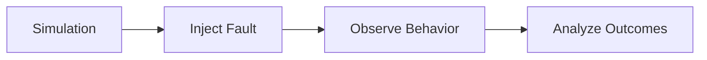

# Multi-Agent Systems and Collaboration: Failure Modes in Multi-Agent Systems

## Learning Objectives

- Identify common multi-agent failures
- Analyze cascading error scenarios
- Design fault-tolerant systems
- Prevent deadlocks
- Test multi-agent robustness

---

## Introduction

This chapter examines common failure scenarios and mitigation strategies.

---

---

Multi-agent systems (MAS) are increasingly used to solve complex problems that are too large, too dynamic, or too distributed for a single intelligent agent. From fleets of autonomous vehicles and distributed sensor networks to collaborative AI assistants and financial trading bots, multi-agent systems promise scalability, resilience, and emergent intelligence through collaboration. However, these benefits come with a cost: **new and often subtle failure modes** that do not exist—or are far less severe—in single-agent systems.

In a multi-agent environment, agents must communicate, coordinate, trust one another’s outputs, and adapt to changing conditions. When something goes wrong, failures rarely stay isolated. A small misunderstanding between two agents can propagate across the system, triggering cascading errors, deadlocks, or widespread loss of trust. These failures can be difficult to diagnose because the system’s global behavior emerges from many local interactions.

This chapter focuses on **failure modes in multi-agent systems**, with a strong emphasis on understanding *why* they occur, *how* they manifest in real-world systems, and *what* designers and engineers can do to mitigate them. Rather than treating failures as rare edge cases, we treat them as an expected part of multi-agent collaboration that must be actively designed for, tested, and managed.

By the end of this chapter, you will not only recognize common failure patterns, but also develop the analytical tools and practical strategies needed to build **robust, fault-tolerant, and trustworthy multi-agent systems**.

---

By completing this chapter, you will be able to:

- Identify common failure modes in multi-agent systems  
- Analyze how small errors can cascade across multiple agents  
- Design systems that tolerate partial failures gracefully  
- Recognize and prevent deadlocks and livelocks  
- Apply systematic approaches to testing multi-agent robustness  

---

## Communication Failures

Communication is the lifeblood of any multi-agent system. Agents rely on messages to share observations, negotiate responsibilities, coordinate actions, and align on shared goals. When communication fails, agents are effectively operating with partial or distorted views of reality. Unlike single-agent systems, where internal state is usually consistent, multi-agent systems must constantly synchronize understanding across distributed components.

### What Communication Failures Are and Why They Matter

A **communication failure** occurs when messages between agents are delayed, lost, corrupted, misunderstood, or misinterpreted. These failures can be caused by technical issues (network latency, packet loss), semantic mismatches (different interpretations of the same message), or organizational design flaws (unclear protocols or assumptions).

Historically, communication failures became a major research concern in distributed systems during the rise of networked computing in the 1980s and 1990s. As systems evolved from tightly coupled monoliths to loosely coupled distributed agents, researchers realized that *perfect communication cannot be assumed*. This insight carries directly into modern multi-agent AI systems.

Communication failures are especially dangerous because:
- Agents may **act on outdated or incomplete information**
- Conflicting decisions may be made simultaneously
- Errors may remain hidden until they cause visible damage
- Recovery becomes harder as agents diverge in their beliefs

### Types of Communication Failures

Communication failures in multi-agent systems typically fall into several categories:

- **Message loss**: Messages never reach their intended recipients.
- **Message delay**: Messages arrive too late to be useful.
- **Message duplication**: The same message is processed multiple times.
- **Semantic mismatch**: Agents interpret the same message differently.
- **Protocol mismatch**: Agents follow incompatible communication rules.

The table below compares these failure types and their typical consequences:

| Failure Type        | Root Cause                         | Typical Impact                          | Example |
|---------------------|------------------------------------|------------------------------------------|---------|
| Message loss        | Network instability, overload      | Missing coordination, inconsistent state | Sensor agent fails to report hazard |
| Message delay       | Latency, congestion                | Actions based on stale data              | Robot avoids obstacle that no longer exists |
| Message duplication | Retry mechanisms without safeguards| Repeated actions, overreaction           | Order placed twice by procurement agents |
| Semantic mismatch   | Poor ontology design               | Misaligned decisions                     | “Priority” interpreted differently |
| Protocol mismatch   | Versioning or design errors        | Communication breakdown                  | One agent expects ACK, other does not |

### How Communication Failures Propagate

Communication failures rarely remain local. Consider an agent that fails to receive an update about a resource allocation. That agent may proceed with an outdated plan, causing conflicts with other agents. Those conflicts generate further messages, potentially overwhelming the communication channel and amplifying the original problem.

This propagation can be visualized as follows:

### Practical Examples and Analogies

A useful analogy is a **group chat with poor connectivity**. If one team member misses a message about a meeting time change, they may show up late, disrupting the entire group’s plan. Similarly, in multi-agent systems, even a single missed message can derail coordinated action.

In autonomous vehicle platoons, delayed communication about braking can cause rear vehicles to react too late, increasing collision risk. In financial trading bots, delayed price updates can lead to trades based on outdated market conditions, amplifying losses.

### Mitigation Strategies

To reduce communication failures, designers commonly use:
- Redundant communication channels
- Explicit acknowledgments and retries
- Shared ontologies and schemas
- Time-stamped messages with expiration logic
- Graceful degradation when communication is uncertain

---

## Cascading Agent Errors

Cascading errors occur when a failure in one agent triggers failures in others, leading to system-wide degradation. This phenomenon is one of the most dangerous failure modes in multi-agent systems because it can transform a small, localized issue into a catastrophic system collapse.

### Understanding Cascading Errors

A **cascading agent error** begins with a single incorrect action, assumption, or internal state within one agent. Other agents, trusting that agent’s outputs, incorporate the error into their own reasoning. Over time, the error compounds as more agents depend on faulty information.

This concept has roots in systems engineering and risk analysis, particularly in studies of power grids and financial systems. In multi-agent AI, cascading errors are exacerbated by:
- High interdependence between agents
- Strong trust assumptions
- Lack of global oversight
- Rapid automated decision-making

### Why Cascades Are Hard to Detect

Cascading errors are often difficult to detect early because:
- Each individual action may appear reasonable
- Errors emerge from interactions, not isolated components
- Monitoring is often decentralized
- Feedback loops amplify effects nonlinearly

The following diagram shows how a single error propagates:

### Real-World Examples

In supply chain management systems, one forecasting agent may underestimate demand. Procurement agents then order fewer materials, logistics agents schedule fewer deliveries, and retail agents run out of stock. Each agent is “doing its job,” yet the system fails.

In collaborative AI writing systems, one agent may misinterpret a requirement. Other agents build on that misunderstanding, resulting in a final output that is coherent but fundamentally wrong.

### Case Study: Cascading Failures in an Autonomous Warehouse

## Case Study: When One Robot’s Error Stopped an Entire Warehouse

### Context

In 2022, a large e-commerce company deployed a fully autonomous warehouse staffed by hundreds of mobile robots. Each robot acted as an agent responsible for navigating the warehouse, retrieving items, and coordinating with others through a shared task allocation system. The system was designed for efficiency and scalability, with minimal human intervention during normal operations.

The warehouse operated around the clock, processing thousands of orders per hour. Agents communicated continuously to avoid collisions, share location updates, and dynamically reassign tasks. Management considered the system highly robust due to redundancy in hardware and sophisticated planning algorithms.

### Problem

The failure began with a single robot experiencing a faulty wheel sensor. The robot slightly misreported its position, but remained operational. Nearby agents, trusting the shared location data, adjusted their paths accordingly. This created minor inefficiencies but no immediate alarms.

Over time, more agents began to reroute to avoid what they believed was a blocked aisle. Task allocation agents noticed delays and reassigned tasks, increasing traffic in other areas. Eventually, congestion reached a tipping point, causing widespread delays and forcing the system into an emergency shutdown.

### Solution

Engineers conducted a detailed post-mortem and identified the root cause as a lack of **cross-validation** between agents. They introduced several changes:
1. Multiple agents now independently verify critical spatial data.
2. Confidence scores were attached to sensor readings.
3. Anomaly detection agents monitored for unusual traffic patterns.
4. Localized failures triggered containment protocols instead of global replanning.

### Results

After implementing these changes, similar sensor faults no longer caused system-wide disruptions. The system could isolate faulty agents and reroute locally, maintaining overall throughput. Downtime due to cascading failures dropped by over 70% in the following six months.

### Lessons Learned

The key lesson was that **trust must be conditional** in multi-agent systems. Blindly accepting another agent’s output is efficient but dangerous. Systems must balance collaboration with skepticism, especially when small errors can propagate rapidly.

---

## Deadlocks and Livelocks

Deadlocks and livelocks are classic problems in distributed systems that take on new complexity in multi-agent environments. They occur when agents become stuck—not because they cannot act, but because their interactions prevent progress.

### Deadlocks Explained

A **deadlock** occurs when two or more agents are waiting indefinitely for each other to release resources or make decisions. No agent can proceed, and the system comes to a halt.

Common conditions for deadlock include:
- Mutual exclusion
- Hold and wait
- No preemption
- Circular wait

### Livelocks Explained

A **livelock** is more subtle. Agents are actively changing state, but their actions cancel each other out, resulting in no progress. Unlike deadlocks, livelocks consume resources while achieving nothing.

An analogy is two people repeatedly stepping aside to let each other pass in a hallway, but always choosing the same direction.

### Why They Occur in Multi-Agent Systems

Deadlocks and livelocks arise due to:
- Poorly designed coordination protocols
- Symmetric decision rules
- Lack of global arbitration
- Overly cautious conflict avoidance

The table below contrasts deadlocks and livelocks:

| Aspect        | Deadlock                     | Livelock                     |
|---------------|------------------------------|------------------------------|
| Activity      | No activity                   | Continuous activity          |
| Progress      | None                          | None                          |
| Detection     | Easier                        | Harder                       |
| Resource use  | Low                           | High                          |

### Prevention and Resolution

Common strategies include:
- Resource ordering
- Randomized backoff
- Timeouts and retries
- Centralized arbitration agents

---

## Trust and Reliability Issues

Trust is a foundational assumption in many multi-agent systems. Agents often rely on others’ outputs without independent verification. While this enables efficiency, it also introduces significant risk.

### What Trust Means in Multi-Agent Systems

Trust refers to an agent’s belief that another agent’s information or actions are:
- Accurate
- Timely
- Aligned with shared goals

Historically, trust models emerged in distributed AI and game theory, where agents had to decide whether to cooperate or defect. In modern systems, trust is often implicit rather than explicitly modeled.

### Risks of Misplaced Trust

When trust is misplaced:
- Faulty agents can mislead the system
- Malicious agents can exploit cooperation
- Errors propagate more quickly

Examples include recommendation systems amplifying biased agents or cybersecurity systems failing due to compromised nodes.

### Building Reliable Trust

Effective systems use:
- Reputation systems
- Redundancy and voting
- Confidence scores
- Continuous monitoring

| Trust Mechanism     | Strengths                  | Limitations                  |
|--------------------|----------------------------|------------------------------|
| Reputation scores  | Adaptive over time          | Slow to react to sudden faults |
| Majority voting    | Robust to single failures   | Costly, slower decisions     |
| Confidence metrics | Fine-grained trust          | Complex calibration          |

---

## Fault Tolerance Strategies

Fault tolerance is the ability of a system to continue functioning despite failures. In multi-agent systems, this means designing agents and interactions that assume failures will occur.

### Core Principles of Fault Tolerance

Fault-tolerant MAS are built on:
- Redundancy
- Isolation
- Graceful degradation
- Recovery and learning

### Practical Techniques

Common strategies include:
- Agent replication
- Checkpointing and rollback
- Supervisory agents
- Dynamic task reallocation

These techniques trade efficiency for robustness, requiring careful design choices.

---

## Testing Multi-Agent Robustness

Testing multi-agent systems is fundamentally harder than testing single-agent systems due to emergent behavior.

### Why Traditional Testing Falls Short

Unit tests validate individual agents, but failures often arise from interactions. Integration testing helps, but cannot cover all possible interaction patterns.

### Advanced Testing Approaches

Robust testing includes:
- Simulation at scale
- Adversarial testing
- Fault injection
- Stress and chaos testing

### Best Practices

- Test under extreme conditions
- Randomize agent behaviors
- Measure recovery time, not just failure rate
- Continuously test in production-like environments

---

## Summary

Failure modes in multi-agent systems are not anomalies—they are an inherent consequence of distributed intelligence and collaboration. Communication failures, cascading errors, deadlocks, trust issues, and insufficient fault tolerance can all undermine system performance if not carefully addressed. By understanding these failure modes deeply and designing systems with resilience in mind, engineers can harness the power of multi-agent collaboration while minimizing its risks.

---

## Reflection Questions

1. Which failure mode do you think is hardest to detect early, and why?  
2. How would you balance trust and skepticism between agents in a safety-critical system?  
3. What trade-offs are involved when adding redundancy for fault tolerance?  
4. How might cascading errors differ in human–AI vs. AI–AI multi-agent systems?  
5. What testing strategies would you prioritize for a real-time multi-agent application?