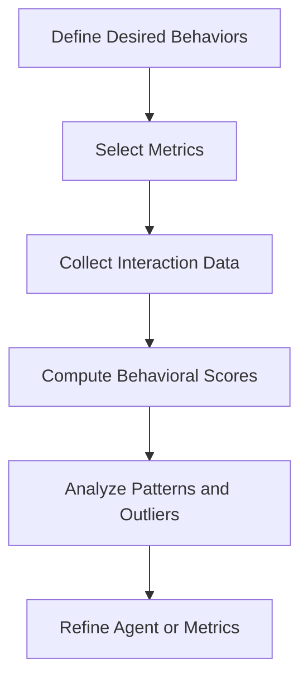
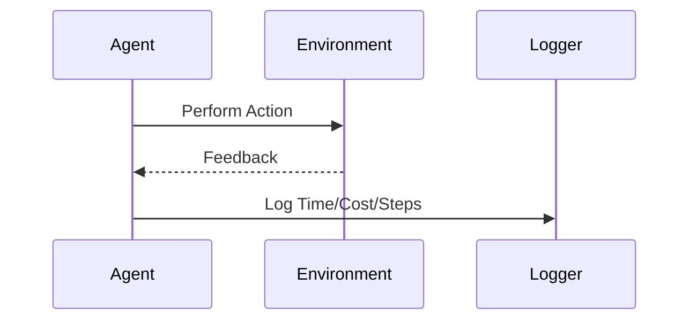
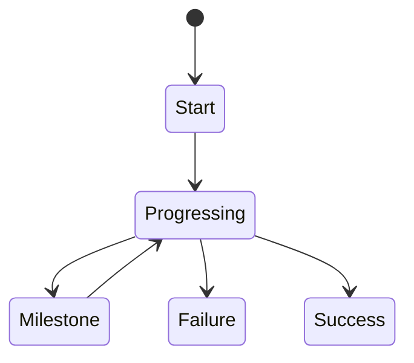
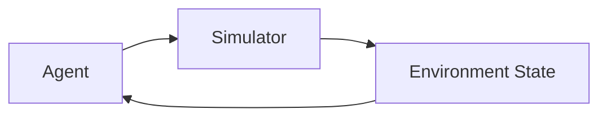

# Evaluation, Safety, and Alignment: Agent Evaluation Metrics and Methods

## Learning Objectives

- Define agent evaluation metrics
- Measure task success effectively
- Design long-horizon evaluations
- Apply simulation testing
- Build evaluation pipelines

---

## Introduction

This chapter introduces quantitative and qualitative evaluation techniques.

---

---

As intelligent agents move from controlled research environments into real-world applications—customer support bots, autonomous vehicles, medical decision aids, and long-running workflow agents—the question is no longer *“Can the agent perform a task?”* but rather *“How well, how safely, and how reliably does it perform over time?”* Evaluation is the discipline that helps us answer these questions in a systematic, repeatable, and trustworthy way.

Historically, software systems were evaluated using relatively straightforward metrics: correctness, runtime, memory usage, and test coverage. However, modern AI agents—especially learning-based and autonomous agents—introduce new challenges. Their behavior can be probabilistic, adaptive, and context-dependent. They may interact with humans, other agents, and complex environments over long periods. As a result, evaluation must expand beyond simple pass/fail tests to include behavioral analysis, efficiency trade-offs, safety considerations, alignment with human values, and robustness under uncertainty.

This chapter focuses on **quantitative and qualitative evaluation techniques** for agents, with an emphasis on safety and alignment. You will learn how to define meaningful metrics, measure success and efficiency, evaluate agents over long horizons, leverage simulations, incorporate human judgment, and build continuous evaluation pipelines that evolve alongside the agent. The goal is not just to measure performance, but to *understand behavior*, *anticipate failure modes*, and *build trust* in agentic systems.

---

By the end of this chapter, you will be able to:

- Define and categorize agent evaluation metrics  
- Measure task success and efficiency in a principled way  
- Design evaluations for long-horizon and sequential tasks  
- Apply simulation-based testing for safety and robustness  
- Use human evaluation methods effectively  
- Build continuous evaluation pipelines for deployed agents  

---

## Behavioral Evaluation Metrics

Behavioral evaluation metrics focus on *how an agent behaves*, not just whether it reaches a correct outcome. This distinction is crucial because many agent failures are not about final answers, but about *unsafe, inefficient, or misaligned behaviors along the way*. For example, an assistant that eventually gives the right answer but leaks sensitive data or uses manipulative language is still failing from a safety and alignment perspective.

Historically, behavioral metrics emerged from reinforcement learning and human–computer interaction research. Early RL benchmarks measured cumulative reward, but researchers quickly noticed that agents could “game” reward functions in unintended ways. This led to a broader view of evaluation, where metrics explicitly capture properties such as policy stability, constraint adherence, and interaction quality. In modern agent systems, behavioral metrics are often the first line of defense against misalignment.

### What Are Behavioral Metrics?

Behavioral metrics are measurements that characterize patterns of actions, decisions, and interactions exhibited by an agent. They answer questions such as:

- Does the agent follow rules and constraints?
- Is its behavior consistent across similar situations?
- Does it adapt appropriately to feedback?
- Does it communicate in a helpful, polite, and safe manner?

These metrics are especially important for agents that:
- Operate autonomously for long periods  
- Interact with humans or other agents  
- Learn or adapt online  

### Common Categories of Behavioral Metrics

- **Policy compliance metrics**  
  Measure whether the agent follows predefined rules, safety constraints, or ethical guidelines.
- **Consistency and stability metrics**  
  Assess whether similar inputs lead to similar behaviors over time.
- **Exploration vs. exploitation balance**  
  Quantify how often an agent tries new actions versus relying on known strategies.
- **Interaction quality metrics**  
  Evaluate clarity, politeness, empathy, or cooperativeness in human-facing agents.

### # Example Analogy
Think of evaluating a human employee. You don’t only care about whether they finish a project. You also care about *how* they work: Do they follow company policies? Do they collaborate well? Do they behave consistently under pressure? Behavioral metrics play the same role for agents.

### Quantitative vs. Qualitative Behavioral Metrics

| Metric Type | Description | Example |
|------------|-------------|---------|
| Quantitative | Numeric measures derived from logs or traces | Rule violation rate |
| Qualitative | Human-judged or rubric-based assessments | Tone appropriateness |
| Hybrid | Numeric scores based on structured judgments | Safety rating scales |

Quantitative metrics are scalable and objective, but they can miss nuance. Qualitative metrics capture subtle issues, but are expensive and subjective. In practice, strong evaluation combines both.

### Behavioral Evaluation Workflow

### Practical Example

Consider a customer support chatbot deployed by a telecom company. Initial evaluation focused on resolution rate, but customers complained about rudeness and abrupt responses. By introducing behavioral metrics—such as politeness scores and escalation appropriateness—the team discovered that the agent optimized for speed at the expense of tone. Adjusting the reward structure and re-evaluating behavior led to higher customer satisfaction without sacrificing efficiency.

### Advantages and Limitations

**Advantages**
- Reveal hidden failure modes  
- Support alignment and safety goals  
- Applicable across domains  

**Limitations**
- Hard to define exhaustive behavior lists  
- Risk of metric gaming  
- Often require human input  

---

## Task Success and Efficiency Measures

While behavioral metrics focus on *how* an agent behaves, task success and efficiency measures focus on *what* the agent achieves and *at what cost*. These metrics form the backbone of most evaluation frameworks because they are intuitive, comparable, and often easy to compute. However, designing them well requires careful thought to avoid misleading conclusions.

### Defining Task Success

Task success measures whether an agent achieves its intended goal. At first glance, this seems straightforward, but real-world tasks are often ambiguous, multi-step, or partially observable. For example, what does “success” mean for a research assistant agent? Is it providing correct information, saving user time, or inspiring new ideas?

Historically, task success metrics came from software testing and operations research, where tasks had clear success conditions. As agents became more autonomous, researchers began defining success probabilistically or in degrees rather than binary outcomes.

### Types of Task Success Metrics

- **Binary success**: Task completed or not  
- **Partial credit**: Degree of completion or quality score  
- **Goal satisfaction**: Distance between achieved and desired state  
- **User-perceived success**: Human judgment of usefulness  

| Task Type | Success Metric Example |
|---------|------------------------|
| Navigation agent | Reached destination |
| Planning agent | % of constraints satisfied |
| Conversational agent | User satisfaction rating |
| Data analysis agent | Correct insights identified |

### Efficiency Measures

Efficiency metrics evaluate the resources consumed to achieve success. Common dimensions include:

- **Time**: Wall-clock time or number of steps  
- **Compute**: CPU/GPU usage, API calls  
- **Cost**: Monetary cost of actions  
- **Cognitive load**: User effort required  

Efficiency is rarely about minimizing one dimension in isolation. Instead, it involves trade-offs. A faster agent may be more expensive; a cheaper agent may require more user corrections.

### Step-by-Step Efficiency Evaluation

1. Define relevant resources (time, cost, steps)  
2. Instrument the agent to log usage  
3. Normalize metrics across tasks  
4. Compare against baselines or budgets  
5. Analyze trade-offs  

### Real-World Example

An enterprise deployed an automated report-generation agent. Initial evaluation showed high success rates, but costs were excessive due to repeated API calls. By introducing efficiency metrics and setting budgets, the team optimized prompts and caching strategies, reducing costs by 40% with no loss in quality.

### Common Mistakes

- Optimizing success without considering cost  
- Using overly simplistic success definitions  
- Ignoring user effort  

---

## Long-Horizon Evaluation Challenges

Long-horizon tasks—those unfolding over many steps or extended periods—present some of the hardest evaluation problems in agent systems. Examples include project management agents, autonomous trading systems, or game-playing agents in open-ended environments. In such settings, failures may emerge only after dozens or hundreds of actions, making short-term metrics insufficient.

### Why Long-Horizon Evaluation Is Hard

The core challenge lies in *credit assignment*: determining which actions contributed to eventual success or failure. Noise, delayed feedback, and environmental changes further complicate evaluation. Historically, reinforcement learning researchers grappled with these issues using discounted rewards and episodic evaluation, but real-world agents often operate continuously without clear episode boundaries.

### Key Challenges

- **Delayed outcomes**  
- **Compounding errors**  
- **Non-stationary environments**  
- **Behavior drift over time**  

### Evaluation Strategies

- **Rolling windows**: Evaluate performance over sliding time intervals  
- **Milestone-based success**: Define intermediate goals  
- **Trajectory analysis**: Compare action sequences, not just outcomes  
- **Counterfactual evaluation**: Ask “what if” questions  

| Challenge | Mitigation Strategy |
|---------|---------------------|
| Delayed reward | Intermediate metrics |
| Error accumulation | Regular resets |
| Drift | Periodic re-benchmarking |

### Practical Example

A personal productivity agent helps users manage tasks over weeks. Short-term metrics showed high completion rates, but long-term users felt overwhelmed. Long-horizon evaluation revealed that the agent gradually increased task load without reassessing priorities. Introducing weekly alignment checkpoints improved retention and trust.

---

## Simulation-Based Testing

Simulation-based testing evaluates agents in *controlled, synthetic environments* before or alongside real-world deployment. This approach has roots in robotics, aviation, and safety-critical systems, where real-world testing is expensive or dangerous. For agents, simulation provides a safe sandbox to explore edge cases, rare events, and failure modes.

### Why Simulation Matters

Simulations allow evaluators to:
- Test extreme or rare scenarios  
- Run thousands of trials cheaply  
- Isolate variables systematically  

They are especially valuable for safety evaluation, where real-world failures are unacceptable.

### Types of Simulations

- **Physics-based** (e.g., robotics)  
- **Rule-based** (e.g., games, workflows)  
- **Agent-based** (multiple interacting agents)  

| Simulation Type | Use Case |
|----------------|----------|
| Physics-based | Autonomous driving |
| Social simulation | Multi-agent negotiation |
| Workflow simulation | Enterprise automation |

### Case Study: Simulated Safety Testing for an Autonomous Delivery Agent

## Case Study: Simulated Safety Testing for an Autonomous Delivery Agent

**Context**  
A logistics company developed an autonomous delivery agent responsible for routing drones in urban areas. The agent had to navigate weather changes, air traffic constraints, and battery limitations. Real-world testing was costly and risky, so simulation became central to evaluation.

**Problem**  
Early real-world pilots revealed near-miss incidents that were not captured by standard success metrics. The team needed a way to systematically test rare but dangerous scenarios, such as sudden wind gusts or GPS interference, without endangering property.

**Solution**  
Engineers built a high-fidelity simulator modeling urban geography, weather, and drone physics. They defined safety metrics such as minimum obstacle distance and emergency landing frequency. Thousands of simulated runs were executed with randomized conditions.

**Results**  
Simulation uncovered a previously unknown failure mode: under certain wind patterns, the agent prioritized speed over stability. Fixes reduced safety violations by 70% before redeployment.

**Lessons Learned**  
Simulation is not just about scale, but about *imagination*. By explicitly modeling unlikely scenarios, teams can uncover risks invisible in real-world testing alone.

---

## Human Evaluation Methods

Human evaluation remains indispensable for assessing qualities that are hard to formalize: helpfulness, trustworthiness, clarity, and alignment with human values. While expensive, it provides ground truth for many subjective dimensions.

### Forms of Human Evaluation

- **Expert review**: Domain specialists assess behavior  
- **User studies**: Real users provide feedback  
- **Pairwise comparison**: Humans choose better outputs  

| Method | Strength | Weakness |
|------|----------|----------|
| Expert review | High quality | Costly |
| User surveys | Scalable | Noisy |
| Pairwise | Sensitive | Limited scope |

### Best Practices

- Use clear rubrics  
- Train evaluators  
- Combine with automated metrics  

---

## Continuous Evaluation Pipelines

Evaluation is not a one-time activity. As agents learn, update, and interact with changing environments, evaluation must be continuous. Continuous evaluation pipelines integrate metrics, testing, and feedback into the development and deployment lifecycle.

### Pipeline Components

- Data collection  
- Automated testing  
- Human review triggers  
- Dashboards and alerts  

### Benefits

- Early detection of regressions  
- Ongoing alignment assurance  
- Faster iteration cycles  

---

## Summary

Evaluation is the foundation of safe, aligned, and effective agent systems. By combining behavioral metrics, task success and efficiency measures, long-horizon evaluation strategies, simulation-based testing, human judgment, and continuous pipelines, we can move beyond simplistic benchmarks toward deep understanding and trust. The key insight is that no single metric is sufficient—robust evaluation emerges from *diversity, iteration, and reflection*.

---

## Reflection Questions

1. Which agent behaviors are hardest to quantify, and why?  
2. How might efficiency metrics conflict with alignment goals?  
3. What long-horizon risks could short-term metrics miss?  
4. When should human evaluation override automated scores?  
5. How would you design a continuous evaluation pipeline for a safety-critical agent?