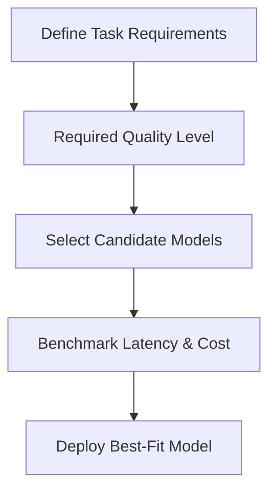
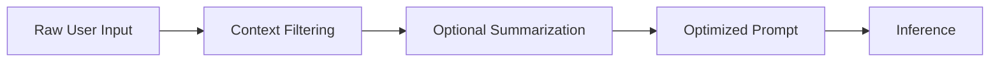
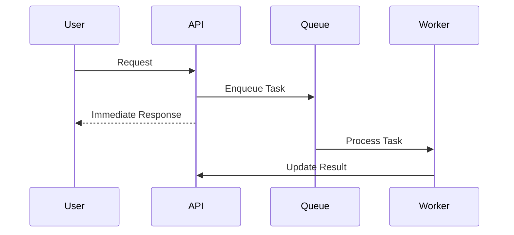
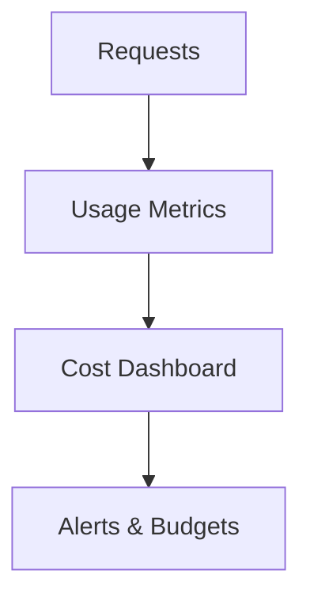
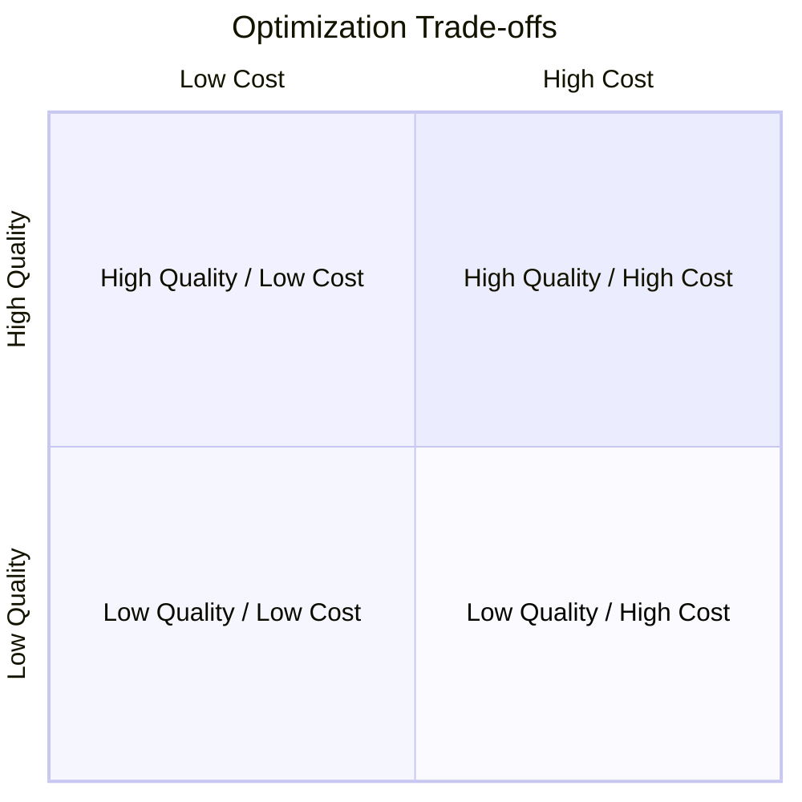

# Latency and Cost Optimization

As AI systems move from experimentation into real-world production, performance and cost become just as important as accuracy and functionality. A model that works well in a notebook or demo environment may fail dramatically when exposed to thousands of users, strict latency requirements, or budget constraints. This chapter focuses on **scaling, optimization, and production deployment**, with a specific emphasis on **reducing latency and controlling operational costs**.

Latency and cost optimization are not isolated technical tasks; they are deeply interconnected decisions that affect system architecture, model selection, user experience, and business sustainability. Lower latency improves responsiveness and user satisfaction, while lower cost ensures that systems can scale without becoming financially unviable. However, optimizing for one often impacts the other, creating trade-offs that engineers and product teams must carefully evaluate.

Historically, optimization challenges were most visible in large web-scale systems such as search engines, e-commerce platforms, and streaming services. With the rise of large language models (LLMs) and AI-driven applications, these challenges have intensified. Model inference is computationally expensive, context sizes are growing, and user expectations are higher than ever. A delay of even a few hundred milliseconds can feel unacceptable in conversational or real-time applications.

This chapter provides a **progressive learning journey**. We begin by understanding how to identify performance bottlenecks, then move through model and prompt optimization, asynchronous execution, cost monitoring, and finally the difficult but unavoidable topic of optimization trade-offs. Along the way, you will encounter practical examples, detailed explanations, visual diagrams, and a comprehensive case study that ties everything together.

By the end of this chapter, you will be able to:

- Identify performance bottlenecks in AI-driven systems
- Optimize model selection and sizing for latency and cost
- Reduce system latency through prompt and context optimization
- Apply asynchronous execution patterns to improve throughput
- Monitor and manage operational costs effectively
- Evaluate and balance optimization trade-offs in production systems

---

## Performance Bottleneck Analysis

Understanding performance bottlenecks is the foundation of any optimization effort. Without a clear diagnosis, optimization becomes guesswork, often leading to wasted effort or even degraded performance. A bottleneck is the **slowest or most constrained part of a system**, limiting overall throughput or responsiveness.

### What Performance Bottlenecks Really Are

At a conceptual level, a bottleneck is similar to the narrowest point in a water pipe. No matter how wide the rest of the pipe is, the flow rate is constrained by that narrow section. In AI systems, bottlenecks can appear at many layers:

- Model inference time
- Network latency between services
- Serialization and deserialization of requests
- Prompt construction and context loading
- Downstream dependencies such as databases or APIs

Historically, performance analysis originated in operating systems and distributed systems research, where CPU scheduling, disk I/O, and memory access were the primary concerns. In modern AI systems, the focus has expanded to include GPU utilization, model architecture complexity, and token-level processing costs.

### Why Bottleneck Analysis Is Critical

Optimizing without identifying bottlenecks often leads to **local optimizations** that do not improve end-to-end performance. For example, aggressively caching responses may save milliseconds, but if model inference dominates latency, the user experience remains unchanged.

Bottleneck analysis is important because it:

- Ensures optimization effort is applied where it matters most
- Prevents premature or unnecessary optimization
- Provides measurable baselines for improvement
- Enables informed trade-off decisions between cost and latency

### How Bottleneck Analysis Works in Practice

A systematic bottleneck analysis typically follows these steps:

1. **Instrument the system** with detailed metrics (latency, throughput, error rates)
2. **Break down request lifecycle** into discrete stages
3. **Measure each stage independently**
4. **Identify the slowest or most resource-intensive component**
5. **Validate findings under realistic load conditions**

The following flow illustrates a typical AI request lifecycle and where bottlenecks may occur:

Each node in this flow can become a bottleneck depending on workload and system design.

### Common Bottlenecks in AI Systems

| Bottleneck Type | Description | Typical Symptoms |
|----------------|------------|------------------|
| Model Inference | Slow computation due to model size or hardware | High response time |
| Network Latency | Delays between distributed services | Spiky or inconsistent latency |
| Prompt Assembly | Large or complex prompts | Increased token processing time |
| External APIs | Dependency on third-party services | Timeouts or cascading failures |

### Practical Example: Chat Application Latency

Imagine a customer support chatbot deployed globally. Users in different regions experience vastly different response times. Initial assumptions might blame the model, but bottleneck analysis reveals:

- Users in distant regions suffer from network latency to a centralized inference server
- Prompt construction includes unnecessary historical context
- Database lookups for user metadata occur synchronously

Only by identifying these specific bottlenecks can targeted optimizations be applied.

---

## Model Selection and Sizing

Model selection and sizing are among the most impactful decisions for both latency and cost. Larger models often provide better reasoning and accuracy, but they come with increased inference time and higher compute costs. Smaller models may be faster and cheaper but risk reduced output quality.

### Understanding Model Size and Complexity

Model size typically refers to the number of parameters. Larger models:

- Require more memory
- Consume more compute per token
- Often exhibit higher latency per request

However, size alone is not the full story. Architecture, quantization, and hardware acceleration all influence real-world performance. Historically, the industry trend favored ever-larger models, but production realities have driven renewed interest in **right-sizing models**.

### Why Model Selection Matters

Choosing the wrong model can lead to:

- Unsustainable operational costs
- Poor user experience due to latency
- Underutilized hardware resources

Conversely, a well-chosen model aligns task complexity with model capability, achieving acceptable quality at minimal cost.

### Strategies for Model Selection

Common strategies include:

- **Task-specific models** instead of general-purpose ones
- **Model tiering**, where different models handle different request types
- **Distillation**, using smaller models trained to mimic larger ones

The table below compares model sizing strategies:

| Strategy | Latency Impact | Cost Impact | Quality Impact |
|--------|---------------|-------------|----------------|
| Large General Model | High latency | High cost | High quality |
| Medium Task-Specific | Moderate latency | Moderate cost | Good quality |
| Small Distilled Model | Low latency | Low cost | Variable quality |

### Practical Example: Search vs. Chat

A search ranking system may require high precision but minimal explanation, making a smaller or medium-sized model sufficient. A conversational assistant, however, may require richer reasoning, justifying a larger model—but only for certain queries.

### Model Selection Workflow

---

## Prompt and Context Optimization

Prompt and context optimization is one of the most cost-effective ways to reduce latency and expense. Unlike model changes, prompt optimization often requires no infrastructure changes and can yield immediate benefits.

### What Prompt Optimization Really Means

Prompt optimization involves crafting inputs that:

- Are concise yet informative
- Avoid redundant or irrelevant context
- Guide the model efficiently toward desired outputs

Historically, prompt engineering emerged as a response to the high cost and unpredictability of large models. Engineers discovered that better prompts could dramatically improve results without changing the model itself.

### Why Context Size Matters

Context size directly affects:

- Token processing time
- Memory usage
- Inference cost

Long contexts increase latency linearly or worse, depending on model architecture. Many systems unknowingly include entire conversation histories when only a small subset is relevant.

### Techniques for Context Optimization

Common techniques include:

- **Context window trimming**: Remove irrelevant history
- **Summarization**: Replace long histories with concise summaries
- **Dynamic context assembly**: Include only what is needed per request

| Technique | Latency Benefit | Cost Benefit | Risk |
|---------|----------------|--------------|------|
| Trimming | High | High | Loss of relevant info |
| Summarization | Medium | Medium | Summary inaccuracies |
| Dynamic Context | High | High | Implementation complexity |

### Prompt Optimization Flow

---

## Asynchronous Execution

Asynchronous execution is a powerful technique for improving system throughput and perceived latency, especially in I/O-bound or multi-step workflows.

### Understanding Asynchronous Execution

In synchronous systems, each request waits for all operations to complete before returning a response. Asynchronous systems allow tasks to run concurrently, freeing resources and improving responsiveness.

This concept originated in event-driven systems and high-performance networking, where blocking operations were a major scalability bottleneck.

### Why Asynchronous Execution Reduces Latency

Asynchronous execution reduces:

- Idle wait time
- Resource contention
- User-perceived latency

For example, a system can return a partial response while background tasks continue processing.

### Common Asynchronous Patterns

- **Fire-and-forget tasks**
- **Callbacks and promises**
- **Message queues and event streams**

### Practical Example: Document Processing

Uploading a document for analysis does not require the user to wait synchronously. Instead, the system acknowledges receipt and processes the document asynchronously, notifying the user upon completion.

---

## Cost Monitoring Strategies

Cost optimization without monitoring is impossible. Cost monitoring provides visibility into how resources are consumed and where inefficiencies exist.

### Why Cost Monitoring Is Essential

AI systems often incur costs at a granular level (per token, per request). Without monitoring, small inefficiencies scale into large expenses.

Historically, cost overruns in cloud systems have caused significant business disruptions, leading to the rise of FinOps practices.

### Key Cost Metrics to Track

- Cost per request
- Cost per user
- Cost per feature
- Cost per latency tier

| Metric | Description | Use Case |
|------|-------------|----------|
| Cost/Request | Average inference cost | Budget forecasting |
| Cost/User | User-level spend | Pricing strategy |
| Cost/Feature | Feature-level spend | Feature optimization |

### Cost Monitoring Architecture

---

## Optimization Trade-offs

Optimization always involves trade-offs. Improving latency may increase cost; reducing cost may reduce quality. Understanding these trade-offs is a critical skill.

### Why Trade-offs Are Inevitable

Resources are finite. Optimizing one dimension often consumes another. The goal is not perfection but **balance** aligned with business goals.

### Common Trade-offs

- Latency vs. Quality
- Cost vs. Reliability
- Complexity vs. Maintainability

| Optimization Goal | Potential Downside |
|------------------|-------------------|
| Lower Latency | Higher cost |
| Lower Cost | Reduced quality |
| Higher Throughput | Increased complexity |

### Decision-Making Framework

---

## Case Study: Scaling a Real-Time Customer Support Assistant

### Context

In 2024, a mid-sized e-commerce company launched an AI-powered customer support assistant to handle order inquiries, returns, and basic troubleshooting. The system was initially deployed as a proof of concept, serving a limited user base during business hours. Early feedback was positive, and leadership decided to roll it out globally.

As usage increased, the assistant began receiving thousands of concurrent requests, especially during seasonal sales events. The original architecture, designed for simplicity rather than scale, quickly showed signs of strain.

### Problem

Users experienced slow response times, sometimes waiting several seconds for simple answers. Operational costs grew rapidly, surprising both engineering and finance teams. The system used a large general-purpose model for all requests, included full conversation histories in every prompt, and executed all steps synchronously.

Traditional scaling approaches, such as adding more servers, provided only marginal improvements and significantly increased costs. The team needed a more thoughtful optimization strategy.

### Solution

The team began with a thorough bottleneck analysis, discovering that model inference and prompt size were the dominant contributors to latency. They introduced model tiering, using a smaller model for common queries and reserving the large model for complex cases.

Prompt optimization reduced average context size by 60% through trimming and summarization. Asynchronous execution was introduced for non-critical tasks, such as logging and analytics.

Cost monitoring dashboards were implemented, providing real-time visibility into spending patterns and enabling proactive alerts.

### Results

Average response latency dropped from 2.8 seconds to 900 milliseconds. Monthly operational costs decreased by 35%, despite higher overall usage. User satisfaction scores improved significantly, and the system handled peak loads without degradation.

### Lessons Learned

The team learned that optimization is not a one-time task but an ongoing process. Small, targeted improvements compounded into significant gains. Most importantly, aligning technical decisions with business priorities ensured sustainable scaling.

---

## Summary

This chapter explored the critical techniques required to scale AI systems efficiently while minimizing latency and cost. We examined how to identify performance bottlenecks, choose appropriately sized models, optimize prompts and context, leverage asynchronous execution, monitor costs, and navigate inevitable trade-offs. Together, these strategies form a comprehensive toolkit for production-ready AI deployment.

---

## Reflection Questions

1. Which performance bottlenecks are most likely in your current or planned AI system?
2. How would you decide whether to use a large or small model for a specific feature?
3. What parts of your prompts or context could be optimized without reducing quality?
4. Where could asynchronous execution improve user experience in your system?
5. How would you balance cost reduction against quality and reliability?