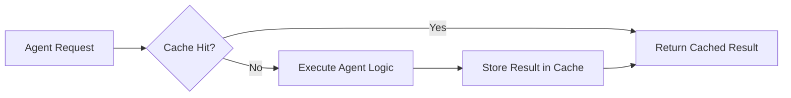
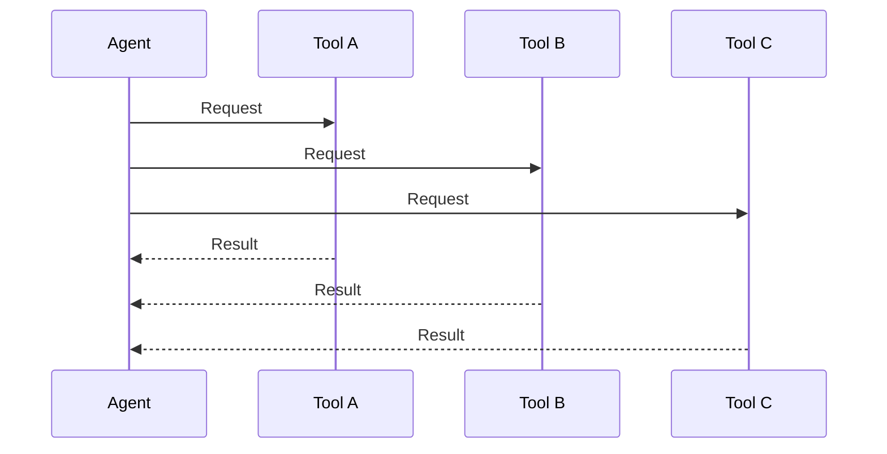
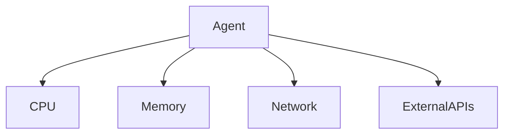

# Caching, Parallelization, and Throughput

As intelligent agent systems move from experimentation to real-world production, their workloads grow rapidly in size, complexity, and unpredictability. An agent that works perfectly for a single user or a small test dataset can fail dramatically when thousands of users, tools, and tasks are introduced simultaneously. Latency increases, costs spiral, failures cascade, and reliability erodes. This chapter focuses on the engineering discipline required to prevent that outcome: **scaling agent workloads safely and efficiently**.

Scaling is not just about “making things faster.” It is about designing systems that can **handle growth gracefully**, **optimize limited resources**, and **remain reliable under stress**. Techniques such as caching, parallel execution, throughput optimization, concurrency control, and resource management form the backbone of production-grade agent systems. These techniques are deeply interconnected—improving one without understanding the others often introduces subtle bugs or performance regressions.

In this chapter, you will progress from foundational concepts to advanced production strategies. We will explore not only *what* these techniques are, but *why* they exist, *how* they work internally, *when* they should be used, and *what trade-offs* they introduce. Through detailed explanations, analogies, tables, diagrams, and real-world case studies, you will gain a complete mental model for building scalable agent systems that thrive under real production pressure.

By the end of this chapter, you will be able to:

- Implement effective caching mechanisms for agent workloads  
- Design safe and efficient parallel execution flows  
- Increase system throughput without sacrificing correctness  
- Manage concurrency and shared resources reliably  
- Stress test agent systems to uncover bottlenecks and failure modes  

---

## Caching Strategies for Agents

Caching is one of the oldest and most powerful optimization techniques in computing, and it plays an especially critical role in agent-based systems. At its core, caching is about **avoiding unnecessary work** by reusing previously computed results. For agents that frequently call large language models, tools, databases, or external APIs, caching can dramatically reduce latency and cost while improving reliability.

Historically, caching emerged in hardware systems—CPU caches were introduced to bridge the speed gap between processors and memory. The same principle applies to modern agent systems: the “processor” (the agent’s reasoning loop) is often much faster than the external services it depends on. Without caching, agents repeatedly wait for the same slow operations to complete, even when the answers have not changed.

In agent architectures, caching can occur at multiple layers. You might cache full agent responses, intermediate reasoning steps, tool outputs, or even embeddings used for retrieval. Each level offers different benefits and risks. For example, caching a full response provides maximum speedup but risks staleness, while caching embeddings offers reuse with lower semantic risk.

### How Caching Works in Agent Systems

At a practical level, caching introduces a simple decision point into the agent’s execution flow:

1. A request arrives (user input, task trigger, or internal agent step).
2. The system computes a cache key based on relevant inputs.
3. The cache is checked for a matching entry.
4. If found, the cached result is returned immediately.
5. If not found, the operation executes normally and the result is stored.

This flow sounds trivial, but the complexity lies in **what constitutes a cache key** and **how long cached data remains valid**. In agent systems, inputs often include prompts, tool parameters, user context, and even environmental state. Choosing the wrong cache granularity can lead to incorrect behavior or minimal performance gains.

Consider a daily-life analogy: a restaurant that pre-prepares popular dishes. If the chef prepares meals too early (over-caching), food becomes stale. If nothing is prepared ahead of time (no caching), customers wait too long. Effective caching finds the balance between freshness and speed.

### Types of Caching in Agent Workloads

Caching strategies vary based on scope and purpose. The table below compares common caching approaches used in agent systems.

| Caching Type | What Is Cached | Benefits | Risks | Typical Use Cases |
|-------------|--------------|----------|-------|------------------|
| Response Cache | Full agent outputs | Maximum speed and cost savings | Stale or incorrect responses | FAQ agents, static knowledge |
| Tool Output Cache | Results of tool calls | Reduces API/database load | Parameter sensitivity | Search, analytics tools |
| Embedding Cache | Vector embeddings | Faster retrieval | Semantic drift | RAG systems |
| Partial Reasoning Cache | Intermediate steps | Reuse sub-results | Complex invalidation | Multi-step planning agents |

Each approach must be aligned with how frequently underlying data changes and how tolerant the system is to outdated information.

### Cache Invalidation and Freshness

One of the most famous sayings in computer science is: *“There are only two hard things: cache invalidation and naming things.”* This applies strongly to agent systems. Invalidation defines when cached data should be discarded or refreshed.

Common invalidation strategies include:

- **Time-based (TTL)**: Entries expire after a fixed duration.
- **Event-based**: Cache is cleared when underlying data changes.
- **Manual override**: Operators clear caches during incidents or updates.

For agents, TTL-based caching is often the safest default, especially when agents interact with dynamic data sources. However, TTL alone may not be sufficient for mission-critical decisions where stale data could cause harm.

## Case Study: Reducing LLM Costs with Smart Caching

### Context  
A mid-sized SaaS company deployed an AI-powered support agent to answer customer questions. The agent relied heavily on large language model calls and external documentation search tools. As adoption grew, daily usage increased from hundreds to tens of thousands of requests. Infrastructure costs rose rapidly, and response latency became inconsistent during peak hours.

The engineering team initially assumed that model optimization alone would solve the problem. However, profiling revealed that a large percentage of user queries were variations of the same core questions—billing, password resets, and product features. Despite semantic similarity, each request triggered full agent execution.

### Problem  
The system treated every request as unique, even when answers were effectively identical. This resulted in redundant LLM calls, repeated tool queries, and unnecessary reasoning cycles. Traditional scaling approaches—adding more servers or increasing rate limits—only increased costs without addressing the root inefficiency.

Additionally, customer satisfaction suffered during traffic spikes, as response times exceeded acceptable thresholds. The team needed a solution that reduced workload without compromising answer quality.

### Solution  
The team introduced a multi-layer caching strategy. First, they implemented a response cache keyed by normalized user intent rather than raw text. Similar queries were mapped to the same cache entry using lightweight semantic hashing. Second, tool outputs such as documentation searches were cached separately with longer TTLs.

The caching logic was integrated directly into the agent’s orchestration layer, ensuring that cached results bypassed expensive reasoning loops. TTL values were tuned carefully: short for responses, longer for documentation data. Monitoring dashboards were updated to track cache hit rates and freshness.

### Results 
Within weeks, LLM call volume dropped by over 60%. Average response time decreased from 4.2 seconds to under 1.5 seconds during peak traffic. Infrastructure costs stabilized despite continued growth in users. Importantly, customer satisfaction scores improved as responses became faster and more consistent.

### Lessons Learned  
The team learned that caching is not a blunt instrument—it requires thoughtful design aligned with agent behavior. Semantic normalization proved critical, as naive text-based caching delivered minimal benefit. They also discovered that monitoring cache effectiveness is just as important as implementing it, enabling continuous refinement as usage patterns evolved.

---

---

## Parallel Tool Execution

Parallel execution is a natural evolution step when single-threaded agent workflows become a bottleneck. In early prototypes, agents often execute tools sequentially: one API call finishes before the next begins. While simple to reason about, this approach wastes time when tasks are independent and could safely run simultaneously.

The concept of parallelism dates back to early multi-core processors and distributed systems. As hardware evolved to support concurrent operations, software had to adapt. Agent systems face a similar shift: modern environments offer abundant parallel capacity, but agents must be explicitly designed to exploit it.

In agent workloads, parallelism often appears when an agent needs to gather information from multiple sources—search engines, databases, APIs, or internal tools. If these calls do not depend on each other, executing them sequentially artificially inflates latency.

### How Parallel Tool Execution Works

Parallel execution involves launching multiple tasks at the same time and waiting for all (or some) of them to complete before proceeding. Conceptually, this introduces a **fork-join** model:

1. The agent identifies independent tasks.
2. Tasks are dispatched concurrently.
3. The system waits for completion.
4. Results are merged and processed.

This model requires careful orchestration. Errors, timeouts, and partial failures must be handled gracefully. Without safeguards, parallel execution can overwhelm resources or introduce race conditions.

An analogy is cooking a meal: boiling water, chopping vegetables, and preheating the oven can happen at the same time. Doing them sequentially would be inefficient and unnecessary.

### Benefits and Trade-offs

Parallel execution offers clear advantages, but it also introduces complexity.

**Advantages:**
- Reduced end-to-end latency
- Better utilization of available resources
- Improved user experience

**Limitations:**
- Increased complexity in error handling
- Higher peak resource usage
- Potential contention for shared resources

The table below compares sequential and parallel execution.

| Aspect | Sequential Execution | Parallel Execution |
|------|----------------------|-------------------|
| Latency | High | Low |
| Complexity | Low | High |
| Resource Usage | Predictable | Bursty |
| Failure Handling | Simple | Complex |

## Case Study: Accelerating Research Agents with Parallelism

### Context  
A research organization built an agent to generate market intelligence reports. Each report required data from multiple sources: financial APIs, news aggregators, and internal databases. Initially, the agent executed each query sequentially.

### Problem  
Generating a single report took over two minutes, making the system unsuitable for interactive use. Analysts frequently abandoned requests or ran them overnight. Attempts to optimize individual tools yielded marginal improvements.

### Solution  
The team refactored the agent workflow to identify independent data-fetching steps. These were executed in parallel using asynchronous task scheduling. Timeouts were added to prevent slow tools from blocking the entire workflow, and partial results were allowed when non-critical sources failed.

### Results 
Report generation time dropped to under 30 seconds. Analysts could iterate interactively, refining queries in real time. System throughput improved without additional hardware.

### Lessons Learned  
Parallelism delivered dramatic gains, but only after careful dependency analysis. The team learned to explicitly model task relationships rather than assuming independence.

---

---

## Throughput Optimization

While latency focuses on how fast a single request completes, **throughput** measures how many requests a system can handle over time. In production environments, throughput often matters more than individual response speed. A system that responds in two seconds but collapses under load is less useful than one that responds in five seconds reliably.

Throughput optimization emerged from high-traffic web systems, where engineers learned that adding servers alone does not guarantee scalability. Bottlenecks often appear in unexpected places: locks, queues, databases, or third-party services.

For agent systems, throughput optimization requires viewing the system holistically. Each component—the agent loop, tool calls, caches, and orchestration layer—contributes to the overall capacity.

### Key Throughput Techniques

Common techniques include:

- **Batching**: Processing multiple requests together
- **Load shedding**: Rejecting low-priority requests under load
- **Backpressure**: Slowing inputs when downstream systems are saturated
- **Asynchronous processing**: Decoupling request handling from execution

Each technique trades immediacy for stability. For example, batching increases throughput but may increase latency for individual requests.

## Case Study: Scaling a Customer Support Agent

### Context  
An e-commerce platform launched an AI agent to handle customer inquiries during sales events. Traffic surged unpredictably, especially during promotions.

### Problem  
During peak loads, the agent system failed intermittently. Queues backed up, timeouts increased, and users experienced errors. Adding servers provided diminishing returns.

### Solution  
The team introduced request batching for non-urgent queries, prioritized critical workflows, and implemented backpressure to prevent overload. They also optimized cache usage to reduce redundant work.

### Results 
The system handled three times the peak traffic without failures. Error rates dropped significantly, and infrastructure costs stabilized.

### Lessons Learned  
Throughput optimization requires accepting that not all requests are equal. Intelligent prioritization and flow control are essential.

---

## Concurrency Control

Concurrency arises whenever multiple tasks access shared resources simultaneously. Without proper control, concurrency leads to race conditions, inconsistent state, and subtle bugs that are difficult to reproduce.

Historically, concurrency control developed in operating systems and databases. Concepts like locks, semaphores, and transactions were created to ensure correctness. Agent systems inherit these challenges when multiple agents or tasks share memory, caches, or external systems.

### Common Concurrency Problems

- **Race conditions**: Outcomes depend on timing
- **Deadlocks**: Tasks wait on each other indefinitely
- **Starvation**: Some tasks never get resources

### Concurrency Control Mechanisms

The table below summarizes common approaches.

| Mechanism | How It Works | Pros | Cons |
|---------|-------------|------|------|
| Locks | Exclusive access | Simple | Risk of deadlocks |
| Semaphores | Limited access | Flexible | Hard to tune |
| Transactions | Atomic operations | Strong guarantees | Overhead |
| Immutable Data | No modification | Safe | Memory cost |

### Case Study: Preventing Data Corruption in Multi-Agent Systems

**Context**  
A logistics company deployed multiple agents to coordinate deliveries. Agents shared access to a central scheduling database.

**Problem**  
Occasional double-bookings occurred, causing operational chaos. Bugs were intermittent and difficult to trace.

**Solution**  
The team introduced transactional updates and fine-grained locks around scheduling operations. They also redesigned data structures to minimize shared mutable state.

**Results**  
Data corruption incidents dropped to zero. System behavior became predictable and auditable.

**Lessons Learned**  
Concurrency bugs are expensive. Prevention through design is far cheaper than debugging in production.

---

## Resource Management

Resource management ensures that CPU, memory, network, and API quotas are used efficiently. In agent systems, unmanaged resources can lead to cascading failures.

Effective resource management involves:

- Setting quotas and limits
- Monitoring usage continuously
- Designing graceful degradation paths

Agents should be aware of resource constraints and adapt their behavior dynamically.

---

---

## Stress Testing Systems

Stress testing validates that systems behave correctly under extreme conditions. It answers questions like: *What happens when everything goes wrong at once?*

Stress testing agent systems involves simulating high traffic, slow dependencies, and partial failures. The goal is not to prevent failure entirely, but to ensure failures are controlled and recoverable.

Key techniques include load testing, chaos engineering, and fault injection.

---

## Summary

Scaling agent workloads requires a careful balance of performance, correctness, and reliability. Caching reduces redundant work, parallel execution minimizes latency, throughput optimization ensures capacity, concurrency control preserves correctness, resource management prevents collapse, and stress testing reveals hidden weaknesses. Together, these techniques form a robust foundation for production-grade agent systems.

---

## Reflection Questions

1. How would you design a caching strategy for an agent that uses real-time data?
2. What criteria would you use to decide whether tasks can be executed in parallel?
3. How do throughput and latency trade off in your own systems?
4. What shared resources in your agent architecture pose the greatest concurrency risk?
5. How would you stress test your system to uncover its weakest point?