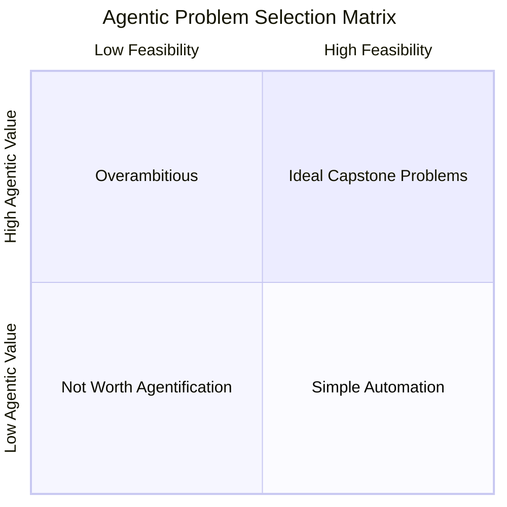
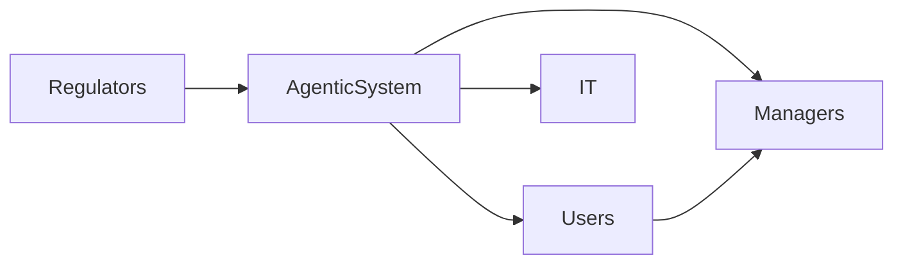
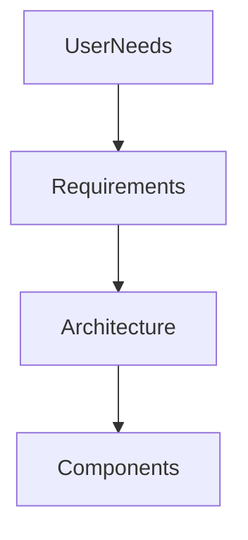
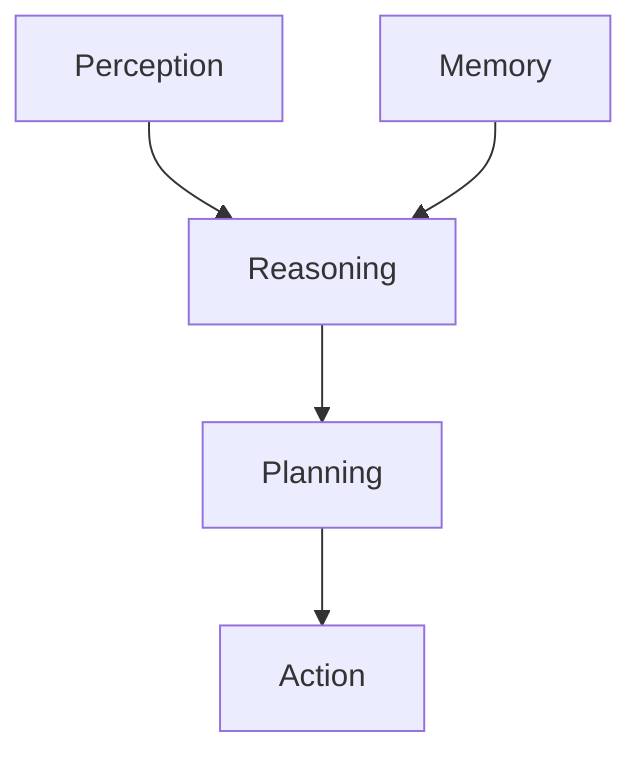
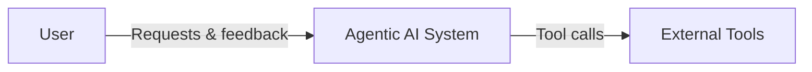
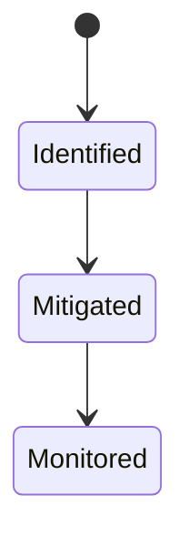

# Problem Definition and System Design

A capstone project represents the culmination of learning, where theory meets practice in a meaningful and realistic way. In the context of **agentic AI systems**, a capstone project is not just about building something that works technically—it is about designing a system that solves a **real-world problem** through autonomous, goal-driven, and adaptive agents. This stage challenges learners to think holistically: understanding human needs, translating them into system requirements, architecting intelligent agents, anticipating risks, and documenting decisions clearly enough that others can understand, critique, and extend the design.

Agentic AI systems differ from traditional software systems because they involve **autonomy, reasoning, planning, memory, and interaction**. These systems often operate in uncertain environments, make decisions with incomplete information, and collaborate with humans or other agents. As a result, the **design phase** becomes especially critical. Poor problem definition or weak system design can lead to agents that are misaligned with user needs, unsafe, unreliable, or impossible to maintain.

This chapter guides you step by step through the **problem definition and system design phase** of your capstone project. You will learn how to choose the right problem, understand stakeholders deeply, define precise system requirements, design a robust agent architecture, analyze risks and constraints, and produce professional design documentation. By the end, you should be able to confidently move from a vague idea—“I want to build an AI agent”—to a **clear, structured, and defensible system design** that could realistically be implemented in the real world.

By the end of this chapter, you will be able to:

- Define a suitable real-world problem for an agentic AI system
- Analyze stakeholders and users to uncover explicit and implicit requirements
- Translate user needs into clear functional and non-functional system requirements
- Design a coherent agent architecture aligned with problem complexity
- Identify risks, constraints, and trade-offs early in the design process
- Produce clear, structured, and professional design documentation

---

## Problem Selection Criteria

Choosing the right problem is the single most important decision in your capstone project. A well-chosen problem provides clarity, motivation, and a natural structure for all subsequent design decisions. A poorly chosen problem, on the other hand, often leads to vague requirements, overengineered solutions, or systems that are technically impressive but practically irrelevant.

### Understanding What Makes a “Good” Agentic AI Problem

At its core, an agentic AI problem is one where **autonomous decision-making adds clear value**. Historically, many AI projects failed because they attempted to apply intelligence where simple automation or rule-based systems would have sufficed. The rise of large language models, planning algorithms, and tool-using agents has made it tempting to “agentify” everything—but restraint and judgment are essential.

A strong problem for an agentic system usually has the following characteristics:

- **Ongoing goals rather than one-off tasks** (e.g., continuously managing schedules rather than generating a single report)
- **Dynamic or uncertain environments** where rules alone are insufficient
- **Multiple steps or decisions** that require reasoning, planning, or adaptation
- **Human interaction**, judgment, or collaboration
- **Meaningful consequences** if decisions are poor (cost, time, safety, satisfaction)

Think of an agent like a capable assistant rather than a calculator. If the problem does not require initiative, prioritization, or adaptation, an agent may be unnecessary.

### Core Criteria for Problem Selection

When evaluating potential capstone problems, it is helpful to assess them against a structured set of criteria. This helps avoid emotional or novelty-driven choices and encourages deliberate design thinking.

| Criterion | Key Questions | Why It Matters |
|---------|--------------|----------------|
| Real-world relevance | Does this problem exist outside a classroom? | Ensures authenticity and motivation |
| Agent suitability | Does autonomy or reasoning add value? | Avoids overengineering |
| Scope appropriateness | Can it be designed in the project timeframe? | Prevents burnout and incompletion |
| Data and interaction availability | Are inputs, outputs, and feedback realistic? | Enables credible system design |
| Ethical and social impact | Could this system affect people’s lives? | Encourages responsible AI design |

A common mistake is choosing problems that are either **too small** (e.g., “an agent that tells jokes”) or **too large** (e.g., “an AI that runs an entire company”). The sweet spot lies in problems that are **narrow enough to design deeply** but **rich enough to justify agentic behavior**.

### Examples of Strong vs Weak Problem Choices

To make this more concrete, consider the following contrasts:

| Weak Problem Choice | Why It’s Weak | Strong Alternative |
|-------------------|--------------|-------------------|
| AI that summarizes PDFs | One-shot task, no autonomy | Research assistant that tracks topics over time |
| Chatbot for FAQs | Static responses, limited reasoning | Customer support agent that escalates and learns |
| AI to generate recipes | Creative but isolated | Meal-planning agent considering budget and health |

The difference lies not in complexity for its own sake, but in **ongoing decision-making and context awareness**.

### Visualizing Problem Suitability

The diagram below illustrates how problems can be mapped based on **agentic value** and **implementation feasibility**.

Problems in the **top-right quadrant**—high agentic value and high feasibility—are ideal for capstone projects.

### Case Study: Selecting the Right Problem for a Healthcare Operations Agent

**Context**  
A team of graduate students wanted to build an AI agent for healthcare. Initially, they proposed “an AI doctor that diagnoses patients.” The idea was ambitious and exciting, inspired by recent advances in medical AI. However, as they explored the idea further, they realized they were stepping into a highly regulated, ethically sensitive domain with enormous responsibility.

The team took a step back and examined the healthcare ecosystem more broadly. They interviewed hospital administrators, nurses, and operations staff. What emerged was a recurring theme: **operational inefficiency**, not diagnostic intelligence, was causing delays, burnout, and patient dissatisfaction.

**Problem**  
Hospitals struggled to coordinate staff schedules, equipment availability, and patient flow. Decisions were often reactive, based on incomplete information. Traditional scheduling software existed, but it lacked adaptability and real-time reasoning. Staff frequently overrode system recommendations because they did not trust them.

The challenge was complex but bounded. It required reasoning, adaptation, and collaboration with humans—ideal characteristics for an agentic system.

**Solution**  
The team reframed their capstone problem as:  
*“Design an agentic AI system that assists hospital operations managers in optimizing staff and resource allocation in real time.”*

This problem:
- Had clear stakeholders
- Required continuous decision-making
- Allowed meaningful agent autonomy
- Avoided direct medical decision-making

**Results and Lessons Learned**  
By choosing a well-scoped, agent-suitable problem, the team was able to design a realistic system architecture, identify risks clearly, and produce strong documentation. The key lesson was that **problem selection is an act of design, not just inspiration**.

---

## Stakeholder and User Analysis

An agentic AI system never exists in isolation. It operates within a social, organizational, and technical ecosystem shaped by people with different goals, expectations, and concerns. Stakeholder and user analysis ensures that the system you design is not only intelligent, but also **useful, acceptable, and trusted**.

### Why Stakeholder Analysis Is Critical in Agentic Systems

Historically, many AI systems failed not because they were technically flawed, but because they ignored human factors. Early expert systems in the 1980s, for example, often produced correct recommendations—but users ignored them because they did not understand or trust the reasoning.

Agentic systems amplify this risk. Because agents can act autonomously, stakeholders are often concerned about:
- Loss of control
- Accountability for decisions
- Transparency and explainability
- Safety and misuse

Stakeholder analysis helps you anticipate these concerns early, shaping system boundaries and interaction design.

### Identifying Stakeholders vs Users

Although often used interchangeably, **stakeholders** and **users** are not the same.

| Role | Definition | Example |
|----|-----------|--------|
| Primary users | Directly interact with the agent | Customer support staff |
| Secondary users | Affected indirectly | Customers receiving support |
| Stakeholders | Have interest or influence | Managers, regulators |
| System owners | Responsible for outcomes | Organization deploying the agent |

Failing to consider non-user stakeholders can lead to systems that are rejected, restricted, or never deployed.

### Methods for Analyzing User Needs

Effective user analysis goes beyond asking, “What do you want?” Users often articulate solutions rather than underlying needs. For example, a user might say, “I want the agent to respond faster,” when the real need is **reduced cognitive load during peak hours**.

Common techniques include:
- Interviews and contextual inquiry
- Personas and empathy maps
- User journey mapping
- “Five Whys” analysis to uncover root needs

### Example Persona Table

| Persona | Goals | Pain Points | Expectations from Agent |
|-------|------|-------------|--------------------------|
| Operations Manager | Smooth workflows | Unpredictable demand | Proactive recommendations |
| Frontline Worker | Reduced stress | Last-minute changes | Clear, actionable guidance |
| Executive Sponsor | Cost control | Inefficiency | Measurable ROI |

### Visualizing Stakeholder Relationships

This visualization helps designers see **conflicting priorities** early.

### Case Study: Stakeholder Misalignment in an AI Scheduling Agent

**Context**  
A startup developed an AI agent to schedule delivery drivers. The primary users were dispatchers, but executives funded the project, and drivers were directly affected by its decisions.

**Problem**  
The agent optimized for cost efficiency, minimizing idle time. Executives loved the metrics. However, drivers felt the schedules were inhumane, with no flexibility. Dispatchers were caught in the middle, constantly overriding the agent.

**Solution**  
A revised stakeholder analysis revealed unmet needs: fairness, predictability, and rest time. The agent was redesigned to include human constraints and explanation features.

**Results and Lessons Learned**  
The system gained adoption only after stakeholder priorities were balanced. The lesson: **ignoring stakeholders creates resistance that no amount of intelligence can overcome**.

---

## System Requirements Definition

System requirements translate human needs into **clear, testable statements** that guide design and implementation. In agentic AI systems, requirements must address not only functionality, but also autonomy, safety, and interaction.

### Types of Requirements

| Requirement Type | Description | Example |
|-----------------|------------|--------|
| Functional | What the system does | Generate task plans |
| Non-functional | Quality attributes | Response time < 2s |
| Behavioral | Agent autonomy and limits | Must ask for approval |
| Ethical/Safety | Guardrails | Avoid sensitive data |

### Writing Good Requirements

Good requirements are:
- Clear and unambiguous
- Testable
- Traceable to user needs
- Realistic

A common mistake is writing vague requirements like “The agent should be smart.” Instead, specify observable behaviors.

### Requirements Traceability

This ensures every design choice is justified.

### Example Requirements Table

| ID | Requirement | Source |
|----|------------|-------|
| FR-01 | Agent generates daily plans | Ops Manager |
| NFR-02 | System uptime 99.9% | IT |
| BR-03 | Agent escalates uncertainty | Compliance |

---

## Agent Architecture Design

Agent architecture defines **how intelligence is structured**. It determines what the agent can perceive, how it reasons, and how it acts.

### Core Components of an Agent

### Architectural Patterns

| Pattern | Description | When to Use |
|-------|------------|------------|
| Reactive | Simple rules | Fast, simple tasks |
| Deliberative | Planning and goals | Complex reasoning |
| Hybrid | Mix of both | Most real-world systems |

---

## Risk and Constraint Analysis

Every design operates under constraints—technical, organizational, legal, and ethical. Ignoring them early leads to failure later.

### Common Risks

| Risk Type | Example | Mitigation |
|---------|--------|-----------|
| Technical | Model hallucination | Verification steps |
| Human | Overreliance | Human-in-the-loop |
| Legal | Data misuse | Access controls |

### Risk Lifecycle

---

## Design Documentation

Design documentation is how your thinking becomes visible. It enables collaboration, review, and future improvement.

### Key Artifacts

- Problem statement
- Stakeholder analysis
- Requirements specification
- Architecture diagrams
- Risk register

### Documentation Structure Table

| Document | Purpose | Audience |
|--------|---------|----------|
| Design Doc | Overall vision | Team |
| Architecture Spec | Technical clarity | Engineers |
| Risk Log | Awareness | Management |

Clear documentation is a **design skill**, not an afterthought.

---

## Summary

In this chapter, you learned how to move from a vague idea to a structured system design for an agentic AI capstone project. You explored how to select the right problem, analyze stakeholders, define robust requirements, design agent architectures, anticipate risks, and document decisions clearly. Together, these steps form the foundation of any successful agentic AI system.

---

## Reflection Questions

1. What makes a problem truly suitable for an agentic AI approach?
2. Which stakeholder perspectives are easiest to overlook—and why?
3. How do system requirements shape architecture decisions?
4. What risks are most critical in autonomous systems?
5. How can good documentation improve both design quality and team collaboration?