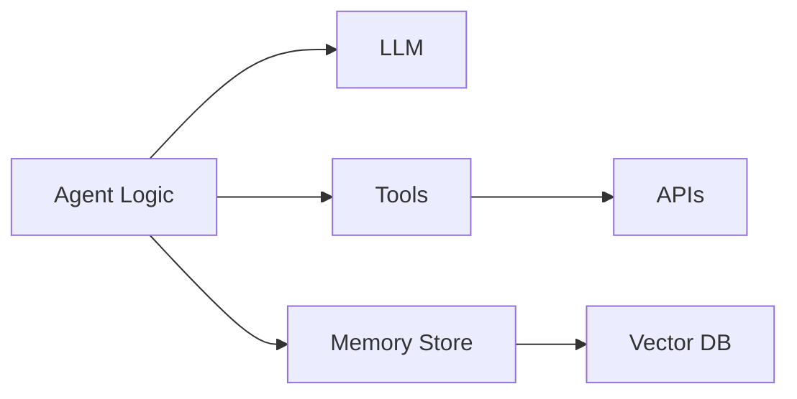
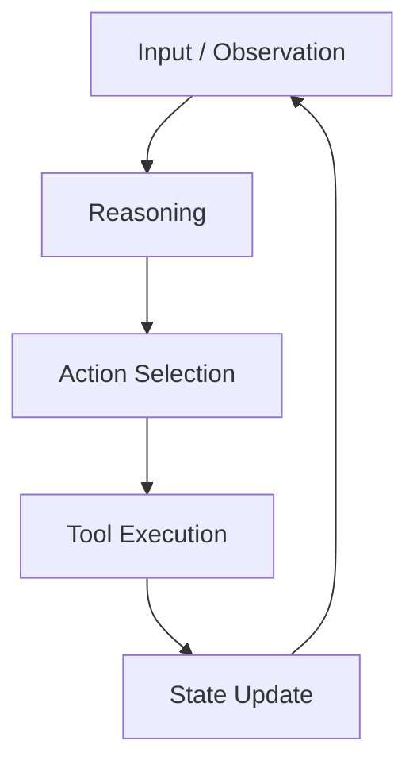
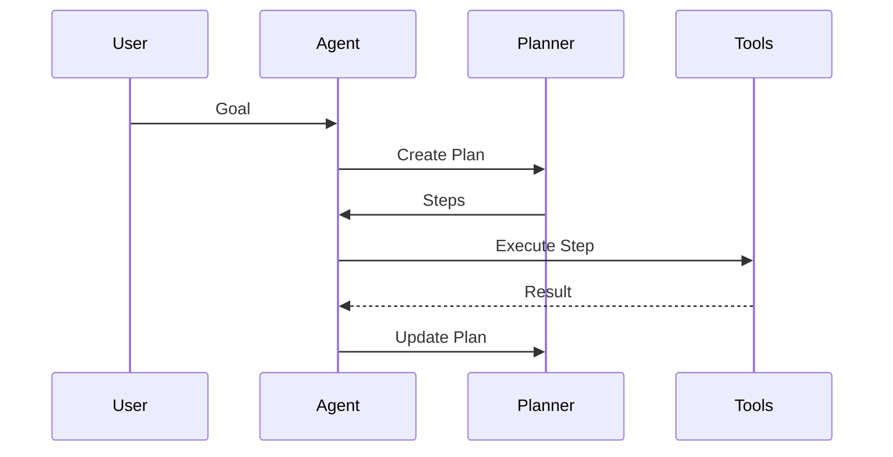
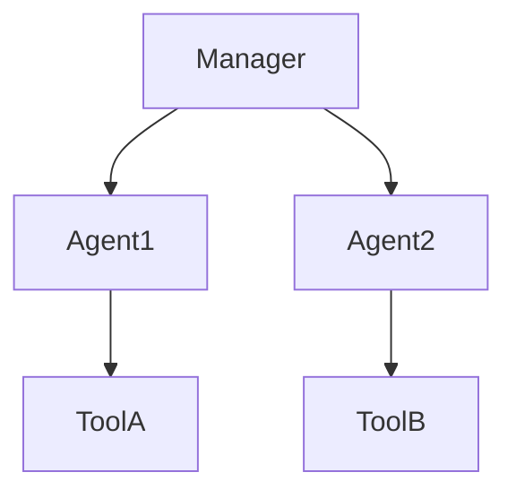
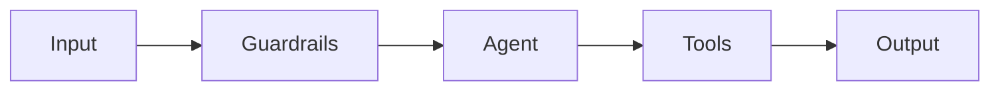
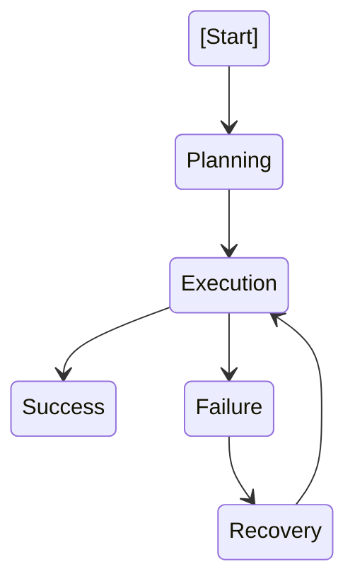

# Agent Implementation and Integration

Designing an agentic AI system is intellectually exciting, but **building it end-to-end** is where real learning happens. In this capstone chapter, we move from abstract designs and architectural blueprints into **hands-on system construction**. This is the stage where ideas are translated into executable agent logic, tools are wired together, memory and planning become operational, and safety mechanisms are no longer theoretical but enforced in code.

Historically, many AI projects failed not because the models were weak, but because **integration was fragile**: agents behaved unpredictably, tools broke under edge cases, or safety assumptions were never validated. Modern agentic AI systems—such as autonomous research agents, customer support copilots, or multi-agent planning systems—demand **engineering rigor**, not just clever prompts.

This chapter walks you through the **implementation phase** of your capstone project. You will learn how to:
- Choose appropriate frameworks and tools
- Implement robust agent decision logic
- Integrate memory and planning components
- Coordinate multiple agents when necessary
- Apply safety and guardrails systematically
- Test the system as a cohesive whole

The emphasis is not just on *what to build*, but *why certain choices matter*, *how components interact*, and *what can go wrong in real-world deployments*.

By the end of this chapter, you will be able to:

- Implement agent logic that reliably reasons, acts, and adapts
- Integrate short-term and long-term memory with planning mechanisms
- Build and coordinate multi-agent systems when required
- Apply safety controls and guardrails at multiple system layers
- Perform integration testing on complex agentic systems

---

## Framework and Tool Selection

Choosing the right framework and tools is the **foundation** of your agentic AI system. Much like selecting construction materials for a building, poor choices here can lead to instability, limited scalability, or costly rewrites later.

### Why Framework Choice Matters

Agentic AI systems differ from traditional ML pipelines. Instead of a single model inference, they involve:
- Iterative reasoning loops
- Tool calling and external system interaction
- State management and memory persistence
- Error handling and recovery

Frameworks emerged in response to these needs. Early agent systems were handcrafted scripts tightly coupled to specific APIs, making them brittle. Modern frameworks abstract repetitive patterns (prompting, tool orchestration, memory access) so developers can focus on **agent behavior**, not plumbing.

### Common Agent Frameworks Compared

| Framework | Core Strength | Best Use Case | Limitations |
|---------|--------------|--------------|-------------|
| LangChain | Tool chaining & memory abstractions | Rapid prototyping | Can become complex at scale |
| LlamaIndex | Data & retrieval integration | Knowledge-heavy agents | Less agent autonomy |
| AutoGen | Multi-agent conversations | Collaborative agents | Steeper learning curve |
| CrewAI | Role-based agent teams | Task decomposition | Limited customization |
| Custom Framework | Full control | Production systems | Higher development cost |

Each framework encodes a **philosophy** of agent design. For example:
- LangChain emphasizes *chains and tools*
- AutoGen emphasizes *conversation between agents*
- CrewAI emphasizes *roles and responsibilities*

### Tool Selection Beyond Frameworks

Agents rarely operate alone. They depend on:
- **LLMs** (OpenAI, Anthropic, open-source)
- **Vector databases** (FAISS, Pinecone, Weaviate)
- **Datastores** (PostgreSQL, Redis)
- **APIs** (search, internal systems)

| Tool Category | Examples | Key Consideration |
|--------------|----------|------------------|
| LLM | GPT-4, Claude | Latency vs reasoning depth |
| Vector DB | Pinecone, FAISS | Scalability vs simplicity |
| Memory Store | Redis, SQLite | Persistence requirements |
| Orchestration | Temporal, Celery | Reliability and retries |

### Visualizing the Tool Ecosystem

### Practical Example

Imagine building an **AI research assistant**:
- LangChain manages prompts and tools
- GPT-4 handles reasoning
- Pinecone stores document embeddings
- Redis caches short-term memory

This stack balances **developer velocity** with **production readiness**.

---

## Agent Logic Implementation

Agent logic is the **brain** of your system. It determines how the agent interprets inputs, reasons about them, decides on actions, and evaluates outcomes.

### Understanding Agent Control Loops

Most agent systems follow a control loop:
1. Observe input/state
2. Reason about next action
3. Execute action (tool call or response)
4. Update memory/state
5. Repeat until goal is achieved

This idea originates from classical AI (Perception–Decision–Action loops) and robotics.

### Designing Decision Logic

Agent decisions can be:
- **Reactive**: Respond directly to input
- **Deliberative**: Plan before acting
- **Hybrid**: React quickly, plan deeply when needed

Common patterns include:
- ReAct (Reason + Act)
- Plan-and-Execute
- Tree-of-Thought reasoning

Each has trade-offs in latency, cost, and reliability.

### Implementing Robust Logic

Key implementation considerations:
- Explicit action schemas
- Clear stopping conditions
- Error handling for tool failures
- Logging for traceability

| Pattern | Strength | Weakness |
|-------|----------|----------|
| ReAct | Simple, flexible | Can loop indefinitely |
| Planner-Executor | Structured | Slower responses |
| FSM-based | Predictable | Less creative |

### Example: Customer Support Agent

A support agent:
- Interprets user intent
- Decides whether to search FAQs, query CRM, or escalate
- Executes tools
- Responds with grounded answers

Without clear logic, such agents hallucinate or misuse tools.

---

## Memory and Planning Integration

Memory transforms agents from **stateless chatbots** into **context-aware systems** capable of learning over time.

### Types of Memory

| Memory Type | Purpose | Example |
|------------|--------|---------|
| Short-term | Conversation context | Current chat |
| Long-term | Persistent knowledge | User preferences |
| Episodic | Past experiences | Previous tasks |
| Semantic | Factual knowledge | Product info |

### Why Memory Matters

Without memory:
- Agents repeat mistakes
- Users must re-explain context
- Long tasks become impossible

Memory enables **continuity**, **personalization**, and **learning**.

### Planning Systems

Planning answers the question: *“What sequence of actions leads to my goal?”*

Approaches include:
- Task decomposition
- Hierarchical planning
- Dynamic replanning when tools fail

### Integrating Memory and Planning

The most powerful agents **plan using memory**:
- Past successes inform future strategies
- Failed plans are avoided
- User preferences shape action choices

---

## Multi-Agent Coordination

Some problems are too complex for a single agent. Multi-agent systems divide labor, much like teams of humans.

### When Multi-Agent Systems Make Sense

Use multiple agents when:
- Tasks require specialization
- Parallel work speeds up results
- Cross-checking improves reliability

Examples:
- Research agent + critique agent
- Planner agent + executor agents
- Negotiation or simulation environments

### Coordination Models

| Model | Description | Use Case |
|------|------------|----------|
| Manager-Worker | Central control | Task pipelines |
| Peer-to-Peer | Equal agents | Brainstorming |
| Role-Based | Defined responsibilities | Teams |

### Challenges and Trade-offs

- Communication overhead
- Conflict resolution
- Consistency of shared memory

Successful systems limit agent count and define **clear protocols**.

---

## Safety and Guardrail Implementation

Safety is not optional. Agentic systems can take actions with real-world consequences.

### Layers of Safety

| Layer | Purpose | Example |
|-----|--------|--------|
| Prompt-level | Guide behavior | System instructions |
| Tool-level | Restrict actions | Whitelists |
| Policy-level | Enforce rules | Content filters |
| Monitoring | Detect anomalies | Logging |

### Why Guardrails Matter

Without guardrails:
- Agents leak data
- Execute harmful actions
- Violate compliance rules

Safety must be **defense-in-depth**, not a single filter.

### Practical Techniques

- Schema validation
- Rate limiting
- Human-in-the-loop approvals
- Red-team testing

---

## System Integration Testing

Integration testing validates that **everything works together**, not just in isolation.

### Types of Tests

| Test Type | Focus |
|---------|------|
| Unit | Individual components |
| Integration | Component interaction |
| End-to-End | User workflows |
| Chaos | Failure scenarios |

### Testing Agentic Systems

Unique challenges:
- Non-determinism
- Tool failures
- Latency variability

Strategies:
- Mock LLM responses
- Replay recorded interactions
- Measure success metrics (task completion, errors)

---

## Case Study: Building an Autonomous Market Research Agent

### Context

In 2024, a mid-sized consulting firm sought to automate market research. Analysts spent days gathering reports, summarizing trends, and validating sources. Leadership wanted an **agentic AI system** to accelerate this process while maintaining quality and safety.

The environment was complex: multiple data sources, proprietary databases, and strict compliance requirements. Previous chatbot experiments failed because they lacked planning, memory, and verification mechanisms.

### Problem

The core challenge was building an agent that could:
- Break down research questions
- Search and retrieve reliable sources
- Synthesize findings coherently
- Avoid hallucinations and unsafe claims

Traditional pipelines could not adapt dynamically when sources were missing or contradictory.

### Solution

The team built a **multi-agent system**:
- Planner agent decomposed research tasks
- Research agents gathered data in parallel
- Critic agent verified claims and sources

LangChain orchestrated tools, Pinecone stored documents, and guardrails enforced citation requirements. Memory stored prior research patterns.

### Results

The system reduced research time by **65%**, improved consistency, and passed internal audits. Analysts shifted from data gathering to interpretation.

Limitations remained: complex qualitative insights still required humans, and latency increased with large queries.

### Lessons Learned

- Clear agent roles prevent chaos
- Guardrails must be enforced at every layer
- Integration testing caught more bugs than unit tests
- Human oversight remains essential

---

## Summary

In this chapter, you learned how to **build and integrate** an end-to-end agentic AI system:
- Selecting frameworks and tools strategically
- Implementing robust agent logic
- Integrating memory and planning
- Coordinating multiple agents
- Applying safety guardrails
- Testing the system holistically

These skills transform designs into **working, trustworthy systems**.

---

## Reflection Questions

1. What criteria matter most when choosing an agent framework for production?
2. How does memory change agent behavior over time?
3. When is a multi-agent approach justified versus unnecessary complexity?
4. Which safety layer would you prioritize in a regulated industry?
5. How would you test an agent that behaves non-deterministically?

Reflect deeply—these questions mirror real-world decisions you will face when deploying agentic AI systems.