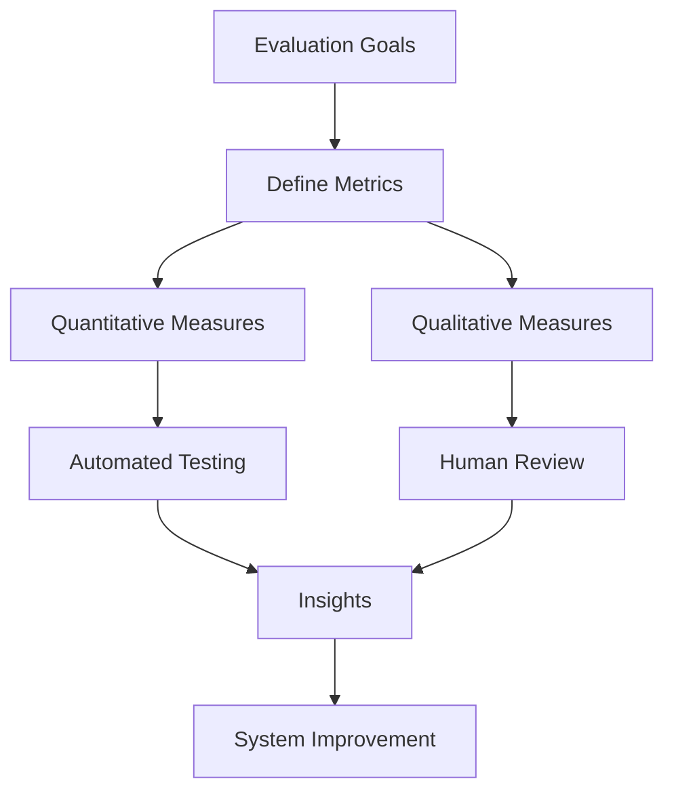
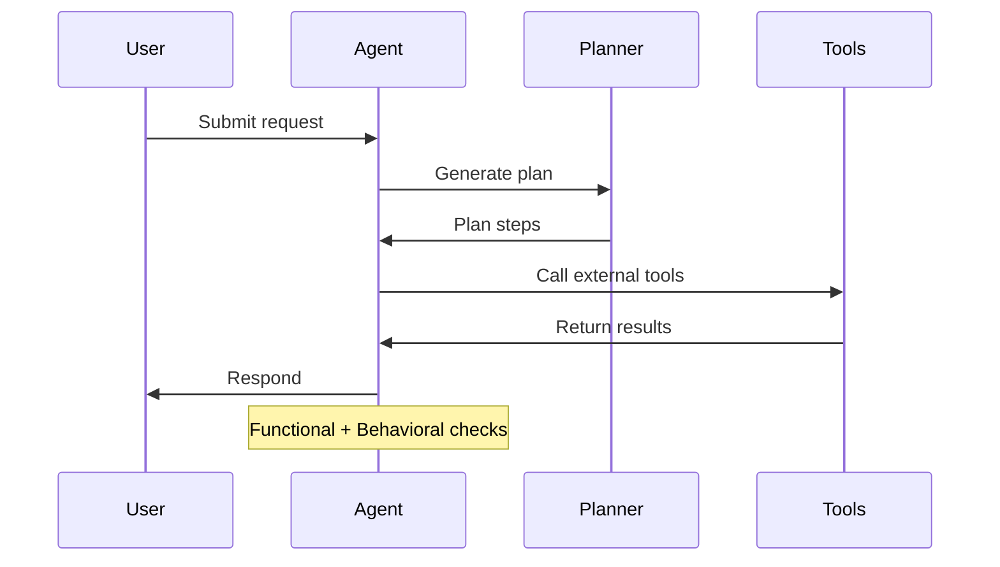
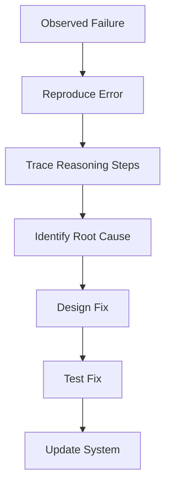
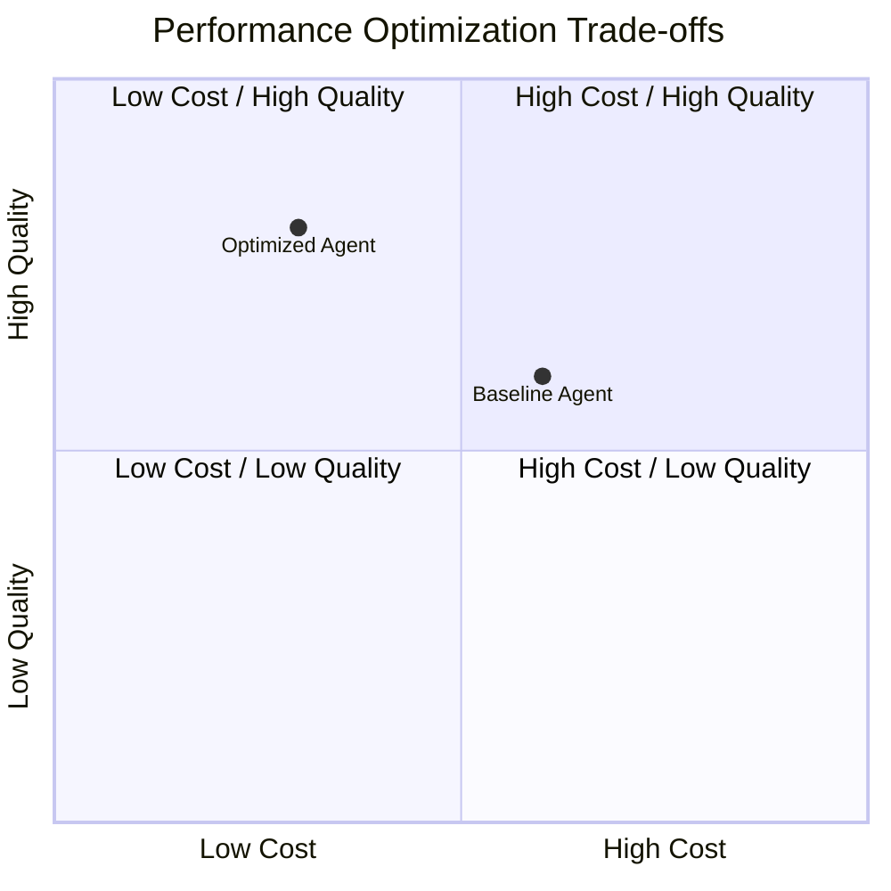
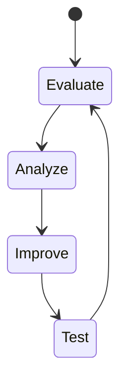
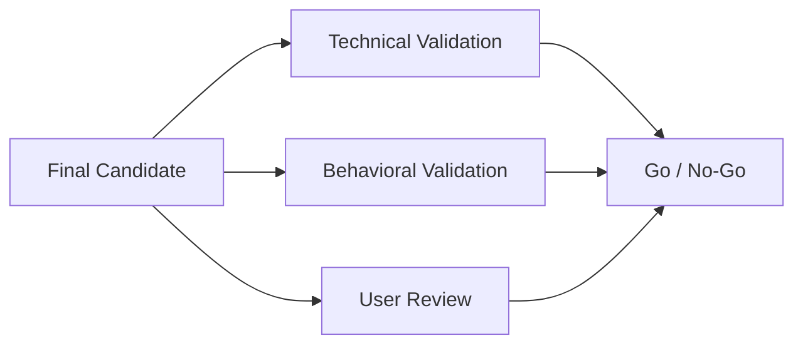

# Testing, Evaluation, and Iteration

Building an end-to-end agentic AI system is a significant achievement—but completing the build is only the beginning. The true value of an intelligent agent emerges when it is **systematically evaluated, rigorously tested, carefully analyzed, and iteratively refined**. In real-world environments, agentic systems must operate under uncertainty, adapt to diverse user behaviors, handle unexpected inputs, and maintain reliability over time. Without structured testing and evaluation, even the most sophisticated architecture can fail silently or behave unpredictably.

This capstone phase focuses on **turning a working prototype into a trustworthy, high-quality system**. Learners step into the role of AI engineers and evaluators, shifting mindset from “Can it work?” to “How well does it work, under what conditions, and how can it be improved?” This mirrors professional practice in industry, where AI systems are continuously monitored, measured, and refined long after their initial deployment.

Testing agentic AI is fundamentally different from testing traditional software. Agents are **probabilistic, autonomous, and context-sensitive**. They make decisions, plan actions, interact with tools, and adapt based on feedback. As a result, evaluation must go beyond simple pass/fail checks and incorporate behavioral quality, robustness, efficiency, and alignment with goals.

In this chapter, you will learn how to define meaningful evaluation metrics, conduct functional and behavioral testing, analyze failures deeply, optimize performance, iterate systematically, and perform final validation before declaring your agent “ready.” By the end, you will not only know *what* to evaluate, but *why*, *how*, and *when*—and how all these practices connect into a disciplined engineering loop.

---

By the end of this chapter, you will be able to:

- Evaluate agent performance using quantitative and qualitative metrics  
- Design and conduct systematic functional and behavioral testing  
- Perform structured error analysis to identify root causes  
- Optimize system behavior for accuracy, efficiency, and robustness  
- Apply iterative refinement cycles to improve agent quality  
- Validate final agentic AI solutions for real-world readiness  

---

## Defining Evaluation Metrics

Evaluation metrics are the **foundation of trustworthy agentic AI systems**. Without clearly defined metrics, improvement becomes subjective, progress is hard to measure, and teams risk optimizing the wrong aspects of system behavior. In agentic systems—where outputs are not always deterministic—metrics act as the shared language between developers, stakeholders, and the system itself.

Historically, software evaluation relied heavily on binary correctness: a function returns the correct value or it does not. As machine learning systems emerged, evaluation expanded to include statistical measures like accuracy, precision, and recall. Agentic AI pushes this evolution further by introducing **multi-dimensional performance**, where success includes not only correctness, but reasoning quality, tool usage, adaptability, safety, and user satisfaction.

### What Makes Metrics Different for Agentic AI

Agentic AI systems are evaluated along multiple axes simultaneously:

- **Outcome quality**: Did the agent achieve the intended goal?
- **Process quality**: Did it reason logically and transparently?
- **Behavioral alignment**: Did it follow constraints, policies, and norms?
- **Efficiency**: Did it minimize unnecessary steps, tokens, or tool calls?
- **Robustness**: Did it handle edge cases and unexpected inputs?

Unlike static models, agents may reach the same goal through different paths. This means metrics must often tolerate variability while still enforcing standards.

### Categories of Evaluation Metrics

A useful way to structure evaluation is to group metrics by purpose:

| Metric Category | Description | Example Metrics |
|-----------------|------------|-----------------|
| Task Success | Measures goal completion | Success rate, completion ratio |
| Quality | Assesses output usefulness | Human ratings, rubric scores |
| Efficiency | Evaluates resource usage | Tokens used, latency, API calls |
| Reliability | Measures consistency | Variance across runs |
| Safety & Alignment | Ensures constraints are met | Policy violation rate |

Each category answers a different “why” question. Together, they provide a holistic view of agent performance.

### Quantitative vs. Qualitative Metrics

Quantitative metrics provide objectivity and scalability, while qualitative metrics capture nuance and human judgment.

| Aspect | Quantitative Metrics | Qualitative Metrics |
|------|---------------------|--------------------|
| Nature | Numeric, automated | Descriptive, human-driven |
| Strengths | Scalable, repeatable | Rich, contextual |
| Limitations | May miss subtle issues | Costly, subjective |
| Examples | Accuracy, latency | Expert review, user feedback |

In practice, high-quality evaluation combines both. For example, an agent might achieve a 90% task success rate (quantitative) but still frustrate users due to confusing explanations (qualitative).

### Example: Metrics for a Research Assistant Agent

Consider an agent designed to help users research complex topics:

- Task success: Did it answer the research question?
- Citation accuracy: Are sources real and relevant?
- Reasoning clarity: Are steps easy to follow?
- Efficiency: How many tool calls were used?
- User satisfaction: Would users trust it again?

Defining these metrics upfront ensures that testing and iteration remain focused and purposeful.

---

---

## Functional and Behavioral Testing

Testing agentic AI systems requires moving beyond traditional unit tests into **multi-layered testing strategies** that capture both functional correctness and emergent behavior. Functional testing answers the question: *Can the agent do what it is supposed to do?* Behavioral testing extends this to: *How does the agent behave while doing it?*

In early software engineering, testing focused on deterministic inputs and outputs. Agentic systems challenge this paradigm because responses may vary across runs while still being acceptable—or unacceptable. Therefore, testing must account for **ranges of behavior**, not just exact matches.

### Functional Testing: Verifying Capabilities

Functional testing validates that each component and capability of the agent works as intended.

Common functional tests include:

- Tool invocation tests (e.g., API calls, database queries)
- Planning tests (does the agent generate a valid plan?)
- Memory retrieval tests (does it recall stored context?)
- End-to-end task tests (can it complete full workflows?)

Functional tests are often automated and repeatable, making them ideal for regression testing during iteration.

### Behavioral Testing: Evaluating How the Agent Acts

Behavioral testing focuses on *patterns*, *consistency*, and *appropriateness* of agent behavior. This includes:

- Tone and communication style
- Adherence to ethical or policy constraints
- Handling of ambiguous or adversarial inputs
- Graceful failure and recovery

Unlike functional tests, behavioral tests frequently require **scenario-based evaluation** and human judgment.

### Scenario-Based Testing

Scenario testing simulates realistic user interactions over time. For example:

- A confused user repeatedly asking clarifying questions
- A user providing incomplete or contradictory information
- A high-pressure situation requiring rapid decision-making

These scenarios reveal weaknesses that unit tests often miss.

| Testing Type | Focus | Typical Tools |
|------------|-------|---------------|
| Unit Testing | Individual functions | Test frameworks |
| Integration Testing | Component interaction | Mock tools |
| Scenario Testing | Realistic workflows | Simulations |
| Adversarial Testing | Edge cases | Red teaming |

### Example: Testing a Customer Support Agent

Functional tests might confirm that the agent can retrieve order status and process refunds. Behavioral tests evaluate whether it remains polite under stress, avoids hallucinations, and escalates when uncertain.

---

---

## Error Analysis

Error analysis is where **true learning happens**. While metrics tell you *that* something is wrong, error analysis explains *why*. In agentic AI, errors are rarely isolated; they often emerge from interactions between reasoning, memory, tools, and prompts.

Historically, error analysis in ML involved inspecting misclassified examples. For agents, the scope expands to **decision chains** and **interaction histories**.

### Types of Errors in Agentic Systems

Errors can be broadly categorized as:

- Reasoning errors (flawed logic or incorrect assumptions)
- Tool errors (wrong tool selection or misuse)
- Knowledge errors (hallucinations or outdated information)
- Coordination errors (poor sequencing of steps)
- Behavioral errors (policy violations or inappropriate tone)

Understanding the type of error guides the fix.

| Error Type | Root Cause | Typical Fix |
|-----------|-----------|-------------|
| Reasoning | Prompt or planning flaws | Better planning constraints |
| Tool Use | Tool selection logic | Improved tool descriptions |
| Knowledge | Model limitations | Retrieval or grounding |
| Behavior | Alignment gaps | Policy reinforcement |

### Root Cause Analysis

Effective error analysis follows a structured approach:

1. Reproduce the error reliably  
2. Trace the agent’s internal steps  
3. Identify the decision point where things diverged  
4. Determine contributing factors  
5. Propose targeted interventions  

This process prevents superficial fixes that mask deeper issues.

### Example: Misleading Recommendations

An agent repeatedly suggests suboptimal solutions. Error analysis reveals that:

- The planner prioritizes speed over accuracy
- Tool results are not cross-validated
- The prompt underweights uncertainty handling

Addressing all three leads to lasting improvement.

---

---

## Performance Optimization

Once correctness and behavior are acceptable, the next challenge is **performance optimization**. This involves improving speed, cost efficiency, scalability, and consistency—without degrading quality.

Optimization matters because agentic systems often operate at scale. A small inefficiency per interaction can become a major cost or latency issue in production.

### Dimensions of Performance

Key performance dimensions include:

- Latency (response time)
- Token and compute efficiency
- Tool call minimization
- Stability across runs

Optimizing one dimension often impacts others, creating trade-offs.

| Optimization Target | Benefit | Trade-Off |
|--------------------|--------|-----------|
| Fewer tokens | Lower cost | Less verbosity |
| Faster responses | Better UX | Less deliberation |
| Caching | Consistency | Risk of staleness |

### Techniques for Optimization

Common techniques include:

- Prompt compression and simplification
- Caching intermediate results
- Early stopping in planning
- Tool result reuse
- Dynamic depth control

Each technique must be tested to ensure it does not introduce regressions.

### Example: Reducing Latency in a Planning Agent

By limiting planning depth for simple queries and reserving deeper reasoning for complex tasks, a team reduced average response time by 40% while maintaining accuracy.

---

---

## Iterative Refinement

Iterative refinement is the **engine of continuous improvement**. Rather than attempting to perfect an agent in one pass, teams cycle through evaluation, analysis, and adjustment repeatedly.

This mirrors agile development and scientific experimentation: form a hypothesis, test it, learn, and refine.

### The Iteration Loop

A disciplined iteration loop includes:

1. Evaluate with defined metrics  
2. Identify weaknesses  
3. Propose targeted changes  
4. Implement and test  
5. Compare against baseline  

Each iteration should have a clear objective and success criteria.

### Avoiding Common Pitfalls

Common mistakes include:

- Changing too many variables at once
- Optimizing metrics without understanding behavior
- Ignoring qualitative feedback
- Failing to document changes

Maintaining experiment logs and versioned configurations helps avoid these traps.

### Example Iteration Cycle

Iteration 1 improves task success but increases latency. Iteration 2 addresses latency but reduces explanation quality. Iteration 3 balances both by adaptive verbosity.

---

---

## Final Validation

Final validation is the **gatekeeper step** before deployment or submission. It answers the question: *Is this agent ready for real-world use?*

Validation differs from testing in that it is holistic and risk-focused. The goal is not to find every minor flaw, but to ensure no critical failures remain.

### Validation Criteria

Typical validation checks include:

- Meeting all core metrics thresholds
- Passing critical scenario tests
- Demonstrating robustness to edge cases
- Alignment with ethical and safety requirements
- Clear documentation of limitations

### Stakeholder Review

Final validation often involves multiple perspectives:

- Technical reviewers assess reliability
- Domain experts evaluate usefulness
- Users provide experiential feedback

This multi-angle review reduces blind spots.

### Go / No-Go Decision

The outcome of validation is a decision:

- **Go**: Agent meets readiness criteria
- **Conditional Go**: Minor fixes required
- **No-Go**: Significant risks remain

Clear criteria make this decision defensible and transparent.

---

---

## Case Study: Iterative Evaluation of an Enterprise Workflow Agent

### Context

In early 2024, a mid-sized enterprise developed an agentic AI system designed to automate internal workflow approvals. The agent interacted with employees, retrieved policy documents, evaluated requests, and routed decisions. The goal was to reduce approval time and administrative burden.

Initially, leadership was optimistic. The agent completed demos successfully and showed strong reasoning during controlled tests. However, once pilot users began interacting with it, inconsistencies emerged.

### Problem

Employees reported that the agent sometimes approved requests incorrectly, provided overly verbose explanations, and occasionally failed to escalate edge cases. Metrics showed high task completion but low user trust.

Traditional testing had focused on functional correctness but overlooked behavioral consistency and scenario diversity. The team needed a structured evaluation and refinement approach.

### Solution

The team began by defining clear evaluation metrics: approval accuracy, escalation correctness, response clarity, latency, and user satisfaction. They introduced scenario-based behavioral tests simulating real employee interactions.

Error analysis revealed that most failures stemmed from ambiguous policy interpretation and insufficient uncertainty handling. The team refined prompts, improved retrieval grounding, and added confidence thresholds triggering escalation.

Performance optimization followed. Tool calls were cached, and explanation verbosity was adjusted dynamically based on request complexity.

### Results

After three iteration cycles:

- Approval accuracy increased from 82% to 95%
- Average response time dropped by 35%
- User satisfaction scores improved significantly
- Escalation errors were reduced to near zero

The agent was successfully rolled out company-wide.

### Lessons Learned

The project demonstrated that **evaluation is not a phase, but a practice**. Early success can mask deeper issues if metrics are poorly defined. Behavioral testing is essential for trust, and iteration must be disciplined and documented.

Most importantly, the team learned that high-quality agentic AI emerges not from clever prompts alone, but from rigorous testing, thoughtful analysis, and continuous refinement.

---

## Summary

In this capstone chapter, you explored how to transform an agentic AI system from a working prototype into a validated, high-quality solution. You learned how to define meaningful evaluation metrics, conduct functional and behavioral testing, analyze errors deeply, optimize performance thoughtfully, iterate systematically, and perform final validation.

These practices are interconnected. Metrics guide testing, testing reveals errors, error analysis informs optimization, optimization feeds iteration, and iteration culminates in validation. Together, they form a continuous improvement loop that mirrors real-world AI engineering.

Mastering these skills prepares you not just to build agents—but to **maintain, improve, and trust them** in real environments.

---

## Reflection Questions

1. Which evaluation metrics matter most for your agent, and why?  
2. How might behavioral testing reveal issues that functional tests miss?  
3. What patterns of errors have you observed, and what do they reveal about system design?  
4. Where do you see the biggest performance trade-offs in your agent?  
5. How will you decide when your agent is truly “ready” for deployment?