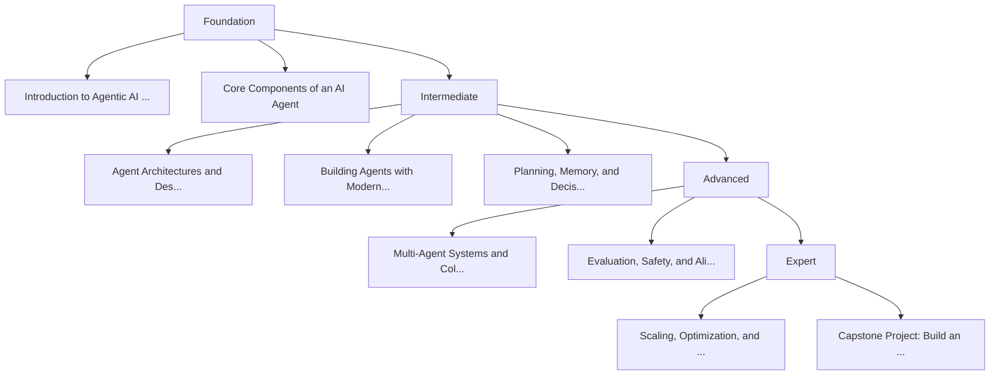

# Deep Dive into Agentic AI: Design, Implementation, and Production Systems

This advanced-level course provides an in-depth and hands-on exploration of Agentic AI systems. Designed for learners who already understand the basics of AI and large language models, the course focuses on how to design, build, and evaluate autonomous and semi-autonomous AI agents capable of reasoning, planning, acting, and collaborating in real-world environments. By the end of the course, learners will be able to architect and implement robust agentic systems using modern frameworks, tools, and best practices.

## 📋 Course Overview

**Estimated Duration:** 10 weeks (~60 hours)

**Level:** advanced level with sufficient experience

**Learning Focus:** Combination of theory and practice

**Learning Objectives:**

- Understand the theoretical foundations and architectural patterns of Agentic AI systems
- Design and implement single-agent and multi-agent systems with planning, memory, and tool use
- Build a production-ready Agentic AI application with evaluation, safety, and optimization considerations

## 🎯 Learning Path

The following diagram shows the learning path of this course:

## 🗺️ Learning Roadmap

This roadmap shows the learning path from basics to advanced level.

### Foundation

This phase establishes a strong conceptual foundation of Agentic AI, clarifying what differentiates agentic systems from traditional AI and LLM-based applications. Learners will revisit core concepts with an advanced perspective and prepare the technical environment for hands-on work.

| Module | Deskripsi | Time |
|------|------------|-------|
| Introduction to Agentic AI and Autonomous Systems | This module introduces Agentic AI, its historical context, and its relevance in modern AI systems... | 6 hours |
| Core Components of an AI Agent | This module breaks down the internal components of an agent and how they interact. Learners will ... | 7 hours |

### Intermediate

In this phase, learners begin implementing agentic systems. The focus is on building functional agents using popular frameworks, introducing planning and memory strategies, and applying theory through guided practice.

| Module | Deskripsi | Time |
|------|------------|-------|
| Agent Architectures and Design Patterns | Learners explore common agentic design patterns and architectures, learning when and why to use e... | 8 hours |
| Building Agents with Modern Frameworks | This hands-on module guides learners through building agents using popular Agentic AI frameworks ... | 9 hours |
| Planning, Memory, and Decision-Making | This module focuses on enabling agents to plan ahead, store knowledge, and make informed decision... | 8 hours |

### Advanced

This phase addresses complex, real-world Agentic AI challenges. Learners will work with multi-agent collaboration, evaluation techniques, and production considerations to build robust systems.

| Module | Deskripsi | Time |
|------|------------|-------|
| Multi-Agent Systems and Collaboration | Learners design and implement systems where multiple agents collaborate, coordinate, and communic... | 7 hours |
| Evaluation, Safety, and Alignment | This module covers how to evaluate agent behavior, manage risks, and ensure alignment with user g... | 6 hours |

### Expert

The final phase focuses on optimization, scalability, and real-world deployment. Learners will integrate everything into a capstone project that demonstrates end-to-end Agentic AI system building.

| Module | Deskripsi | Time |
|------|------------|-------|
| Scaling, Optimization, and Production Deployment | This module explores how to optimize agent performance and deploy Agentic AI systems in productio... | 6 hours |
| Capstone Project: Build an End-to-End Agentic AI System | Learners design and build a complete Agentic AI application, applying all concepts from the cours... | 10 hours |

## 📚 Complete Course Structure

Complete course structure with all modules and chapters.

### Introduction to Agentic AI and Autonomous Systems

This foundational module establishes a clear conceptual understanding of Agentic AI, its defining characteristics, and how it differs from traditional AI systems and LLM-based applications. Learners will explore the evolution, motivations, real-world relevance, and current limitations of autonomous agentic systems.

#### [1. What Is Agentic AI?](module-1-introduction-agentic-ai/chapter-1)

This chapter introduces the formal definition of Agentic AI and explains the core characteristics that distinguish agents from conventional AI systems. It sets the conceptual baseline for the entire course.

**Learning Objectives:**
- Define Agentic AI using accepted academic and industry terminology
- Identify at least five core characteristics of agentic systems
- Differentiate agents from non-agent AI applications
- Explain how goal-driven behavior influences agent design
- Recognize real-world examples that qualify as agentic systems

#### [2. Autonomy, Agency, and Goal-Oriented Behavior](module-1-introduction-agentic-ai/chapter-2)

This chapter dives deeper into autonomy and agency, explaining how agents make decisions independently and pursue goals over time within dynamic environments.

**Learning Objectives:**
- Explain different levels of agent autonomy with examples
- Distinguish agency from simple automation pipelines
- Describe how goals are represented internally by agents
- Analyze how feedback from the environment affects agent behavior
- Evaluate autonomy trade-offs in practical system design

#### [3. Agentic AI vs Traditional AI and LLM Applications](module-1-introduction-agentic-ai/chapter-3)

This chapter compares agentic systems with classical AI pipelines and chat-based LLM applications, clarifying architectural and behavioral differences.

**Learning Objectives:**
- Compare traditional AI pipelines with agentic architectures
- Identify limitations of chat-based LLM applications
- Explain why statefulness is critical for agentic systems
- Analyze decision flow differences across system types
- Select appropriate use cases for Agentic AI

#### [4. Real-World Use Cases and Current Limitations](module-1-introduction-agentic-ai/chapter-4)

This chapter surveys real-world applications of Agentic AI while critically examining technical, operational, and ethical limitations.

**Learning Objectives:**
- Identify at least three real-world applications of Agentic AI
- Analyze strengths and weaknesses of deployed systems
- Explain key technical limitations of current agents
- Assess operational risks in real-world environments
- Summarize open challenges in Agentic AI research

### Core Components of an AI Agent

This module breaks down the internal structure of AI agents, focusing on perception, reasoning, memory, and action. Learners will understand how these components interact in a continuous agent loop.

#### [1. The Agent Loop: Observe, Think, Act](module-2-core-components/chapter-1)

This chapter introduces the fundamental control loop that governs agent behavior and explains how observation, reasoning, and action are connected.

**Learning Objectives:**
- Describe each phase of the agent loop in detail
- Trace data flow through a complete agent cycle
- Identify common breakdown points in the loop
- Explain how feedback influences future actions
- Evaluate agent loop designs for robustness

#### [2. Prompting as Control Logic](module-2-core-components/chapter-2)

This chapter explores how prompts act as the primary control mechanism for LLM-based agents, shaping reasoning and behavior.

**Learning Objectives:**
- Explain how prompts function as control logic
- Design structured prompts for agent reasoning
- Differentiate prompt types and their roles
- Apply prompt chaining to complex tasks
- Evaluate prompt quality using defined criteria

#### [3. Memory Systems: Short-Term and Long-Term](module-2-core-components/chapter-3)

This chapter focuses on memory architectures that allow agents to retain context and knowledge over time.

**Learning Objectives:**
- Differentiate short-term and long-term memory
- Design basic memory retrieval mechanisms
- Explain relevance scoring for memory access
- Analyze trade-offs between memory size and performance
- Implement memory update strategies conceptually

#### [4. Tools, APIs, and Environment Interaction](module-2-core-components/chapter-4)

This chapter explains how agents interact with external systems, APIs, and environments to perform real-world actions.

**Learning Objectives:**
- Explain how agents use tools and APIs
- Design safe tool interfaces for agents
- Handle errors during environment interaction
- Assess security risks of agent actions
- Evaluate reliability of action execution

### Agent Architectures and Design Patterns

This module introduces common architectural patterns used in Agentic AI systems and explains when to apply each pattern based on constraints and goals.

#### [1. Reactive and Deliberative Agents](module-3-architectures-patterns/chapter-1)

This chapter compares reactive and deliberative agent architectures and explores their strengths and weaknesses.

**Learning Objectives:**
- Differentiate reactive and deliberative agents
- Analyze trade-offs between speed and reasoning depth
- Identify use cases for each architecture
- Design hybrid agent approaches
- Evaluate architecture robustness

#### [2. Single-Agent vs Multi-Agent Systems](module-3-architectures-patterns/chapter-2)

This chapter explores the architectural implications of single-agent and multi-agent designs.

**Learning Objectives:**
- Compare single-agent and multi-agent systems
- Explain coordination costs in multi-agent setups
- Design memory strategies for multiple agents
- Assess scalability trade-offs
- Select appropriate system architectures

#### [3. ReAct, Plan-and-Execute, and Reflexion Patterns](module-3-architectures-patterns/chapter-3)

This chapter examines widely used agent design patterns and their practical applications.

**Learning Objectives:**
- Explain core agent design patterns
- Apply ReAct and Plan-and-Execute concepts
- Analyze Reflexion for self-correction
- Combine patterns for complex tasks
- Evaluate pattern effectiveness

#### [4. Design Trade-offs and Constraints](module-3-architectures-patterns/chapter-4)

This chapter focuses on practical constraints that influence agent architecture decisions.

**Learning Objectives:**
- Identify key constraints in agent design
- Analyze cost and latency trade-offs
- Incorporate security into architecture decisions
- Evaluate UX implications of design choices
- Apply decision frameworks to architecture selection

### Building Agents with Modern Frameworks

This hands-on module teaches learners how to implement agentic systems using modern frameworks and tools, emphasizing practical skills and debugging techniques.

#### [1. Overview of Agentic AI Frameworks](module-4-agent-frameworks/chapter-1)

This chapter introduces popular agent frameworks and compares their design philosophies and capabilities.

**Learning Objectives:**
- Explain the purpose of agent frameworks
- Compare LangGraph, AutoGen, and CrewAI
- Identify strengths of each framework
- Select frameworks based on use cases
- Evaluate framework limitations

#### [2. Tool Calling and Function Execution](module-4-agent-frameworks/chapter-2)

This chapter focuses on implementing tool use within agent frameworks.

**Learning Objectives:**
- Implement tool calling in agent frameworks
- Design robust function schemas
- Handle tool execution errors
- Secure agent-tool interactions
- Test and validate tool behavior

#### [3. State Management and Control Flow](module-4-agent-frameworks/chapter-3)

This chapter explores how agent frameworks manage state and execution flow.

**Learning Objectives:**
- Explain state management approaches
- Implement control flow logic
- Handle agent recovery scenarios
- Debug state-related issues
- Design resilient agent workflows

#### [4. Debugging and Observability for Agents](module-4-agent-frameworks/chapter-4)

This chapter teaches techniques for monitoring, debugging, and improving agent behavior.

**Learning Objectives:**
- Implement logging for agent behavior
- Trace and analyze reasoning steps
- Identify common agent failures
- Profile agent performance
- Apply iterative debugging strategies

### Planning, Memory, and Decision-Making

This module focuses on advanced planning techniques, memory systems, and decision-making strategies that allow agents to operate over extended time horizons.

#### [1. Task Decomposition and Planning Strategies](module-5-planning-memory-decision/chapter-1)

This chapter teaches agents to break down complex goals into executable steps.

**Learning Objectives:**
- Decompose complex goals into tasks
- Design hierarchical plans
- Implement replanning strategies
- Handle planning failures
- Evaluate planning effectiveness

#### [2. Vector Databases and Long-Term Memory](module-5-planning-memory-decision/chapter-2)

This chapter covers persistent memory using vector databases.

**Learning Objectives:**
- Explain how vector databases store memory
- Implement semantic retrieval concepts
- Design scalable memory architectures
- Manage memory decay strategies
- Evaluate memory retrieval quality

#### [3. Context Management and Retrieval](module-5-planning-memory-decision/chapter-3)

This chapter explains how agents manage limited context windows effectively.

**Learning Objectives:**
- Manage limited context windows
- Apply retrieval-augmented techniques
- Design context compression strategies
- Prevent context drift
- Measure context relevance

#### [4. Decision-Making Under Uncertainty](module-5-planning-memory-decision/chapter-4)

This chapter focuses on probabilistic and heuristic decision-making.

**Learning Objectives:**
- Identify uncertainty sources
- Apply heuristic decision strategies
- Estimate confidence in decisions
- Design risk-aware actions
- Evaluate decision quality

### Multi-Agent Systems and Collaboration

This module explores collaborative agent systems, focusing on coordination, communication, and robustness.

#### [1. Agent Roles and Specialization](module-6-multi-agent/chapter-1)

This chapter introduces role-based design in multi-agent systems.

**Learning Objectives:**
- Design role-based agent systems
- Assign responsibilities effectively
- Implement dynamic role changes
- Analyze role hierarchies
- Evaluate collaboration efficiency

#### [2. Communication and Coordination Protocols](module-6-multi-agent/chapter-2)

This chapter covers communication mechanisms between agents.

**Learning Objectives:**
- Implement agent communication mechanisms
- Design coordination protocols
- Resolve inter-agent conflicts
- Manage synchronization challenges
- Optimize communication efficiency

#### [3. Task Allocation and Orchestration](module-6-multi-agent/chapter-3)

This chapter focuses on distributing work among agents.

**Learning Objectives:**
- Allocate tasks across agents
- Design orchestration mechanisms
- Balance agent workloads
- Monitor collaborative progress
- Recover from allocation failures

#### [4. Failure Modes in Multi-Agent Systems](module-6-multi-agent/chapter-4)

This chapter examines common failure scenarios and mitigation strategies.

**Learning Objectives:**
- Identify common multi-agent failures
- Analyze cascading error scenarios
- Design fault-tolerant systems
- Prevent deadlocks
- Test multi-agent robustness

### Evaluation, Safety, and Alignment

This module addresses how to evaluate agent behavior, ensure safety, and align systems with human goals and ethical constraints.

#### [1. Agent Evaluation Metrics and Methods](module-7-evaluation-safety/chapter-1)

This chapter introduces quantitative and qualitative evaluation techniques.

**Learning Objectives:**
- Define agent evaluation metrics
- Measure task success effectively
- Design long-horizon evaluations
- Apply simulation testing
- Build evaluation pipelines

#### [2. Hallucination and Error Handling](module-7-evaluation-safety/chapter-2)

This chapter focuses on identifying and mitigating agent errors.

**Learning Objectives:**
- Identify hallucination types
- Detect agent errors
- Implement mitigation strategies
- Design fallback mechanisms
- Analyze error trends

#### [3. Safety, Guardrails, and Human-in-the-Loop](module-7-evaluation-safety/chapter-3)

This chapter covers safety mechanisms and human oversight.

**Learning Objectives:**
- Identify safety risks
- Design effective guardrails
- Implement human-in-the-loop systems
- Monitor unsafe actions
- Balance autonomy with oversight

#### [4. Ethical and Responsible Agentic AI](module-7-evaluation-safety/chapter-4)

This chapter addresses ethical considerations and responsible deployment.

**Learning Objectives:**
- Identify ethical risks
- Mitigate bias in agent systems
- Design transparent agents
- Ensure accountability
- Apply responsible AI frameworks

### Scaling, Optimization, and Production Deployment

This module focuses on optimizing agent performance and deploying systems reliably in production environments.

#### [1. Latency and Cost Optimization](module-8-scaling-production/chapter-1)

This chapter explores techniques to reduce cost and latency.

**Learning Objectives:**
- Identify performance bottlenecks
- Optimize model and prompt usage
- Reduce system latency
- Monitor operational costs
- Evaluate optimization trade-offs

#### [2. Caching, Parallelization, and Throughput](module-8-scaling-production/chapter-2)

This chapter focuses on scaling agent workloads.

**Learning Objectives:**
- Implement caching mechanisms
- Design parallel execution flows
- Increase system throughput
- Manage concurrency safely
- Stress test agent systems

#### [3. Monitoring, Logging, and Observability](module-8-scaling-production/chapter-3)

This chapter teaches production monitoring practices.

**Learning Objectives:**
- Monitor agent performance
- Implement observability tools
- Detect behavior drift
- Respond to incidents
- Improve systems continuously

#### [4. Deployment Patterns and Infrastructure](module-8-scaling-production/chapter-4)

This chapter covers infrastructure and deployment strategies.

**Learning Objectives:**
- Design deployment architectures
- Implement CI/CD pipelines
- Manage versions safely
- Secure production systems
- Scale agent deployments

### Capstone Project: Build an End-to-End Agentic AI System

This final module integrates all course concepts into a comprehensive, real-world capstone project.

#### [1. Problem Definition and System Design](module-9-capstone/chapter-1)

Learners define a real-world problem and design an agentic solution.

**Learning Objectives:**
- Define a suitable problem
- Analyze user requirements
- Design an agent architecture
- Identify risks and constraints
- Produce clear design documentation

#### [2. Agent Implementation and Integration](module-9-capstone/chapter-2)

This chapter focuses on building the designed system.

**Learning Objectives:**
- Implement agent logic
- Integrate planning and memory
- Build multi-agent components
- Apply safety mechanisms
- Test integrated systems

#### [3. Testing, Evaluation, and Iteration](module-9-capstone/chapter-3)

Learners evaluate and refine their systems.

**Learning Objectives:**
- Evaluate agent performance
- Conduct systematic testing
- Analyze and fix errors
- Optimize system behavior
- Validate final solutions

#### [4. Final Presentation and Documentation](module-9-capstone/chapter-4)

This chapter focuses on communicating results and documenting the system.

**Learning Objectives:**
- Produce comprehensive documentation
- Present system architecture clearly
- Demonstrate system functionality
- Justify design decisions
- Propose future improvements

