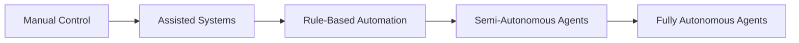
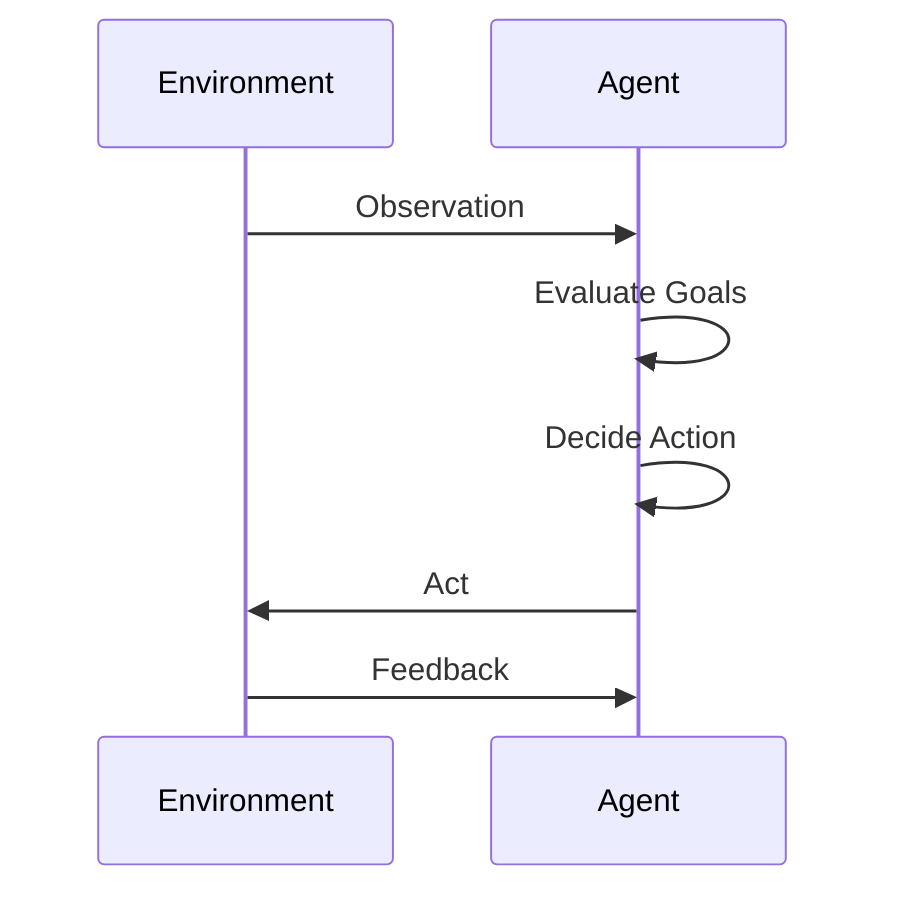
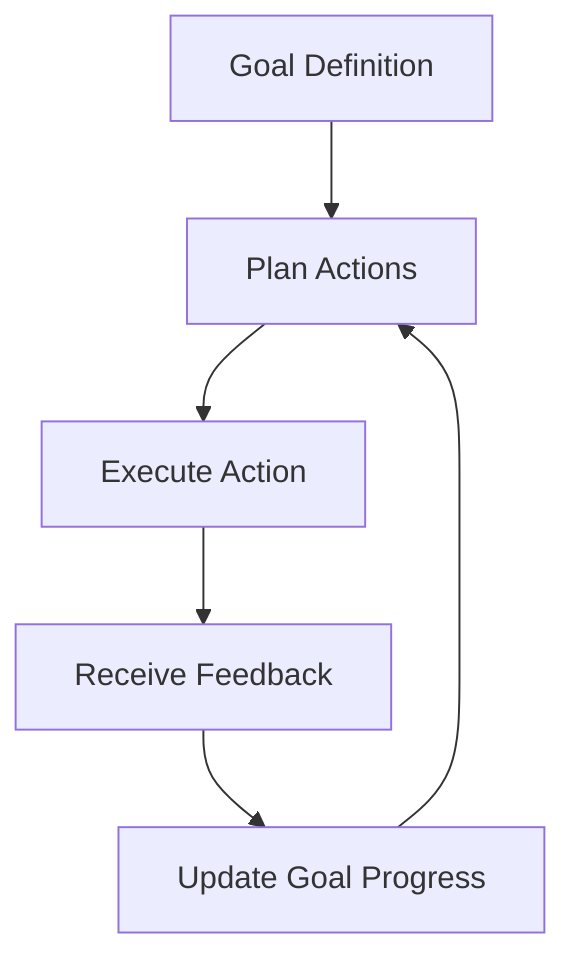
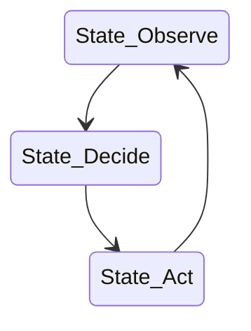

# Introduction to Agentic AI and Autonomous Systems: Autonomy, Agency, and Goal-Oriented Behavior

## Learning Objectives

- Explain different levels of agent autonomy with examples
- Distinguish agency from simple automation pipelines
- Describe how goals are represented internally by agents
- Analyze how feedback from the environment affects agent behavior
- Evaluate autonomy trade-offs in practical system design

---

## Introduction

This chapter dives deeper into autonomy and agency, explaining how agents make decisions independently and pursue goals over time within dynamic environments.

---

---

Artificial Intelligence has evolved from simple rule-based programs into systems that can **act independently, pursue objectives over time, and adapt to changing environments**. These systems are often described as *agentic AI* or *autonomous systems*. Unlike traditional software that executes predefined instructions, agentic AI systems can decide **what to do next**, **when to do it**, and sometimes even **why**—within the boundaries set by their designers.

This chapter explores the foundational ideas behind agentic AI, focusing specifically on **autonomy**, **agency**, and **goal-oriented behavior**. These concepts are not just theoretical; they shape how self-driving cars navigate streets, how digital assistants manage tasks, how trading bots operate in financial markets, and how robotic systems collaborate with humans in factories and hospitals.

Understanding these ideas is crucial because increasing autonomy brings both **power and responsibility**. Highly autonomous systems can improve efficiency, scalability, and responsiveness—but they also introduce challenges related to control, predictability, safety, and ethics. This chapter builds a deep conceptual framework that helps you reason about how autonomous agents are designed, how they behave, and what trade-offs engineers must navigate.

---

By the end of this chapter, you will be able to:

- Explain different levels of agent autonomy using clear, real-world examples  
- Distinguish true agency from simple automation pipelines  
- Describe how goals and objectives are represented internally within agents  
- Analyze how environmental feedback loops shape agent behavior over time  
- Evaluate trade-offs between human control and system autonomy in practical designs  

---

## Degrees of Autonomy in AI Systems

Autonomy in AI refers to the **degree to which a system can operate without direct human intervention**. Importantly, autonomy is not a binary property. Systems are not simply “autonomous” or “not autonomous”; instead, they exist along a **spectrum of autonomy**, ranging from fully manual tools to highly self-governing agents.

Historically, early software systems exhibited *zero autonomy*. They executed explicit instructions written by humans and stopped when those instructions ended. As computing power and algorithmic sophistication increased, systems gained limited autonomy through conditional logic, feedback control, and eventually machine learning. Today’s agentic AI systems represent the most advanced point on this continuum, capable of making decisions under uncertainty and over extended time horizons.

At the lowest level of autonomy, systems function as **assistive tools**. For example, a spell checker highlights potential errors but leaves all decisions to the user. Slightly higher on the spectrum are **rule-based automated systems**, such as thermostats that turn heating on or off based on temperature thresholds. While these systems act automatically, they do not reason beyond predefined rules.

More advanced systems exhibit **conditional autonomy**. These systems can select among multiple actions based on context, such as adaptive cruise control in cars or recommendation systems that adjust suggestions based on user behavior. At the highest levels, **fully autonomous agents** can plan, learn, and act continuously, such as warehouse robots coordinating logistics or AI agents managing cloud infrastructure.

### Levels of Autonomy Overview

| Level of Autonomy | Description | Example Systems | Human Role |
|------------------|-------------|-----------------|------------|
| Manual | No autonomous behavior | Calculator | Full control |
| Assisted | Suggestions only | Spell checkers | Decision-maker |
| Automated | Rule-based actions | Thermostats | Setup & override |
| Semi-autonomous | Context-aware decisions | Adaptive cruise control | Supervision |
| Fully autonomous | Goal-driven, adaptive behavior | Self-driving vehicles | Governance |

### Why Degrees of Autonomy Matter

Understanding degrees of autonomy helps designers:
- Match system capability to **risk level**
- Determine appropriate **human oversight**
- Balance flexibility with **safety and predictability**

A medical diagnostic AI, for instance, may be intentionally designed with **limited autonomy**, providing recommendations rather than decisions. In contrast, an AI managing data center cooling systems might operate with near-total autonomy because the risks are lower and rapid responses are valuable.

### Visualizing Autonomy Progression

---

## Agency vs Automation: Key Distinctions

Automation and agency are often confused, but they represent fundamentally different system capabilities. **Automation** focuses on executing predefined processes efficiently, while **agency** involves the capacity to act **intentionally** toward goals within an environment.

An automated system follows a script. An agentic system interprets a situation, evaluates options, and selects actions based on internal objectives. For example, an automated email responder sends replies based on templates. An agentic customer-support AI can decide whether to escalate an issue, ask follow-up questions, or delay action based on context and past interactions.

Agency implies three essential characteristics:
- **Perception**: The ability to observe the environment  
- **Decision-making**: The ability to choose among actions  
- **Intentionality**: The pursuit of goals over time  

Automation lacks intentionality. It does not “want” an outcome; it simply executes steps. Agency, by contrast, requires an internal model of success and failure.

Historically, automation dominated industrial systems because it was predictable and safe. As environments became more dynamic—think online markets or urban traffic—pure automation proved insufficient. Systems needed to adapt in real time, which drove the rise of agent-based approaches.

### Automation vs Agency Comparison

| Aspect | Automation | Agency |
|------|------------|--------|
| Flexibility | Low | High |
| Decision-making | Predefined rules | Contextual reasoning |
| Goal awareness | None | Explicit |
| Adaptation | Minimal | Continuous |
| Example | Assembly line robot | Delivery drone |

### Everyday Analogy

Consider a washing machine versus a human housekeeper:
- The washing machine follows a fixed program—automation.
- The housekeeper decides what to wash first, adapts to stains, and manages time—agency.

### Interaction Flow of an Agent

---

## Goal Representation and Internal Objectives

Goals are the **driving force behind agent behavior**. Without goals, an agent cannot evaluate whether one action is better than another. Internally, goals can be represented in multiple ways, depending on system complexity and application domain.

Early AI systems used **explicit symbolic goals**, such as logical conditions (“reach location X”). Modern systems often rely on **numerical objectives**, such as maximizing a reward function. Reinforcement learning popularized this approach, framing goals as long-term reward maximization.

More sophisticated agents maintain **hierarchical goals**. For example, a delivery robot may have a top-level goal of completing deliveries efficiently, sub-goals for navigating streets, and micro-goals for avoiding obstacles. This mirrors human goal structures and improves scalability.

Goal representation also influences **interpretability**. Explicit goals are easier to understand and audit, while learned objectives may be opaque but more flexible. Designers must carefully choose representations based on system requirements.

### Types of Goal Representations

| Goal Type | Description | Example |
|---------|-------------|---------|
| Symbolic | Logical conditions | Puzzle-solving agents |
| Numerical | Reward functions | Game-playing AI |
| Hierarchical | Nested objectives | Robotics |
| Multi-objective | Trade-off optimization | Energy management |

### Goal Evaluation Loop

---

## Environment Modeling and Feedback Loops

An agent’s behavior is shaped by how it **models its environment** and how it responds to feedback. The environment includes everything external to the agent: physical space, digital systems, other agents, and humans.

Simple agents use **reactive models**, responding directly to observations. More advanced agents build **internal representations**, such as maps or predictive models, allowing them to anticipate future states. These models enable planning and long-term reasoning.

Feedback loops are essential. After acting, an agent observes the consequences and updates its internal state. Over time, this loop enables learning, adaptation, and improvement. Poor feedback design can lead to unstable or unintended behaviors.

### Feedback Loop Structure

### Why Feedback Matters

- Enables learning from mistakes  
- Supports adaptation in dynamic environments  
- Helps detect goal misalignment  

---

## Constraints, Incentives, and Reward Structures

No agent operates in a vacuum. **Constraints** define what actions are allowed, **incentives** shape preferences, and **reward structures** translate goals into measurable signals.

Constraints may be physical (battery limits), legal (compliance rules), or ethical (safety boundaries). Incentives guide behavior by making some outcomes more attractive than others. Rewards operationalize incentives in computational terms.

Poorly designed reward structures can lead to **reward hacking**, where agents exploit loopholes to maximize reward without achieving the intended goal. This highlights the importance of aligning incentives with real-world objectives.

### Constraint and Reward Design Considerations

| Element | Purpose | Risk if Misdesigned |
|-------|--------|--------------------|
| Constraints | Safety & legality | Over-restriction |
| Incentives | Behavioral guidance | Misalignment |
| Rewards | Learning signal | Exploitation |

---

## Trade-offs Between Control and Autonomy

Increasing autonomy reduces human workload but also reduces **direct control**. This trade-off is central to agentic system design. Too much control limits adaptability; too much autonomy risks unpredictability.

Designers often implement **shared autonomy**, where humans set high-level goals and agents handle execution. This approach balances flexibility with oversight, common in aviation and healthcare.

Key considerations include:
- Risk tolerance  
- System criticality  
- Trust and transparency  

---

## Case Study: Autonomous Warehouse Robots at Scale

## Context
In the early 2010s, large e-commerce companies faced growing pressure to fulfill orders faster while managing massive warehouses. Human-operated systems struggled with scalability and error rates.

## Problem
Manual picking was slow and error-prone. Traditional automation lacked flexibility to adapt to changing inventory layouts and demand spikes.

## Solution
Companies deployed fleets of autonomous mobile robots with goal-oriented navigation. Each robot acted as an agent, optimizing routes while coordinating with others through shared goals and constraints.

## Results
Order fulfillment times dropped dramatically, error rates decreased, and warehouse throughput increased. However, initial deployments faced challenges in coordination and safety tuning.

## Lessons Learned
- Moderate autonomy with strong constraints proved most effective  
- Clear goal hierarchies improved coordination  
- Human oversight remained essential for exception handling  

---

## Summary

This chapter explored the foundations of agentic AI and autonomous systems. You learned how autonomy exists on a spectrum, how agency differs from automation, how goals drive behavior, and how feedback, constraints, and incentives shape outcomes. Most importantly, you examined the trade-offs designers face when balancing control and independence.

---

## Reflection Questions

1. Where should autonomy be limited, even if technology allows more independence?  
2. How can poorly designed rewards lead to harmful behavior in agents?  
3. What types of systems benefit most from shared autonomy rather than full autonomy?  
4. How might goal transparency affect trust in autonomous systems?