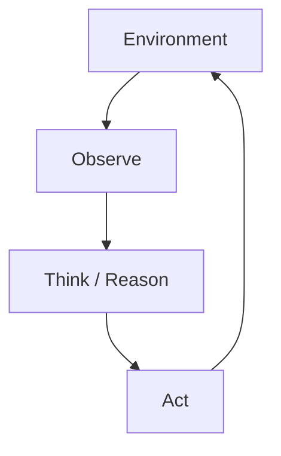
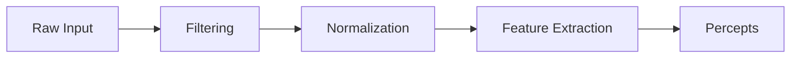
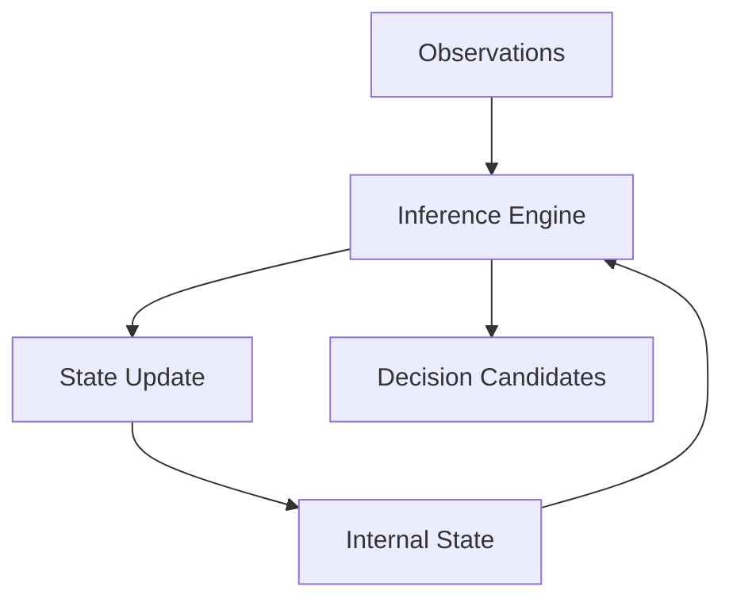
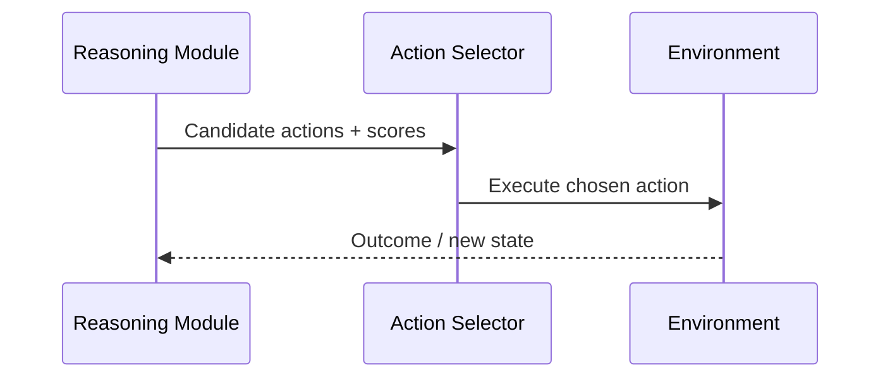
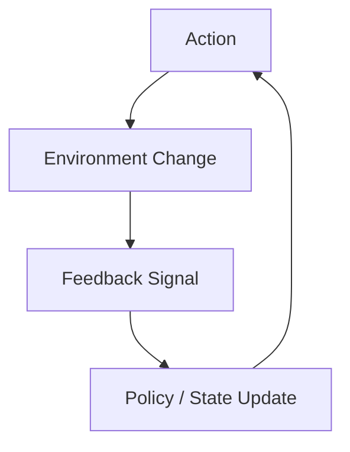

# Core Components of an AI Agent: The Agent Loop: Observe, Think, Act

## Learning Objectives

- Describe each phase of the agent loop in detail
- Trace data flow through a complete agent cycle
- Identify common breakdown points in the loop
- Explain how feedback influences future actions
- Evaluate agent loop designs for robustness

---

## Introduction

This chapter introduces the fundamental control loop that governs agent behavior and explains how observation, reasoning, and action are connected.

---

# Core Components of an AI Agent: The Agent Loop — Observe, Think, Act

---

At the heart of every intelligent agent—whether it is a simple thermostat, a chess-playing program, a self-driving car, or a conversational AI—lies a deceptively simple idea: **a continuous loop of observing the world, thinking about what those observations mean, and acting based on that reasoning**. This cycle, often called the **agent loop** or **perception–decision–action loop**, is the fundamental control structure that governs how agents behave over time.

Understanding this loop is essential because it explains *how* an AI agent turns raw data into meaningful behavior. Without this loop, an agent would either be blind (unable to perceive), mindless (unable to reason), or powerless (unable to act). More importantly, the quality of an agent’s behavior—its intelligence, robustness, adaptability, and safety—emerges directly from how well these three phases are designed and connected.

Historically, the observe–think–act paradigm comes from multiple disciplines. In control theory, it appears as feedback control loops. In cognitive science, it mirrors human perception, cognition, and motor action. In robotics and artificial intelligence, it provides a unifying framework for building systems that can operate autonomously in dynamic environments. Even modern large language model (LLM)–based agents follow this loop, although their “observations” may be text inputs and their “actions” may be API calls or generated responses.

In this chapter, we will explore the agent loop in depth. We will move from a high-level conceptual overview to detailed explanations of each phase, trace data flow through a complete cycle, analyze how feedback shapes future behavior, and examine common failure modes that cause agents to behave incorrectly or unsafely. By the end, you should not only understand *what* the agent loop is, but also *why* it matters and *how* to design it robustly.

---

By the end of this chapter, you will be able to:

- Describe each phase of the agent loop (observe, think, act, feedback) in detail  
- Trace data flow through a complete agent cycle step by step  
- Identify common breakdown points and failure modes in the loop  
- Explain how feedback influences future decisions and learning  
- Evaluate different agent loop designs for robustness, adaptability, and safety  

---

## Conceptual Overview of the Agent Loop

The agent loop is best understood as a **continuous cycle**, not a one-time sequence. An agent does not observe once, think once, and act once. Instead, it repeats this process constantly as long as it is active. Each iteration updates the agent’s understanding of the world and influences its next decision.

At a high level, the loop consists of three core phases:

1. **Observation** – The agent perceives information from its environment.
2. **Reasoning (Thinking)** – The agent interprets observations, updates its internal state, and decides what to do next.
3. **Action** – The agent executes an action that affects the environment or itself.

What makes this loop powerful is the **feedback connection**: actions change the environment, which leads to new observations, closing the loop. This feedback is what allows agents to adapt over time rather than behave in a rigid, preprogrammed way.

From a conceptual standpoint, the agent loop answers three fundamental questions repeatedly:

- *What is happening right now?* (Observe)
- *What should I do about it?* (Think)
- *What will I do next?* (Act)

To make this more intuitive, consider a human analogy. Imagine driving a car:

- You **observe** the road, traffic lights, and other vehicles.
- You **think** about whether to speed up, slow down, or change lanes.
- You **act** by pressing the accelerator, brake, or steering wheel.
- You then **observe again** to see the effect of your action.

This same pattern appears in AI agents, even when the “road” is a digital environment and the “steering wheel” is an API call or a command to a robot arm.

### Why the Loop Matters

The agent loop is not just an implementation detail—it defines the agent’s *behavioral identity*. Small design choices in the loop can have large consequences:

- A poorly designed observation phase can starve the agent of critical information.
- Weak reasoning can lead to inconsistent or irrational decisions.
- Unsafe action execution can cause harm, even if reasoning is correct.
- Missing or delayed feedback can prevent learning and adaptation.

Because of this, modern AI research often focuses less on isolated algorithms and more on how components interact within the loop.

### A High-Level Visual Representation

Below is a simplified flowchart showing the core agent loop:

This diagram hides many complexities, but it captures the essence: **a closed loop where information and influence flow continuously**.

### Variations of the Agent Loop

Not all agents implement the loop in the same way. Some important variations include:

- **Reactive agents**: Minimal reasoning; actions depend directly on observations.
- **Deliberative agents**: Extensive reasoning and planning before acting.
- **Learning agents**: Use feedback to update models or policies over time.
- **Hybrid agents**: Combine fast reactive responses with slower deliberative planning.

The table below compares these variations:

| Agent Type        | Reasoning Depth | Use of Internal State | Typical Use Cases |
|-------------------|-----------------|----------------------|-------------------|
| Reactive          | Very low        | Minimal              | Simple robotics, game NPCs |
| Deliberative      | High            | Rich symbolic models | Planning systems, theorem provers |
| Learning          | Medium–High     | Learned parameters   | Reinforcement learning agents |
| Hybrid            | Variable        | Mixed                | Autonomous vehicles, robotics |

Understanding these differences helps you evaluate which loop design is appropriate for a given problem.

---

## Observation and Input Processing

Observation is the **agent’s window to the world**. Without it, the agent has no grounding in reality and cannot respond meaningfully to changes in its environment. This phase is often underestimated, but in practice, many agent failures originate from poor observation design rather than flawed reasoning.

At its core, observation involves **collecting raw data** from the environment. Depending on the agent, this data may take many forms: sensor readings, text input, images, logs, system states, or even messages from other agents. The challenge is not just collecting data, but transforming it into a form the agent can reason about.

Historically, early AI systems relied on carefully structured inputs provided by humans. Modern agents, by contrast, must often deal with noisy, incomplete, ambiguous, or high-dimensional data. This makes observation a complex pipeline rather than a single step.

### From Raw Input to Meaningful Percepts

Observation typically involves multiple sub-stages:

- **Data acquisition**: Reading sensors, APIs, or input streams.
- **Filtering and cleaning**: Removing noise, errors, or irrelevant data.
- **Normalization and encoding**: Converting data into standardized formats.
- **Feature extraction**: Identifying salient patterns or signals.
- **Percept formation**: Producing a structured representation usable by reasoning modules.

For example, a self-driving car does not “observe” a raw camera image in its reasoning module. Instead, that image is processed to detect lanes, pedestrians, vehicles, and traffic signs—each a higher-level percept derived from raw pixels.

### Why Observation Is Hard

Observation is difficult because the real world is messy:

- Sensors can fail or drift over time.
- Data can arrive late or out of order.
- Important information may be missing entirely.
- The same observation can have multiple interpretations.

These challenges mean that observation is often probabilistic rather than deterministic. Agents may maintain confidence levels or uncertainty estimates about what they are perceiving.

### Examples Across Domains

Consider how observation differs across domains:

- **Chatbot agent**: Observes user text, conversation history, and system prompts.
- **Trading agent**: Observes market prices, volumes, news sentiment, and time.
- **Robot vacuum**: Observes distance sensors, bump sensors, and battery level.

Despite these differences, the underlying goal is the same: **convert external signals into internal representations**.

The table below illustrates different observation modalities:

| Domain            | Raw Inputs                  | Processed Observations |
|-------------------|-----------------------------|------------------------|
| Conversational AI | User text, metadata         | Intent, entities, context |
| Robotics          | Camera, LiDAR, IMU          | Object maps, positions |
| Finance           | Price feeds, news           | Trends, indicators |
| Games             | Game state variables        | Strategic features |

### Observation Pipeline Diagram

This pipeline emphasizes that observation is an **active transformation process**, not a passive reading of data.

---

## Reasoning and Internal State Updates

Once observations are formed, the agent must **make sense of them**. This is the reasoning phase, where intelligence is most visible. Reasoning determines how the agent interprets the world, predicts outcomes, and chooses actions.

Reasoning is deeply connected to the agent’s **internal state**—the information it carries across time. This state may include beliefs, goals, plans, memories, learned parameters, or emotional variables (in human-inspired models). Without internal state, an agent would be stuck reacting only to the present moment.

Historically, reasoning in AI has evolved through several paradigms:

- **Symbolic reasoning**: Logic rules and explicit knowledge bases.
- **Probabilistic reasoning**: Bayesian networks and uncertainty modeling.
- **Optimization-based reasoning**: Planning and search algorithms.
- **Neural reasoning**: Learned representations in neural networks.
- **Hybrid approaches**: Combining symbolic and neural methods.

Modern agents often blend these approaches, using learned models for perception and prediction while relying on structured reasoning for planning and constraints.

### Internal State: Memory Across Time

Internal state allows an agent to answer questions like:

- What happened earlier?
- What am I trying to achieve?
- What have I already tried?
- What do I expect to happen next?

For example, a conversational agent uses conversation history as internal state, while a robot uses a map of its environment. Updating this state correctly is critical; errors can accumulate and lead to cascading failures.

### Step-by-Step Reasoning Flow

A typical reasoning cycle involves:

1. **State retrieval**: Load relevant internal information.
2. **Observation integration**: Combine new percepts with existing state.
3. **Inference or prediction**: Estimate outcomes of possible actions.
4. **Goal evaluation**: Measure how well outcomes align with objectives.
5. **Decision preparation**: Produce candidate actions with scores.

This process may be fast and approximate (reactive) or slow and deliberative (planning-based), depending on the agent’s design.

### Reasoning Architecture Diagram

This diagram highlights the central role of internal state as both input and output of reasoning.

### Trade-Offs in Reasoning Design

Different reasoning approaches involve trade-offs:

| Approach           | Strengths                     | Limitations |
|--------------------|-------------------------------|-------------|
| Rule-based         | Transparent, predictable      | Brittle, hard to scale |
| Probabilistic      | Handles uncertainty           | Computationally heavy |
| Neural             | Flexible, data-driven         | Opaque, hard to debug |
| Hybrid             | Balanced performance          | Complex to engineer |

Choosing the right approach depends on the environment, safety requirements, and computational constraints.

---

## Action Selection and Execution

Action is where the agent’s decisions **become real**. Up to this point, everything has happened inside the agent. Action is the moment when the agent affects the external world—or at least attempts to.

Action selection involves choosing one option among many. Execution involves translating that choice into concrete commands. These two steps are closely related but conceptually distinct.

An agent may consider dozens or thousands of possible actions internally, but only one (or a small set) is actually executed. The quality of this selection process largely determines whether the agent behaves effectively or not.

### From Decision to Command

Action execution typically involves:

- **Action representation**: Defining what actions are possible.
- **Constraint checking**: Ensuring actions are safe and allowed.
- **Selection strategy**: Choosing based on utility, policy, or rules.
- **Command generation**: Converting abstract actions into low-level commands.
- **Dispatch and monitoring**: Sending commands and tracking execution.

For example, a robot deciding to “move forward” must translate that decision into motor commands, monitor whether the movement succeeds, and handle obstacles if it does not.

### Deterministic vs. Stochastic Actions

Some agents choose actions deterministically (always the same choice given the same state). Others introduce randomness to encourage exploration or avoid predictability. Reinforcement learning agents often rely on stochastic policies during training.

### Action Execution Diagram

This sequence highlights the interaction between reasoning, action, and environment.

### Practical Examples

- **Chatbot**: Action = generate a response or call a tool.
- **Game agent**: Action = move, attack, defend.
- **Smart thermostat**: Action = turn heating on or off.

Each example illustrates how abstract decisions must be grounded in executable commands.

---

## Feedback and Iterative Refinement

Feedback is the **glue that turns a loop into a learning system**. Without feedback, an agent cannot evaluate whether its actions were effective. With feedback, it can refine future behavior.

Feedback may be explicit or implicit:

- Explicit feedback: Rewards, penalties, user ratings.
- Implicit feedback: Changes in environment state, success or failure signals.

In reinforcement learning, feedback is formalized as a reward signal. In other systems, feedback may be more subtle, such as whether a user continues a conversation or abandons it.

### Short-Term vs. Long-Term Feedback

Some feedback is immediate (e.g., collision detected). Other feedback is delayed (e.g., long-term user satisfaction). Designing agents that can connect delayed feedback to earlier actions is one of the hardest problems in AI.

### Feedback Loop Diagram

This diagram emphasizes how feedback influences future actions through updates.

### Why Feedback Enables Adaptation

Through feedback, agents can:

- Correct mistakes.
- Improve performance over time.
- Adapt to changing environments.
- Discover new strategies.

However, poorly designed feedback can mislead agents, reinforcing undesirable behavior.

---

## Failure Modes in the Agent Loop

Even well-designed agents can fail. Understanding failure modes helps diagnose problems and design more robust systems.

### Common Breakdown Points

Failures often occur at boundaries between phases:

- **Observation failures**: Incomplete or incorrect data.
- **Reasoning failures**: Wrong assumptions or flawed models.
- **Action failures**: Unsafe or ineffective execution.
- **Feedback failures**: Misinterpreted or missing signals.

### Cascading Effects

A small observation error can propagate through reasoning and lead to catastrophic actions. This is why robustness must be considered end-to-end, not in isolated components.

### Table of Failure Modes

| Loop Phase     | Typical Failure            | Consequence |
|---------------|----------------------------|-------------|
| Observation   | Sensor noise, bias         | Wrong beliefs |
| Reasoning     | Overfitting, logic errors  | Poor decisions |
| Action        | Execution mismatch         | Physical or logical harm |
| Feedback      | Misaligned rewards         | Reinforced bad behavior |

### Designing for Robustness

Best practices include:

- Redundant observations.
- Uncertainty modeling.
- Safety constraints on actions.
- Careful reward and feedback design.

---

## Case Study: An Autonomous Delivery Robot Navigating a City Campus

### Context

In the late 2010s, a large university campus partnered with a robotics startup to deploy autonomous delivery robots capable of transporting food and packages across campus. The campus environment was semi-structured: paved walkways, pedestrians, bicycles, and occasional construction zones. The goal was to reduce delivery time while operating safely among humans.

The robots were equipped with cameras, ultrasonic sensors, GPS, and onboard computing. They operated continuously throughout the day, encountering changing lighting conditions, weather, and pedestrian density. This made them an ideal real-world test of the agent loop.

### Problem

Early deployments revealed inconsistent behavior. Some robots hesitated excessively at intersections, while others took inefficient routes. In rare cases, robots became stuck, repeatedly attempting the same failed maneuver.

Analysis showed that the issue was not a single bug, but weaknesses across the agent loop. Observations were sometimes noisy, reasoning struggled with uncertainty, and feedback signals were too sparse to correct mistakes quickly.

### Solution

The engineering team redesigned the agent loop holistically. First, they improved observation by fusing multiple sensors and estimating uncertainty. Second, they upgraded reasoning to maintain a richer internal state, including a short-term memory of recent failures. Third, they constrained action execution with safety checks and fallback behaviors.

Feedback was also enhanced. Instead of relying only on delivery success, the system incorporated micro-feedback signals such as time delays, obstacle encounters, and human interventions. These signals updated the agent’s policies more frequently.

### Results

After the redesign, delivery success rates improved significantly. Robots completed routes faster, hesitated less, and recovered more gracefully from unexpected situations. Importantly, safety incidents decreased, and human trust in the system increased.

However, limitations remained. Extreme weather still challenged sensors, and rare edge cases required human intervention. The team concluded that robustness is an ongoing process, not a one-time fix.

### Lessons Learned

This case highlighted that intelligence emerges from the **entire loop**, not individual components. Improving observation without adjusting reasoning was insufficient. Likewise, better actions without proper feedback led to stagnation.

The key lesson was to treat the agent loop as an integrated system. Designing, testing, and improving it holistically is essential for real-world success.

---

## Summary

The agent loop—observe, think, act, and refine through feedback—is the foundational control structure of AI agents. Observation grounds the agent in reality, reasoning transforms data into decisions, action turns decisions into impact, and feedback enables adaptation over time.

We explored each phase in depth, traced data flow through the loop, examined practical examples, and analyzed common failure modes. Most importantly, we saw that robust agent behavior emerges not from isolated excellence, but from **well-designed interactions between phases**.

Understanding the agent loop equips you to design, evaluate, and debug intelligent systems across domains, from conversational AI to robotics and beyond.

---

## Reflection Questions

1. Which phase of the agent loop do you think is most often underestimated, and why?  
2. How might delayed feedback affect an agent’s ability to learn effectively?  
3. Can you identify a real-world system where poor observation leads to cascading failures?  
4. How would you balance transparency and performance in reasoning design?  
5. If you were designing an agent for a safety-critical environment, which loop components would you prioritize and why?