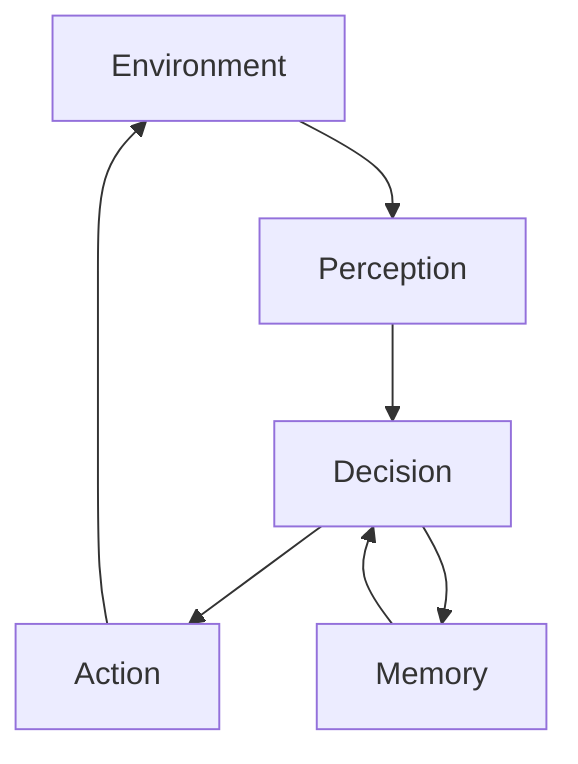
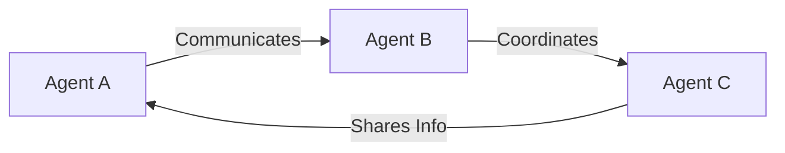
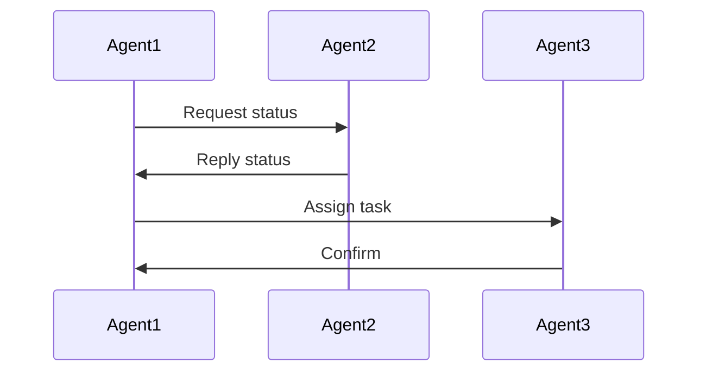
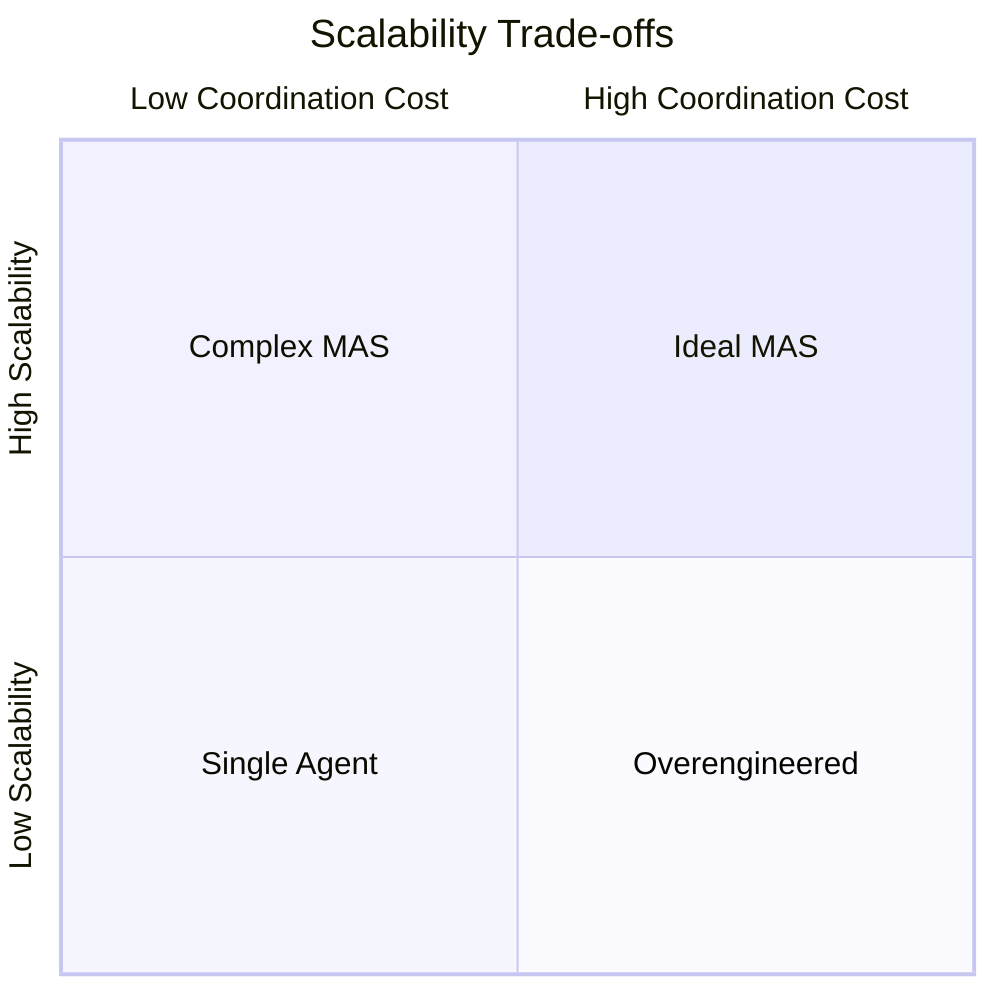

# Agent Architectures and Design Patterns: Single-Agent vs Multi-Agent Systems

## Learning Objectives

- Compare single-agent and multi-agent systems
- Explain coordination costs in multi-agent setups
- Design memory strategies for multiple agents
- Assess scalability trade-offs
- Select appropriate system architectures

---

## Introduction

This chapter explores the architectural implications of single-agent and multi-agent designs.

---

---

As intelligent systems become increasingly embedded in software applications—ranging from recommendation engines and autonomous vehicles to enterprise automation and collaborative AI—the way we *structure* these systems becomes just as important as the algorithms they use. One of the most fundamental architectural decisions designers face is whether to build a **single-agent system** or a **multi-agent system**.

At a high level, this decision may appear simple: use one intelligent agent if the problem is small, or many agents if the problem is large. In reality, the choice has deep implications for **system complexity, coordination costs, scalability, robustness, memory design, and long-term maintainability**. Poor architectural choices often lead to systems that are difficult to scale, fragile under load, or unnecessarily complex.

This chapter explores agent architectures and design patterns with a strong focus on **single-agent versus multi-agent systems**. We will examine not only *what* these architectures are, but *why* they exist, *how* they work internally, *when* each approach is appropriate, and *what trade-offs* system designers must navigate. Throughout the chapter, you will encounter detailed explanations, real-world analogies, architectural diagrams, tables, and extended case studies designed to help you build strong intuition—not just theoretical knowledge.

---

By the end of this chapter, you will be able to:

- Clearly compare single-agent and multi-agent system architectures  
- Explain the coordination and communication costs inherent in multi-agent systems  
- Design appropriate memory strategies for systems involving multiple agents  
- Assess scalability trade-offs across different agent architectures  
- Select the most appropriate system scope and architecture for a given problem  

---

## Single-Agent System Design Principles

A **single-agent system** is an architecture in which one autonomous entity is responsible for perception, decision-making, and action within a given environment. This agent may be simple or extremely complex internally, but from the system’s perspective, it acts as a *centralized intelligence*.

Historically, single-agent designs dominated early AI systems. Expert systems in the 1980s, rule-based automation tools, and early machine learning pipelines all followed this pattern. The assumption was straightforward: a single program could reason about the world, make decisions, and execute actions efficiently. Even today, many successful systems—such as fraud detection models, game-playing agents, or scheduling optimizers—are fundamentally single-agent in nature.

One of the most important design principles of single-agent systems is **centralized control**. All decision logic resides in one place, which simplifies reasoning about behavior. Debugging is generally easier because there is only one source of truth for decisions. If an error occurs, engineers can trace it back to a specific internal component or state.

However, centralized control also creates constraints. As the environment becomes more complex or dynamic, the agent must handle more responsibilities. This often leads to large, monolithic architectures that are difficult to modify without unintended side effects. Over time, the agent may accumulate tightly coupled components that reduce flexibility.

Another key principle is **global state awareness**. A single agent typically maintains a comprehensive internal model of the environment. This enables strong optimization because decisions can be made with full context. For example, a single logistics optimization agent can compute globally optimal delivery routes because it sees all vehicles, destinations, and constraints at once.

Yet global state awareness has costs. Maintaining an accurate and up-to-date global state can be computationally expensive, especially in real-time systems. Additionally, as the system grows, the agent’s memory and processing requirements increase, sometimes exponentially.

### Internal Architecture of a Single Agent

Most single-agent systems follow a layered internal architecture:

- **Perception layer**: Collects and preprocesses input from the environment  
- **Decision layer**: Applies rules, models, or policies to determine actions  
- **Action layer**: Executes decisions in the environment  
- **Memory/state**: Stores knowledge, observations, and intermediate results  

This architecture emphasizes clarity and determinism. Each component has a well-defined responsibility, making the system easier to reason about and test.

### Practical Examples and Analogies

A useful analogy is a **single chef running a small restaurant**. The chef takes orders, cooks meals, manages inventory, and serves customers. As long as the restaurant is small, this works efficiently. The chef has full visibility into everything happening and can optimize decisions easily. However, as the restaurant grows, the chef becomes overwhelmed.

Real-world examples of single-agent systems include:

- A chess engine that evaluates board positions and selects moves  
- A recommendation model generating personalized suggestions  
- A scheduling optimizer for factory production lines  

### Advantages and Limitations

**Advantages:**

- Simpler architecture and debugging  
- Lower communication overhead  
- Strong global optimization capabilities  

**Limitations:**

- Limited scalability  
- Single point of failure  
- Increasing complexity as responsibilities grow  

---

## Multi-Agent System Motivations

A **multi-agent system (MAS)** consists of multiple autonomous agents that interact within a shared environment. Each agent has its own goals, perceptions, and decision-making capabilities. Rather than centralizing intelligence, MAS distributes it across multiple entities.

The motivation for multi-agent systems emerged as AI problems grew in scale and complexity. Researchers realized that some problems are inherently **distributed**—they involve multiple actors, locations, or objectives that cannot be efficiently managed by a single centralized agent.

One of the strongest motivations for MAS is **decomposition**. Large problems can be broken into smaller subproblems, each handled by a specialized agent. This mirrors how human organizations work: teams are composed of individuals with distinct roles rather than one person doing everything.

Another motivation is **robustness**. In a multi-agent system, the failure of one agent does not necessarily cause total system failure. Other agents may compensate, reroute tasks, or continue operating independently. This property is particularly valuable in safety-critical or large-scale systems.

Multi-agent systems also support **parallelism**. Multiple agents can act simultaneously, enabling faster responses and higher throughput. For example, in a warehouse automation system, dozens of robots can move goods concurrently rather than waiting for a single controller.

### Types of Multi-Agent Systems

Multi-agent systems can be categorized in several ways:

- **Cooperative**: Agents work toward a shared global goal  
- **Competitive**: Agents have conflicting goals (e.g., auctions, games)  
- **Mixed**: Agents cooperate in some aspects and compete in others  

### Real-World Examples

- Autonomous vehicle fleets coordinating traffic flow  
- Distributed sensor networks monitoring environmental conditions  
- Financial trading agents operating in markets  

### Trade-offs Introduced

While MAS offers flexibility and scalability, it introduces new challenges:

- Coordination complexity  
- Communication overhead  
- Emergent behaviors that are hard to predict  

---

## Coordination and Communication Overhead

Coordination is the **hidden cost** of multi-agent systems. As soon as multiple agents exist, they must share information, align decisions, and resolve conflicts. This process consumes time, bandwidth, and computational resources.

At small scales, coordination may seem trivial. Two agents can simply exchange messages. But as the number of agents grows, communication paths grow rapidly. In fully connected systems, the number of potential communication links increases quadratically.

Coordination mechanisms vary widely:

- **Direct messaging**: Agents send explicit messages  
- **Shared blackboards**: Agents read and write to a common space  
- **Market-based coordination**: Agents bid for tasks  
- **Protocols and norms**: Predefined rules for interaction  

### Overhead Implications

Communication overhead affects:

- **Latency**: Time required to reach agreement  
- **Consistency**: Risk of stale or conflicting information  
- **Scalability**: Performance degradation as agents increase  

A common mistake is underestimating coordination costs during design. Systems that work well with five agents may collapse with fifty.

### Case Study: Distributed Delivery Drones

### # Context
In 2021, a logistics company piloted a drone-based delivery system across a large metropolitan area. The system initially used a centralized controller to assign routes. As demand increased, engineers transitioned to a multi-agent model where each drone acted autonomously.

### # Problem
As the number of drones grew, collisions and delivery delays increased. Each drone needed to know airspace conditions, weather updates, and the intentions of nearby drones. Communication bandwidth became saturated, and inconsistent data led to conflicting decisions.

### # Solution
Engineers introduced hierarchical coordination. Drones were grouped into zones, each with a local coordinator agent. Only summarized information flowed between zones, dramatically reducing communication load.

### # Results
Delivery times improved by 35%, and collision incidents dropped significantly. However, system complexity increased, requiring careful monitoring and testing.

### # Lessons Learned
The team learned that coordination architecture matters as much as agent intelligence. Thoughtful communication design is essential for scalability.

---

## Shared vs Isolated Memory Models

Memory architecture plays a central role in agent systems. In single-agent systems, memory is typically centralized and consistent. In multi-agent systems, designers must decide whether memory should be **shared** or **isolated**.

### Shared Memory Models

In shared memory systems, agents access a common data store. This simplifies information sharing and ensures consistency.

**Advantages:**

- Easy knowledge sharing  
- Reduced communication messages  

**Disadvantages:**

- Contention and synchronization costs  
- Risk of unintended interference  

### Isolated Memory Models

In isolated memory models, each agent maintains its own internal state. Information is shared only through explicit communication.

**Advantages:**

- Strong encapsulation  
- Better fault isolation  

**Disadvantages:**

- Data duplication  
- Potential inconsistencies  

### Hybrid Approaches

Most real-world systems use hybrid designs: shared global knowledge combined with private local state.

| Memory Model | Consistency | Scalability | Complexity |
|-------------|-------------|-------------|------------|
| Shared | High | Low–Medium | Medium |
| Isolated | Variable | High | High |
| Hybrid | Medium–High | High | High |

---

## Scalability Considerations

Scalability refers to a system’s ability to handle growth—more users, more data, more tasks—without unacceptable performance degradation.

Single-agent systems often scale **vertically** by adding more computational resources. This approach has limits and can be expensive.

Multi-agent systems scale **horizontally** by adding more agents. This is theoretically powerful but practically challenging due to coordination costs.

Key scalability questions include:

- How does performance change as agents increase?  
- Does communication grow linearly or exponentially?  
- Can failures be isolated?  

---

## Choosing the Right System Scope

Selecting between single-agent and multi-agent architectures is fundamentally about **scope management**. Designers must balance ambition with practicality.

Single-agent systems are often best when:

- The problem is well-defined and centralized  
- Global optimization is critical  
- Development speed and simplicity matter  

Multi-agent systems excel when:

- The environment is distributed  
- Tasks can be decomposed  
- Robustness and scalability are priorities  

| Decision Factor | Single-Agent | Multi-Agent |
|----------------|-------------|-------------|
| Complexity | Low–Medium | High |
| Coordination Cost | Low | High |
| Scalability | Limited | Strong |
| Fault Tolerance | Low | High |

A common best practice is to **start simple**. Many successful systems begin as single-agent designs and evolve into multi-agent architectures as requirements grow.

---

## Summary

In this chapter, we explored the architectural foundations of single-agent and multi-agent systems. We examined how centralized control simplifies design but limits scalability, while distributed intelligence enables robustness at the cost of coordination complexity. We analyzed communication overhead, memory models, scalability trade-offs, and practical decision-making strategies.

Understanding these architectural patterns is critical for designing intelligent systems that are not only powerful, but also maintainable and resilient.

---

## Reflection Questions

1. What hidden costs might emerge when transitioning from a single-agent to a multi-agent system?  
2. How would you design coordination mechanisms for a system with hundreds of agents?  
3. In what situations might a hybrid memory model be preferable?  
4. Can you think of a system you use daily that likely relies on multi-agent principles?  
5. If starting a new AI project today, how would you justify your architectural choice to stakeholders?