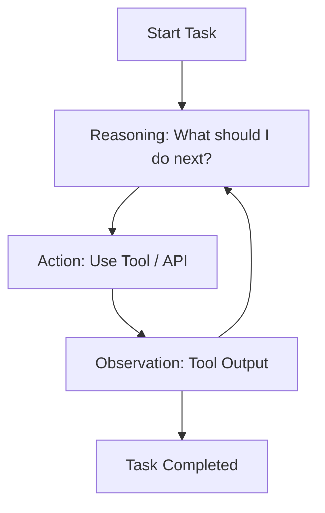
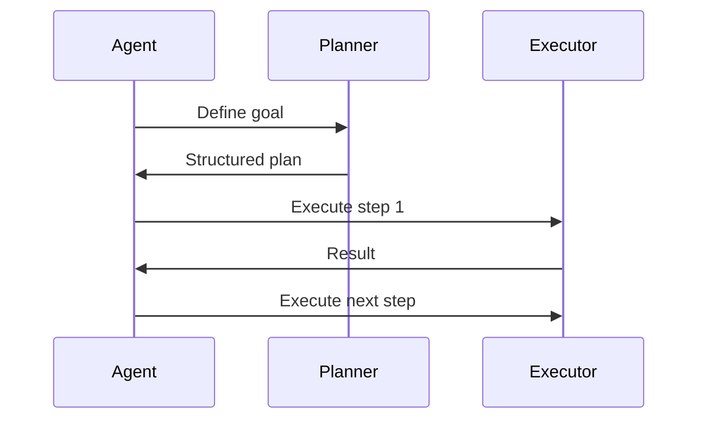
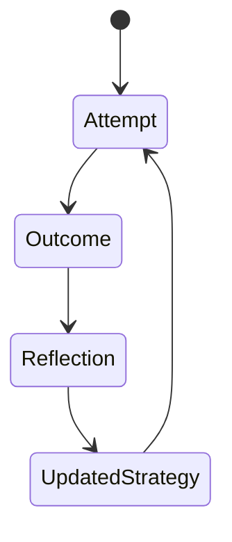
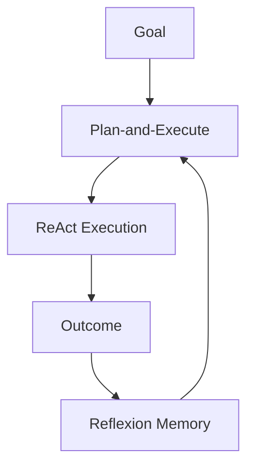

# Agent Architectures and Design Patterns: ReAct, Plan-and-Execute, and Reflexion Patterns

## Learning Objectives

- Explain core agent design patterns
- Apply ReAct and Plan-and-Execute concepts
- Analyze Reflexion for self-correction
- Combine patterns for complex tasks
- Evaluate pattern effectiveness

---

## Introduction

This chapter examines widely used agent design patterns and their practical applications.

---

---

As large language models (LLMs) and autonomous agents have moved from research labs into real-world products, a critical challenge has emerged: **how should we structure an agent’s reasoning and actions so that it behaves reliably, adaptively, and efficiently?** Early systems often relied on single-pass prompting—ask a question, get an answer—but this approach quickly breaks down for complex, multi-step, or uncertain tasks. Real-world problems require agents that can reason, act, observe outcomes, revise their plans, and learn from mistakes.

This need gave rise to **agent architectures and design patterns**—reusable, well-tested ways of organizing how an agent thinks, decides, and interacts with tools and environments. Among the most influential patterns are **ReAct**, **Plan-and-Execute**, and **Reflexion**. These patterns are not just academic ideas; they are practical blueprints used in production systems for tasks like software debugging, data analysis, customer support automation, research assistance, and autonomous decision-making.

In this chapter, we take a deep, structured journey through these patterns. We begin with foundational ideas and progressively build toward advanced concepts such as pattern composition, failure handling, and selection guidelines. Along the way, we will use detailed explanations, analogies, real-world examples, tables, diagrams, and narrative case studies to ensure not just familiarity—but true understanding.

---

By the end of this chapter, you will be able to:

- Explain the core principles behind major agent design patterns  
- Understand and apply the ReAct and Plan-and-Execute workflows  
- Analyze how Reflexion enables self-correction and improvement  
- Combine multiple patterns to solve complex, real-world tasks  
- Evaluate the effectiveness and trade-offs of different patterns  

---

## ReAct Pattern Fundamentals

The **ReAct pattern**, short for *Reasoning + Acting*, represents one of the most influential shifts in how agents are designed. Traditionally, language models were treated as static reasoning engines: they received a prompt, generated a response, and stopped. ReAct challenges this assumption by tightly interleaving **internal reasoning** with **external actions**, allowing agents to think step by step while actively interacting with tools, APIs, or environments.

Historically, ReAct emerged from the observation that models perform better when they can externalize intermediate reasoning steps and immediately test those thoughts through actions. Instead of reasoning in isolation and hoping the answer is correct, a ReAct agent continuously asks: *What do I know? What should I do next? What did I observe as a result?* This loop mirrors how humans solve problems—thinking, trying something, observing the outcome, and adjusting accordingly.

At a conceptual level, the ReAct pattern operates as a repeating cycle:
1. **Thought (Reasoning)** – The agent reflects on the current state and decides what to do next.  
2. **Action** – The agent invokes a tool, queries a database, calls an API, or performs an operation.  
3. **Observation** – The agent receives feedback from the environment and incorporates it into its reasoning.  

This cycle continues until the task is completed. The key insight is that reasoning is no longer hidden or static—it directly drives action, and action informs subsequent reasoning.

Why is this important? Because many real-world tasks are **non-deterministic and information-incomplete**. For example:
- A research agent may not know which sources are relevant until it searches.
- A debugging agent may not know the cause of an error until it runs the code.
- A customer support agent may need to ask clarifying questions before resolving an issue.

ReAct excels in these situations because it embraces uncertainty rather than trying to eliminate it upfront.

### Concrete Examples and Analogies

A useful analogy is a **human detective**. The detective does not sit in a room and reason endlessly. Instead, they:
- Form a hypothesis (reasoning)
- Interview a witness or inspect a location (action)
- Update their theory based on new evidence (observation)

Similarly, a ReAct agent alternates between thinking and doing.

Another example is **interactive data analysis**. An agent analyzing sales data might:
- Reason that revenue dropped in Q3
- Query the database for regional breakdowns
- Observe that one region underperformed
- Decide to analyze marketing spend in that region

### Strengths and Limitations

**Advantages of ReAct** include:
- High adaptability in dynamic environments  
- Improved factual grounding through tool use  
- Transparent reasoning steps (useful for debugging and trust)

However, ReAct also has limitations:
- It can become inefficient if reasoning loops are too long  
- Poorly designed prompts can lead to redundant or irrelevant actions  
- Without safeguards, agents may overuse tools or get stuck in cycles  

### ReAct Workflow Diagram

---

## Plan-and-Execute Workflow

While ReAct emphasizes tight, moment-to-moment coupling between reasoning and action, the **Plan-and-Execute** pattern introduces a more deliberate and structured approach. This pattern separates *strategic planning* from *operational execution*, making it especially useful for long-horizon or complex tasks.

The historical roots of Plan-and-Execute lie in classical AI planning systems, where an agent first generated a plan and then executed it step by step. In modern LLM-based agents, this idea has been revived and adapted: the model first produces a high-level plan in natural language, then systematically carries out each step—often using tools—while monitoring progress.

At a high level, the workflow consists of:
1. **Goal Understanding** – Clarify the task and constraints.  
2. **Plan Generation** – Produce an ordered list of steps or subgoals.  
3. **Execution** – Carry out each step, often with tool calls.  
4. **Monitoring and Adjustment** – Detect failures and revise the plan if needed.

This separation provides clarity and control. By explicitly writing down the plan, the agent reduces cognitive load during execution and makes its intentions transparent.

### Why Plan-and-Execute Matters

Plan-and-Execute shines in scenarios where:
- Tasks have many dependencies  
- Order of operations matters  
- Progress needs to be tracked or audited  

Examples include:
- Generating a multi-section technical report  
- Migrating a database schema  
- Conducting a structured market analysis  

In these cases, jumping directly into action (as ReAct might) can lead to wasted effort or missed steps.

### Example: Report Generation Agent

Consider an agent tasked with writing a 30-page market research report. Using Plan-and-Execute, it might:
- Plan: outline sections, identify data sources, define analysis steps  
- Execute: gather data, write each section, compile visuals  
- Monitor: ensure consistency and completeness  

This approach reduces the risk of producing an incoherent or incomplete output.

### Comparison with ReAct

| Dimension | ReAct | Plan-and-Execute |
|---------|------|------------------|
| Structure | Emergent | Explicit |
| Flexibility | High | Moderate |
| Transparency | Medium | High |
| Best for | Exploration | Long tasks |

### Plan-and-Execute Diagram

---

## Reflexion and Self-Improvement Loops

The **Reflexion pattern** introduces a powerful idea: agents should not only act and observe, but also **reflect on their past performance** to improve future behavior. Unlike ReAct, which focuses on immediate feedback, Reflexion emphasizes **meta-cognition**—thinking about one’s own thinking and actions over time.

This concept draws inspiration from human learning. When humans fail an exam or make a mistake at work, they do not just correct the error—they reflect on *why* it happened and adjust their strategies. Reflexion brings this capability into agent design.

A Reflexion loop typically involves:
- Recording actions, outcomes, and errors  
- Analyzing what went wrong or right  
- Generating lessons, rules, or heuristics  
- Applying those insights to future attempts  

Importantly, Reflexion often operates across episodes, not just within a single task.

### Practical Importance

Reflexion is crucial in environments where:
- Tasks are repeated with variations  
- Errors are costly  
- Continuous improvement is expected  

Examples include:
- Automated code generation and debugging  
- Customer support agents handling recurring issues  
- Game-playing or simulation agents  

### Reflexion Cycle Diagram

### Benefits and Trade-offs

**Advantages**:
- Reduces repeated mistakes  
- Enables learning without retraining  
- Improves long-term performance  

**Challenges**:
- Requires memory management  
- Risk of overfitting to past errors  
- Additional computational overhead  

---

## Case Study: Building a Customer Support Agent with ReAct and Reflexion

### Context
A mid-sized SaaS company faced increasing customer support requests related to billing, integrations, and account management. Human agents were overwhelmed, and response times were growing. Leadership decided to build an AI support agent capable of resolving common issues autonomously while escalating complex cases.

### Problem
Early prototypes used simple question-answering prompts. While fast, these systems often hallucinated answers or failed when information was missing. They could not ask clarifying questions or learn from past failures. Customer trust suffered, and escalation rates remained high.

### Solution
The team adopted a **ReAct architecture** for real-time interactions. The agent reasoned about each query, queried internal knowledge bases, and observed results before responding. To improve over time, a **Reflexion layer** was added. After each failed or escalated interaction, the agent analyzed what went wrong and stored lessons such as “ask for account ID before checking billing.”

### Results
Within three months:
- First-contact resolution improved by 35%  
- Escalations dropped by 22%  
- Customer satisfaction scores increased  

The agent became noticeably better at handling edge cases.

### Lessons Learned
The team learned that ReAct provided flexibility, but Reflexion was essential for long-term improvement. They also discovered the importance of carefully curating reflection memory to avoid noisy or irrelevant lessons.

---

## Pattern Composition and Chaining

In practice, sophisticated agents rarely rely on a single pattern. Instead, they **compose and chain multiple patterns** to leverage their complementary strengths. Pattern composition is about architectural design—deciding which pattern governs which phase of behavior.

A common composition is:
- **Plan-and-Execute** for high-level structure  
- **ReAct** within each execution step  
- **Reflexion** across task episodes  

This layered approach mirrors organizational structures: executives plan, teams execute adaptively, and retrospectives drive improvement.

### Composite Architecture Diagram

### Benefits of Composition

- Balances structure and flexibility  
- Enables scalability  
- Improves robustness  

---

## Failure Handling Within Patterns

Failures are inevitable in real-world environments. Robust agent design treats failure not as an exception, but as a **first-class concept**. Each pattern handles failure differently.

- **ReAct** handles failure by immediate adjustment  
- **Plan-and-Execute** handles failure through replanning  
- **Reflexion** handles failure through learning  

Common failure modes include:
- Tool errors  
- Incomplete information  
- Ambiguous goals  

### Failure Handling Comparison

| Pattern | Failure Response | Time Horizon |
|-------|-----------------|--------------|
| ReAct | Immediate retry | Short |
| Plan-and-Execute | Replan | Medium |
| Reflexion | Strategy update | Long |

---

## Pattern Selection Guidelines

Choosing the right pattern is a design decision shaped by task characteristics, constraints, and goals. There is no universally “best” pattern.

### Practical Guidelines

- Use **ReAct** when environments are dynamic and exploratory  
- Use **Plan-and-Execute** for long, structured tasks  
- Use **Reflexion** when learning over time matters  
- Combine patterns for complex systems  

A helpful heuristic is to ask:
- How much uncertainty exists?  
- How long is the task horizon?  
- Is improvement over time required?  

---

## Summary

In this chapter, we explored three foundational agent design patterns—ReAct, Plan-and-Execute, and Reflexion—and examined how they shape intelligent behavior. We saw how ReAct enables adaptive interaction, how Plan-and-Execute provides structure and clarity, and how Reflexion supports self-improvement. By understanding their strengths, limitations, and combinations, you can design agents that are not only capable, but resilient and trustworthy.

---

## Reflection Questions

1. Which pattern best fits a task you are currently working on, and why?  
2. How might Reflexion change the long-term behavior of an agent in your domain?  
3. What risks arise when combining multiple patterns, and how can they be mitigated?