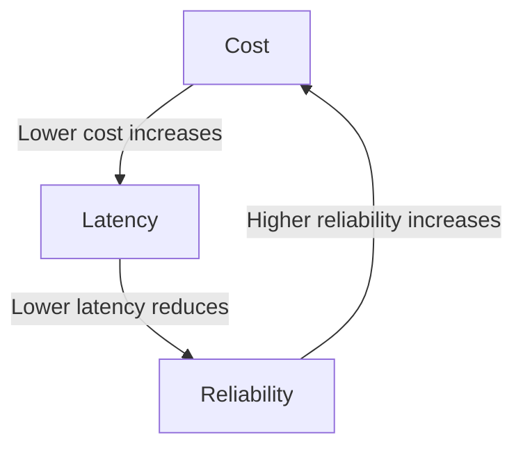
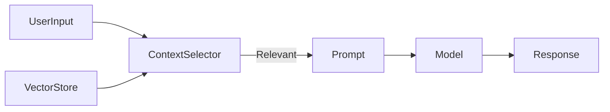
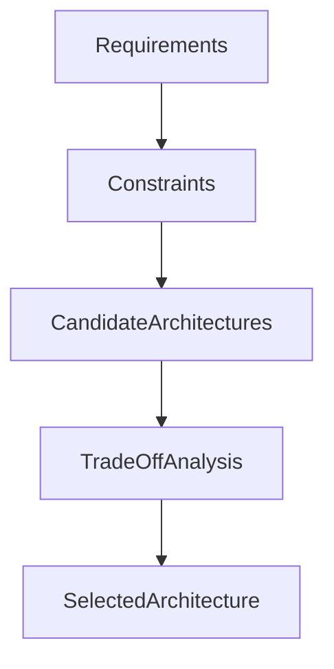

# Agent Architectures and Design Patterns: Design Trade-offs and Constraints

## Learning Objectives

- Identify key constraints in agent design
- Analyze cost and latency trade-offs
- Incorporate security into architecture decisions
- Evaluate UX implications of design choices
- Apply decision frameworks to architecture selection

---

## Introduction

This chapter focuses on practical constraints that influence agent architecture decisions.

---

---

Designing intelligent agents is not only about choosing the most powerful model or the most elegant architecture. In real-world systems, agent design is shaped—and often constrained—by practical realities such as cost, latency, reliability, infrastructure, security, and user experience expectations. Many promising agent prototypes fail to reach production not because the core idea is flawed, but because the architecture does not respect these constraints.

This chapter focuses on **practical constraints that influence agent architecture decisions**. Instead of treating agent architectures as abstract diagrams, we examine them as living systems deployed in production environments, used by real people, operating under financial, technical, organizational, and regulatory limits. You will learn how these constraints arise, why they matter, and how they directly shape architectural design patterns such as single-agent vs. multi-agent systems, tool-augmented agents, retrieval-augmented generation (RAG), and orchestrated workflows.

By the end of this chapter, you should be able to reason clearly about *trade-offs*. Rather than asking “What is the best architecture?”, you will learn to ask the more useful question: **“What is the best architecture under these constraints?”**

---

By the end of this chapter, you will be able to:

- Identify key constraints that influence agent architecture decisions  
- Analyze cost, latency, and reliability trade-offs in agent systems  
- Understand how model limitations and context windows shape design patterns  
- Incorporate security and compliance requirements into architecture choices  
- Evaluate how architectural decisions affect user experience  
- Apply structured decision frameworks to select appropriate agent architectures  

---

## Cost, Latency, and Reliability Constraints

Designing agent architectures always involves balancing **cost**, **latency**, and **reliability**. These three forces are deeply interconnected, and improving one often worsens another. Understanding this triangle is foundational for making responsible architectural decisions.

### Understanding Cost in Agent Architectures

Cost in agent systems is not limited to model inference pricing. Historically, early AI systems ran on fixed infrastructure, where costs were mostly upfront and predictable. Modern agent systems, however, are often built on usage-based APIs, cloud infrastructure, and dynamic orchestration layers. This shifts cost from a fixed expense to a variable, sometimes unpredictable one.

Agent-related costs typically include:

- **Model inference costs** (per token, per request, per second)
- **Tool invocation costs** (search APIs, databases, third-party services)
- **Infrastructure costs** (servers, GPUs, queues, observability tools)
- **Engineering and maintenance costs** (monitoring, debugging, updates)

A seemingly small architectural decision—such as allowing an agent to reason step-by-step with verbose internal chains—can multiply token usage dramatically. Similarly, multi-agent systems often improve reasoning quality but may increase cost by duplicating context and coordination messages.

### Latency as a User-Visible Constraint

Latency is the time between a user’s request and the agent’s response. In conversational agents, latency is experienced emotionally: users perceive delays longer than 1–2 seconds as “slow,” even if the result is high quality. Historically, batch-based AI systems could tolerate long processing times, but interactive agents cannot.

Latency comes from multiple sources:

- Model inference time (larger models are slower)
- Network round trips (especially with multiple tools)
- Sequential agent steps (planner → executor → verifier)
- Cold starts in serverless deployments

Architectures that rely on **serial reasoning chains** or **synchronous tool calls** often struggle with latency. To mitigate this, designers use techniques such as parallel tool execution, caching, speculative responses, or smaller “fast” models for intermediate steps.

### Reliability and System Trust

Reliability refers to how consistently an agent system behaves as expected. This includes uptime, correctness, and predictability. An unreliable agent erodes user trust faster than a less capable but consistent one.

Reliability challenges include:

- Model non-determinism and hallucinations
- External tool failures
- Partial system outages
- Cascading failures in multi-agent systems

Architectures with many interdependent components can fail in subtle ways. For example, a planner agent might succeed, but a downstream execution agent might fail silently. Robust architectures often include fallback strategies, retries, circuit breakers, and confidence estimation.

### The Cost–Latency–Reliability Trade-off Table

| Constraint Priority | Typical Architectural Choice | Benefits | Drawbacks |
|---------------------|------------------------------|----------|-----------|
| Low Cost | Smaller models, fewer agents | Affordable, scalable | Lower reasoning depth |
| Low Latency | Single-agent, cached responses | Fast UX | Less flexibility |
| High Reliability | Redundant agents, validation layers | Trustworthy | Higher cost and latency |

### Visualizing the Trade-off Triangle

This triangle illustrates why optimizing all three simultaneously is rarely possible. Instead, architects must decide which dimension is most critical for their use case.

---

## Model Limitations and Context Windows

Agent architectures are deeply influenced by the **capabilities and limitations of the underlying models**. One of the most impactful limitations is the **context window**, which defines how much information a model can consider at once.

### Historical Context of Model Limitations

Early language models had extremely limited memory, forcing developers to summarize or truncate inputs aggressively. As context windows expanded, new patterns emerged—such as long-running conversations and document-level reasoning. However, even modern models face constraints: context windows are finite, expensive, and not always reliable for long-term memory.

Understanding these limitations is crucial because agent architectures often exist to *work around* model weaknesses.

### Context Windows and Architectural Patterns

When context is limited, designers must choose what information to include and what to omit. This leads to architectural patterns such as:

- **Retrieval-Augmented Generation (RAG)**: Fetch only relevant documents
- **Memory summarization**: Compress long histories into short summaries
- **Tool-based memory**: Store state externally (databases, vector stores)

Each pattern introduces trade-offs. RAG improves factual grounding but adds latency and complexity. Summarization reduces cost but risks losing nuance.

### Reasoning Depth vs. Context Consumption

Agent reasoning styles also affect context usage. Step-by-step reasoning, planning, and self-reflection consume tokens rapidly. Multi-agent debates or critiques multiply this effect.

Designers must decide:

- Should reasoning be explicit or implicit?
- Should intermediate thoughts be stored or discarded?
- Should multiple models share context or operate independently?

### Model Capability Comparison Table

| Model Capability | Architectural Implication | Risk |
|-----------------|---------------------------|------|
| Small context window | External memory, RAG | Complexity |
| Large context window | Simpler architecture | High cost |
| Weak reasoning | Multi-agent collaboration | Latency |

### Context Management Flow

This diagram shows how architecture compensates for limited context by selectively injecting information.

---

## Infrastructure and Deployment Constraints

Agent architectures do not exist in isolation—they run on real infrastructure with real limits. Deployment environments strongly influence what designs are feasible.

### Infrastructure as an Architectural Constraint

Infrastructure constraints include compute availability, scaling limits, geographic distribution, and operational maturity. A startup deploying on serverless platforms faces very different constraints than an enterprise with dedicated GPU clusters.

Common infrastructure factors include:

- Autoscaling behavior
- Cold start latency
- Network reliability
- Observability and logging

An architecture that works well in a research environment may fail under production load.

### Deployment Models and Their Trade-offs

Different deployment models impose different constraints:

| Deployment Model | Strengths | Limitations |
|------------------|-----------|-------------|
| Serverless | Scales easily | Cold starts |
| Dedicated servers | Predictable performance | High cost |
| Edge deployment | Low latency | Limited compute |

### Orchestration and Failure Domains

As agent systems grow, orchestration becomes complex. Multi-agent systems may span multiple services, each with its own failure modes. Designing clear boundaries and failure domains is critical.

This architecture highlights how failures in one component should not collapse the entire system.

---

## Security and Compliance Considerations

Security is not an add-on—it is a foundational architectural constraint. Agent systems often handle sensitive data, make decisions, and trigger actions, which raises serious security and compliance concerns.

### Why Security Shapes Architecture

Historically, AI systems were passive: they analyzed data but did not act. Agents, however, can execute commands, access systems, and automate workflows. This increases the attack surface dramatically.

Security concerns include:

- Prompt injection attacks
- Unauthorized tool access
- Data leakage through logs or prompts
- Regulatory compliance (GDPR, HIPAA)

### Architectural Patterns for Secure Agents

Security-aware architectures often include:

- Strict tool permissioning
- Input and output validation layers
- Sandboxed execution environments
- Audit logs and traceability

### Security vs. Usability Trade-offs

Adding security layers can increase latency and reduce flexibility. For example, requiring human approval for certain actions improves safety but harms user experience.

| Security Measure | Benefit | Trade-off |
|------------------|---------|-----------|
| Tool sandboxing | Prevents misuse | Limits capability |
| Approval gates | Reduces risk | Slower workflows |

---

## User Experience Trade-offs

User experience (UX) is often where architectural decisions become visible. Users do not see agents, tools, or context windows—they see responsiveness, clarity, and trustworthiness.

### UX as a Constraint, Not a Feature

Good UX is not just about polish; it constrains architecture. For example, users expect conversational continuity, which requires memory. They expect fast responses, which limits reasoning depth.

### Transparency vs. Simplicity

Should users see the agent’s reasoning? Transparency builds trust but can overwhelm users or expose errors. Some systems provide explanations only on demand.

### UX-Driven Architectural Decisions

- Streaming responses to reduce perceived latency
- Progressive disclosure of complex outputs
- Confidence indicators and uncertainty messaging

---

## Architecture Decision Frameworks

Given so many constraints, how do architects make decisions systematically?

### Why Frameworks Matter

Without a framework, architecture decisions become ad hoc and reactive. Decision frameworks provide structure, making trade-offs explicit and defensible.

### A Practical Decision Flow

### Common Framework Dimensions

- Business priorities (cost, speed, quality)
- Technical constraints (models, infrastructure)
- Risk tolerance (security, reliability)
- User expectations (UX, transparency)

### Architecture Fit Table

| Use Case | Recommended Pattern | Rationale |
|--------|---------------------|-----------|
| Customer support | RAG + single agent | Cost-effective |
| Complex analysis | Multi-agent | Higher reasoning |
| Automation | Tool-driven agent | Reliability |

---

## Case Study: Designing a Customer Support Agent Under Real Constraints

### Context

In 2023, a mid-sized SaaS company providing accounting software decided to replace its rule-based chatbot with an AI-powered support agent. The company served over 50,000 small businesses across multiple regions, with strict uptime and compliance requirements. Customer support was a major cost center, and leadership hoped that an intelligent agent could reduce ticket volume while improving response quality.

The initial vision was ambitious: a conversational agent that could understand nuanced accounting questions, retrieve relevant documentation, access user-specific data, and even initiate certain workflows such as invoice corrections. The engineering team was excited, but the operational reality quickly set in.

### Problem

The first prototypes used a large language model with full conversation history and unrestricted tool access. While impressive in demos, the system was expensive and slow. Average response times exceeded 8 seconds, and inference costs were far above budget. Worse, internal testing revealed that the agent sometimes hallucinated confident but incorrect answers about tax regulations.

Security teams raised concerns about exposing customer financial data to prompts, and compliance officers worried about auditability. The UX team also observed that users became frustrated when the agent paused mid-conversation or asked too many clarifying questions.

### Solution

The team stepped back and applied a constraint-driven architecture approach. First, they identified non-negotiables: compliance, predictable cost, and sub-2-second response times for common queries. They abandoned the idea of a fully autonomous agent and instead designed a **retrieval-augmented single-agent system**.

Key steps included:

- Introducing a RAG layer with curated documentation
- Using a smaller, faster model for most queries
- Restricting tool access to read-only operations
- Adding confidence scoring and escalation to humans

The architecture was simplified, and responsibilities were clearly separated.

### Results

After deployment, average response times dropped to 1.6 seconds. Support ticket volume decreased by 32%, and customer satisfaction scores improved. Costs were predictable and within budget. While the agent could not handle every complex case, it reliably solved common issues.

### Lessons Learned

The team learned that **constraint-aware design beats maximal capability**. By respecting cost, latency, security, and UX constraints, they built a system that delivered real business value. They also realized that agent architectures should evolve incrementally, not all at once.

---

## Summary

Agent architecture design is fundamentally about trade-offs. Cost, latency, reliability, model limitations, infrastructure, security, and user experience all impose constraints that shape what is possible and desirable. There is no universally “best” architecture—only architectures that are well-matched to their context.

By understanding these constraints deeply and applying structured decision frameworks, architects can design agent systems that are not only intelligent, but also practical, trustworthy, and sustainable.

---

## Reflection Questions

1. Which constraint do you think is most often underestimated in agent design, and why?  
2. How would your architectural choices change if latency were more important than accuracy?  
3. What security risks are unique to agent systems compared to traditional software?  
4. How can UX considerations simplify—or complicate—agent architectures?  
5. How would you apply a decision framework to choose between a single-agent and multi-agent system?