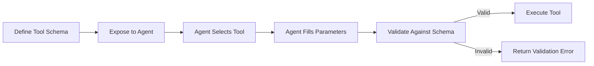
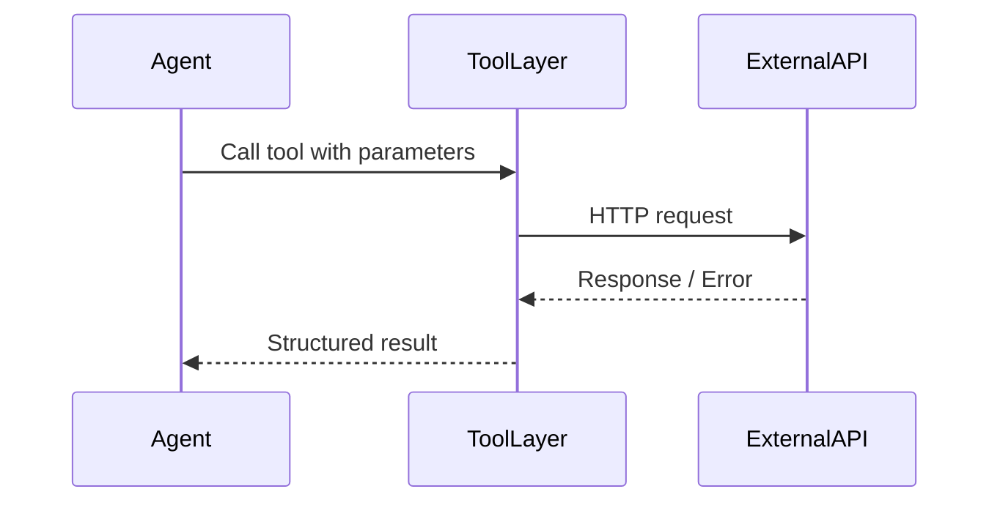
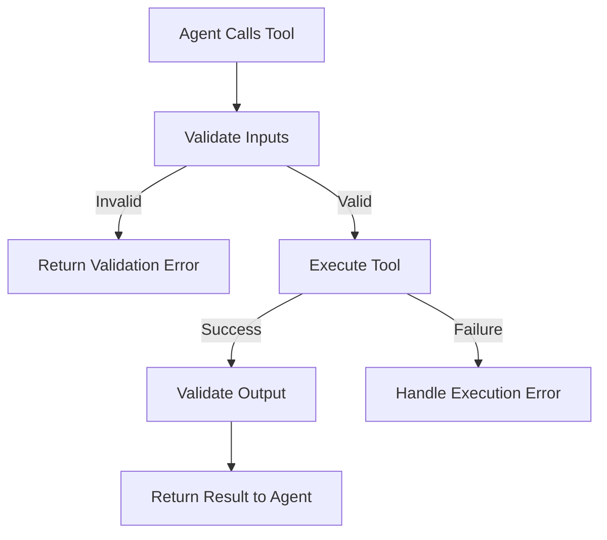
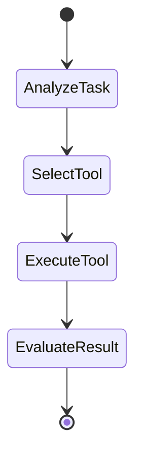
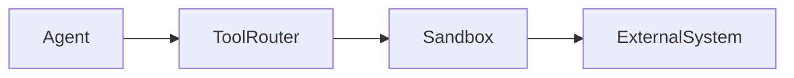

# Building Agents with Modern Frameworks: Tool Calling and Function Execution

## Learning Objectives

- Implement tool calling in agent frameworks
- Design robust function schemas
- Handle tool execution errors
- Secure agent-tool interactions
- Test and validate tool behavior

---

## Introduction

This chapter focuses on implementing tool use within agent frameworks.

---

---

As modern AI agents evolve from passive text generators into **active problem solvers**, one capability has become absolutely central: **the ability to use tools**. Tool calling—sometimes referred to as *function calling*—allows an agent to go beyond language and interact with the real world: querying databases, calling APIs, running calculations, triggering workflows, or even controlling external systems.

In early conversational systems, language models were isolated. They could *describe* how to do something, but they could not *do* it. Modern agent frameworks change this by introducing a structured bridge between reasoning and execution. The agent decides *what* needs to be done, selects the appropriate tool, provides structured inputs, executes the tool, and then incorporates the results back into its reasoning loop.

This chapter focuses specifically on **implementing tool use within agent frameworks**, with a strong emphasis on practical design decisions, safety, reliability, and testing. Rather than treating tool calling as a magic feature, we will break it down into understandable, testable, and secure components that you can confidently apply in real-world systems.

---

By the end of this chapter, you will be able to:

- Implement tool calling in modern agent frameworks
- Design clear, robust tool schemas and function signatures
- Integrate external APIs into agent workflows
- Handle validation, errors, and unexpected tool behavior gracefully
- Apply secure sandboxing techniques to protect systems
- Design effective tool selection strategies
- Test and validate tool interactions thoroughly

---

## Tool Schemas and Function Signatures

Tool schemas and function signatures form the **contract** between an agent and the tools it can use. Without a clear contract, agents become unreliable, unpredictable, and unsafe. At a conceptual level, a tool schema answers three fundamental questions: *What does this tool do? What inputs does it expect? What outputs does it produce?*

Historically, early agent experiments relied on unstructured prompts like “You can call the weather API with these parameters.” This approach quickly broke down. Language models might invent parameters, misuse types, or call tools incorrectly. Tool schemas emerged as a response to this fragility, borrowing ideas from API design, type systems, and formal interfaces used in software engineering.

A **tool schema** typically includes:
- A name and description of the tool
- A structured definition of inputs (parameters, types, constraints)
- A structured definition of outputs
- Optional metadata such as authentication requirements or rate limits

From a practical perspective, schemas reduce ambiguity. When an agent reasons about using a tool, it is guided by a machine-readable definition rather than vague natural language.

### Anatomy of a Function Signature

A function signature is the executable counterpart of the schema. While the schema is declarative, the signature is operational. It defines:
- Parameter names and types
- Required vs optional arguments
- Default values
- Error conditions

Consider this analogy: a restaurant menu (schema) tells you what dishes exist and what ingredients they contain, while the recipe (function signature) defines exact measurements and steps. Both are necessary for consistent outcomes.

Below is a simplified comparison of weak vs strong tool definitions:

| Aspect | Weak Definition | Strong Schema-Based Definition |
|------|----------------|--------------------------------|
| Input structure | Free-text description | Typed parameters (JSON schema) |
| Error handling | Implicit or undefined | Explicit error cases |
| Validation | Manual or absent | Automatic schema validation |
| Agent reliability | Low | High |
| Debuggability | Difficult | Straightforward |

### Why Schemas Matter for Agent Reasoning

Agents do not just execute tools—they *reason* about them. A well-designed schema enables:
- Accurate tool selection
- Correct parameter filling
- Predictable execution
- Easier testing and monitoring

Without schemas, agents often hallucinate parameters or misuse tools, leading to cascading failures. With schemas, errors are caught early and systematically.

### Mermaid Diagram: Tool Schema Lifecycle

### Common Mistakes and Best Practices

**Common mistakes include:**
- Overloading a single tool with too many responsibilities
- Using vague parameter names
- Allowing loosely typed inputs (e.g., “string” for everything)

**Best practices:**
- Keep tools small and focused
- Use explicit, typed schemas
- Treat schemas as versioned contracts
- Document tools for both humans and agents

---

## Integrating External APIs

Integrating external APIs is where agent systems truly become powerful. APIs allow agents to retrieve live data, trigger real-world actions, and participate in existing digital ecosystems. However, API integration introduces complexity: latency, failures, authentication, and inconsistent responses.

From a historical standpoint, API integration was traditionally handled by deterministic code. Agents change this by making *decisions* about when and how to call APIs dynamically. This flexibility is powerful but also risky if not carefully designed.

### The API Integration Pipeline

At a high level, API integration in agent frameworks follows a consistent pipeline:
1. The agent identifies a need for external data or action
2. It selects the appropriate API tool
3. It constructs a valid request
4. The system executes the API call
5. The response is normalized
6. The agent incorporates the result into reasoning

This pipeline must be resilient to partial failures at every step.

### Mermaid Diagram: API Interaction Sequence

### Handling Authentication and Configuration

APIs often require authentication tokens, API keys, or OAuth flows. A critical design principle is **never exposing secrets to the agent itself**. Instead:
- Secrets are stored securely in the execution layer
- The agent only references the tool abstractly
- The tool implementation injects credentials at runtime

This separation keeps agents safe even if prompts or logs are exposed.

### Case Study: Integrating a Logistics API for a Supply Chain Agent

## Case Study: Automating Inventory Decisions with API Tools

### Context

In 2023, a mid-sized retail company operated across multiple warehouses in Europe. Inventory planning was handled by human analysts who manually checked stock levels, supplier lead times, and sales forecasts. The company wanted an AI agent that could assist planners by querying real-time inventory data and supplier APIs.

The environment was complex: multiple APIs, inconsistent response formats, and frequent downtime during peak hours. Traditional automation scripts failed whenever APIs returned unexpected responses.

### Problem

The main challenge was reliability. Analysts needed answers they could trust. Early agent prototypes often failed silently or hallucinated results when APIs timed out. The lack of structured API integration made debugging extremely difficult.

Additionally, security concerns arose: API keys were accidentally exposed during prompt debugging sessions, raising alarms with the security team.

### Solution

The team designed each API integration as a dedicated tool with a strict schema. Inventory queries, supplier availability checks, and delivery estimates were separated into individual tools.

A normalization layer converted all API responses into a consistent internal format before passing results to the agent. Authentication was handled entirely outside the agent’s context.

Extensive retry logic and timeout handling were added, ensuring the agent received explicit error messages rather than incomplete data.

### Results

Within three months, planners reported a 40% reduction in manual lookup time. Errors decreased significantly because the agent either returned verified data or clearly stated when data was unavailable.

Security audits showed no further leakage of credentials. The agent became a trusted assistant rather than an experimental novelty.

### Lessons Learned

The team learned that API integration is less about connectivity and more about **discipline**. Clear boundaries, strict schemas, and defensive design made the difference between an unreliable demo and a production-ready system.

---

## Validation and Error Handling

Validation and error handling are the **safety nets** of agent-tool interactions. No matter how well-designed your schemas are, real-world data is messy, APIs fail, and agents make imperfect decisions.

Validation occurs at multiple layers:
- Input validation (before execution)
- Execution-time validation
- Output validation (after execution)

Each layer serves a different purpose and catches different classes of errors.

### Why Validation Is Non-Negotiable

Without validation, agents may:
- Send malformed requests
- Execute unsafe operations
- Misinterpret partial responses

Validation protects not just systems, but also user trust. An agent that admits uncertainty is far more valuable than one that confidently returns wrong answers.

### Types of Errors and Responses

| Error Type | Example | Recommended Handling |
|----------|--------|----------------------|
| Validation error | Missing required parameter | Return structured error to agent |
| Execution error | API timeout | Retry or escalate |
| Semantic error | Unexpected response format | Normalize or flag |
| Security error | Unauthorized access | Block and alert |

### Mermaid Diagram: Error Handling Flow

### Designing Agent-Friendly Errors

Errors should be:
- Structured (machine-readable)
- Descriptive but not verbose
- Actionable (suggest next steps)

For example, instead of “API failed,” return:
> “SupplierAvailabilityAPI timeout after 5s. Retry recommended or use cached data.”

---

## Tool Selection Strategies

Tool selection is the cognitive heart of an agent. When multiple tools are available, the agent must decide *which* one to use, *when*, and *why*. Poor tool selection leads to inefficiency, cost overruns, and incorrect outcomes.

### Explicit vs Implicit Selection

There are two dominant strategies:
- **Explicit selection**: The agent reasons step-by-step and chooses a tool deliberately
- **Implicit selection**: The framework automatically selects based on embeddings or heuristics

| Strategy | Advantages | Limitations |
|--------|-----------|-------------|
| Explicit | Transparent, debuggable | Slower |
| Implicit | Fast, scalable | Harder to explain |

### Mermaid Diagram: Tool Selection Decision Flow

### Heuristics and Constraints

Effective tool selection often combines:
- Tool descriptions
- Cost considerations
- Latency expectations
- Confidence thresholds

For example, an agent might prefer cached data over live APIs unless freshness is critical.

---

## Security and Sandboxing

Security is often underestimated in agent design. Tools give agents power, and power must be constrained. Sandboxing ensures that even if an agent behaves unexpectedly, the damage is limited.

### Principles of Secure Tool Execution

- Least privilege: tools only access what they need
- Isolation: execution environments are separated
- Auditing: every call is logged

### Mermaid Diagram: Sandboxed Execution Architecture

### Common Security Risks

- Prompt injection leading to unsafe tool use
- Credential leakage
- Unauthorized resource access

Mitigations include strict allowlists, runtime monitoring, and human-in-the-loop approvals for high-risk actions.

---

## Testing Tool Interactions

Testing agent-tool interactions is fundamentally different from testing traditional code. You are testing not only execution, but *decision-making*.

### Types of Tests

- Unit tests for tool logic
- Schema validation tests
- Simulation tests with mocked APIs
- End-to-end agent scenarios

| Test Type | Purpose |
|---------|---------|
| Unit | Verify tool behavior |
| Integration | Verify API interactions |
| Simulation | Test agent reasoning |
| Regression | Prevent behavior drift |

### Best Practices

- Mock external APIs
- Test edge cases aggressively
- Log tool usage patterns
- Re-run tests after model updates

---

## Summary

Tool calling transforms agents from conversational entities into actionable systems. By designing strong schemas, integrating APIs responsibly, validating every interaction, securing execution environments, and testing thoroughly, you create agents that are not only powerful but trustworthy.

This chapter emphasized that tool use is not a single feature—it is an ecosystem of design decisions that must work together harmoniously.

---

## Reflection Questions

1. How does a well-designed tool schema change an agent’s reasoning quality?
2. What risks arise when API authentication is exposed to agents?
3. How would you design a fallback strategy when all tools fail?
4. Which tool selection strategy best fits safety-critical systems, and why?
5. How might testing strategies evolve as agents become more autonomous?

---