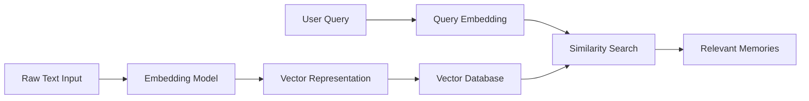
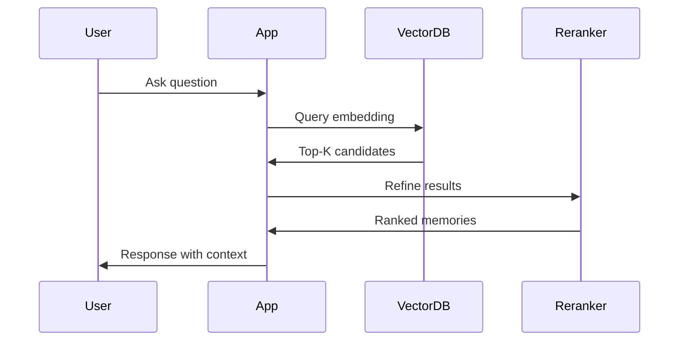
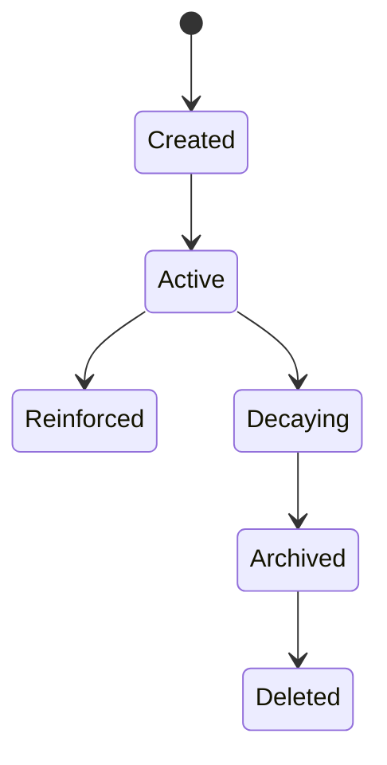
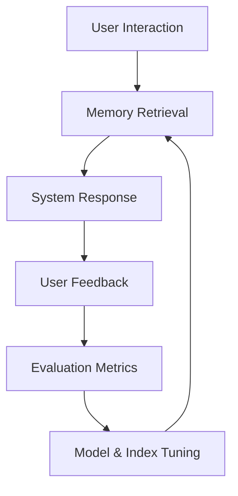

# Planning, Memory, and Decision-Making: Vector Databases and Long-Term Memory

## Learning Objectives

- Explain how vector databases store memory
- Implement semantic retrieval concepts
- Design scalable memory architectures
- Manage memory decay strategies
- Evaluate memory retrieval quality

---

## Introduction

This chapter covers persistent memory using vector databases.

---

---

Modern intelligent systems—such as AI assistants, recommendation engines, autonomous agents, and decision-support tools—are no longer expected to operate only in the moment. They are increasingly required to **remember past interactions**, **learn from experience**, and **use prior knowledge to plan and make better decisions over time**. This need for persistent, long-term memory is one of the most important shifts in the design of AI-driven systems.

Traditional software memory models, such as relational databases or key–value stores, are excellent at storing exact facts: names, numbers, timestamps, and structured records. However, human-like memory is not based on exact matches alone. When humans remember, they recall information **by meaning**, **by association**, and **by relevance to the current context**. You might not remember the exact sentence someone said last week, but you remember what they *meant*. This is where **vector databases and embeddings** come into play.

Vector databases enable systems to store information as numerical representations of meaning—called **embeddings**—and retrieve memories based on **semantic similarity** rather than exact matches. This approach is foundational for long-term memory in AI systems, especially those powered by large language models (LLMs). It allows systems to plan using past experiences, adapt behavior over time, and make decisions that feel coherent and context-aware.

In this chapter, we will explore how vector databases support planning, memory, and decision-making. We will move progressively from core concepts like embeddings, through architectural and scaling concerns, to advanced topics such as memory decay and evaluation. By the end, you will understand not only *what* vector-based memory systems are, but *why* they work, *how* to design them, and *how* to evaluate their effectiveness in real-world applications.

---

By the end of this chapter, you will be able to:

- Explain how vector databases store and represent long-term memory
- Understand embeddings and semantic similarity at a deep, conceptual level
- Implement and reason about semantic retrieval strategies
- Design scalable and maintainable memory architectures
- Apply memory freshness and decay strategies appropriately
- Evaluate the quality and relevance of retrieved memories

---

## Embeddings and Semantic Similarity

Embeddings are the foundation of vector-based memory systems. At a high level, an embedding is a numerical representation of data—such as text, images, or audio—that captures its **semantic meaning**. Instead of storing information as raw text or symbols, embeddings translate meaning into points in a high-dimensional mathematical space. In this space, items with similar meanings are located close to each other.

Historically, embeddings emerged from the field of distributional semantics in linguistics, which is often summarized by the phrase: *“You shall know a word by the company it keeps.”* Early techniques like Word2Vec and GloVe represented words as vectors based on surrounding words in large corpora. Over time, these ideas evolved into sentence, paragraph, and multimodal embeddings, powered by deep neural networks and transformers. Today, embeddings are central to modern AI systems, especially those involving natural language understanding.

Why are embeddings so important for memory? Because memory retrieval in intelligent systems is rarely about exact matches. Consider a user who asks, “Can you remind me what we decided about pricing last month?” The system may not have a memory explicitly labeled “pricing decision,” but it may have stored notes from meetings, emails, or chats discussing “subscription costs” or “service tiers.” Embeddings allow the system to retrieve these memories based on *meaning*, not keywords.

### How Semantic Similarity Works

Semantic similarity is typically measured using distance or similarity metrics between vectors. The most common approach is **cosine similarity**, which measures the angle between two vectors rather than their absolute distance. This is important because the magnitude of a vector is often less meaningful than its direction in semantic space.

The process generally works as follows:

1. **Encoding**: Raw data (e.g., a paragraph of text) is passed through an embedding model, producing a vector.
2. **Storage**: The vector is stored in a vector database, often alongside metadata such as timestamps or source identifiers.
3. **Querying**: A new input (e.g., a user question) is embedded using the same model.
4. **Comparison**: The query vector is compared to stored vectors using a similarity metric.
5. **Retrieval**: The most similar vectors are returned as relevant memories.

An analogy can help here. Imagine a library where books are not organized alphabetically, but by topic similarity in a multi-dimensional space. Books about “machine learning,” “neural networks,” and “AI ethics” are placed close together, even if their titles differ greatly. When you enter the library with a vague idea, you walk toward the “area” that feels relevant rather than searching for an exact title.

### Examples of Embeddings in Practice

Consider three short sentences:

- “I forgot my password and need help logging in.”
- “I can’t access my account because I lost my credentials.”
- “What is the capital of France?”

The first two sentences will have embeddings that are close together because they express the same underlying intent. The third will be far away in vector space. This allows systems like customer support bots to retrieve relevant help articles even when users phrase problems differently.

Another example comes from recommendation systems. A streaming platform may embed movie descriptions and user preferences into the same vector space. When a user watches several “slow-paced psychological thrillers,” the system can recommend similar content—even if genres or keywords differ.

### Advantages and Limitations

**Advantages of embeddings include:**

- Robustness to wording differences and paraphrasing  
- Ability to unify multiple data types (text, images, audio)  
- Natural support for fuzzy, human-like recall  

**Limitations include:**

- Dependence on embedding quality and training data  
- Difficulty interpreting high-dimensional vectors directly  
- Potential bias encoded in embeddings  

Understanding these trade-offs is essential before building memory systems on top of embeddings.

### Table: Keyword Search vs Semantic Embedding Search

| Aspect | Keyword Search | Embedding-Based Search |
|------|---------------|------------------------|
| Matching | Exact or partial text | Meaning-based similarity |
| Flexibility | Low | High |
| Handling paraphrases | Poor | Excellent |
| Computational cost | Low | Higher |
| Suitability for memory | Limited | Strong |

### Mermaid Diagram: Semantic Embedding Flow

---

## Vector Database Architectures

Vector databases are specialized systems designed to store, index, and retrieve high-dimensional vectors efficiently. Unlike traditional databases, which are optimized for exact matches and structured queries, vector databases focus on **approximate nearest neighbor (ANN)** search—finding vectors that are “close enough” to a query vector.

The rise of vector databases is closely tied to the practical adoption of embeddings. As embedding models became larger and more capable, organizations needed new infrastructure to store millions or even billions of vectors while maintaining fast retrieval times. This led to the emergence of dedicated vector database systems such as FAISS, Milvus, Pinecone, and Weaviate.

### Core Components of a Vector Database

At a conceptual level, most vector databases share several architectural components:

- **Vector Storage Layer**: Stores the raw vectors, often in memory or optimized disk formats.
- **Indexing Layer**: Builds data structures that accelerate similarity search.
- **Query Engine**: Handles incoming queries, computes similarity, and returns results.
- **Metadata Store**: Stores auxiliary information such as timestamps, tags, or access control data.

These components work together to balance speed, accuracy, and scalability.

### Centralized vs Distributed Architectures

Early vector databases were often centralized, running on a single machine. While simple to manage, this approach does not scale well. Modern systems increasingly use **distributed architectures**, where vectors are sharded across multiple nodes. This allows horizontal scaling but introduces challenges such as network latency, consistency, and fault tolerance.

In distributed setups, designers must decide:

- How to partition vectors across nodes  
- Whether to replicate data for reliability  
- How to aggregate search results efficiently  

These decisions have direct implications for memory reliability and retrieval latency.

### Case Study: Building Long-Term Memory for an AI Assistant

## Case Study: Persistent Memory for a Customer Support AI

### Context

In 2023, a mid-sized SaaS company set out to improve its AI-powered customer support assistant. The assistant already handled basic FAQs, but users complained that it “forgot” previous conversations. Customers had to repeat context, explain past issues again, and re-share preferences. This led to frustration and longer resolution times.

The company’s leadership recognized that the assistant needed long-term memory. Not just logs of past chats, but a way to **recall relevant past interactions based on meaning**. The goal was to create an assistant that could say, “Last time you contacted us, we discussed this issue,” even if the wording was different.

### Problem

The main challenge was scale and relevance. The system had millions of past conversation snippets. Storing them in a traditional database allowed retrieval by user ID or timestamp, but not by semantic relevance. Keyword search was brittle; users often phrased similar problems differently.

Another issue was performance. The assistant needed to respond in under two seconds. Searching through millions of records naively was not feasible. The team also had to consider privacy, ensuring that only authorized memories were retrieved for each user.

### Solution

The team adopted a vector database architecture. Each conversation turn was embedded using a sentence-level embedding model. These embeddings were stored in a distributed vector database, sharded by user ID to enforce access boundaries.

They implemented a hybrid retrieval approach:
- Semantic search using embeddings to find relevant past interactions
- Metadata filtering to restrict results to the same user and recent time windows

To ensure performance, they used approximate nearest neighbor indexing and cached frequently accessed memories.

### Results

After deployment, the assistant was able to reference past conversations accurately in over 70% of follow-up interactions. Average resolution time dropped by 25%, and customer satisfaction scores improved significantly.

However, the team also observed challenges. Some retrieved memories were technically similar but contextually outdated. This led to the next phase of work: memory freshness and decay strategies.

### Lessons Learned

The case demonstrated that vector databases are powerful enablers of long-term memory, but architecture choices matter deeply. Sharding by user improved privacy and performance, while hybrid retrieval balanced relevance and control. Most importantly, memory is not just about storage—it is about **useful recall**.

---

## Indexing and Retrieval Strategies

Efficient indexing and retrieval are the backbone of any vector-based memory system. Without proper strategies, even the best embeddings become impractical at scale. Indexing determines how vectors are organized internally, while retrieval strategies define how queries are executed and results are selected.

### Why Indexing Matters

A naïve approach to similarity search would compare a query vector to every stored vector. This brute-force method guarantees accuracy but becomes computationally infeasible as data grows. Indexing introduces data structures that allow the system to quickly narrow down candidate vectors.

Common indexing strategies include:

- **Flat indexes**: Simple but slow at scale
- **Tree-based indexes**: Partition space hierarchically
- **Graph-based indexes**: Navigate similarity graphs efficiently
- **Quantization-based indexes**: Compress vectors to reduce memory usage

Each approach involves trade-offs between speed, accuracy, and memory footprint.

### Retrieval Strategies Beyond “Top-K”

Retrieval is not just about returning the top-K most similar vectors. In memory systems, additional considerations often apply:

- **Filtering**: Restricting results by metadata (e.g., user ID, time range)
- **Re-ranking**: Applying secondary models to refine results
- **Hybrid search**: Combining keyword and semantic search
- **Contextual weighting**: Boosting recent or frequently used memories

These strategies ensure that retrieved memories are not only similar, but also **useful**.

### Table: Indexing Techniques Comparison

| Index Type | Speed | Accuracy | Memory Use | Typical Use Case |
|-----------|-------|----------|------------|------------------|
| Flat | Slow | High | High | Small datasets |
| HNSW (Graph) | Fast | High | Medium | Large-scale semantic search |
| IVF | Medium | Medium | Low | Very large datasets |
| PQ | Fast | Lower | Very Low | Memory-constrained systems |

### Mermaid Diagram: Retrieval Pipeline

---

## Memory Freshness and Decay

Human memory is not static. Over time, memories fade, are reinforced, or are reinterpreted in light of new experiences. Effective long-term memory systems for AI must mirror this dynamic nature. Memory freshness and decay strategies determine **what is remembered**, **what is forgotten**, and **how importance changes over time**.

### Why Memory Decay Is Necessary

Without decay, memory systems grow endlessly. This leads to:

- Increased storage costs  
- Slower retrieval times  
- Retrieval of outdated or irrelevant information  

More importantly, stale memories can actively harm decision-making. An AI assistant that insists on a user’s preference from years ago may appear unhelpful or even incorrect.

### Common Decay Strategies

Memory decay can be implemented in several ways:

- **Time-based decay**: Gradually reducing relevance scores as memories age
- **Usage-based decay**: Reinforcing memories that are frequently accessed
- **Event-based decay**: Invalidating memories after significant changes
- **Manual pruning**: Explicit deletion based on rules or audits

Often, systems combine multiple strategies for robustness.

### Mermaid Diagram: Memory Lifecycle

---

## Scaling Memory Systems

As applications grow, memory systems must scale gracefully. Scaling is not just about handling more data, but also about maintaining performance, reliability, and cost efficiency.

### Dimensions of Scaling

Scaling vector-based memory systems involves multiple dimensions:

- **Data volume**: Number of stored vectors
- **Query throughput**: Number of simultaneous searches
- **Latency requirements**: Real-time vs batch retrieval
- **Geographic distribution**: Serving users globally

Each dimension introduces trade-offs and design decisions.

### Architectural Strategies for Scale

Common scaling approaches include:

- Horizontal sharding of vectors  
- Replication for fault tolerance  
- Caching hot memories  
- Tiered storage (hot vs cold memory)  

Designers must also consider operational complexity and observability.

### Table: Scaling Challenges and Solutions

| Challenge | Impact | Typical Solution |
|---------|--------|------------------|
| High latency | Poor UX | ANN indexing, caching |
| Large memory footprint | High cost | Quantization, tiered storage |
| Fault tolerance | Downtime | Replication, redundancy |
| Global users | Inconsistent latency | Regional clusters |

---

## Evaluating Memory Relevance

Evaluation is often overlooked but is critical for long-term success. A memory system is only as good as the relevance of the memories it retrieves.

### What Does “Relevance” Mean?

Relevance is context-dependent. A memory may be semantically similar but contextually inappropriate. Evaluation must consider:

- Semantic similarity  
- Temporal relevance  
- User intent alignment  
- Actionability  

### Evaluation Methods

Common evaluation approaches include:

- **Offline benchmarks**: Labeled query–memory pairs
- **Online metrics**: Click-through rates, task success
- **Human evaluation**: Qualitative judgment
- **A/B testing**: Comparing retrieval strategies

### Mermaid Diagram: Evaluation Feedback Loop

---

## Summary

In this chapter, we explored how vector databases enable long-term memory for intelligent systems. We began with embeddings and semantic similarity, the conceptual foundation for meaning-based recall. We examined vector database architectures, indexing and retrieval strategies, and the importance of memory freshness and decay. We then discussed scaling considerations and concluded with methods for evaluating memory relevance.

Together, these concepts form a cohesive framework for designing systems that can remember, adapt, and make better decisions over time. Vector-based memory is not just a technical optimization—it is a fundamental shift toward more human-like intelligence in machines.

---

## Reflection Questions

1. How does semantic similarity differ from exact matching, and why is it critical for long-term memory?
2. What trade-offs would you consider when choosing an indexing strategy for a large memory system?
3. How might improper memory decay negatively affect user trust?
4. In what scenarios would hybrid retrieval outperform pure semantic search?
5. How would you design an evaluation strategy for a memory system used in healthcare or finance?