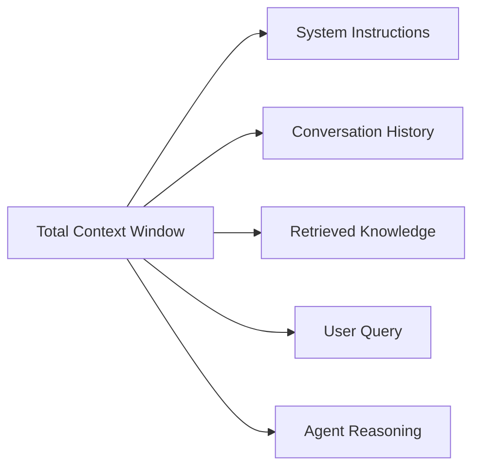
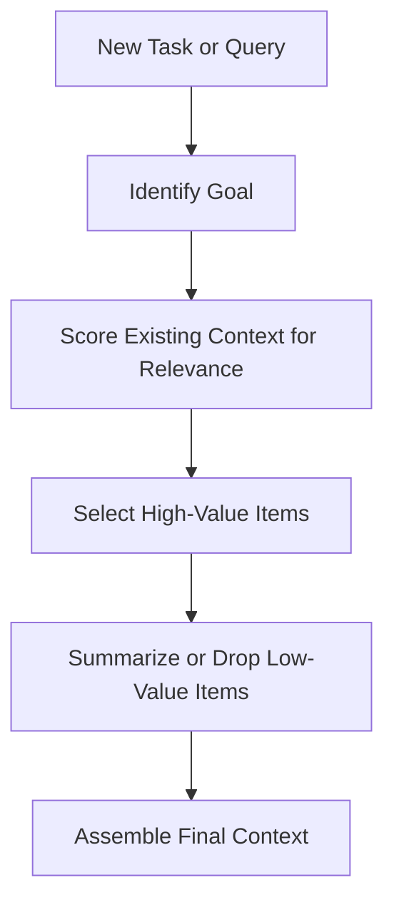
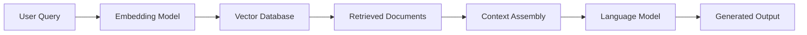
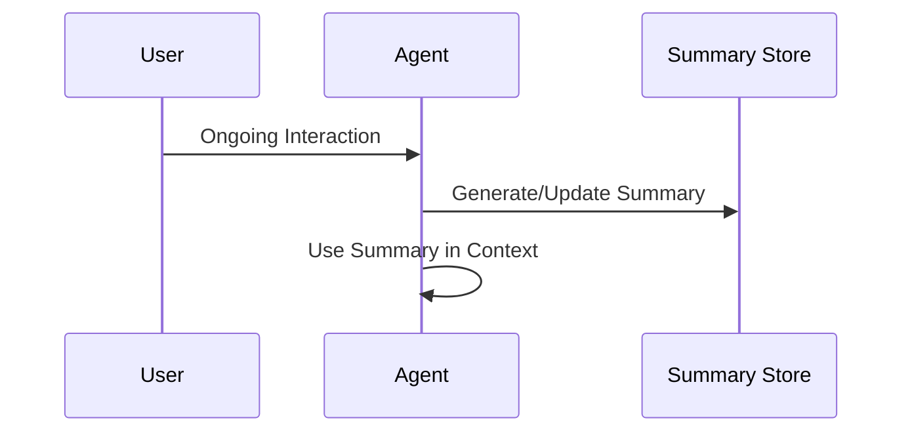
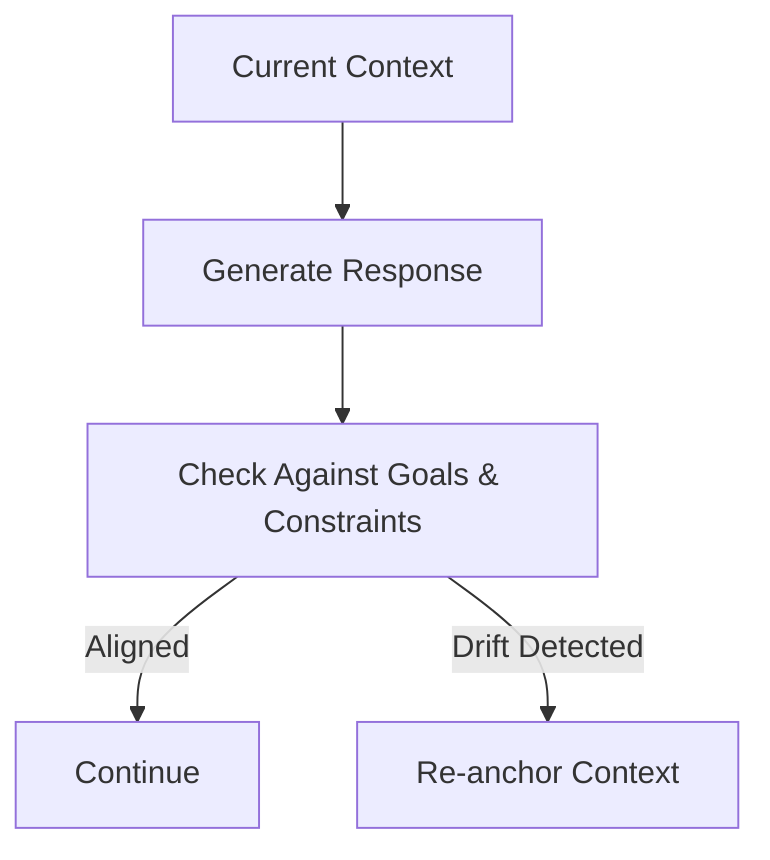
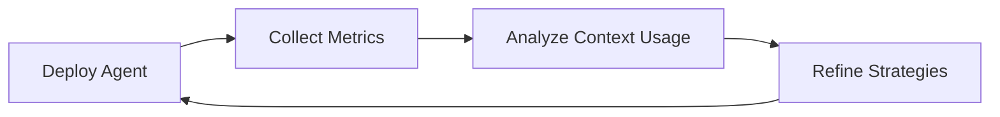

# Planning, Memory, and Decision-Making: Context Management and Retrieval

## Learning Objectives

- Manage limited context windows
- Apply retrieval-augmented techniques
- Design context compression strategies
- Prevent context drift
- Measure context relevance

---

## Introduction

This chapter explains how agents manage limited context windows effectively.

---

---

Modern intelligent agents—such as large language model (LLM)-based systems, conversational assistants, and autonomous decision-making systems—operate under a fundamental constraint: **they can only “see” a limited amount of information at one time**. This limitation is commonly known as the **context window constraint**. Despite having access to massive external knowledge bases, tools, or long histories of interaction, an agent must decide *what information to bring into focus right now* in order to reason, plan, and act effectively.

This challenge is not new. Humans face a similar limitation with working memory: we can only actively think about a handful of concepts at once. Over centuries, humans developed techniques such as note-taking, summarization, prioritization, and memory aids to compensate. In a parallel way, artificial agents rely on **context management strategies**—planning what to include, what to omit, what to retrieve on demand, and how to compress information without losing meaning.

This chapter explores **how agents manage limited context windows effectively**, focusing on planning, memory, and decision-making. You will learn why context is limited, how agents prioritize and retrieve relevant information, how summarization enables context compression, how to prevent gradual loss of focus (context drift), and how to measure whether context management strategies are actually working.

Rather than treating context as a passive container, this chapter frames it as an **active, carefully engineered resource**—one that directly determines the quality, reliability, and usefulness of an agent’s decisions.

---

By the end of this chapter, you will be able to:

- Understand and manage limited context windows in intelligent agents  
- Apply retrieval-augmented generation (RAG) techniques effectively  
- Design robust context compression and summarization strategies  
- Identify and prevent context drift in long-running interactions  
- Measure and evaluate context relevance and effectiveness  

---

## Context Window Constraints

Context windows define the maximum amount of information an agent can consider at once. In language-model-based agents, this typically means a fixed number of tokens that include system instructions, user input, conversation history, retrieved documents, and intermediate reasoning. While model sizes and context lengths have grown dramatically over time, **the window is always finite**, and scarcity forces trade-offs.

Historically, early language models had extremely small context windows, sometimes only a few hundred tokens. This made them brittle and forgetful, unable to maintain long conversations or complex reasoning chains. As context windows expanded into the thousands and now tens or hundreds of thousands of tokens, expectations grew accordingly. However, larger windows did not eliminate the problem; instead, they shifted it. The challenge became not *how to fit everything*, but *how to avoid overwhelming the model with irrelevant or low-value information*.

From a cognitive perspective, context windows resemble human working memory. Humans do not recall every detail of past experiences when making a decision; instead, we selectively recall what seems relevant. Similarly, agents must choose what to include in context based on current goals. Including too much information can be just as harmful as including too little, leading to confusion, slower inference, or incorrect reasoning.

Key implications of context window constraints include:

- **Opportunity cost**: Every token used for irrelevant history displaces potentially useful information.
- **Noise accumulation**: Long conversations often contain tangents, corrections, or outdated assumptions.
- **Computational cost**: Larger contexts increase latency and resource usage.
- **Reasoning degradation**: Models may struggle to identify salient facts in overly dense contexts.

A practical analogy is a **meeting agenda**. If every past discussion and document is read aloud in every meeting, participants lose focus and decision quality declines. Effective meetings summarize, prioritize, and distribute background materials selectively. Context windows demand the same discipline.

### Typical Components of a Context Window

| Component | Description | Risk if Overused |
|--------|-------------|------------------|
| System instructions | Rules and behavior constraints | Crowding out task-specific info |
| Conversation history | Prior turns between user and agent | Irrelevant or outdated assumptions |
| Retrieved documents | External knowledge or memory | Information overload |
| Intermediate reasoning | Chain-of-thought or plans | Excess verbosity |

### Visualizing Context Constraints

This diagram highlights that the context window is a **shared budget**, not an expandable container. Effective agents actively manage this budget rather than filling it passively.

---

## Context Prioritization Techniques

Context prioritization is the process of deciding **what information deserves a place in the limited context window at a given moment**. This is a planning problem as much as a memory problem. Without prioritization, agents default to chronological accumulation, which is almost always suboptimal.

The idea of prioritization emerged from early failures in long-running conversational systems. Developers noticed that simply appending conversation history led to degraded performance over time. Important constraints stated early were forgotten, while minor clarifications dominated the context. This led to the insight that **recency is not the same as relevance**.

At a conceptual level, prioritization answers three questions:

1. What is the agent trying to achieve right now?
2. What information directly supports that goal?
3. What information can be safely omitted or summarized?

Effective prioritization strategies often combine static rules with dynamic scoring. For example, system instructions may always be included, while conversation turns are filtered based on semantic relevance to the current task. Some systems use explicit metadata such as “importance scores” or “expiration times” attached to memories.

Common prioritization techniques include:

- **Goal-based filtering**: Include only information relevant to the current objective.
- **Recency-weighted relevance**: Favor recent information *only if* it remains relevant.
- **Importance tagging**: Mark critical facts (e.g., user preferences, constraints) as high-priority.
- **Hierarchical context**: Keep summaries of older interactions rather than raw transcripts.

### Example: Customer Support Agent

Imagine a customer support agent assisting a user over several days. Early in the conversation, the user states they are on a free plan. Later, the discussion focuses on troubleshooting an advanced feature available only on paid plans. If the agent fails to prioritize the original plan information, it may give incorrect advice.

A well-prioritized context would:

- Retain the user’s plan type as a high-priority fact.
- Summarize resolved troubleshooting steps.
- Exclude casual greetings and small talk.

### Context Prioritization Strategies Compared

| Strategy | Strengths | Weaknesses | Best Use Case |
|-------|-----------|------------|--------------|
| Chronological | Simple to implement | Accumulates noise | Short interactions |
| Relevance-based | High signal-to-noise | Requires scoring | Knowledge-intensive tasks |
| Importance-tagged | Preserves key facts | Manual or heuristic tagging | Long-term agents |
| Hierarchical summaries | Compact and scalable | Risk of over-compression | Long conversations |

### Prioritization Workflow

This workflow highlights that prioritization is not a one-time step but a **continuous process** that adapts as goals change.

---

## Retrieval-Augmented Generation

Retrieval-augmented generation (RAG) addresses context limitations by **decoupling knowledge storage from reasoning context**. Instead of forcing all relevant information into the context window permanently, agents retrieve only what is needed at the moment of generation.

The concept of RAG emerged as a response to two competing realities: models have powerful reasoning abilities, but they are expensive and limited in context; external databases are vast and cheap, but lack reasoning. RAG bridges this gap by combining retrieval systems (search, vector databases) with generative models.

At a high level, RAG works as follows:

1. The agent receives a query or task.
2. The query is transformed into a search representation (e.g., embeddings).
3. Relevant documents or memories are retrieved from external storage.
4. Retrieved content is inserted into the context window.
5. The model generates a response grounded in retrieved information.

This approach allows agents to scale knowledge without scaling context windows. However, it introduces new challenges, such as retrieval accuracy, redundancy, and trustworthiness of retrieved content.

### RAG Architecture Overview

### Why RAG Matters

RAG is particularly valuable when:

- Knowledge changes frequently (e.g., policies, documentation).
- The knowledge base is too large to fit into context.
- Accuracy and grounding are critical (e.g., legal or medical domains).

Without RAG, agents rely on parametric memory (what they were trained on), which may be outdated or incomplete. With RAG, agents gain **situational awareness**, pulling in fresh and relevant data on demand.

### Case Study: Enterprise Knowledge Assistant

## Case Study: Scaling Knowledge Access in a Global Consulting Firm

**Context**  
A global consulting firm with tens of thousands of employees maintained an internal knowledge base containing project reports, best practices, and industry analyses. Consultants frequently struggled to find relevant information quickly, especially under tight deadlines. Leadership decided to deploy an AI assistant to help consultants query this knowledge base conversationally.

**Problem**  
Initial prototypes attempted to load large chunks of documentation into the model’s context. This quickly failed. Context windows overflowed, responses became inconsistent, and the assistant often cited irrelevant projects. The sheer volume of information made naive approaches unusable.

**Solution**  
The team implemented a retrieval-augmented generation system. All documents were chunked and embedded into a vector database. When a consultant asked a question, the system retrieved the top relevant chunks and inserted them into the context. Careful prompt design ensured the model cited retrieved sources explicitly.

**Results**  
Consultants reported dramatically faster access to relevant information. Average research time dropped from hours to minutes. Importantly, response accuracy improved because answers were grounded in specific, retrieved documents rather than vague generalizations.

**Lessons Learned**  
The team learned that retrieval quality mattered as much as model quality. Poor chunking or embedding strategies led to irrelevant retrievals, undermining trust. RAG was not a silver bullet, but when carefully designed, it transformed how context limitations were handled.

---

## Summarization for Context Compression

Summarization is one of the most powerful tools for managing limited context windows. Instead of choosing between including or excluding information, summarization allows agents to **compress information while preserving meaning**. This mirrors human strategies such as taking meeting notes or writing executive summaries.

Historically, summarization has been studied as a natural language processing task in its own right. In the context of agents, however, summarization serves a strategic purpose: maintaining continuity over long interactions without overwhelming the context window.

There are multiple types of summarization used in context management:

- **Extractive summarization**: Selecting key sentences verbatim.
- **Abstractive summarization**: Generating new text that captures core ideas.
- **Rolling summaries**: Periodically updating a summary as interactions progress.
- **Hierarchical summaries**: Summaries of summaries at different time scales.

The challenge lies in deciding *what to preserve*. Over-aggressive summarization can remove subtle constraints or emotional nuances. Under-aggressive summarization fails to save enough space.

### Example: Personal Productivity Agent

A productivity agent helping a user plan a multi-month project might summarize weekly discussions into milestones, decisions, and open questions. Detailed task discussions are compressed, but commitments and deadlines are preserved.

### Summarization Trade-Offs

| Aspect | High Compression | Low Compression |
|-----|------------------|----------------|
| Context size | Small | Large |
| Detail retention | Low | High |
| Risk | Losing nuance | Overloading context |
| Best use | Long histories | Short, complex tasks |

### Summarization Lifecycle

Summarization is not a one-off step; it is a **living process** that evolves with the interaction.

---

## Preventing Context Drift

Context drift occurs when an agent gradually loses alignment with the original goal, constraints, or user intent. This is especially common in long-running conversations or autonomous agents that operate over extended periods.

Drift often emerges subtly. A small assumption goes unchallenged, a summary omits a key constraint, or retrieved information shifts the focus. Over time, the agent’s internal representation diverges from reality. Humans experience similar drift when discussions wander off-topic or when memories are reconstructed inaccurately.

Preventing context drift requires both **technical mechanisms** and **interaction design principles**. Technically, agents can anchor critical constraints explicitly and reintroduce them periodically. Design-wise, agents can ask clarifying questions or restate goals to confirm alignment.

Common anti-drift techniques include:

- **Goal restatement**: Periodically restating the current objective.
- **Constraint pinning**: Keeping non-negotiable constraints always in context.
- **Drift detection**: Monitoring when responses deviate from expected topics.
- **User checkpoints**: Asking users to confirm or correct direction.

### Drift Prevention Flow

Preventing drift is less about perfection and more about **early correction**. Small course adjustments prevent large failures later.

---

## Measuring Context Effectiveness

Managing context is only useful if it improves outcomes. Measuring context effectiveness helps teams move from intuition to evidence. Without metrics, it is impossible to know whether prioritization, retrieval, or summarization strategies are helping or hurting.

Metrics can be qualitative or quantitative. Qualitative signals include user satisfaction and perceived coherence. Quantitative metrics include task success rates, hallucination frequency, or retrieval precision. Importantly, metrics should align with the agent’s purpose.

Common evaluation dimensions include:

- **Relevance**: Does the context support the current task?
- **Efficiency**: How many tokens are used per successful outcome?
- **Stability**: Does performance degrade over time?
- **Faithfulness**: Are responses grounded in provided context?

### Example Metrics Table

| Metric | What It Measures | Why It Matters |
|-----|------------------|----------------|
| Task success rate | Completion accuracy | Overall effectiveness |
| Token efficiency | Tokens per task | Cost and scalability |
| Drift frequency | Goal deviation | Reliability |
| Retrieval precision | Relevant docs retrieved | Grounding quality |

### Measurement Feedback Loop

Measurement turns context management from an art into an engineering discipline.

---

## Summary

Context management lies at the heart of effective planning, memory, and decision-making in intelligent agents. Because context windows are inherently limited, agents must treat context as a scarce and valuable resource. Through prioritization, retrieval-augmented generation, summarization, drift prevention, and rigorous measurement, agents can operate far beyond the apparent limits of their context windows.

Rather than asking, “How can we fit everything in?” the better question is, “What does the agent truly need *right now* to make the best decision?” Answering that question well is the essence of context management.

---

## Reflection Questions

1. How does context management in artificial agents mirror human cognitive strategies?  
2. What risks arise from relying too heavily on summarization?  
3. In what situations might retrieval-augmented generation fail or mislead an agent?  
4. How would you design metrics for a safety-critical agent (e.g., healthcare)?  
5. What strategies would you use to prevent context drift in a multi-week interaction?