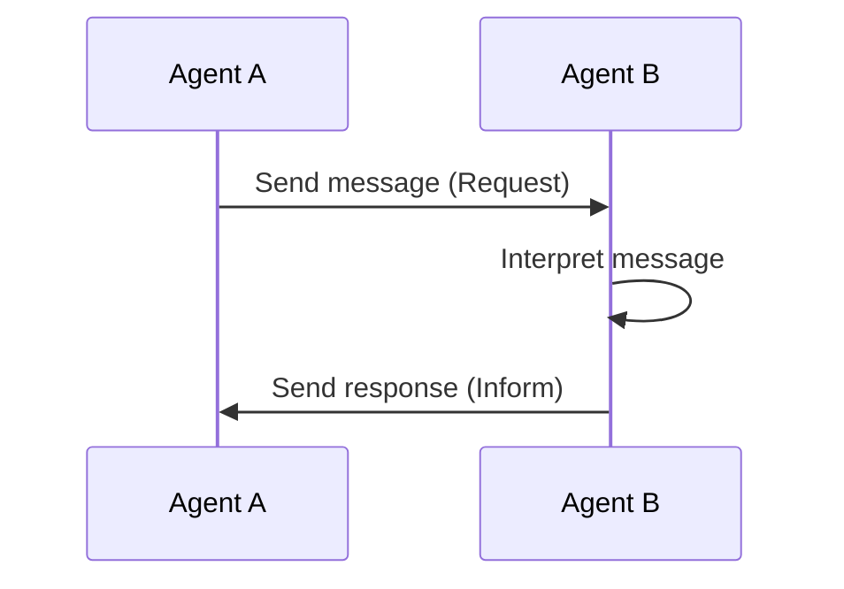
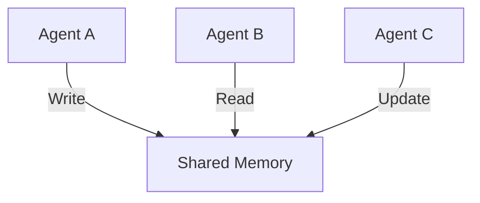
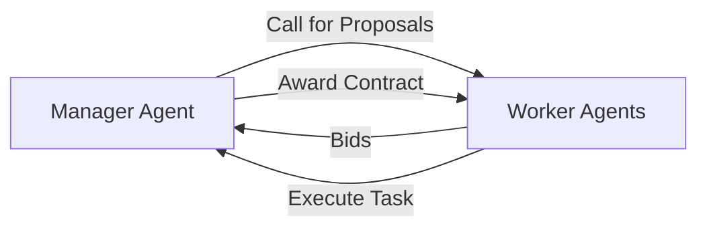
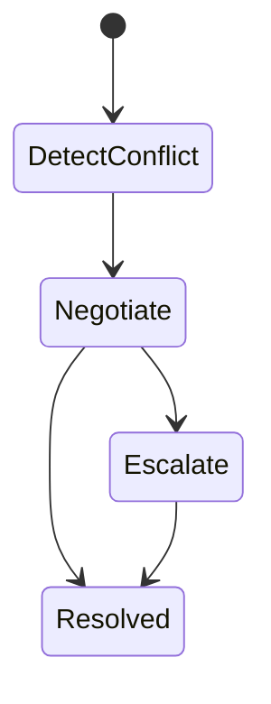

# Multi-Agent Systems and Collaboration: Communication and Coordination Protocols

## Learning Objectives

- Implement agent communication mechanisms
- Design coordination protocols
- Resolve inter-agent conflicts
- Manage synchronization challenges
- Optimize communication efficiency

---

## Introduction

This chapter covers communication mechanisms between agents.

---

---

Modern intelligent systems are rarely built as single, monolithic programs. Instead, they are increasingly designed as **multi-agent systems (MAS)**—collections of autonomous agents that perceive their environment, make decisions, and act independently while still needing to **work together** to achieve shared or overlapping goals. Examples range from fleets of delivery drones and warehouse robots to distributed AI services, financial trading bots, multiplayer game characters, and collaborative software agents.

At the heart of every successful multi-agent system lies **communication and coordination**. Agents must exchange information, align their actions, resolve disagreements, and synchronize their behavior over time. Without well-designed communication mechanisms and coordination protocols, agents may duplicate work, act at cross purposes, overload the system with messages, or even deadlock entirely.

This chapter focuses on the **communication mechanisms between agents** and how these mechanisms support collaboration. We move progressively from foundational ideas—such as message passing and shared memory—toward more advanced topics like coordination protocols, conflict resolution strategies, synchronization challenges, and communication overhead optimization. Throughout the chapter, you will see how theoretical ideas translate into practical system designs, supported by real-world analogies, detailed examples, diagrams, and case studies.

---

By the end of this chapter, you will be able to:

- Implement agent communication mechanisms using message passing and shared memory
- Design coordination protocols that enable effective collaboration among agents
- Resolve inter-agent conflicts using structured strategies
- Identify and manage synchronization challenges in distributed agent systems
- Optimize communication efficiency to improve scalability and performance

---

## Message-Passing Fundamentals

Message passing is the most widely used and conceptually fundamental communication mechanism in multi-agent systems. In its simplest form, agents communicate by **sending and receiving discrete messages** over some communication channel. This approach mirrors how humans collaborate at a distance: by exchanging letters, emails, or instant messages rather than sharing a single notepad.

### Concept and Historical Context

The roots of message passing can be traced back to early distributed systems and networking research in the 1970s and 1980s. As computing systems moved from centralized mainframes to distributed architectures, researchers needed ways for independent processes to coordinate without relying on shared physical memory. Message passing emerged as a natural solution, later formalized in models such as **actor systems**, **Communicating Sequential Processes (CSP)**, and **agent communication languages (ACLs)**.

In multi-agent systems, message passing aligns perfectly with the idea of **agent autonomy**. Each agent controls its own internal state and decides how to react to incoming messages. No other agent can directly modify that state; all influence must occur through communication. This design supports modularity, robustness, and scalability.

### How Message Passing Works

At a detailed level, message passing involves several steps:

1. **Message creation** – An agent constructs a message containing:
   - A sender identifier
   - One or more recipients
   - A performative or type (e.g., request, inform, propose)
   - A content payload (data, goals, beliefs)
2. **Transmission** – The message is sent through a communication medium such as a network socket, message queue, or middleware service.
3. **Delivery and reception** – The receiving agent’s communication module accepts the message.
4. **Interpretation and response** – The agent interprets the message and decides whether and how to respond.

A helpful analogy is postal mail. Writing a letter (message creation), mailing it (transmission), receiving it in your mailbox (delivery), and reading and responding to it (interpretation) all correspond directly to steps in agent communication.

### Synchronous vs Asynchronous Messaging

Message passing can be implemented in different styles, each with implications for system behavior:

- **Synchronous messaging**
  - The sender waits for a response before continuing.
  - Similar to a phone call.
  - Easier to reason about but risks blocking and deadlocks.
- **Asynchronous messaging**
  - The sender continues immediately after sending.
  - Similar to sending an email.
  - More scalable and robust, but requires careful handling of delayed responses.

Most large-scale multi-agent systems prefer asynchronous messaging because it supports loose coupling and avoids global waiting.

### Advantages and Limitations

**Advantages**
- Preserves agent autonomy and encapsulation
- Scales well across networks and machines
- Fault isolation: failure of one agent does not directly corrupt others

**Limitations**
- Communication latency can slow coordination
- Message loss or duplication must be handled
- Designing message protocols requires careful planning

### Examples and Analogies

- **Robotic soccer team**: Each robot sends position updates and strategy messages to teammates.
- **Customer service chatbots**: Bots exchange messages to escalate issues or share customer context.
- **Human analogy**: Team members coordinating via group chat instead of sharing a single document.

### Message Passing Overview Table

| Aspect | Description | Practical Implication |
|------|-------------|-----------------------|
| Coupling | Loose | Agents evolve independently |
| Failure handling | Explicit | Requires retries and acknowledgments |
| Scalability | High | Suitable for large distributed systems |
| Complexity | Moderate | Protocol design is critical |

### Message Exchange Flow Diagram

---

## Shared Memory Communication

Shared memory communication represents an alternative approach in which agents communicate indirectly by **reading from and writing to a common data space**. Instead of sending messages directly to each other, agents coordinate by observing and modifying shared structures.

### Concept and Background

The idea of shared memory originates in concurrent programming on single machines, where multiple threads access the same memory space. In multi-agent systems, this concept evolved into models such as **blackboard systems**, **tuple spaces**, and **distributed shared memory**.

Unlike message passing, shared memory emphasizes **environment-mediated interaction**. Agents do not need to know who produced a piece of information; they only need to know where to find it. This aligns with stigmergy, a concept from biology where insects coordinate indirectly through environmental cues.

### How Shared Memory Works

A shared memory communication system typically includes:

1. **Shared data structure** – A repository accessible to multiple agents.
2. **Read/write operations** – Agents can post, update, or remove information.
3. **Consistency mechanisms** – Rules that ensure data remains coherent.

For example, in a blackboard system:
- One agent posts a partial solution.
- Another agent reads it and refines it.
- A third agent evaluates the result.

### Advantages and Limitations

**Advantages**
- Decouples agents in time and space
- Supports opportunistic collaboration
- Simplifies broadcast-style communication

**Limitations**
- Risk of race conditions
- Requires synchronization mechanisms
- Harder to scale across distributed networks

### Examples and Analogies

- **Shared task board**: Agents update task status on a common board.
- **Wikipedia editing**: Contributors coordinate by editing shared pages.
- **Warehouse robots**: Robots mark occupied paths in a shared map.

### Comparison Table: Message Passing vs Shared Memory

| Dimension | Message Passing | Shared Memory |
|---------|----------------|---------------|
| Coupling | Explicit sender–receiver | Indirect via environment |
| Scalability | High | Moderate |
| Synchronization | Message ordering | Locks, transactions |
| Transparency | Clear interaction | Implicit interaction |

### Shared Memory Interaction Diagram

---

## Coordination Protocols

Coordination protocols define **rules and patterns** that govern how agents interact to achieve coherent group behavior. While communication mechanisms enable information exchange, coordination protocols give that exchange **meaning and structure**.

### Concept and Importance

Coordination protocols answer questions such as:
- Who acts first?
- How are tasks allocated?
- How do agents reach agreements?

Historically, these protocols evolved from distributed systems research (e.g., leader election, consensus algorithms) and were adapted to agent-oriented settings with richer semantics and autonomy.

### Common Coordination Protocols

- **Contract Net Protocol (CNP)**: Agents bid for tasks.
- **Consensus protocols**: Agents agree on shared values.
- **Negotiation protocols**: Agents exchange offers and counteroffers.

### Why Protocols Matter

Without protocols:
- Agents may duplicate work
- Conflicting actions may occur
- System-level goals may never be achieved

With protocols:
- Interactions become predictable
- System behavior is analyzable
- Fairness and efficiency improve

### Example: Contract Net Protocol Flow

### Coordination Protocol Comparison Table

| Protocol | Use Case | Strengths | Weaknesses |
|--------|----------|-----------|------------|
| Contract Net | Task allocation | Flexible, decentralized | Communication-heavy |
| Consensus | Shared decisions | Strong consistency | Slow under failures |
| Negotiation | Resource sharing | Adaptive | Complex strategies |

---

## Conflict Resolution Strategies

Conflicts arise when agents have **incompatible goals, beliefs, or resource demands**. Conflict resolution strategies provide structured ways to detect, manage, and resolve these situations.

### Nature of Conflicts

Conflicts can occur due to:
- Limited resources
- Incomplete or inconsistent information
- Divergent priorities

In human teams, conflicts are resolved through discussion, compromise, or authority. Multi-agent systems require algorithmic equivalents.

### Common Strategies

- **Negotiation**: Agents exchange proposals.
- **Arbitration**: A neutral agent decides.
- **Priority rules**: Predefined hierarchies resolve disputes.

### Advantages and Trade-offs

Negotiation is flexible but slow. Arbitration is fast but reduces autonomy. Priority rules are simple but may be unfair.

### Conflict Resolution Process Diagram

---

## Synchronization Challenges

Synchronization ensures that agents’ actions occur in the **correct order and timing**. In distributed systems, achieving synchronization is notoriously difficult due to delays, failures, and partial knowledge.

### Why Synchronization Is Hard

Agents lack a global clock and may perceive events in different orders. This can lead to:
- Deadlocks
- Starvation
- Inconsistent states

### Common Synchronization Techniques

- **Locks and semaphores**
- **Barrier synchronization**
- **Logical clocks**

### Practical Example

In a traffic simulation, cars (agents) must synchronize at intersections. Poor synchronization leads to collisions or gridlock.

---

## Communication Overhead Optimization

As the number of agents grows, communication can become a bottleneck. Optimization focuses on **reducing unnecessary messages** while preserving coordination quality.

### Sources of Overhead

- Redundant messages
- Large payloads
- Excessive broadcast communication

### Optimization Strategies

- Message aggregation
- Selective communication
- Hierarchical coordination

### Before-and-After Comparison Table

| Metric | Unoptimized | Optimized |
|------|-------------|-----------|
| Messages/sec | High | Reduced |
| Latency | Variable | Predictable |
| Scalability | Limited | Improved |

---

## Case Study: Coordinating Warehouse Robots at Scale

### Context

In a large e-commerce fulfillment center, hundreds of autonomous robots move shelves of products to human pickers. Each robot acts as an agent, navigating aisles, avoiding collisions, and responding to task assignments in real time. The environment is highly dynamic: orders fluctuate throughout the day, aisles become congested, and robots occasionally fail or require maintenance.

Initially, the system designers focused on individual robot intelligence. Each robot could plan paths and avoid obstacles locally. However, as the fleet grew, coordination problems began to emerge. Robots competed for the same paths, congestion increased, and overall throughput declined.

### Problem

The core problem was not individual navigation but **inter-agent coordination**. Robots needed to:
- Share path and task information
- Resolve conflicts over shared space
- Synchronize movements at intersections

Early solutions relied heavily on direct message passing between nearby robots. While this worked at small scales, message traffic exploded as the fleet grew. Latency increased, and inconsistent information led to deadlocks.

### Solution

The team redesigned the communication architecture using a **hybrid approach**:
1. **Shared memory** in the form of a distributed map storing aisle occupancy.
2. **Message passing** for task assignments and exception handling.
3. **Coordination protocols** to manage intersection access.

A contract-net-like protocol was introduced for task allocation, while priority-based conflict resolution handled aisle conflicts. Synchronization barriers ensured safe movement through high-traffic zones.

### Results

After deployment, message traffic dropped by over 40%. Throughput increased by 25%, and deadlocks were virtually eliminated. The system scaled smoothly as more robots were added.

### Lessons Learned

The case demonstrated that:
- No single communication mechanism is sufficient alone.
- Coordination protocols must be designed with scale in mind.
- Optimizing communication is as important as improving agent intelligence.

---

## Summary

In this chapter, we explored how agents in multi-agent systems communicate and collaborate. We examined message passing and shared memory as foundational communication mechanisms, discussed coordination protocols that structure interactions, and analyzed strategies for resolving conflicts and synchronizing actions. Finally, we addressed the critical challenge of optimizing communication overhead in large-scale systems.

Effective multi-agent collaboration depends not only on intelligent agents but on **well-designed communication and coordination infrastructures**. Understanding these concepts enables you to build systems that are robust, scalable, and capable of complex collective behavior.

---

## Reflection Questions

1. In what situations would you prefer shared memory communication over message passing, and why?
2. How do coordination protocols balance agent autonomy with system-level control?
3. What trade-offs arise when choosing between negotiation and arbitration for conflict resolution?
4. How can poor synchronization undermine otherwise well-designed agent behaviors?
5. If you were designing a system with thousands of agents, which communication optimization strategies would you prioritize?

---