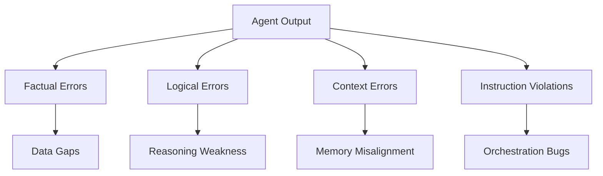
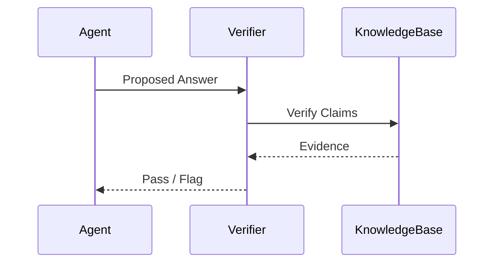
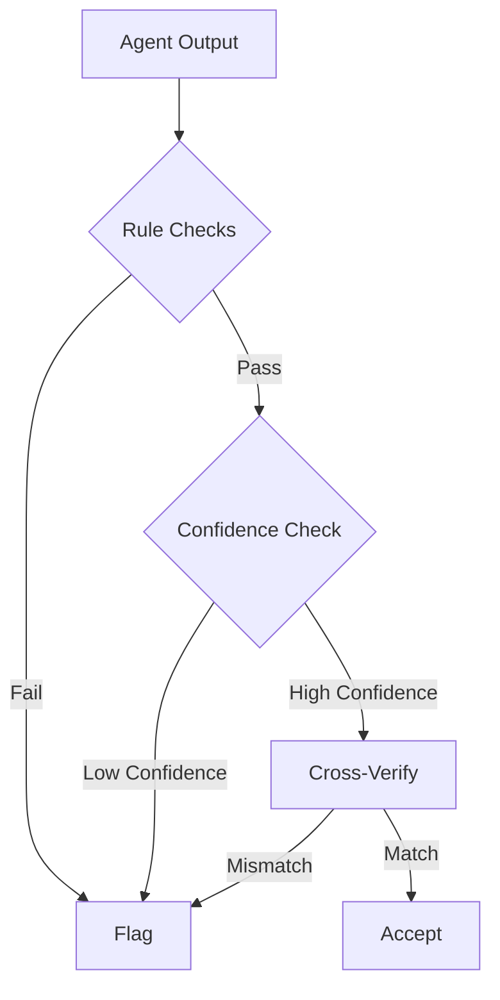
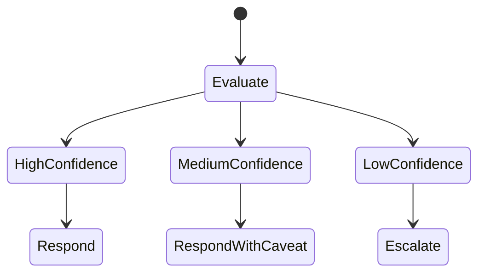
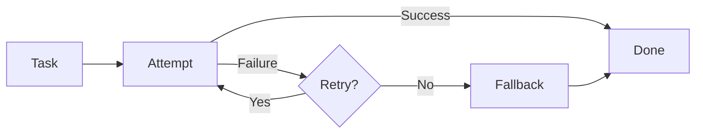
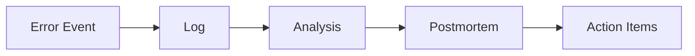
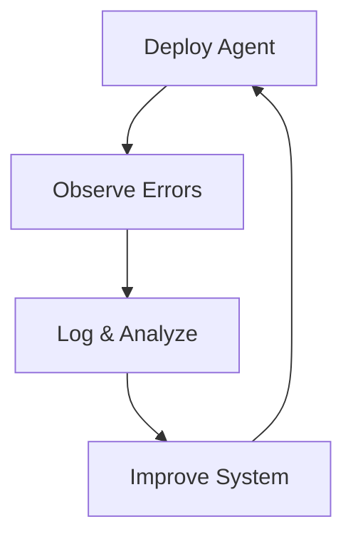

# Evaluation, Safety, and Alignment: Hallucination and Error Handling

## Learning Objectives

- Identify hallucination types
- Detect agent errors
- Implement mitigation strategies
- Design fallback mechanisms
- Analyze error trends

---

## Introduction

This chapter focuses on identifying and mitigating agent errors.

---

---

As AI agents become more capable and autonomous, they are increasingly trusted with tasks that affect real people, real businesses, and real decisions. From customer support bots and data analysis agents to coding assistants and autonomous research systems, these agents are now embedded deeply into workflows where correctness, reliability, and safety matter. However, alongside this growing capability comes a persistent and sometimes subtle problem: **agent errors**, especially **hallucinations**—confident but incorrect outputs that can mislead users and systems alike.

This chapter focuses on **evaluation, safety, and alignment**, with a particular emphasis on **hallucination and error handling**. Rather than treating errors as rare edge cases, we approach them as an inevitable part of intelligent systems that must be **actively detected, mitigated, logged, and learned from**. A well-designed agent is not one that never makes mistakes, but one that recognizes uncertainty, fails gracefully, and improves continuously.

We will move progressively from understanding the **types of hallucinations**, to learning **how to detect errors**, to implementing **confidence-based mitigation**, **retry and fallback strategies**, and **robust logging and postmortems**. Finally, we will explore **continuous improvement loops** that turn errors into long-term system learning. Throughout the chapter, you will find concrete examples, detailed case studies, tables, and visual diagrams that make abstract safety concepts tangible and practical.

---

By the end of this chapter, you will be able to:

- Identify different types of hallucinations in AI agent outputs  
- Detect agent errors using automated and human-in-the-loop techniques  
- Implement confidence-based mitigation strategies  
- Design robust retry and fallback mechanisms  
- Log errors effectively and conduct meaningful postmortems  
- Analyze error trends to drive continuous improvement  

---

## Types of Hallucinations

Hallucinations are among the most discussed and misunderstood failure modes of AI agents. At a high level, a hallucination occurs when an agent produces output that **appears coherent and confident but is factually incorrect, logically inconsistent, or unsupported by available evidence**. Importantly, hallucinations are not random noise—they are often *plausible*, which makes them particularly dangerous in real-world applications.

Historically, the term “hallucination” was borrowed from cognitive science and psychology, where it describes perceptions without external stimuli. In AI, the term emerged as large language models began generating fluent text that sounded authoritative even when it was wrong. Early deployments of conversational AI revealed that users tended to trust confident-sounding answers, amplifying the risk of misinformation.

### Factual Hallucinations

Factual hallucinations occur when an agent invents or misstates objective facts—dates, numbers, events, references, or entities. These are the most visible and widely recognized hallucinations.

Consider a travel-planning agent that confidently states that a country does not require a visa when it actually does, or a medical assistant that fabricates clinical trial results. These errors often arise because the model is optimizing for *plausibility*, not truth verification.

Why factual hallucinations matter:

- They can directly mislead users into making harmful decisions  
- They undermine trust in the system over time  
- They are often difficult to detect without external validation  

### Logical and Reasoning Hallucinations

Not all hallucinations involve wrong facts. Some involve **flawed reasoning**, where the steps between premises and conclusions are inconsistent or invalid. The final answer may even be correct by coincidence, but the reasoning path is broken.

An analogy from everyday life is a student who guesses the right answer on a math exam but shows incorrect steps. In AI systems, such hallucinations are dangerous because they can propagate incorrect reasoning patterns into downstream decisions.

### Contextual and Instructional Hallucinations

Contextual hallucinations occur when an agent ignores, misinterprets, or invents constraints from the prompt or environment. For example, an agent instructed to summarize *only* a provided document may introduce external knowledge that was never included.

Instructional hallucinations often arise in multi-step agent systems where memory, tool outputs, or prior messages are incorrectly recalled or overwritten.

### Comparative Overview of Hallucination Types

| Hallucination Type | Description | Typical Cause | Risk Level |
|-------------------|-------------|---------------|------------|
| Factual | Incorrect objective information | Training data gaps, no retrieval | High |
| Logical | Invalid reasoning steps | Weak chain-of-thought alignment | Medium–High |
| Contextual | Misuse or invention of context | Prompt misalignment, memory errors | Medium |
| Instructional | Violating explicit instructions | Agent orchestration flaws | Medium |

### Conceptual Map of Hallucination Sources

Understanding these types is foundational, because **different hallucinations require different detection and mitigation strategies**. Treating all errors the same leads to overengineering in some places and blind spots in others.

---

## Detection Techniques

Detecting hallucinations is fundamentally about answering one question: *How do we know when an agent is wrong?* This is surprisingly difficult, especially when the agent’s output is fluent, confident, and superficially reasonable. Detection techniques have evolved alongside AI systems, moving from manual review to automated, multi-layered approaches.

Early AI systems relied heavily on **human validation**, where domain experts reviewed outputs. While effective, this approach does not scale. Modern agent systems instead use **hybrid detection pipelines** that combine heuristics, statistical signals, external tools, and human oversight.

### Rule-Based and Heuristic Detection

Rule-based detection uses predefined rules to flag suspicious outputs. For example:

- Flagging answers that contain phrases like “I’m not sure, but…” followed by strong claims  
- Detecting impossible dates (e.g., events in the future described as historical)  
- Checking numerical ranges (negative ages, impossible percentages)  

These rules are simple and transparent, but brittle. They work well for known error patterns but fail when hallucinations are novel or subtle.

### Cross-Verification and Tool-Based Detection

A more robust approach involves **cross-checking agent outputs against trusted sources**. For example:

- Using retrieval systems to verify factual claims  
- Running code outputs through test suites  
- Validating structured outputs against schemas  

This is analogous to fact-checking a news article by consulting multiple independent sources.

### Confidence and Uncertainty Signals

Agents can also self-report uncertainty. Token-level probabilities, entropy measures, or explicit confidence scores can indicate when an output is unreliable. While not perfect, these signals are valuable inputs into broader detection systems.

### Human-in-the-Loop Detection

For high-stakes applications—medical, legal, financial—human oversight remains essential. Rather than reviewing everything, humans are involved selectively:

- Reviewing flagged outputs  
- Auditing random samples  
- Handling edge cases and disputes  

### Comparison of Detection Techniques

| Technique | Strengths | Weaknesses | Best Use |
|---------|-----------|------------|----------|
| Rule-Based | Simple, fast | Brittle | Known error patterns |
| Cross-Verification | High accuracy | Cost, latency | Factual validation |
| Confidence Signals | Cheap, scalable | Noisy | Early warning |
| Human Review | High trust | Expensive | High-stakes decisions |

Detection is not about eliminating errors entirely, but about **catching enough of them early to prevent harm**.

---

## Confidence-Based Mitigation

Once an error or potential hallucination is detected, the next question is how the system should respond. Confidence-based mitigation focuses on **modulating agent behavior based on uncertainty**, rather than treating all outputs equally.

Humans do this naturally. When we are unsure, we hedge, ask for clarification, or consult others. AI agents should behave similarly.

### Understanding Confidence in AI Systems

Confidence can be derived from:

- Model-internal signals (probabilities, entropy)  
- External validation success or failure  
- Historical accuracy in similar contexts  

Importantly, confidence is **contextual**. An agent may be highly confident summarizing a document but less confident predicting future trends.

### Mitigation Strategies Based on Confidence

Low-confidence outputs can trigger:

- Clarifying questions to the user  
- Softer language (“I may be mistaken, but…”)  
- Requests for additional data  
- Escalation to a human reviewer  

High-confidence outputs can proceed automatically, improving efficiency.

### Practical Example

Imagine a financial advisory agent:

- High confidence: Summarizing a user’s transaction history  
- Medium confidence: Suggesting budgeting tips  
- Low confidence: Giving tax advice → escalate to human  

### Confidence Threshold Table

| Confidence Level | Action | User Experience |
|------------------|--------|-----------------|
| High | Auto-respond | Fast, seamless |
| Medium | Respond with caveats | Transparent |
| Low | Ask / Escalate | Safe, slower |

Confidence-based mitigation reduces harm **without paralyzing the system**, striking a balance between safety and usability.

---

## Retry and Fallback Strategies

Even with detection and mitigation, errors will occur. Retry and fallback strategies define **what the system does next** when something goes wrong. These strategies are critical for resilience.

### Retries: When and How

Retries involve attempting the task again, often with modifications:

- Adjusted prompts  
- Additional context  
- Different tools or models  

However, blind retries can amplify errors. Effective retries are **informed retries**, guided by the failure reason.

### Fallback Mechanisms

Fallbacks provide alternative paths:

- Simpler models or templates  
- Cached answers  
- Human agents  
- Graceful failure messages  

An analogy is a GPS system that reroutes when a road is blocked rather than insisting on the original path.

### Retry vs Fallback Comparison

| Aspect | Retry | Fallback |
|------|-------|----------|
| Goal | Fix error | Avoid error |
| Cost | Medium | Varies |
| Risk | Repeating mistake | Reduced capability |
| Best Use | Transient failures | Systemic uncertainty |

Well-designed systems combine retries and fallbacks, ensuring that users are never left stuck or misled.

---

## Logging and Postmortems

Errors that are not logged are errors that will happen again. Logging and postmortems turn failures into learning opportunities.

### Effective Logging Practices

Good logs capture:

- Input prompts and context  
- Agent decisions and confidence  
- Tool calls and responses  
- User feedback  

Logs should be structured, searchable, and privacy-aware.

### Postmortems: Learning from Failure

A postmortem is a structured analysis conducted after a significant error. It focuses on:

- What happened  
- Why it happened  
- How it was detected  
- How it can be prevented  

Blame-free postmortems encourage honesty and learning.

### Example Log Structure

| Field | Description |
|------|-------------|
| Timestamp | When the event occurred |
| Agent State | Model, version |
| Input | User request |
| Output | Agent response |
| Confidence | Score |
| Outcome | Success / Error |

---

## Continuous Improvement Loops

The final step is closing the loop: using logged errors and postmortems to **systematically improve the agent over time**.

### Feedback as a Learning Signal

Feedback can come from:

- Users correcting errors  
- Humans reviewing outputs  
- Automated metrics  

This feedback feeds into model updates, prompt refinements, and policy changes.

### Improvement Cycle

### Long-Term Benefits

Continuous improvement leads to:

- Reduced hallucination rates  
- Increased user trust  
- Better alignment with real-world needs  

This is not a one-time effort but an ongoing discipline.

---

## Summary

In this chapter, we explored hallucinations and error handling as core challenges in building safe, aligned AI agents. We examined different types of hallucinations, learned how to detect them using layered techniques, and applied confidence-based mitigation to reduce harm. We designed retry and fallback strategies for resilience, emphasized the importance of logging and postmortems, and closed with continuous improvement loops that turn failures into progress.

The key takeaway is simple but powerful: **errors are inevitable, but unmanaged errors are unacceptable**. A mature AI system is one that anticipates failure, responds intelligently, and learns continuously.

---

## Reflection Questions

1. Which type of hallucination do you think is most dangerous in your domain, and why?  
2. How would you balance automation and human oversight in a high-stakes agent system?  
3. What confidence signals would you trust most, and which would you treat cautiously?  
4. How can postmortems be designed to encourage learning rather than blame?  
5. What metrics would best indicate that your continuous improvement loop is working?