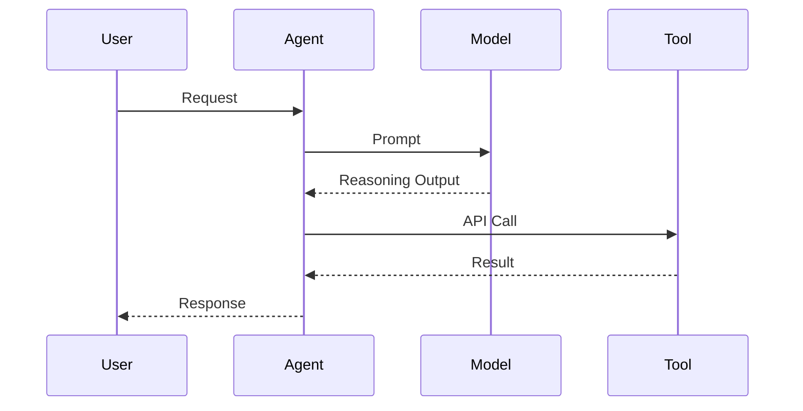
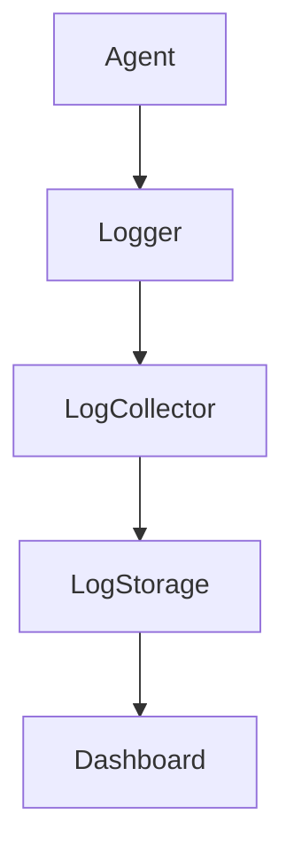
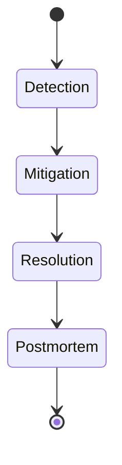
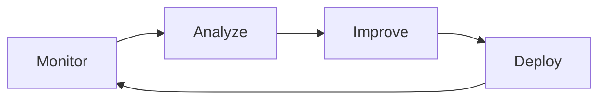

# Scaling, Optimization, and Production Deployment: Monitoring, Logging, and Observability

## Learning Objectives

- Monitor agent performance
- Implement observability tools
- Detect behavior drift
- Respond to incidents
- Improve systems continuously

---

## Introduction

This chapter teaches production monitoring practices.

---

---

When intelligent agent systems move from prototypes into real-world production environments, their success is no longer defined solely by how “smart” they are. Instead, reliability, stability, transparency, and adaptability become the dominant concerns. An agent that performs perfectly in a controlled development environment can fail dramatically under real-world load, unexpected inputs, or changing user behavior. This is why **monitoring, logging, and observability** are foundational pillars of production-grade systems.

Historically, software systems were relatively simple and monolithic. Developers could debug issues by checking a single log file or restarting a server. Modern agent systems, however, are **distributed, adaptive, probabilistic, and continuously learning**. They interact with APIs, tools, databases, other agents, and users in real time. Failures are often subtle, emergent, and delayed. Without deep visibility into system behavior, teams are effectively “flying blind.”

This chapter focuses on **production monitoring practices for agent systems**, with an emphasis on scaling, optimization, and continuous improvement. You will learn not just *what* to monitor, but *why*, *how*, and *what to do* when things go wrong. We will progressively build from basic metrics, to distributed tracing, structured logging, alerting, behavior drift detection, and finally to feedback loops that turn operational data into system improvements.

---

By the end of this chapter, you will be able to:

- Monitor agent performance using meaningful, actionable metrics  
- Implement observability tools that provide end-to-end system visibility  
- Detect behavior drift in agent outputs and decision-making  
- Respond effectively to incidents using alerting and incident response practices  
- Design continuous improvement feedback loops based on real-world data  

---

## Key Metrics for Agent Systems

Monitoring begins with **metrics**, but not all metrics are equally valuable. In agent systems, metrics must capture not only system health, but also *behavioral quality, decision efficiency, and user impact*. Understanding which metrics matter—and why—is the foundation of effective observability.

### Understanding Metrics in the Context of Agent Systems

A metric is a numerical representation of some aspect of system behavior over time. Traditional software metrics focused on infrastructure: CPU usage, memory consumption, disk I/O, and network latency. While these remain important, agent systems require a broader view. Agents reason, plan, interact, and adapt—activities that are not fully captured by infrastructure metrics alone.

Agent metrics typically fall into multiple layers:
- **System-level metrics** (resource usage, availability)
- **Application-level metrics** (latency, throughput, error rates)
- **Agent-level metrics** (decision time, tool usage, success rates)
- **Outcome-level metrics** (task completion, user satisfaction)

The historical shift toward richer metrics came with the rise of distributed systems and microservices. Engineers realized that “the system is healthy” does not necessarily mean “the user experience is good.” For agent systems, this gap is even wider: an agent may respond quickly but produce incorrect, biased, or unhelpful outputs.

### Core Metric Categories for Agents

Agent metrics should be chosen intentionally, based on system goals and risk areas. Common categories include:

- **Performance metrics**
  - Response latency per request or interaction
  - End-to-end task completion time
  - Throughput (requests per second)

- **Reliability metrics**
  - Error rates (timeouts, failed tool calls)
  - Retry counts and fallback usage
  - Availability and uptime

- **Quality metrics**
  - Task success rate
  - Human evaluation scores
  - Policy compliance or safety flags

- **Behavioral metrics**
  - Tool invocation frequency
  - Prompt length and token usage
  - Decision path complexity

Each category answers a different question. Performance metrics answer “How fast?”, reliability metrics answer “How often does it fail?”, quality metrics answer “Is it useful?”, and behavioral metrics answer “How is it thinking and acting?”

### Why Metrics Matter in Production

Metrics are not just for dashboards—they drive decisions. Without metrics, teams rely on anecdotes and assumptions. With metrics, they can:
- Detect degradation before users complain
- Compare model versions objectively
- Identify cost inefficiencies
- Validate optimization efforts

A useful analogy is a car dashboard. Speed, fuel level, and engine temperature do not tell you *everything* about the car, but without them, driving at scale would be unsafe. Similarly, metrics provide early warning signals that something is wrong—even if the root cause is not immediately clear.

### Common Pitfalls in Metric Design

Despite their importance, metrics are often misused. Common mistakes include:
- Tracking too many metrics without clear ownership
- Focusing only on infrastructure metrics
- Measuring averages instead of distributions (e.g., p95 latency)
- Ignoring user-centric outcomes

Good metric design emphasizes **actionability**. A metric is valuable only if someone knows what to do when it changes.

### Example Metrics Table

| Metric Category | Example Metric | What It Indicates | Common Use |
|----------------|---------------|------------------|------------|
| Performance | p95 Response Time | Tail latency | SLA monitoring |
| Reliability | Tool Call Failure Rate | External dependency health | Incident detection |
| Quality | Task Success Rate | Output usefulness | Model evaluation |
| Behavioral | Avg. Tools per Task | Reasoning complexity | Cost optimization |

---

## Distributed Tracing

As agent systems scale, requests rarely stay within a single process. Distributed tracing provides visibility into **how a single request flows through multiple components**, revealing bottlenecks, failures, and unexpected behaviors.

### The Evolution of Distributed Tracing

Distributed tracing emerged from large-scale systems at companies like Google and Twitter, where debugging production issues became nearly impossible using logs alone. A single user request might touch dozens of services. Tracing introduced the idea of a **trace**, composed of **spans**, each representing a unit of work.

In agent systems, tracing is even more critical. A single user query may involve:
- Prompt construction
- Model inference
- Tool selection
- Multiple API calls
- Post-processing and response synthesis

Without tracing, these steps blur together.

### How Distributed Tracing Works

At a high level, tracing follows these steps:
1. A request is assigned a unique trace ID.
2. Each component creates spans with timing and metadata.
3. Spans are linked into a trace graph.
4. Traces are collected and visualized.

This allows engineers to answer questions like:
- Where did the time go?
- Which dependency failed?
- Which agent decision caused retries?

### Tracing Agent Reasoning and Tool Use

For agent systems, spans can represent:
- Reasoning steps
- Tool invocations
- Model calls
- External API requests

This turns tracing into a **cognitive observability tool**, not just a performance one. You can see *how the agent reasoned*, not just *how long it took*.

### Distributed Tracing Flow Diagram

### Benefits and Trade-offs

Distributed tracing provides:
- Root cause analysis
- Performance optimization insights
- Dependency visibility

However, it introduces:
- Overhead in instrumentation
- Storage costs
- Complexity in interpretation

The key is **selective tracing**—not every request needs full detail.

---

## Logging Best Practices

Logs are the **narrative record** of what a system did and why. In agent systems, logs are invaluable for debugging, audits, and learning from real-world behavior.

### From Debug Logs to Structured Logging

Early logging was informal: developers printed strings to files. Modern production systems use **structured logging**, where logs are machine-readable (e.g., JSON) and include consistent fields such as timestamps, request IDs, and agent states.

Structured logs allow:
- Automated searching
- Aggregation and filtering
- Correlation with metrics and traces

### What to Log in Agent Systems

Effective agent logs balance completeness with signal-to-noise ratio. Useful log categories include:
- Input summaries (sanitized)
- Decision rationale or plan IDs
- Tool selection and parameters
- Errors and exceptions
- Safety or policy flags

Logs should explain *why* an agent acted, not just *what* it did.

### Logging Levels and Their Purpose

Different log levels serve different audiences:
- **DEBUG**: Detailed reasoning steps (development only)
- **INFO**: High-level decisions and outcomes
- **WARN**: Unexpected but recoverable events
- **ERROR**: Failures requiring attention

Misusing log levels leads to either silence during incidents or overwhelming noise.

### Logging Architecture Diagram

### Privacy and Compliance Considerations

Agent systems often handle sensitive data. Logging must:
- Avoid storing raw personal data
- Support redaction and anonymization
- Comply with retention policies

Poor logging hygiene can turn observability into a liability.

---

## Alerting and Incident Response

Monitoring without alerting is passive. Alerting transforms observability into **action**.

### Principles of Effective Alerting

Alerts should be:
- Actionable
- Timely
- Specific
- Rare

Alert fatigue is a real risk. Too many alerts cause teams to ignore them, missing real incidents.

### Designing Alerts for Agent Systems

Common alert triggers include:
- Latency spikes
- Error rate thresholds
- Quality metric degradation
- Safety policy violations

Alerts should point to **what broke** and **where to look next**.

### Incident Response Lifecycle

Each stage has distinct goals, from stopping harm to learning.

### Cultural Aspects of Incident Response

Blameless postmortems encourage learning. In agent systems, incidents often reveal:
- Hidden assumptions
- Edge cases in reasoning
- Gaps in monitoring

The goal is resilience, not perfection.

---

## Behavior Drift Detection

Behavior drift occurs when an agent’s outputs change over time in undesirable ways, even if the system appears “healthy.”

### What Is Behavior Drift?

Drift can arise from:
- Changing user inputs
- Updated tools or APIs
- Model updates
- Feedback loops

Unlike failures, drift is gradual and subtle.

### Detecting Drift in Practice

Common approaches include:
- Statistical comparison of outputs
- Embedding similarity analysis
- Human review sampling
- Rule-based anomaly detection

Drift detection often combines quantitative signals with qualitative review.

### Why Drift Is Dangerous

Drift can:
- Degrade user trust
- Introduce bias
- Violate policies

Because it is slow, teams often notice it too late.

### Drift Monitoring Table

| Drift Type | Signal | Detection Method | Example |
|----------|--------|------------------|---------|
| Quality | Lower success rate | A/B evaluation | Worse answers |
| Behavioral | Tool overuse | Usage metrics | Cost spike |
| Safety | More flags | Rule counters | Policy risk |

---

## Continuous Improvement Feedback Loops

Observability is only valuable if it leads to improvement.

### From Data to Decisions

Feedback loops connect:
- Monitoring data
- Analysis
- System changes
- Validation

This turns production into a learning environment.

### Designing Effective Feedback Loops

Key elements include:
- Clear ownership of metrics
- Regular review cadence
- Experimentation frameworks
- Rollback mechanisms

### Feedback Loop Diagram

### Long-Term Impact

Organizations with strong feedback loops:
- Improve faster
- Recover quicker
- Build more trustworthy systems

---

## Case Study: Scaling a Customer Support Agent Platform

### Context

In 2024, a mid-sized SaaS company deployed an AI-driven customer support agent to handle tier-1 inquiries. The system integrated an LLM, internal knowledge base, and ticketing tools. Initially, it served a few hundred requests per day and was monitored using basic uptime checks and application logs.

As adoption grew, the agent expanded to handle thousands of daily interactions across multiple regions. The engineering team consisted of platform engineers, ML engineers, and support operations staff. Each group had different visibility needs, but no unified observability strategy.

### Problem

Within months, users reported inconsistent answers, slow responses during peak hours, and occasional incorrect ticket escalations. Infrastructure metrics looked normal, but user satisfaction declined. Traditional debugging failed because issues were intermittent and hard to reproduce.

The team realized they lacked:
- End-to-end request visibility
- Behavioral quality metrics
- Drift detection mechanisms

### Solution

The team implemented a layered observability approach. They defined key agent metrics (latency, success rate, tool usage), introduced distributed tracing across agent steps, and migrated to structured logging with request IDs.

They added quality sampling, where a subset of interactions was reviewed weekly. Drift detection compared embeddings of current responses against a baseline. Alerts were redesigned to focus on user impact, not just system errors.

### Results

Within weeks, the team identified a subtle drift caused by a knowledge base update that biased the agent toward outdated policies. Fixing it improved resolution accuracy by 18%. Latency optimizations based on trace data reduced p95 response time by 35%.

Over six months, incident frequency dropped, and mean time to resolution improved significantly. User satisfaction scores increased, and support costs decreased.

### Lessons Learned

The team learned that:
- Infrastructure health is not enough
- Behavioral metrics are essential
- Drift is inevitable but manageable
- Observability must evolve with scale

Most importantly, they learned that monitoring is not a toolset—it is a mindset.

---

## Summary

Production-grade agent systems demand deep visibility. Metrics, tracing, logging, alerting, drift detection, and feedback loops work together to form a holistic observability strategy. When designed thoughtfully, they enable teams to scale confidently, respond to incidents effectively, and continuously improve system behavior.

Observability transforms uncertainty into understanding—and understanding into progress.

---

## Reflection Questions

1. Which agent metrics would be most critical for your system’s goals, and why?  
2. How would you balance detailed tracing with performance and cost constraints?  
3. What signals might indicate behavior drift before users complain?  
4. How can observability data be integrated into your development workflow?  
5. What cultural practices are needed to support effective incident response?