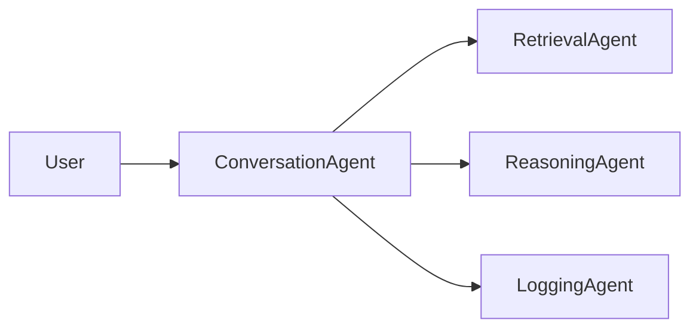
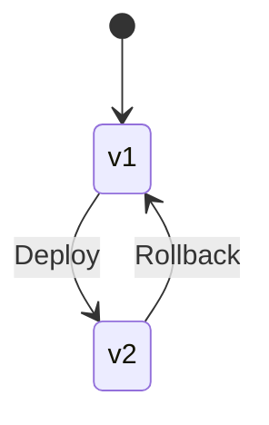
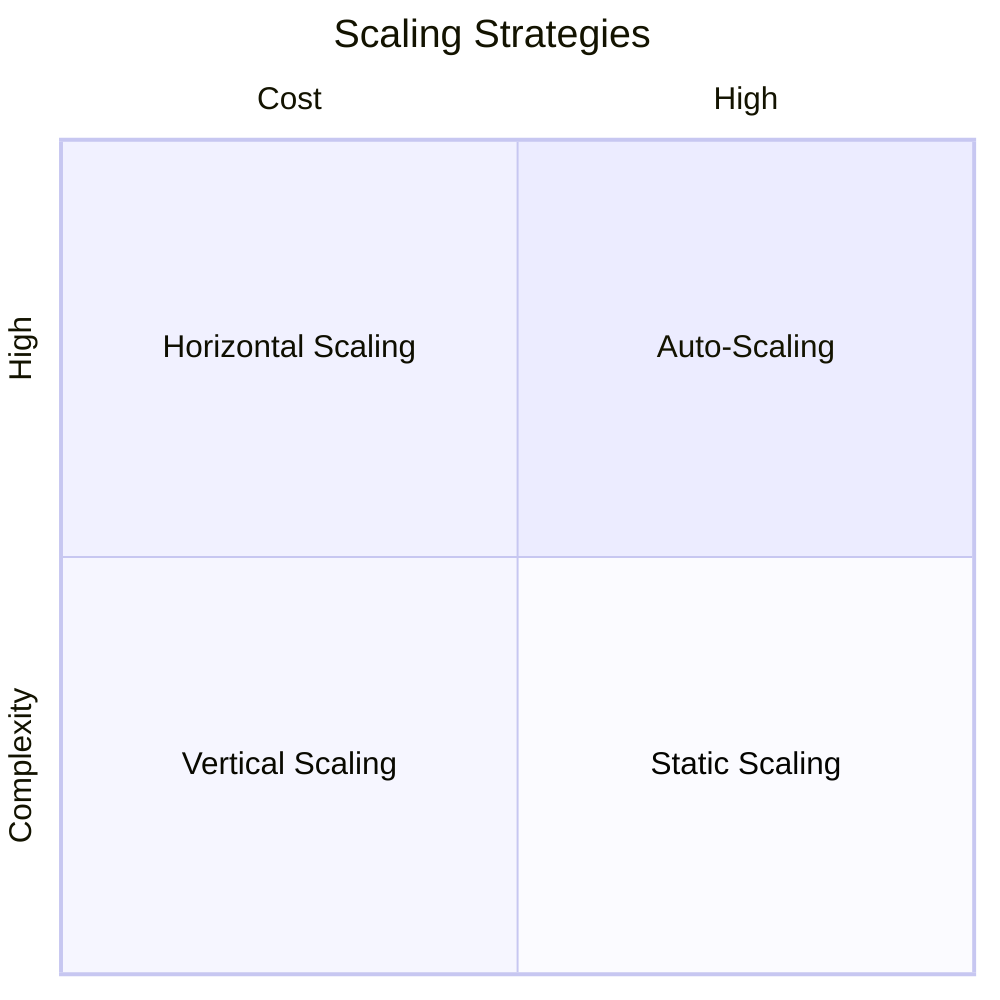

# Scaling, Optimization, and Production Deployment: Deployment Patterns and Infrastructure

## Learning Objectives

- Design deployment architectures
- Implement CI/CD pipelines
- Manage versions safely
- Secure production systems
- Scale agent deployments

---

## Introduction

This chapter covers infrastructure and deployment strategies.

---

---

As systems evolve from prototypes into mission-critical production platforms, deployment and infrastructure decisions become just as important as the code itself. Many promising systems fail not because their logic is flawed, but because they cannot scale, cannot be updated safely, or cannot be secured properly once exposed to real users and real-world workloads. This is especially true for **agent-based systems** and modern distributed applications, where multiple services, models, and integrations must work together reliably under changing conditions.

This chapter focuses on **how software systems—particularly intelligent agent systems—are deployed, scaled, optimized, and operated in production environments**. We move beyond development-time concerns and explore how systems live, grow, and adapt in the real world. You will learn how deployment architectures are designed, how infrastructure choices affect cost and performance, how CI/CD pipelines enable safe and frequent updates, how versioning and rollback protect users from failures, how security is enforced in production, and how scaling strategies keep systems responsive under load.

The goal is not only to explain *what* these concepts are, but *why* they exist, *how* they work in practice, and *when* to apply each approach. By the end of this chapter, you should be able to reason confidently about deployment trade-offs and design robust production-ready systems.

---

By the end of this chapter, you will be able to:

- Design and evaluate different deployment architectures for production systems  
- Compare cloud-based and on-premise infrastructure strategies  
- Implement CI/CD pipelines suitable for agent-based systems  
- Manage versioning and rollback strategies safely in production  
- Apply security and access control principles to deployed systems  
- Scale agent deployments effectively while maintaining reliability and performance  

---

## Deployment Architectures

Deployment architecture describes **how software components are packaged, hosted, and connected in a production environment**. It is the structural blueprint that determines how requests flow through the system, how failures are isolated, and how scaling occurs. Historically, deployment architectures evolved alongside hardware and networking capabilities, moving from single machines to globally distributed systems.

In the early days of software, applications were often deployed as **monoliths**—a single executable or service running on one server. This approach was simple and easy to reason about, but it tightly coupled all functionality. As systems grew more complex, teams began separating concerns into multiple deployable units, leading to **service-oriented architectures (SOA)** and later **microservices**. Agent systems further extend this idea by introducing autonomous components that may scale and evolve independently.

At a conceptual level, deployment architecture answers several key questions:
- Where does each component run?
- How do components communicate?
- How are failures handled and isolated?
- How does the system scale under increased demand?

### Common Deployment Architecture Patterns

Different architectural patterns exist to address different needs. There is no universally “best” architecture—only trade-offs.

| Architecture Pattern | Description | Advantages | Limitations |
|---|---|---|---|
| Monolithic Deployment | Entire application deployed as one unit | Simple, low overhead, easy debugging | Poor scalability, high blast radius |
| Modular Monolith | Single deployment with well-defined internal modules | Better structure, easier refactoring | Still scales as a whole |
| Microservices | Independent services deployed separately | Independent scaling, fault isolation | Operational complexity |
| Agent-Oriented Architecture | Autonomous agents deployed as services | Flexible, adaptive, scalable | Coordination and observability challenges |

In **agent-oriented deployments**, each agent may represent a distinct responsibility—such as planning, retrieval, reasoning, or interaction with external tools. These agents can be deployed as:
- Independent services
- Containers within a shared cluster
- Serverless functions triggered by events

### How Deployment Architecture Impacts System Behavior

The choice of deployment architecture has deep implications:

- **Performance**: Network calls between services introduce latency.
- **Reliability**: Failure in one service may or may not affect others.
- **Scalability**: Independent components can scale horizontally.
- **Development Velocity**: Smaller deployable units enable faster iteration.

An analogy is urban planning. A monolithic system is like a single large building where everyone works; efficient at small scale, but crowded and fragile. A microservice or agent-based architecture is like a city of specialized buildings connected by roads—more complex, but far more scalable and resilient.

### Example: From Monolith to Agent-Based Deployment

Imagine a customer support AI system initially built as a single service handling chat, retrieval, reasoning, and logging. As usage grows, response times degrade and updates become risky. The team restructures deployment so that:
- A **conversation agent** handles dialogue
- A **retrieval agent** queries knowledge bases
- A **reasoning agent** synthesizes answers
- A **logging agent** handles observability

Each agent is deployed independently, allowing targeted scaling and safer updates.

---

## Cloud and On-Premise Considerations

One of the most important infrastructure decisions is **where your system runs**. Cloud and on-premise environments represent different philosophies of ownership, control, and responsibility. Understanding their trade-offs is essential for designing sustainable deployment strategies.

### Understanding Cloud Infrastructure

Cloud computing emerged to solve the inefficiencies of owning and maintaining physical servers. Providers such as AWS, Azure, and Google Cloud offer **on-demand access to compute, storage, and networking resources**. Instead of buying servers upfront, teams rent capacity and scale it dynamically.

Cloud environments are particularly well-suited for agent systems because:
- Workloads are often variable and bursty
- Scaling needs can change rapidly
- Managed services reduce operational burden

Common cloud service models include:
- **IaaS** (Infrastructure as a Service): Virtual machines and networks
- **PaaS** (Platform as a Service): Managed runtimes and databases
- **Serverless**: Event-driven execution with no server management

### Understanding On-Premise Infrastructure

On-premise deployment means running systems on hardware owned and managed by the organization. This approach predates the cloud and remains relevant in industries with strict regulatory, latency, or data sovereignty requirements.

Advantages of on-premise environments include:
- Full control over hardware and network
- Predictable long-term costs
- Compliance with strict regulations

However, on-premise systems require:
- Dedicated operations teams
- Capacity planning and procurement
- Manual scaling and upgrades

### Hybrid and Multi-Cloud Approaches

Many modern systems adopt **hybrid architectures**, combining cloud and on-premise resources. For example:
- Sensitive data stored on-premise
- Compute-intensive agents running in the cloud

| Deployment Model | Best For | Key Trade-Off |
|---|---|---|
| Cloud | Rapid scaling, experimentation | Vendor lock-in |
| On-Premise | Compliance, control | High maintenance |
| Hybrid | Flexibility | Architectural complexity |

---

## CI/CD for Agent Systems

Continuous Integration and Continuous Deployment (CI/CD) pipelines automate the process of **building, testing, and deploying software changes**. In agent systems, CI/CD is especially critical because frequent updates to models, prompts, or agent logic can introduce subtle failures.

### Why CI/CD Matters in Production

Before CI/CD, deployments were manual, infrequent, and risky. Errors were often discovered only after users were affected. CI/CD addresses this by:
- Catching errors early through automated testing
- Enabling small, incremental changes
- Reducing human error in deployments

For agent systems, CI/CD must handle:
- Code changes
- Configuration updates
- Prompt and policy modifications
- Model version updates

### CI/CD Pipeline Stages

A typical CI/CD pipeline includes:

- **Source**: Code committed to version control
- **Build**: Packaging agents into deployable artifacts
- **Test**: Unit, integration, and simulation tests
- **Deploy**: Automated rollout to environments

### Special Considerations for Agent Systems

Agent systems introduce unique CI/CD challenges:
- Non-deterministic behavior
- Dependence on external APIs or models
- Prompt changes that alter behavior without code changes

Best practices include:
- Scenario-based testing
- Canary deployments for new agent versions
- Monitoring agent decisions post-deployment

---

## Versioning and Rollback Strategies

Versioning is the practice of **tracking changes to software artifacts over time**, while rollback strategies ensure systems can recover quickly from faulty deployments. Together, they form the safety net of production operations.

### Why Versioning Is Critical

Without proper versioning:
- It is difficult to reproduce bugs
- Rollbacks become guesswork
- Multiple environments drift out of sync

Semantic versioning (MAJOR.MINOR.PATCH) is commonly used to communicate the impact of changes.

| Version Change | Meaning | Risk Level |
|---|---|---|
| Patch | Bug fixes | Low |
| Minor | New features | Medium |
| Major | Breaking changes | High |

### Rollback Mechanisms

Rollback strategies include:
- **Blue-Green Deployments**: Switch traffic between two environments
- **Canary Releases**: Gradually expose new versions
- **Feature Flags**: Disable features without redeploying

---

## Security and Access Control

Security in production is not an add-on; it is a foundational requirement. Deployment decisions directly affect how systems are protected from misuse, data leaks, and attacks.

### Core Security Principles

Key principles include:
- **Least Privilege**: Grant minimal access
- **Defense in Depth**: Multiple security layers
- **Zero Trust**: Never assume trust based on location

### Access Control Mechanisms

Common mechanisms include:
- API keys and tokens
- Role-Based Access Control (RBAC)
- Network segmentation

| Mechanism | Use Case | Risk if Misused |
|---|---|---|
| API Keys | Service authentication | Key leakage |
| RBAC | User permissions | Over-privileged roles |
| Network ACLs | Traffic control | Misconfiguration |

---

## Scaling in Production

Scaling is the ability of a system to **handle increased load without degrading performance**. In production, scaling must be predictable, cost-effective, and safe.

### Types of Scaling

- **Vertical Scaling**: Adding more resources to a single instance
- **Horizontal Scaling**: Adding more instances
- **Auto-Scaling**: Dynamic adjustment based on metrics

### Scaling Agent Systems

Agent systems scale well horizontally because agents are often stateless or loosely coupled. However, shared resources such as memory stores or rate-limited APIs can become bottlenecks.

Best practices include:
- Load balancing across agents
- Caching shared results
- Isolating critical agents

---

## Case Study: Scaling an Intelligent Customer Support Platform

### Context

In 2022, a mid-sized e-commerce company launched an AI-powered customer support platform to reduce response times and support costs. The system initially served a limited user base and was deployed as a single cloud service. The team consisted of eight engineers and operated in a fast-moving startup environment where speed to market was prioritized over long-term scalability.

As marketing campaigns succeeded, daily support requests tripled within six months. Customers from multiple regions began using the platform simultaneously, and the system transitioned from a convenience tool to a mission-critical service. This shift exposed weaknesses in deployment, scaling, and operational practices.

### Problem

The monolithic deployment struggled under increased load. Response times became inconsistent, and outages during peak hours eroded customer trust. Deployments required full system restarts, leading to downtime. Security audits revealed overly permissive access policies, increasing risk.

Traditional fixes—adding more compute resources—only delayed failures. The team realized that architectural and operational changes were necessary to sustain growth.

### Solution

The team redesigned the system using an agent-based deployment architecture. Conversation handling, retrieval, reasoning, and analytics were separated into independent services. Each agent was containerized and deployed on a managed Kubernetes cluster in the cloud.

A CI/CD pipeline was introduced to automate testing and deployment. Canary releases allowed new agent versions to be tested on a subset of traffic. Versioning policies were formalized, and blue-green deployments enabled instant rollbacks.

Security was strengthened through RBAC, network segmentation, and secret management. Auto-scaling policies were configured based on request latency and queue depth.

### Results

Within three months, system reliability improved dramatically. Average response time dropped by 40%, and outages were eliminated during peak periods. Deployment frequency increased from once per week to multiple times per day without incidents.

Operational visibility improved through centralized logging and metrics. The platform successfully handled a seasonal traffic spike that was five times higher than previous peaks.

### Lessons Learned

The team learned that deployment architecture is a strategic decision, not an implementation detail. Early investment in CI/CD and security pays dividends as systems scale. They also discovered that agent-based architectures require strong observability and disciplined versioning to manage complexity.

---

## Summary

In this chapter, we explored how production systems are deployed, scaled, and secured. We examined deployment architectures, infrastructure choices, CI/CD pipelines, versioning strategies, security principles, and scaling techniques. Together, these elements form the backbone of reliable, production-ready systems.

---

## Reflection Questions

1. How would you choose between monolithic and agent-based deployment for a new system?
2. What factors would push you toward cloud, on-premise, or hybrid infrastructure?
3. How can CI/CD pipelines be adapted for non-deterministic agent behavior?
4. What rollback strategy would you trust most in a high-risk deployment?
5. Which scaling bottlenecks are most likely in agent-based systems, and why?