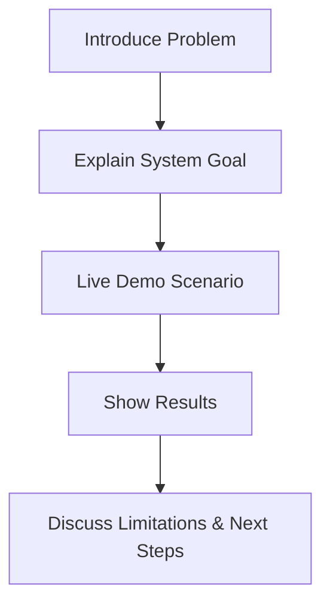
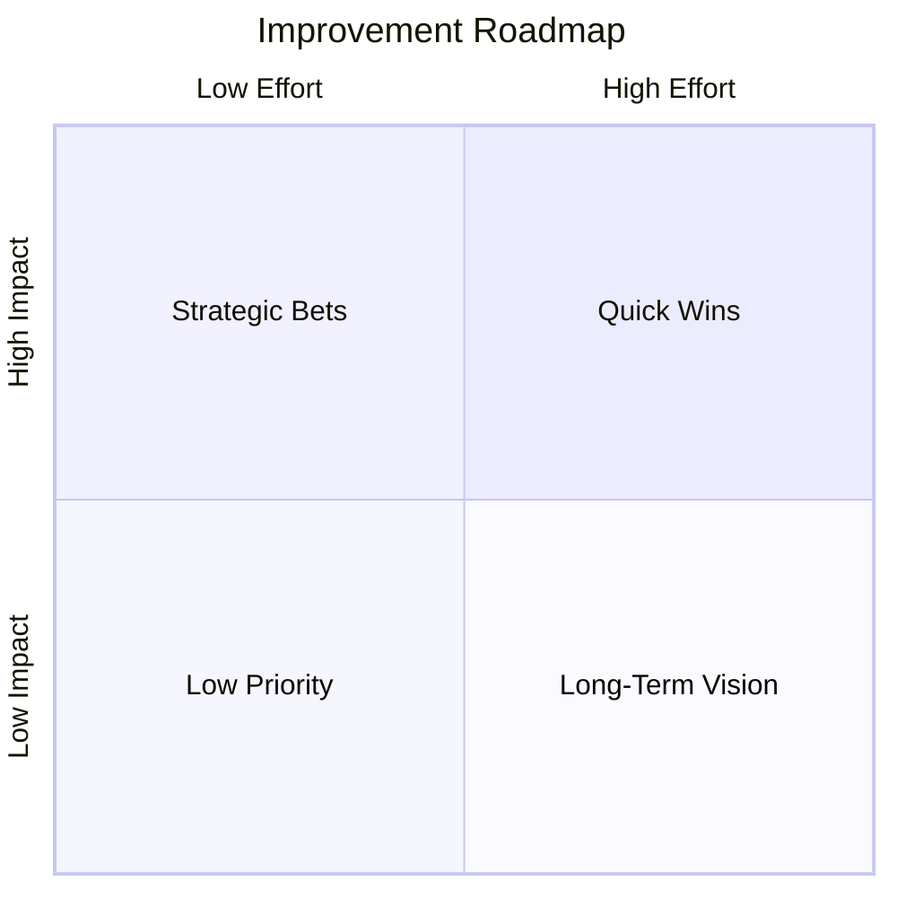

# Capstone Project: Build an End-to-End Agentic AI System: Final Presentation and Documentation

## Learning Objectives

- Produce comprehensive documentation
- Present system architecture clearly
- Demonstrate system functionality
- Justify design decisions
- Propose future improvements

---

## Introduction

This chapter focuses on communicating results and documenting the system.

---

# Capstone Project: Build an End-to-End Agentic AI System  

---

## Final Presentation and Documentation

---


By the time you reach the capstone stage of building an end-to-end **agentic AI system**, the technical work—designing agents, orchestrating tools, integrating models, and handling data—often feels like the hardest part. Surprisingly, in real-world settings, the **final presentation and documentation** can be just as important, if not more so. A system that works brilliantly but cannot be clearly explained, demonstrated, or justified is unlikely to be trusted, adopted, or maintained.

This chapter focuses on the often-overlooked but critical skill of **communicating your system effectively**. You will learn how to transform your technical work into clear documentation, compelling architectural visuals, convincing demos, and thoughtful reflections. These are the artifacts that allow others—stakeholders, engineers, evaluators, or future maintainers—to understand *what you built, why you built it this way, how it works, and where it can go next*.

Think of this chapter as the bridge between **building** and **being understood**. Much like an architect must present blueprints and models before a building is approved, an AI engineer must present documentation, diagrams, and reasoning to ensure their system can live beyond a single developer or classroom project.

---


By the end of this chapter, you will be able to:

- Produce **comprehensive and professional technical documentation**
- Present **system architecture clearly** using diagrams and structured explanations
- Prepare and deliver a **convincing system demonstration**
- Clearly **justify design decisions** with technical and contextual reasoning
- Reflect honestly on **limitations and trade-offs**
- Propose a realistic and structured **future improvement roadmap**

---

## Technical Documentation Structure

Technical documentation is the **memory of your system**. While code captures *how* something works, documentation explains *what it is*, *why it exists*, and *how others should interact with it*. Historically, as software systems grew more complex—from monolithic programs to distributed and AI-driven systems—documentation evolved from simple README files into structured, multi-layered artifacts. In agentic AI systems, where reasoning, autonomy, and orchestration play major roles, documentation becomes even more critical.

At its core, good documentation answers different questions for different audiences. A project sponsor may want a high-level overview and outcomes. A fellow engineer may need detailed setup instructions and architectural rationale. A future maintainer may look for known limitations and extension points. Structuring documentation thoughtfully ensures that each reader can quickly find what they need without being overwhelmed.

A common and effective structure for an agentic AI capstone includes:

- **Executive Overview**: Purpose, problem statement, and high-level solution
- **System Architecture**: Components, interactions, and data flow
- **Agent Design**: Roles, responsibilities, and reasoning strategies
- **Setup and Deployment**: Installation, configuration, and environment details
- **Usage and Demo Scenarios**: How the system is used in practice
- **Design Decisions**: Key trade-offs and rationale
- **Limitations and Risks**: Known issues and constraints
- **Future Work**: Planned enhancements and scalability considerations

Well-structured documentation is not just descriptive—it is **narrative**. It tells the story of how a problem led to a design, how that design became a system, and how that system behaves in the real world. This narrative approach helps readers form a mental model, which is especially important for agentic systems where behavior emerges from interactions rather than linear logic.

### Example: Documentation as a User Guide vs. a Blueprint

An analogy helps clarify this distinction. Imagine buying a complex kitchen appliance:
- The **user guide** explains how to operate it safely and effectively.
- The **engineering blueprint** explains how it was designed and how to repair it.

Your capstone documentation must serve **both roles**. High-level sections guide users and evaluators, while deeper sections support engineers and maintainers.

### Common Documentation Mistakes

- Treating documentation as an afterthought
- Writing only for yourself, not for new readers
- Mixing high-level concepts with low-level details without structure
- Failing to explain *why* decisions were made

### Documentation Structure Comparison

| Documentation Style | Strengths | Weaknesses | Best Use Case |
|--------------------|-----------|------------|---------------|
| Minimal README | Fast to write, simple | Lacks depth and clarity | Small prototypes |
| API-Only Docs | Precise and technical | No context or narrative | Developer libraries |
| Narrative Technical Docs | Clear, contextual, maintainable | Takes more time to write | Agentic AI systems |
| Auto-Generated Docs | Always up to date | Often hard to read | Large codebases |

---

## System Architecture Presentation

System architecture presentation is where **complexity becomes clarity**. Agentic AI systems often include multiple agents, tools, models, memory stores, and external services. Without a clear architectural presentation, these components blur together, making the system difficult to reason about or trust.

Historically, architecture diagrams emerged to help teams reason about increasingly distributed systems. In AI systems, architecture diagrams serve an additional role: they explain *intelligence flow*—how decisions are made, how context is shared, and how autonomy is constrained.

A strong architecture presentation typically moves from **high-level context** to **detailed components**, allowing the audience to progressively zoom in.

### High-Level Context (C4 Context Diagram)

At the highest level, you want to answer:
- Who uses the system?
- What external systems does it interact with?
- What problem boundary does it define?

```mermaid
C4Context
title Agentic AI System - Context Diagram
Person(user, "End User", "Interacts with the AI system")
System(agenticAI, "Agentic AI System", "Autonomous multi-agent system")
System_Ext(api, "External APIs", "Search, tools, data")
System_Ext(llm, "LLM Provider", "Reasoning and generation")

user -> agenticAI : Requests & feedback
agenticAI -> api : Tool calls
agenticAI -> llm : Prompts & context
```

This diagram is especially useful for non-technical stakeholders. It reassures them that the system boundary is well understood and controlled.

### Container-Level Architecture

Next, you explain *how the system is internally organized*.

```mermaid
C4Container
title Agentic AI System - Container Diagram
Container(ui, "User Interface", "Web App", "Collects input and shows output")
Container(orchestrator, "Agent Orchestrator", "Python Service", "Controls agents")
Container(agent, "Agents", "LLM-based", "Reasoning and task execution")
Container(memory, "Memory Store", "Vector DB", "Context and history")
Container(tools, "Tool Layer", "APIs", "Search, actions")

ui -> orchestrator
orchestrator -> agent
agent -> memory
agent -> tools
```

### Why Architecture Presentation Matters

- It builds **trust** by showing control and transparency
- It helps others **debug and extend** the system
- It allows you to justify design decisions later

### Architecture Presentation Table

| Level | Focus | Audience | Key Question Answered |
|------|-------|----------|------------------------|
| Context | System boundaries | Stakeholders | What is this system? |
| Container | Major components | Engineers | How is it organized? |
| Component | Internal logic | Developers | How does it work? |

---

## Demo Preparation

A demo is where your system stops being theoretical and becomes **real**. In professional environments, demos often determine whether a system is approved, funded, or adopted. A strong demo does not try to show everything—it tells a **focused story** about value.

Effective demos follow a clear narrative arc:
1. Problem context
2. System capability
3. Live or simulated interaction
4. Outcome and impact

### Preparing the Demo Flow



Preparation involves more than running the system once. You must:
- Define **happy paths** and **failure scenarios**
- Prepare fallback outputs in case of technical issues
- Control input complexity to avoid unpredictable agent behavior

### Example Demo Scenario

Imagine demonstrating a research assistant agent:
- Start with a vague research question
- Show how the agent decomposes the task
- Demonstrate tool usage (search, summarization)
- Present a synthesized answer

This mirrors real user behavior and highlights agent autonomy.

### Demo vs. Explanation Comparison

| Aspect | Demo | Explanation |
|------|------|-------------|
| Focus | Behavior | Reasoning |
| Risk | High (live system) | Low |
| Impact | Emotional, convincing | Rational, detailed |
| Best Used For | Validation | Understanding |

---

## Explaining Design Decisions

Design decisions are the **intellectual backbone** of your project. They show that your system is not accidental but the result of thoughtful trade-offs. Historically, engineering disciplines emphasize design justification because it reveals maturity and foresight.

When explaining decisions, always frame them as:
- A **problem or constraint**
- Multiple **possible options**
- The **chosen approach**
- The **reasoning behind it**

### Example: Choosing Multi-Agent vs. Single-Agent

- **Constraint**: Complex tasks requiring decomposition
- **Options**:
  - Single agent with long prompts
  - Multi-agent system with roles
- **Decision**: Multi-agent system
- **Rationale**:
  - Better modularity
  - Easier debugging
  - More human-like collaboration

### Decision Trade-Off Table

| Decision Area | Option A | Option B | Chosen | Why |
|--------------|----------|----------|--------|-----|
| Agent Design | Single agent | Multi-agent | Multi-agent | Scalability |
| Memory | Prompt-only | Vector DB | Vector DB | Long-term context |
| Tools | Hard-coded | Dynamic | Dynamic | Flexibility |

Explaining decisions also means acknowledging downsides. This honesty builds credibility and prepares the ground for future improvements.

---

## Reflecting on Limitations

Limitations are not failures; they are **boundaries of validity**. Reflecting on them demonstrates realism and responsibility—especially important for AI systems that may impact users.

Common limitation categories include:
- Model hallucinations
- Tool dependency failures
- Latency and cost
- Ethical or data bias concerns

### Example Reflection

An agentic system may perform well in controlled demos but struggle with ambiguous real-world input. This limitation arises from reliance on LLM reasoning without sufficient grounding. Acknowledging this shows awareness of current AI constraints.

### Limitation Analysis Table

| Limitation | Cause | Impact | Mitigation |
|-----------|------|--------|------------|
| Hallucination | LLM uncertainty | Incorrect outputs | Validation steps |
| Tool failure | API downtime | Task interruption | Fallback logic |
| Cost | Token usage | Scalability issues | Caching |

---

## Future Improvement Roadmap

A roadmap transforms limitations into **opportunities**. It shows that your system is not static but evolving. In industry, roadmaps align technical work with strategic goals.

A good roadmap balances:
- Short-term fixes
- Medium-term enhancements
- Long-term vision



### Example Roadmap Items

- Short-term: Improve prompt robustness
- Medium-term: Add agent self-evaluation
- Long-term: Human-in-the-loop governance

Roadmaps also help evaluators see that you understand *what comes next*—a key marker of professional maturity.

---

## Case Study: Presenting an Agentic Research Assistant Capstone

### Context

A graduate student team built an agentic AI research assistant designed to help policy analysts synthesize large volumes of public documents. The system used multiple agents: one for search, one for summarization, and one for synthesis. The project culminated in a final academic and industry-facing presentation.

The audience included professors, industry mentors, and fellow students. Many were not deeply familiar with agentic AI but cared deeply about clarity, trustworthiness, and real-world applicability.

### Problem

Early rehearsal revealed a major issue: while the system worked well, explanations were fragmented. Architecture diagrams were missing, and design decisions were implied rather than stated. Evaluators struggled to understand why a multi-agent approach was necessary.

The risk was clear: the project could be perceived as over-engineered or unclear despite its technical strength.

### Solution

The team restructured documentation into a narrative flow, starting with a policy research problem and ending with system outputs. They introduced C4 diagrams to show architecture progressively and added a dedicated design decisions section.

For the demo, they scripted a realistic research scenario and prepared fallback outputs. Limitations were explicitly discussed, including potential bias in source material.

### Results

The final presentation was significantly more compelling. Evaluators reported higher confidence in the system’s design and clearer understanding of agent interactions. The project received top marks and was later used as a reference example for future cohorts.

### Lessons Learned

The team learned that communication is not secondary to engineering—it is part of engineering. Clear documentation and honest reflection transformed a good system into a convincing one. They also learned that diagrams and narratives are essential tools for making intelligence visible.

---

## Summary

In this chapter, you learned how to communicate an agentic AI system effectively through documentation, architecture presentation, demos, design justification, limitation reflection, and future planning. These skills ensure that your system can be understood, trusted, and extended beyond its initial build.

---

## Reflection Questions

1. Which part of your system would be hardest for a new reader to understand, and how could documentation improve it?
2. What design decision are you most confident in, and which one would you reconsider?
3. How could your demo fail, and what safeguards could you prepare?
4. Which limitation poses the greatest risk in real-world use?
5. What would be the first improvement you would implement if given three more months?

---