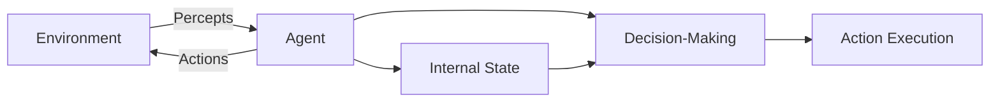
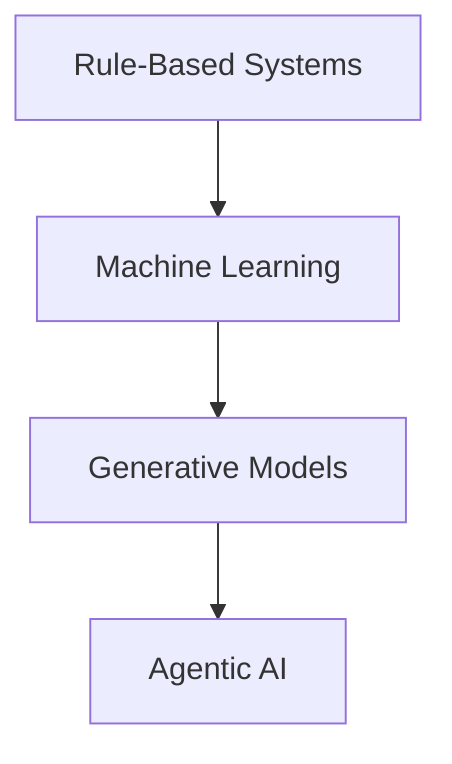
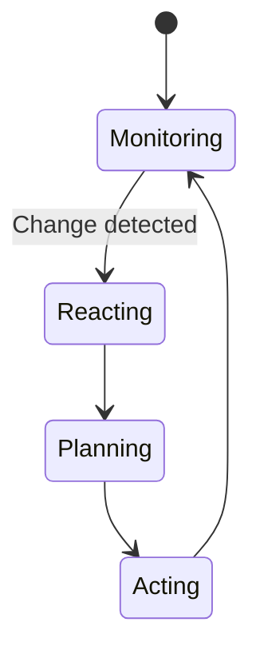
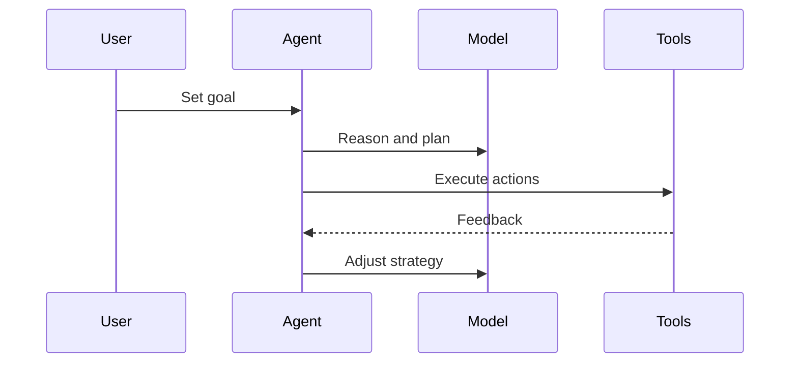
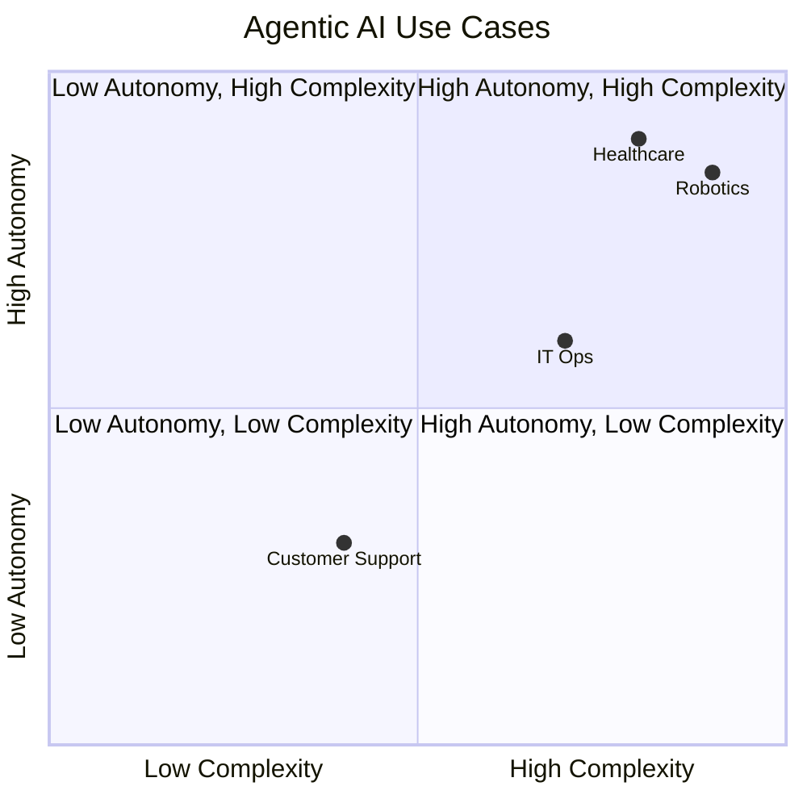

# Foundations of Agentic AI: Introduction to Agentic AI

## Learning Objectives

- Explain the defining properties of Agentic AI and autonomous agents
- Differentiate Agentic AI from traditional AI and generative models
- Analyze why agentic paradigms are increasingly important in complex systems
- Identify real-world domains where Agentic AI provides unique advantages

---

## Introduction

This chapter introduces the concept of Agentic AI, its historical context, and its relevance in modern AI systems. Learners will understand why agentic approaches have emerged and how they reshape the way intelligent systems are designed and deployed.

---

---

Artificial Intelligence has undergone several major paradigm shifts over the past decades. Early AI systems were designed as rigid, rule-following machines. Later, statistical learning and data-driven approaches allowed systems to recognize patterns and make predictions. More recently, generative models have demonstrated impressive abilities to produce text, images, and code. Yet, as AI systems are increasingly deployed in complex, dynamic, and real-world environments, a critical limitation has become clear: many AI systems can *respond*, but very few can truly *act*.

This gap has given rise to **Agentic AI**—a paradigm focused on building systems that do not merely generate outputs but actively pursue goals, make decisions over time, adapt to changing environments, and take initiative. Agentic AI reframes artificial intelligence as a collection of *agents* that perceive their surroundings, reason about possible actions, and autonomously influence the world to achieve objectives.

Understanding Agentic AI is essential for anyone seeking to design, evaluate, or deploy modern intelligent systems. From autonomous vehicles and AI research assistants to supply chain optimization and adaptive healthcare systems, agentic approaches are reshaping what AI can do and how it integrates into human workflows.

This chapter lays the foundation for Agentic AI by introducing its core concepts, historical roots, defining characteristics, and practical relevance. By the end, you will not only understand *what* Agentic AI is, but also *why* it matters and *where* it delivers unique value.

---

By the end of this chapter, you will be able to:

- Explain the defining properties of Agentic AI and autonomous agents  
- Differentiate Agentic AI from traditional AI systems and generative models  
- Analyze why agentic paradigms are increasingly important in complex, real-world systems  
- Identify real-world domains where Agentic AI provides unique and transformative advantages  

---

## Defining Agentic AI and Autonomous Agents

Agentic AI refers to artificial intelligence systems designed around the concept of **agency**—the capacity to act independently in an environment in pursuit of goals. Unlike passive systems that wait for inputs and produce outputs, agentic systems continuously perceive, decide, and act. This shift from *response-oriented* to *action-oriented* AI represents a fundamental change in system design philosophy.

At the core of Agentic AI is the notion of an **autonomous agent**. An autonomous agent is an entity—software, hardware, or hybrid—that operates within an environment, senses relevant information, makes decisions based on internal reasoning or learned models, and executes actions without requiring constant human intervention. Importantly, autonomy does not imply isolation; agents often collaborate with humans and other agents while retaining decision-making independence.

Historically, the concept of agents emerged from multiple disciplines. In philosophy, agency relates to intentional action. In economics, agents are decision-makers optimizing utility. In computer science, agents were formalized in distributed systems and artificial intelligence research as early as the 1980s and 1990s. Agentic AI synthesizes these perspectives, embedding intentionality, adaptability, and decision-making into computational systems.

Why does this matter? Many real-world problems are not static or fully predictable. Environments change, goals evolve, constraints emerge unexpectedly, and trade-offs must be managed over time. Agentic AI addresses these challenges by enabling systems to:

- Operate continuously rather than episodically  
- Balance short-term actions with long-term goals  
- Respond to unexpected events without predefined scripts  

A useful analogy is the difference between a **calculator** and a **personal assistant**. A calculator responds perfectly to explicit inputs but has no understanding of goals. A personal assistant, on the other hand, anticipates needs, prioritizes tasks, and adapts when plans change. Agentic AI aims to bring this assistant-like behavior into artificial systems.

### Core Components of an Autonomous Agent

While implementations vary, most agentic systems share several foundational components:

- **Perception**: Collecting information from the environment (e.g., sensors, APIs, user input)  
- **Decision-making**: Reasoning or learning mechanisms to choose actions  
- **Action execution**: Affecting the environment through tools, commands, or physical movement  
- **Internal state**: Memory or beliefs that persist over time  

These components interact in a continuous loop, as illustrated below.

### Agentic AI vs Simple Automation

It is important not to confuse Agentic AI with basic automation. A scripted automation follows predefined rules and fails when conditions deviate from expectations. An agentic system, by contrast, evaluates context, reasons about alternatives, and adapts its behavior.

| Aspect | Scripted Automation | Agentic AI |
|---|---|---|
| Flexibility | Low | High |
| Decision-making | Predefined rules | Contextual and adaptive |
| Goal awareness | None or implicit | Explicit and dynamic |
| Response to change | Breaks or fails | Adjusts behavior |

In practice, Agentic AI often builds on automation but adds layers of reasoning, learning, and autonomy that enable more robust behavior.

---

## Historical Evolution from Rule-Based Systems to Agents

The emergence of Agentic AI did not happen overnight. It represents the culmination of several waves of AI development, each responding to the limitations of the previous paradigm. Understanding this evolution clarifies *why* agentic approaches became necessary.

### Rule-Based and Symbolic AI

Early AI systems, particularly in the 1950s–1980s, relied heavily on **symbolic reasoning** and explicit rules. Expert systems encoded human knowledge in the form of “if–then” statements. For example, a medical expert system might contain rules such as: *If symptom A and symptom B are present, then consider diagnosis X.*

These systems worked well in narrow, well-defined domains. However, they struggled with complexity, ambiguity, and change. Updating rules was labor-intensive, and unforeseen situations often caused failures. Crucially, rule-based systems had no sense of agency—they did not pursue goals or adapt strategies.

### Statistical Learning and Machine Learning

The rise of machine learning in the 1990s and 2000s shifted AI toward data-driven approaches. Systems learned patterns from data rather than relying on handcrafted rules. This enabled breakthroughs in image recognition, speech processing, and recommendation systems.

Yet, most machine learning models remained **passive**. They mapped inputs to outputs but lacked an ongoing relationship with an environment. A classifier predicts; it does not act. Even reinforcement learning, which introduced decision-making over time, was often confined to simulated or highly controlled settings.

### Generative Models and Foundation Models

More recently, generative AI—powered by large-scale neural networks—has demonstrated remarkable capabilities in producing language, images, and code. These models can reason, explain, and even plan at a superficial level. However, they typically operate in a *prompt–response* mode.

Without an agentic framework, generative models:

- Do not track long-term goals  
- Do not initiate actions on their own  
- Do not manage multi-step tasks across time  

This limitation became increasingly evident as users attempted to use generative models for complex workflows.

### Emergence of Agentic Paradigms

Agentic AI emerged as a response to these limitations. Researchers and practitioners recognized that intelligence in real-world systems requires more than prediction or generation—it requires *control*, *adaptation*, and *persistence*.

Agentic paradigms integrate:

- Learning from data  
- Reasoning and planning  
- Continuous interaction with environments  

### Timeline of AI Paradigms

| Era | Dominant Paradigm | Key Limitation |
|---|---|---|
| 1950s–1980s | Rule-based AI | Brittle, hard to scale |
| 1990s–2010s | Machine Learning | Passive, task-specific |
| 2015–2022 | Generative Models | Lack of autonomy |
| 2023–present | Agentic AI | Emerging challenges (safety, control) |

This evolution reflects a growing recognition that intelligence is not just about knowledge—but about *purposeful action*.

---

## Key Characteristics of Agentic Behavior (Autonomy, Reactivity, Proactivity)

Agentic AI systems are defined not by a single capability, but by a constellation of behavioral characteristics. Among these, **autonomy**, **reactivity**, and **proactivity** are foundational. Together, they distinguish agents from traditional AI systems.

### Autonomy: Acting Without Constant Oversight

Autonomy refers to an agent’s ability to operate independently once given goals or constraints. An autonomous agent does not require step-by-step instructions; instead, it determines *how* to achieve objectives.

Autonomy exists on a spectrum. At one end are systems that require frequent human approval. At the other are systems that can plan, execute, and adjust actions over long periods. Importantly, autonomy does not eliminate human control—it redefines it. Humans shift from micromanaging actions to setting goals and boundaries.

Examples of autonomy include:

- A robotic vacuum that decides when and where to clean  
- An AI trading agent that adjusts strategies based on market conditions  
- A software agent that manages cloud resources dynamically  

### Reactivity: Responding to Environmental Change

Reactivity is the ability to perceive changes and respond in a timely manner. Environments are rarely static; users change preferences, systems fail, and new information emerges. Reactive agents continuously monitor their surroundings and update their behavior accordingly.

This capability is critical for safety and reliability. For instance, an autonomous vehicle must react instantly to obstacles. A cybersecurity agent must respond to emerging threats. Reactivity ensures that agents remain aligned with reality rather than operating on outdated assumptions.

### Proactivity: Taking Initiative

Proactivity distinguishes truly agentic systems from reactive ones. A proactive agent does not wait for events—it anticipates them. It initiates actions to achieve goals, prevent problems, or exploit opportunities.

Consider a human project manager who identifies a risk before it materializes and adjusts plans accordingly. Agentic AI aspires to this level of foresight.

### How These Characteristics Interact

| Characteristic | Description | Why It Matters |
|---|---|---|
| Autonomy | Independent decision-making | Reduces human workload |
| Reactivity | Timely response to change | Ensures robustness |
| Proactivity | Goal-driven initiative | Enables long-term success |

### Common Misconceptions

A frequent mistake is assuming that more autonomy is always better. In reality, autonomy must be balanced with oversight, transparency, and alignment with human values. Poorly designed autonomy can amplify errors rather than reduce them.

---

## Comparison with Traditional and Generative AI Systems

To fully appreciate Agentic AI, it is essential to compare it with other AI paradigms. While these systems share underlying technologies, their design goals and behaviors differ substantially.

### Traditional AI Systems

Traditional AI systems—including classifiers, recommenders, and rule-based engines—are typically designed for *single tasks*. They operate within narrow boundaries and rely on explicit inputs.

Strengths of traditional AI include predictability, ease of evaluation, and well-understood failure modes. However, they struggle with complex workflows that require coordination across tasks and time.

### Generative AI Systems

Generative models excel at producing rich outputs. They can write essays, generate images, and suggest plans. Yet, without an agentic framework, they remain reactive tools.

For example, a generative model can draft a project plan, but it cannot execute the plan, monitor progress, or revise actions based on outcomes unless embedded within an agent.

### Agentic AI Systems

Agentic AI systems integrate generative and predictive models within a control loop that enables action. They use generative capabilities for reasoning and communication, while relying on agentic structures for persistence and execution.

### Comparative Overview

| Dimension | Traditional AI | Generative AI | Agentic AI |
|---|---|---|---|
| Interaction style | Input–output | Prompt–response | Continuous loop |
| Goal persistence | None | Limited | Strong |
| Environment awareness | Minimal | Indirect | Direct |
| Action execution | Rare | None | Core capability |

### Trade-offs and Considerations

Agentic AI introduces new challenges:

- Increased system complexity  
- Harder evaluation and testing  
- Greater safety and alignment risks  

Despite these challenges, the benefits in complex domains often outweigh the costs.

---

## Current and Emerging Use Cases of Agentic AI

Agentic AI is already transforming multiple industries. Its value is most evident in domains characterized by complexity, uncertainty, and the need for continuous decision-making.

### Enterprise and Knowledge Work

In enterprise settings, agentic systems act as AI coworkers. They manage schedules, coordinate tasks, monitor metrics, and suggest interventions. Unlike static dashboards, these agents take initiative and follow through on actions.

### Robotics and Autonomous Systems

Robotics has long relied on agentic principles. Modern autonomous drones, warehouse robots, and self-driving cars exemplify agentic AI in physical environments. These systems must integrate perception, planning, and action seamlessly.

### Healthcare and Personalized Medicine

Agentic AI can monitor patients over time, adapt treatment plans, and alert clinicians proactively. This continuous engagement contrasts sharply with episodic diagnostic tools.

### Software Engineering and IT Operations

Agentic systems are increasingly used in DevOps to monitor infrastructure, respond to incidents, and optimize resource usage autonomously.

---

## Case Study: An Agentic AI Operations Assistant in Cloud Infrastructure

### Context

In the late 2010s, a global e-commerce company experienced rapid growth in its cloud infrastructure. The organization operated thousands of microservices across multiple regions, serving millions of users daily. The infrastructure team was responsible for ensuring uptime, performance, and cost efficiency.

Initially, the team relied on dashboards, alerts, and manual interventions. Engineers monitored metrics, investigated incidents, and applied fixes. As the system grew, this approach became unsustainable. Alert fatigue increased, response times slowed, and operational costs rose.

Leadership recognized the need for a more intelligent, adaptive approach—one that could operate continuously and reduce the cognitive burden on human engineers.

### Problem

The core challenge was complexity. Failures were rarely isolated; a small configuration change could cascade across services. Traditional monitoring tools could detect anomalies but could not diagnose causes or take corrective action.

Moreover, incidents often occurred outside business hours. On-call engineers faced burnout, and mean time to recovery (MTTR) remained high. The company needed a system that could *act*, not just notify.

### Solution

The company developed an agentic AI operations assistant. The system was designed as an autonomous agent with clear goals: maintain service availability, minimize costs, and reduce human intervention.

First, the agent integrated with monitoring systems to perceive real-time metrics. It maintained an internal state representing system health and historical incidents. Next, it used machine learning models to identify patterns and predict failures.

Crucially, the agent was granted controlled autonomy. It could restart services, adjust resource allocations, and roll back deployments within predefined safety boundaries. Human engineers defined policies and constraints, but the agent handled execution.

Over time, the agent learned from outcomes. Successful interventions reinforced strategies; failures triggered analysis and policy refinement.

### Results

Within six months, the company observed a significant reduction in incident frequency and severity. MTTR decreased by over 40%, and on-call workload dropped dramatically. Engineers reported higher job satisfaction, as they could focus on strategic improvements rather than firefighting.

The system was not perfect. Some edge cases still required human judgment, and extensive testing was needed to ensure safety. However, the agent consistently outperformed manual processes in speed and consistency.

### Lessons Learned

The project highlighted the importance of *bounded autonomy*. Giving the agent freedom within well-defined limits enabled trust and adoption. Transparency was also critical; engineers needed visibility into the agent’s decisions.

Perhaps most importantly, the case demonstrated that Agentic AI is not about replacing humans but about augmenting them. By handling routine decisions, the agent freed humans to focus on creativity and strategy.

---

## Summary

Agentic AI represents a significant evolution in artificial intelligence, shifting the focus from passive response to purposeful action. By embedding autonomy, reactivity, and proactivity into AI systems, agentic approaches enable continuous, goal-driven behavior in complex environments.

We explored how Agentic AI emerged from earlier paradigms, how it differs from traditional and generative systems, and why it is increasingly essential in modern applications. Through real-world use cases and a detailed case study, we saw how agentic systems deliver tangible value when designed thoughtfully.

As AI systems continue to integrate more deeply into society, understanding Agentic AI will be critical—not only for building effective systems, but for ensuring they act responsibly and align with human goals.

---

## Reflection Questions

1. In what types of environments do you think Agentic AI provides the greatest advantages, and why?  
2. How should designers balance autonomy and human oversight in agentic systems?  
3. Can you think of a task you perform daily that could benefit from an agentic AI assistant? What challenges might arise?  
4. How might Agentic AI change the roles and responsibilities of human workers in the next decade?