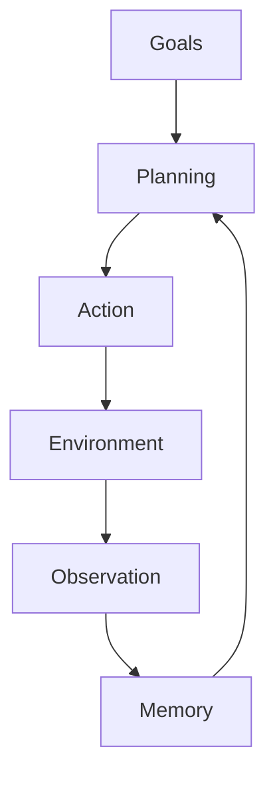
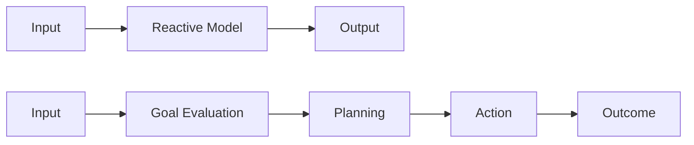
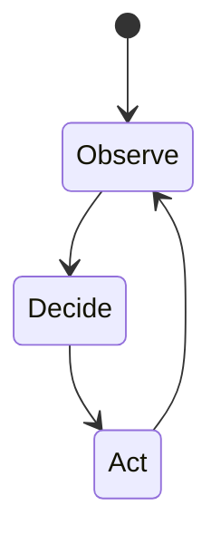
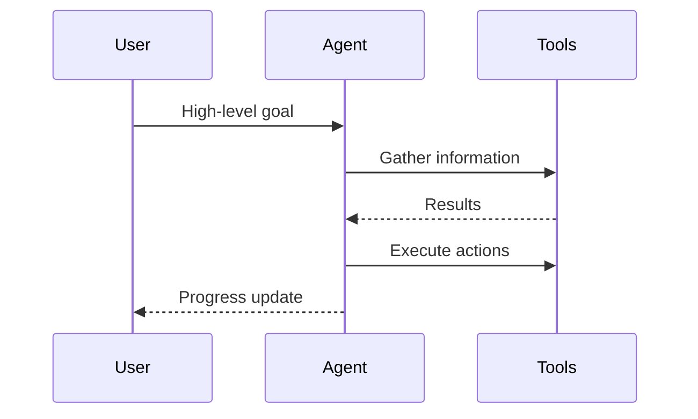
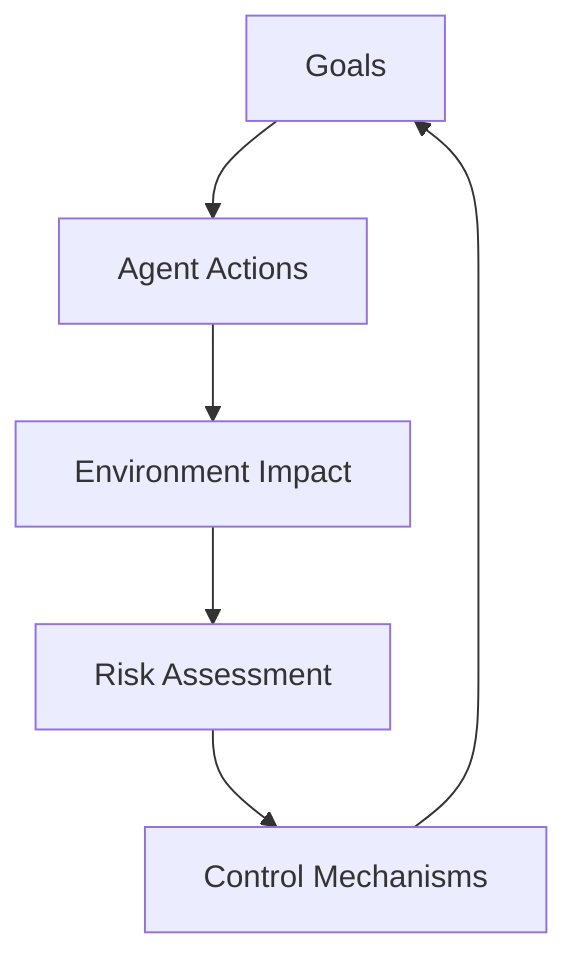

# Foundations of Agentic AI: Introduction to Agentic AI

## Learning Objectives

- Explain the defining characteristics of Agentic AI and how they differ from traditional AI paradigms
- Identify real-world scenarios where agentic behavior provides clear advantages
- Analyze the limitations of early agentic systems and articulate open research challenges

---

## Introduction

This chapter introduces the concept of Agentic AI, explaining what it is, why it matters, and how it differs from conventional AI systems. It sets the stage for deeper technical and architectural discussions in later chapters.

---

---

Artificial Intelligence has progressed rapidly over the past decades, moving from simple rule-based systems to powerful machine learning models capable of recognizing images, generating text, and predicting outcomes with impressive accuracy. Yet, despite these advances, many traditional AI systems remain *passive*: they respond to inputs but do not independently decide what to do next, how to adapt their behavior over time, or how to pursue longer-term objectives. This limitation becomes increasingly visible as we try to deploy AI in complex, dynamic, real-world environments.

Agentic AI represents a shift in how we think about intelligent systems. Instead of viewing AI as a tool that reacts to instructions, agentic AI treats AI systems as *actors*—entities that can set goals, plan actions, observe outcomes, and adjust their strategies over time. This chapter lays the foundation for understanding what agentic AI is, why it matters, and how it differs fundamentally from conventional AI approaches.

By grounding the discussion in intuitive examples, visual diagrams, and real-world use cases, this chapter prepares you for deeper technical and architectural discussions in later chapters. Think of this as learning the “mindset” behind agentic systems before diving into their inner mechanics.

---

By the end of this chapter, you will be able to:

- Explain the defining characteristics of Agentic AI and how they differ from traditional AI paradigms  
- Describe the evolution from reactive AI systems to agentic systems  
- Identify real-world scenarios where agentic behavior provides clear advantages  
- Analyze the limitations of early agentic systems and articulate open research challenges  

---

## Defining Agentic AI and Its Scope

Agentic AI refers to artificial intelligence systems that exhibit *agency*: the ability to act autonomously in pursuit of goals within an environment. Unlike conventional AI systems that execute predefined tasks or respond directly to user prompts, agentic systems can decide *what actions to take*, *when to take them*, and *how to adapt* based on feedback from the environment. This makes them especially suitable for complex, open-ended problems where all conditions cannot be specified in advance.

To understand this intuitively, consider the difference between a calculator and a personal assistant. A calculator performs calculations when you provide exact inputs. A personal assistant, however, might notice you have an upcoming meeting, check traffic conditions, reschedule reminders, and notify you proactively. Agentic AI aspires to bring this level of proactive, goal-oriented behavior into artificial systems across many domains.

The scope of agentic AI is broad and still evolving. It includes software agents that operate in digital environments (such as task-planning agents or autonomous code assistants), physical agents like robots and drones, and hybrid systems that interact with both digital and physical worlds. What unifies them is not the domain, but the presence of autonomy, goal-directedness, and adaptability.

Importantly, agentic AI is not a single algorithm or model. It is a *paradigm*—a way of designing systems that combine perception, reasoning, planning, and action. This paradigm often builds on existing technologies such as machine learning, reinforcement learning, and large language models, but extends them with mechanisms for memory, decision-making, and control.

### Agentic AI vs Traditional AI Systems

The distinction between agentic and traditional AI becomes clearer when we compare their core assumptions and behaviors.

| Dimension | Traditional AI Systems | Agentic AI Systems |
|---------|-----------------------|--------------------|
| Role | Tool that responds to inputs | Actor that initiates actions |
| Control | Mostly user-driven | Partially or fully autonomous |
| Time Horizon | Short-term, single-step | Long-term, multi-step |
| Adaptation | Limited or offline | Continuous, online |
| Examples | Image classifiers, chatbots | Autonomous assistants, robots |

Traditional AI systems excel in well-defined tasks with clear inputs and outputs. Agentic AI systems, by contrast, are designed for *ongoing interaction* with their environment, where decisions unfold over time and outcomes are uncertain.

### Conceptual Structure of an Agentic AI System

This diagram highlights a key idea: agentic AI operates in a loop. Goals inform planning, plans lead to actions, actions affect the environment, and observations feed back into memory and future plans.

---

## From Reactive Systems to Agentic Systems

Early AI systems were largely reactive. They operated on the principle of “input in, output out,” without maintaining internal goals or long-term state. A spam filter, for example, classifies emails as spam or not spam based on patterns learned from data. While effective, it does not decide to retrain itself, investigate new spam tactics, or coordinate with other systems unless explicitly programmed to do so.

Reactive systems are well-suited for stable environments where requirements are known in advance. However, as AI applications move into domains like autonomous driving, personalized education, and business process automation, environments become more dynamic and unpredictable. In such contexts, the inability to plan, adapt, and act autonomously becomes a bottleneck.

Agentic systems emerge as a response to these limitations. Instead of reacting to a single input, they maintain an internal model of the world, track progress toward goals, and choose actions accordingly. This transition mirrors a shift from reflexes to deliberate behavior in biological organisms. Reflexes are fast and reliable but limited; deliberate behavior allows for flexibility and foresight.

This evolution is not abrupt but gradual. Many modern systems lie somewhere between purely reactive and fully agentic. For example, recommendation systems may adapt based on user behavior (a step toward agency) but still lack explicit goal-setting or planning mechanisms.

### Evolution of AI System Capabilities

| Capability Level | Description | Example |
|------------------|-------------|---------|
| Reactive | Responds directly to inputs | Rule-based chatbot |
| Adaptive | Adjusts parameters over time | Recommendation engine |
| Goal-Oriented | Optimizes for defined objectives | Reinforcement learning agent |
| Agentic | Plans, acts, and adapts autonomously | Autonomous task assistant |

### Reactive vs Agentic Decision Flow

This comparison shows how agentic systems insert reasoning and planning steps between input and action, enabling more sophisticated behavior.

---

## Core Characteristics of Agency in AI

Agency in AI is not a single feature but a combination of interrelated characteristics. Together, these characteristics enable systems to operate with a degree of independence and intentionality that goes beyond traditional automation.

One fundamental characteristic is *autonomy*. An agentic system can operate without constant human intervention, deciding when and how to act. Autonomy does not mean the absence of constraints; rather, it means the system can make choices within defined boundaries. For example, an autonomous customer support agent might decide when to escalate a case to a human based on its assessment of complexity.

Another defining feature is *goal-directed behavior*. Agentic AI systems are guided by explicit or implicit objectives, such as minimizing cost, maximizing user satisfaction, or completing a task efficiently. These goals provide a unifying structure for decision-making over time, allowing the system to evaluate trade-offs and prioritize actions.

A third critical characteristic is *adaptation through feedback*. Agentic systems observe the consequences of their actions and adjust future behavior accordingly. This feedback loop enables learning from experience, whether through reinforcement learning, heuristic updates, or symbolic reasoning.

Finally, *contextual awareness and memory* allow agentic systems to maintain continuity over time. Memory enables agents to remember past interactions, track progress, and avoid repeating mistakes, making their behavior more coherent and human-like.

### Characteristics of Agency at a Glance

| Characteristic | Description | Why It Matters |
|---------------|-------------|----------------|
| Autonomy | Independent decision-making | Reduces human workload |
| Goals | Explicit objectives | Enables long-term planning |
| Feedback | Learning from outcomes | Improves performance over time |
| Memory | Retaining past information | Supports consistency and context |

### Internal Feedback Loop of an Agent

This simple state diagram illustrates the continuous cycle that underpins agentic behavior.

---

## Key Use Cases Driving Agentic AI Adoption

The growing interest in agentic AI is driven by practical needs across industries. As tasks become more complex and environments more dynamic, organizations seek systems that can operate with less supervision and greater flexibility.

In enterprise settings, agentic AI is transforming workflow automation. Instead of automating isolated steps, agentic systems can manage entire processes end-to-end. For example, an agent might monitor inventory levels, predict shortages, negotiate with suppliers, and place orders autonomously, adjusting its strategy based on market conditions.

In software development, agentic coding assistants are emerging that go beyond code completion. These agents can plan feature implementations, write and test code, debug errors, and even coordinate with other agents. This reduces cognitive load on developers and accelerates development cycles.

Healthcare provides another compelling domain. Agentic AI systems can monitor patients over time, adapt treatment recommendations based on responses, and coordinate care across providers. The agentic aspect is crucial here because patient health is dynamic and requires continuous adjustment rather than one-off predictions.

### Use Case Comparison

| Domain | Traditional AI Role | Agentic AI Advantage |
|------|---------------------|----------------------|
| Business Ops | Report generation | End-to-end process management |
| Software Dev | Code suggestions | Autonomous feature development |
| Healthcare | Diagnosis support | Continuous care coordination |
| Robotics | Predefined tasks | Adaptive navigation and control |

### Example: Autonomous Task Assistant

This sequence shows how an agent decomposes a high-level goal into actionable steps and interacts with tools to achieve it.

---

## Limitations and Open Questions in Early Agentic AI

Despite its promise, agentic AI is still in an early stage, and current systems face significant limitations. One major challenge is *reliability*. Autonomous decision-making increases the risk of unexpected behavior, especially in open-ended environments. Ensuring that agents act safely and predictably remains an active area of research.

Another limitation is *alignment*. Agentic systems optimize for goals, but specifying the “right” goals is difficult. Misaligned objectives can lead to undesirable outcomes, even if the system performs well according to its internal metrics. This problem becomes more pronounced as agents gain more autonomy.

Scalability is also a concern. Agentic systems often require complex planning, memory management, and environment modeling, which can be computationally expensive. Balancing sophistication with efficiency is a key engineering challenge.

Finally, there are open questions around *evaluation and accountability*. Traditional AI can be evaluated using benchmarks and test sets, but agentic behavior unfolds over time and across contexts. Developing robust methods to test, monitor, and audit agentic systems is essential for responsible deployment.

### Key Challenges in Early Agentic AI

| Challenge | Description | Open Question |
|---------|-------------|---------------|
| Reliability | Unpredictable behavior | How to ensure robustness? |
| Alignment | Misaligned objectives | How to define safe goals? |
| Scalability | High resource demands | How to optimize performance? |
| Evaluation | Hard to benchmark | How to measure success? |

### Risk and Control Loop

This diagram emphasizes the need for continuous monitoring and control in agentic systems.

---

## Summary

Agentic AI represents a fundamental shift from reactive, tool-like systems to autonomous, goal-driven actors capable of planning, acting, and adapting over time. By introducing concepts such as autonomy, goal-directed behavior, feedback loops, and memory, this paradigm enables AI systems to operate effectively in complex, dynamic environments.

We explored how AI has evolved from simple reactive systems toward agentic architectures, examined the core characteristics that define agency, and reviewed key use cases driving adoption across industries. At the same time, we highlighted important limitations and open questions that shape ongoing research and development.

This foundational understanding sets the stage for deeper exploration of agentic architectures, algorithms, and design patterns in subsequent chapters.

---

## Reflection Questions

1. How does the concept of agency change your expectations of what AI systems can and should do?  
2. In which real-world scenarios do you think agentic AI would provide the most value, and why?  
3. What risks do you associate with increased AI autonomy, and how might they be mitigated?  
4. How would you evaluate whether an agentic system is behaving “well” over long periods of time?