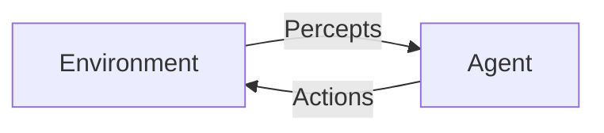
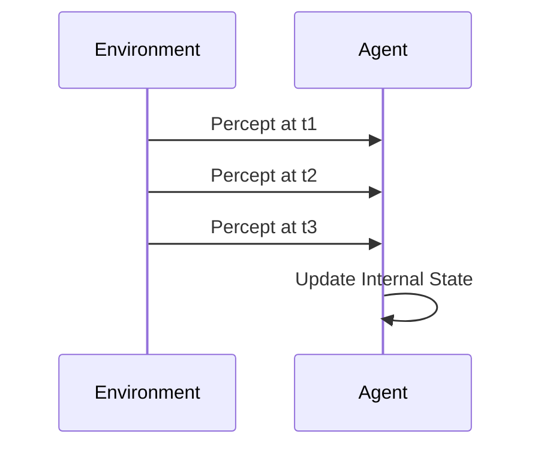
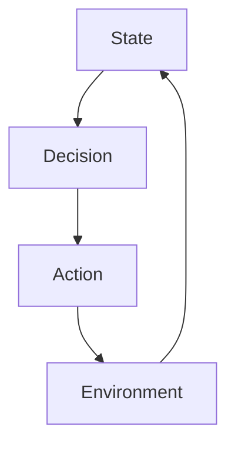
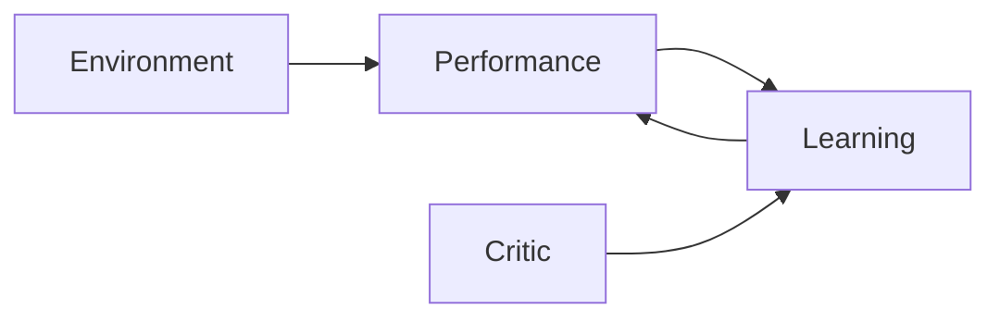

# Foundations of Agentic AI: Core Concepts of Intelligent Agents

## Learning Objectives

- Describe the agent–environment interaction loop in formal terms
- Evaluate different environment types and their impact on agent design
- Distinguish between various classes of intelligent agents
- Apply rationality concepts to assess agent performance

---

## Introduction

This chapter explores the theoretical foundations of intelligent agents, including environments, perceptions, actions, and rationality. It provides the conceptual vocabulary required to reason formally about agent behavior.

---

---

Artificial Intelligence has evolved far beyond static algorithms that merely compute answers. Modern AI systems are increasingly **agentic**—they perceive their surroundings, make decisions, take actions, and adapt over time to achieve goals. From autonomous vehicles navigating busy streets, to recommendation systems shaping digital experiences, to AI assistants coordinating complex workflows, the unifying idea behind these systems is the **intelligent agent**.

This chapter lays the **conceptual foundations** of Agentic AI. Rather than focusing on specific algorithms or technologies, we explore the *theoretical vocabulary* that allows us to reason precisely about agent behavior. Understanding agents, environments, perceptions, actions, and rationality is essential because these concepts form the mental model behind *every* intelligent system—regardless of whether it is rule-based, learning-based, symbolic, or neural.

We will progressively build understanding:

1. Start with what an agent is and how it interacts with its environment  
2. Examine how agents perceive the world and represent internal state  
3. Explore how agents act and exert control  
4. Define rationality and performance in formal terms  
5. Classify different types of agents and understand their trade-offs  

Throughout the chapter, you will encounter **concrete examples**, **real-world analogies**, **detailed case studies**, **tables for comparison**, and **visual diagrams** to make abstract ideas tangible and intuitive.

---

By the end of this chapter, you will be able to:

- Describe the agent–environment interaction loop using formal concepts  
- Evaluate different environment types and explain how they influence agent design  
- Distinguish between major classes of intelligent agents and their capabilities  
- Apply the concept of rationality and performance measures to assess agent behavior  

---

## Agents, Environments, and Interaction Models

An **intelligent agent** is best understood not as a piece of code in isolation, but as a system embedded in—and continuously interacting with—an **environment**. This interaction-centric view is foundational in AI theory because intelligence emerges from the *relationship* between an agent and the world it inhabits, not merely from internal computation.

### What Is an Agent?

At its core, an agent is anything that can be described as:

> **An entity that perceives its environment through sensors and acts upon that environment through actuators.**

This definition is intentionally broad. A human is an agent, but so is a thermostat, a chess-playing program, or a self-driving car. What differentiates simple agents from intelligent ones is not the presence of perception and action, but the *quality of decision-making* that connects the two.

Historically, this definition became prominent through early AI research in the 1950s–1990s, especially in the work of researchers who wanted a unifying abstraction that could apply equally to symbolic AI systems and later to learning-based systems. By framing AI systems as agents, researchers gained a powerful lens to analyze behavior across domains.

Agents can be:

- **Physical agents**: robots, drones, autonomous vehicles  
- **Software agents**: trading bots, recommendation systems, game-playing agents  
- **Hybrid agents**: systems that combine physical presence with digital intelligence  

### Understanding Environments

An **environment** is everything external to the agent that it can potentially perceive and influence. Environments are not just passive backgrounds; they actively shape what an agent can and cannot do.

Consider how different environments impose different constraints:

- A chess environment has clear rules, full observability, and deterministic outcomes  
- A real-world driving environment is partially observable, stochastic, and dynamic  
- A stock market environment is adversarial, uncertain, and influenced by many agents  

The importance of environments lies in the fact that **no agent design is universally optimal**. An agent that performs well in one environment may fail completely in another.

### The Agent–Environment Interaction Loop

The interaction between an agent and its environment unfolds as a continuous loop:

1. The environment is in some state at time *t*  
2. The agent perceives part of that state through sensors  
3. The agent selects an action based on its decision mechanism  
4. The action affects the environment, leading to a new state at time *t+1*  

This loop repeats indefinitely, forming the backbone of all agent behavior.

What makes this loop powerful is that it abstracts away implementation details. Whether the agent uses rules, search, planning, or neural networks, it still fits this same interaction pattern.

### Types of Environments and Their Impact

Different environments pose fundamentally different challenges. AI theory commonly classifies environments along several dimensions:

| Environment Property | Description | Example |
|---|---|---|
| Observable vs Partially Observable | Whether the agent can perceive the full state | Chess vs Poker |
| Deterministic vs Stochastic | Whether actions have predictable outcomes | Calculator vs Weather |
| Episodic vs Sequential | Whether actions affect future decisions | Image labeling vs Driving |
| Static vs Dynamic | Whether environment changes during deliberation | Crossword vs Traffic |
| Single-agent vs Multi-agent | Whether other agents influence outcomes | Maze vs Market |

These properties matter because they dictate **what kinds of reasoning are feasible**. For example, perfect planning is possible in deterministic environments but becomes impractical in stochastic ones.

### Why Interaction Models Matter

The agent–environment framework provides:

- A **formal language** for comparing different AI systems  
- A way to reason about **limitations and trade-offs**  
- A foundation for later concepts like learning, planning, and cooperation  

Without this abstraction, AI systems would appear as isolated solutions rather than instances of a broader theory of intelligent behavior.

---

## Perception, Sensors, and State Representation

Perception is the agent’s window into the world. Without perception, an agent is blind—unable to ground its decisions in reality. However, perception is rarely perfect, and how an agent **represents what it perceives** often matters more than the raw sensory input itself.

### The Role of Perception in Intelligent Behavior

Perception refers to the process by which an agent receives information about the environment through **sensors**. Sensors can be physical (cameras, microphones, GPS) or abstract (API responses, database queries, game state variables).

From a theoretical standpoint, perception answers one fundamental question:

> *What information does the agent have available when making decisions?*

This question is crucial because decision quality is always bounded by information quality. Even the most sophisticated reasoning system will fail if it perceives the wrong thing—or too little.

Historically, early AI systems assumed *perfect perception*, which simplified reasoning but limited real-world applicability. As AI moved into messy, real environments, perception became one of the hardest challenges.

### Sensors and Percepts

A **sensor** is the mechanism that produces a **percept**, which is a piece of information about the environment at a specific time.

Examples include:

- A camera producing pixel arrays  
- A temperature sensor producing numeric readings  
- A web crawler retrieving text content  
- A game API returning board positions  

Importantly, sensors do not deliver “truth”—they deliver **signals**. These signals may be noisy, delayed, incomplete, or ambiguous.

### Percept Sequences and Internal State

An agent rarely acts based on a single percept. Instead, it relies on a **percept sequence**—the history of everything it has perceived so far.

However, storing raw percept sequences is often impractical. Instead, agents construct an **internal state**, a compact representation that summarizes relevant aspects of the world.

Internal state representation is where design choices matter deeply:

- Too simple → agent lacks situational awareness  
- Too complex → agent becomes computationally inefficient  

### State Representation Strategies

| Representation Type | Description | Example |
|---|---|---|
| Raw State | Direct storage of percepts | Pixel frames |
| Feature-based | Extracted meaningful variables | Speed, distance |
| Symbolic | Discrete symbols and relations | “Car ahead” |
| Belief State | Probabilistic estimate of world | Bayesian filters |

Each approach involves trade-offs between accuracy, interpretability, and computational cost.

### Why State Representation Is Central

State representation determines:

- What patterns the agent can recognize  
- What predictions it can make  
- What actions it can justify  

In practice, many failures of intelligent systems stem not from poor algorithms, but from **poor representations of reality**.

---

## Action Spaces, Actuators, and Control

Perception alone does not make an agent intelligent. Intelligence becomes visible only when an agent **acts**—when it exerts influence on the environment in pursuit of goals.

### Understanding Actions and Actuators

An **action** is any operation an agent can perform that affects the environment. Actions are executed through **actuators**, which are the mechanisms that implement those actions.

Examples include:

- Steering wheels and brakes for cars  
- Robotic arms and grippers  
- API calls in software agents  
- Text outputs in conversational agents  

The set of all possible actions available to an agent is known as its **action space**.

### Action Space Design

Action spaces can be:

| Action Space Type | Characteristics | Example |
|---|---|---|
| Discrete | Finite, countable actions | Chess moves |
| Continuous | Infinite range of values | Steering angle |
| Hybrid | Combination of both | Robot navigation |

The structure of the action space has a profound impact on control complexity. Continuous action spaces, for example, require sophisticated control theory or learning techniques.

### Control and Decision Making

Control refers to how an agent selects actions over time. This involves:

1. Evaluating the current state  
2. Predicting the effects of possible actions  
3. Choosing an action aligned with goals  

Control can be reactive (responding immediately to stimuli) or deliberative (planning ahead). Many modern agents combine both.

### Constraints and Real-World Considerations

Real-world action is constrained by:

- Physical limits (speed, energy)  
- Safety requirements  
- Uncertainty in outcomes  

Effective agents must balance ambition with caution, especially in safety-critical domains.

---

## Rational Agents and Performance Measures

Rationality is the normative concept at the heart of Agentic AI. It answers the question: *What does it mean for an agent to behave correctly?*

### Defining Rationality

A **rational agent** is one that selects actions expected to maximize its **performance measure**, given its percept sequence and built-in knowledge.

This definition is subtle but powerful. Rationality does not mean:

- Always succeeding  
- Knowing everything  
- Acting perfectly  

Instead, rationality means **doing the best possible thing given what the agent knows and can do**.

### Performance Measures

A performance measure defines success from the perspective of the environment designer, not the agent itself.

Examples include:

- Safety and efficiency for autonomous vehicles  
- Win rate for game-playing agents  
- User satisfaction for recommendation systems  

| Performance Measure | Focus | Risk |
|---|---|---|
| Single-metric | Simple optimization | Gaming the metric |
| Multi-metric | Balanced objectives | Complexity |
| Long-term | Sustainability | Delayed feedback |

### Expected Utility and Trade-offs

Rational agents often operate under uncertainty. They must evaluate **expected outcomes**, not guaranteed ones.

This leads to trade-offs such as:

- Exploration vs exploitation  
- Short-term gain vs long-term reward  
- Risk vs reward  

Understanding these trade-offs is key to evaluating agent behavior fairly.

---

## Agent Typologies and Classification

Not all agents are created equal. AI theory classifies agents based on how they make decisions and how much internal sophistication they possess.

### Major Agent Types

| Agent Type | Description | Strengths | Limitations |
|---|---|---|---|
| Simple Reflex | Condition–action rules | Fast | No memory |
| Model-Based | Internal world model | Handles change | Complexity |
| Goal-Based | Explicit goals | Flexibility | Planning cost |
| Utility-Based | Preference optimization | Trade-offs | Design difficulty |
| Learning Agent | Improves over time | Adaptability | Data dependence |

### Learning Agents

Learning agents are especially important in modern AI. They include components for:

- Performance  
- Learning  
- Criticism  
- Exploration  

### Choosing the Right Agent Type

The “best” agent type depends on:

- Environment complexity  
- Availability of data  
- Safety requirements  
- Computational constraints  

Misclassification often leads to over-engineering or under-performance.

---

## Case Study: Autonomous Warehouse Robots

### Context

In the late 2010s, large e-commerce companies faced mounting pressure to speed up order fulfillment. Warehouses grew to the size of multiple football fields, staffed by thousands of workers navigating dense aisles of inventory. Human-driven processes were slow, error-prone, and physically demanding.

One global retailer decided to deploy autonomous warehouse robots to transport shelves of products to human packers. These robots needed to operate continuously, safely, and efficiently in a dynamic, multi-agent environment.

### Problem

The environment was partially observable and highly dynamic. Robots had limited sensor ranges, humans moved unpredictably, and paths frequently changed due to congestion. Traditional rule-based automation failed because it could not adapt to real-time variability.

The challenge was to design agents that could:

- Perceive local surroundings accurately  
- Navigate efficiently without collisions  
- Optimize long-term throughput rather than short-term speed  

### Solution

Engineers modeled each robot as an intelligent agent with:

- Sensors (lidar, cameras) for perception  
- Internal state tracking local maps and goals  
- A hybrid action space combining discrete routing decisions and continuous motion control  

Rationality was defined using a multi-objective performance measure balancing speed, safety, and energy efficiency. Learning components allowed robots to adapt routes based on congestion patterns.

### Results

After deployment:

- Order fulfillment speed increased by over 30%  
- Workplace injuries dropped significantly  
- System throughput scaled smoothly with warehouse size  

However, limitations remained. Rare edge cases required human intervention, highlighting the ongoing challenge of perception under uncertainty.

### Lessons Learned

The project demonstrated that agentic AI succeeds when:

- Environment properties are explicitly modeled  
- Rationality is carefully defined  
- Learning is grounded in strong state representation  

It also showed that no agent is universally optimal—success depends on alignment between agent design and environment structure.

---

## Summary

This chapter introduced the foundational concepts of Agentic AI. We explored how intelligent agents interact with environments through perception and action, how internal state enables reasoning over time, why rationality depends on well-defined performance measures, and how different agent types embody different design trade-offs.

Together, these concepts form a **conceptual toolkit** for reasoning formally about intelligent behavior—one that applies across domains, technologies, and generations of AI systems.

---

## Reflection Questions

1. How does partial observability change what it means for an agent to be rational?  
2. Can an agent be rational but still fail in practice? Why or why not?  
3. How would you design a performance measure for an AI tutor or healthcare assistant?  
4. Which agent type would you choose for a smart home system, and why?