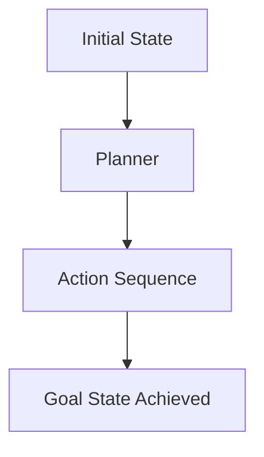
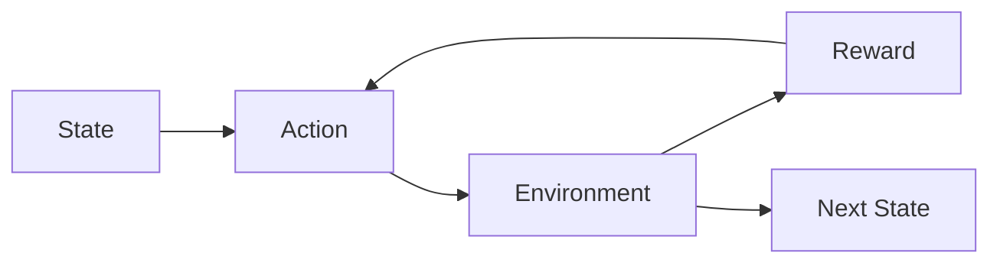
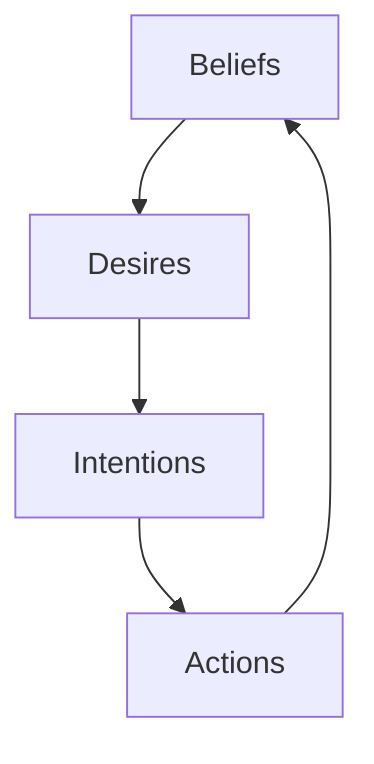
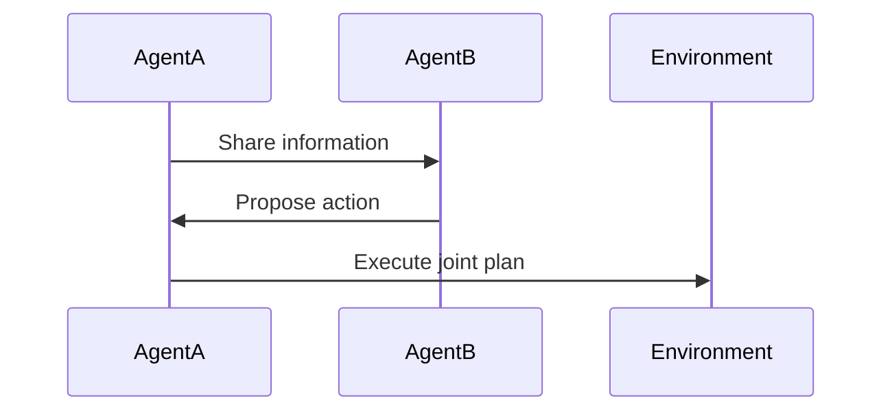
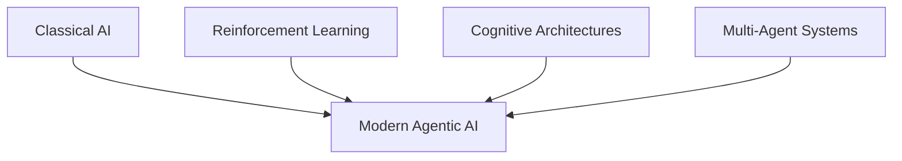

# Foundations of Agentic AI: Historical and Theoretical Foundations

## Learning Objectives

- Trace the historical evolution of ideas leading to modern Agentic AI
- Compare theoretical foundations and their influence on agent design
- Evaluate how past approaches inform current agentic architectures

---

## Introduction

This chapter explores the intellectual roots of Agentic AI, drawing from AI planning, reinforcement learning, cognitive science, and multi-agent systems. Understanding these roots helps learners reason about design trade-offs.

---

---

Agentic AI—systems that can perceive their environment, make decisions, and take actions toward goals—did not emerge overnight. Instead, it is the result of decades of intellectual exploration across multiple disciplines, including classical artificial intelligence, reinforcement learning, cognitive science, and multi-agent systems. Each of these fields contributed key ideas about **agency**, **decision-making**, **learning**, and **interaction** that shape how modern AI agents are designed today.

Understanding these historical and theoretical foundations is crucial for anyone building or reasoning about agentic systems. Without this background, modern architectures may seem like ad hoc collections of techniques. With it, learners can see clear lines of evolution: why some design choices emphasize planning over learning, why others prioritize adaptability, and why coordination among multiple agents has become increasingly important.

This chapter takes a guided journey through these roots. We begin with early symbolic AI and planning systems, move through reinforcement learning and human-inspired cognitive models, explore multi-agent dynamics, and finally connect these ideas to modern agentic AI systems. Along the way, we focus not just on *what* these approaches are, but *why* they matter and *how* they continue to influence contemporary AI.

---

By the end of this chapter, you will be able to:

- Trace the historical evolution of ideas that led to modern Agentic AI  
- Compare key theoretical foundations and understand their influence on agent design  
- Evaluate how earlier approaches inform and constrain today’s agentic architectures  
- Reason about design trade-offs using historical and theoretical context  

---

## Classical AI, Planning, and Decision-Making Roots

Classical AI, often referred to as **symbolic AI**, laid the earliest foundations for agentic thinking. Emerging in the 1950s and 1960s, this paradigm viewed intelligence as the manipulation of symbols according to formal rules. Early AI researchers believed that if knowledge about the world could be explicitly represented, then intelligent behavior would naturally follow from logical reasoning over that knowledge. This perspective strongly shaped early notions of artificial agents as rational problem solvers.

At the heart of classical AI was **planning**—the idea that an agent could reason about future actions before executing them. Planning systems represented the world in terms of states, actions, preconditions, and effects. Given a goal state, the agent would search for a sequence of actions that transformed the current state into the desired one. This approach mirrors how humans often solve structured problems, such as planning a route for a road trip or scheduling tasks for a project.

However, classical planning assumed relatively static, fully observable environments. Real-world uncertainty, incomplete information, and dynamic changes posed serious challenges. Despite these limitations, classical AI introduced enduring ideas that remain central to agentic systems today: goal-directed behavior, explicit reasoning, and the separation between **decision-making** and **execution**.

### Key Characteristics of Classical Planning Agents

- Explicit symbolic representations of the world  
- Deterministic action models with clear preconditions and effects  
- Goal-oriented reasoning using search algorithms  
- Limited ability to adapt to unexpected changes  

### Example: STRIPS Planning System

The STRIPS (Stanford Research Institute Problem Solver) system is a canonical example of classical planning. It represented actions using logical predicates and searched for action sequences to achieve goals, such as navigating a robot through rooms.

### Classical AI Planning vs Real-World Decision-Making

| Aspect | Classical AI Planning | Real-World Agents |
|---|---|---|
| Environment | Static, fully known | Dynamic, partially observable |
| Uncertainty | Minimal | High |
| Adaptation | Limited | Continuous |
| Knowledge | Explicit, symbolic | Often implicit or learned |

Despite its constraints, classical AI provided the conceptual scaffolding for later agentic approaches. Modern agents still use planning modules, especially in structured domains like logistics, robotics, and game AI.

---

## Reinforcement Learning and Sequential Decision Processes

Reinforcement Learning (RL) marked a significant shift from symbolic reasoning toward **learning from interaction**. Instead of relying on predefined rules, RL agents learn optimal behavior through trial and error by receiving feedback from the environment. This paradigm reframed intelligence as the ability to improve decisions over time based on experience, aligning closely with how animals and humans learn.

At the core of reinforcement learning is the **sequential decision-making problem**. An agent observes a state, takes an action, receives a reward, and transitions to a new state. Over many iterations, the agent learns a policy—a mapping from states to actions—that maximizes cumulative reward. This framework is commonly formalized using **Markov Decision Processes (MDPs)**.

Reinforcement learning introduced adaptability and robustness that classical AI lacked. Agents could now operate in uncertain environments and improve performance without explicit programming. However, this flexibility came at the cost of interpretability and sample efficiency, raising new design trade-offs for agentic systems.

### Components of a Reinforcement Learning Agent

- **Agent**: The decision-maker  
- **Environment**: Everything the agent interacts with  
- **State**: Current situation of the agent  
- **Action**: Choice made by the agent  
- **Reward**: Feedback signal guiding learning  

### Classical Planning vs Reinforcement Learning

| Dimension | Classical Planning | Reinforcement Learning |
|---|---|---|
| Knowledge | Predefined | Learned |
| Adaptation | Low | High |
| Uncertainty Handling | Poor | Strong |
| Explainability | High | Often Low |

### Real-World Example: Game-Playing Agents

RL has powered agents that surpass human performance in games like Go and Chess. These environments are ideal testbeds because they offer clear reward signals and well-defined rules, allowing agents to learn complex strategies through self-play.

Reinforcement learning’s emphasis on learning from experience deeply influenced modern agentic AI, especially in environments where explicit modeling is infeasible.

---

## Cognitive Architectures and Human Agency Models

Cognitive architectures aim to model intelligence by drawing inspiration from **human cognition**. Instead of focusing solely on optimal decision-making, these frameworks seek to replicate how humans perceive, reason, remember, and act. This approach reframed agents as systems with internal mental structures rather than purely reactive or reward-maximizing entities.

Prominent cognitive architectures such as **SOAR**, **ACT-R**, and **BDI (Belief-Desire-Intention)** introduced concepts like memory systems, goals, intentions, and reasoning cycles. These models emphasized bounded rationality—the idea that agents operate under constraints of limited knowledge, time, and computational resources.

For agentic AI, cognitive architectures highlighted the importance of **internal state**, long-term goals, and explainable reasoning. They provided a bridge between symbolic AI and learning-based approaches by integrating structured reasoning with adaptive behavior.

### The BDI Model of Agency

The BDI framework is particularly influential in agentic AI. It models agents as having:

- **Beliefs**: Information about the world  
- **Desires**: Goals or objectives  
- **Intentions**: Committed plans of action  

### Cognitive Architectures vs Reinforcement Learning

| Aspect | Cognitive Architectures | Reinforcement Learning |
|---|---|---|
| Inspiration | Human cognition | Behavioral psychology |
| Internal Models | Rich, explicit | Often implicit |
| Explainability | High | Low |
| Learning | Limited or hybrid | Central |

### Case Study: Intelligent Personal Assistants

Modern digital assistants borrow from cognitive architectures by maintaining user preferences (beliefs), goals (desires), and planned tasks (intentions). While powered by machine learning, their agentic behavior reflects cognitive modeling principles.

Cognitive architectures remind us that intelligence is not just about optimization—it is also about coherence, interpretability, and alignment with human expectations.

---

## Multi-Agent Systems and Emergent Behavior

As AI systems moved from isolated agents to interconnected environments, **multi-agent systems (MAS)** became increasingly important. These systems study how multiple agents interact, cooperate, compete, and collectively produce complex behaviors that may not be predictable from individual agents alone.

Multi-agent research introduced ideas of **coordination**, **communication**, and **emergence**. Emergent behavior occurs when simple local rules lead to complex global patterns, much like ant colonies or traffic flows. This perspective shifted agentic AI from individual intelligence to collective intelligence.

MAS also raised new challenges, such as negotiation, trust, and conflict resolution. Designing agents that can operate effectively alongside others requires understanding not only decision-making, but also social dynamics and strategic reasoning.

### Types of Multi-Agent Interactions

- Cooperative (shared goals)  
- Competitive (opposing goals)  
- Mixed-motive (partially aligned goals)  

### Single-Agent vs Multi-Agent Systems

| Dimension | Single-Agent | Multi-Agent |
|---|---|---|
| Complexity | Lower | Higher |
| Coordination | Not needed | Essential |
| Emergence | Rare | Common |
| Scalability | Limited | High |

### Example: Traffic Signal Coordination

In smart cities, traffic lights act as agents that coordinate with neighbors. No single light controls the entire system, yet efficient traffic flow emerges from local interactions—a hallmark of multi-agent intelligence.

Multi-agent systems strongly influence modern agentic AI, especially in distributed, decentralized, and real-world environments.

---

## Evolution Toward Modern Agentic AI

Modern agentic AI represents a synthesis of these historical threads. Today’s systems combine planning, learning, cognitive modeling, and multi-agent interaction into hybrid architectures. For example, a modern autonomous agent may use planning for short-term decisions, reinforcement learning for adaptation, and symbolic reasoning for high-level goals.

Large language models (LLMs) have further accelerated this evolution by enabling agents to reason, communicate, and plan using natural language. These capabilities echo symbolic AI while leveraging data-driven learning, effectively reconnecting old and new paradigms.

Crucially, understanding this evolution helps designers reason about **trade-offs**. Should an agent prioritize adaptability or explainability? Centralized control or decentralized coordination? These questions are best answered with historical awareness.

### Foundations and Their Modern Influence

| Historical Root | Key Contribution | Modern Impact |
|---|---|---|
| Classical AI | Planning, goals | Task decomposition |
| Reinforcement Learning | Learning from feedback | Adaptation |
| Cognitive Architectures | Internal state | Explainability |
| Multi-Agent Systems | Coordination | Scalability |

Modern agentic AI is not a replacement of past ideas but their integration, refined by decades of experimentation and theory.

---

## Summary

This chapter explored the deep intellectual roots of Agentic AI, tracing its evolution from classical symbolic reasoning to learning-based, cognitively inspired, and multi-agent systems. Each historical approach contributed essential insights into how agents can reason, learn, adapt, and interact.

By understanding these foundations, learners gain more than historical knowledge—they acquire a framework for reasoning about design decisions in modern agentic systems. Agentic AI is best understood not as a single technique, but as a layered synthesis of ideas developed over time.

---

## Reflection Questions

1. How do the assumptions of classical AI planning limit its applicability in real-world environments?  
2. In what scenarios would reinforcement learning be preferred over symbolic planning, and why?  
3. What advantages do cognitive architectures offer for explainable and aligned AI systems?  
4. How does emergent behavior challenge traditional notions of control in AI systems?  
5. Which historical foundations do you think will most strongly shape the next generation of agentic AI, and why?