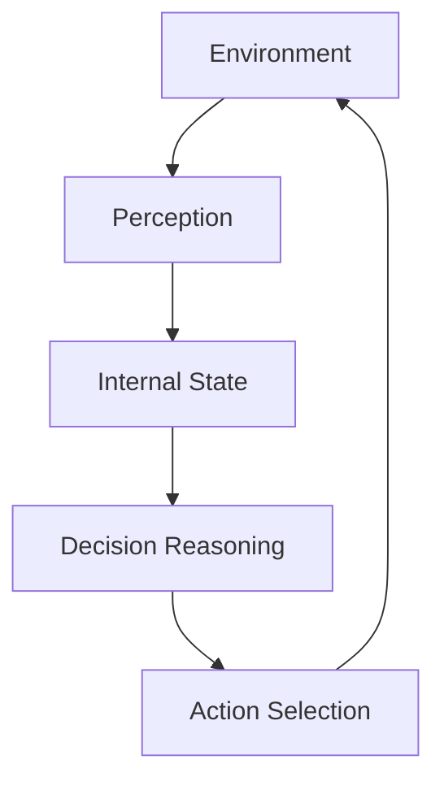
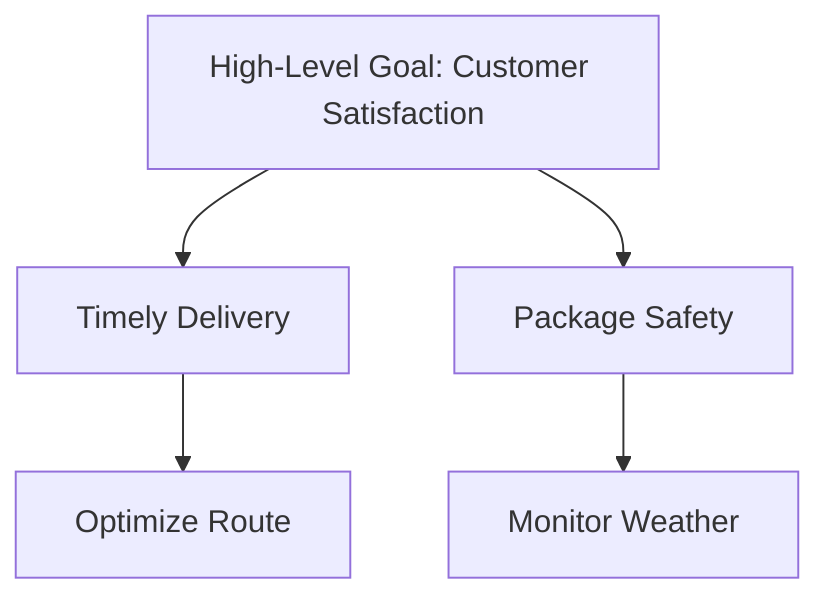
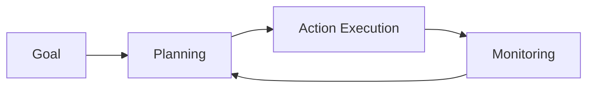
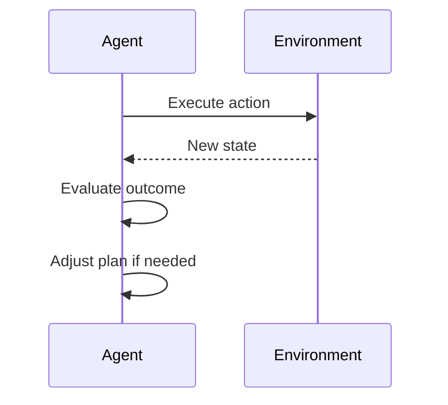
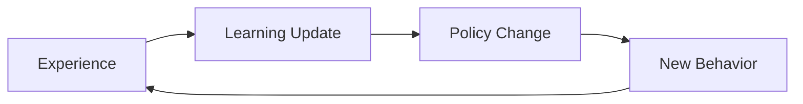
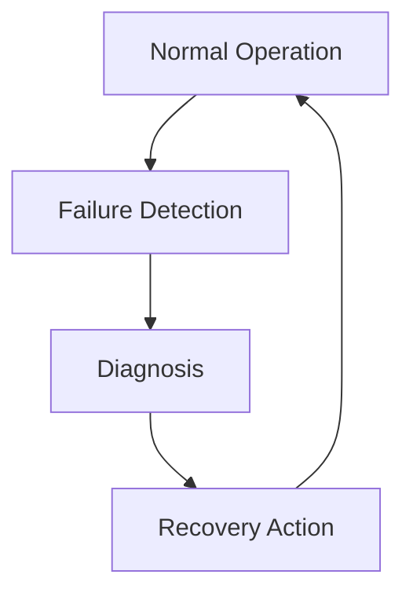

# Foundations of Agentic AI: Core Principles of Agentic Behavior

## Learning Objectives

- Describe the core principles that define agentic behavior
- Analyze how goals and plans are represented and managed in agents
- Assess trade-offs between autonomy, control, and robustness

---

## Introduction

This chapter focuses on the essential principles that enable agency, such as autonomy, goal orientation, and adaptability. These principles form the conceptual backbone for all agentic systems.

---

---

Agentic AI represents a shift from passive, reactive systems toward **active entities that pursue objectives, make decisions, and adapt over time**. Instead of merely responding to user commands, agentic systems exhibit behaviors that resemble purposeful action: they decide *what* to do, *how* to do it, and *when* to change course. This capability is essential for modern applications such as autonomous robots, digital assistants, automated scientific discovery, and self-managing software systems.

At the heart of these systems lie a set of **foundational principles** that make agency possible. Concepts like autonomy, goal orientation, planning, learning, and robustness form the conceptual backbone of all agentic behavior. Without these principles, an AI system remains a tool; with them, it becomes an agent.

This chapter builds a deep understanding of these core principles. We begin with the idea of autonomy and independent decision-making, then explore how agents represent and organize goals. We examine how agents plan, act, and monitor their behavior in continuous loops, how they learn and adapt over time, and finally how they remain robust in the face of failure and uncertainty. Together, these principles explain *why agentic systems behave the way they do* and *how designers can balance autonomy, control, and reliability*.

---

By the end of this chapter, you will be able to:

- Describe the core principles that define agentic behavior  
- Analyze how goals and plans are represented and managed in agentic systems  
- Explain how planning, acting, monitoring, and learning interact over time  
- Assess trade-offs between autonomy, control, and robustness in real-world agents  
- Apply these principles to practical examples and design scenarios  

---

## Autonomy and Independent Decision-Making

Autonomy is the defining characteristic that separates agentic systems from traditional software. An autonomous agent can make decisions **without constant external intervention**, using its own internal state, goals, and perceptions. This does not mean the agent acts randomly or uncontrollably; rather, it means the agent has **delegated authority** to choose actions within defined boundaries.

At a basic level, autonomy answers the question: *Who decides what to do next?* In non-agentic systems, this decision is made by a human or a fixed script. In agentic systems, the decision is made by the system itself, based on its internal reasoning. For example, a thermostat that simply turns heating on or off based on temperature thresholds has limited autonomy. In contrast, a smart energy-management agent that decides when to heat, cool, or store energy based on forecasts, costs, and user habits demonstrates higher autonomy.

Autonomy exists on a **spectrum**, not as a binary property. Some agents are tightly constrained, while others operate with broad freedom. Understanding this spectrum is crucial because higher autonomy often brings greater flexibility—but also greater risk.

### Degrees of Autonomy

| Level of Autonomy | Description | Example |
|------------------|------------|---------|
| Reactive | Responds directly to stimuli | Simple game NPC |
| Rule-based | Chooses actions from predefined rules | Workflow automation |
| Goal-directed | Selects actions to achieve goals | Delivery route optimizer |
| Self-directed | Sets and revises its own goals | Research assistant agent |

This table highlights that autonomy grows as agents gain control over *decision-making*, not just *execution*.

### How Autonomous Decisions Are Made

Autonomous decision-making typically involves three internal components:

- **Perception**: Understanding the current state of the environment  
- **Reasoning**: Evaluating possible actions and their consequences  
- **Action selection**: Choosing the best action according to goals and constraints  

The following diagram illustrates this internal decision loop:

This loop runs continuously, allowing the agent to remain responsive while acting independently.

### Trade-offs: Autonomy vs. Control

While autonomy enables flexibility and scalability, it introduces challenges:

- Highly autonomous agents may behave in **unexpected ways**
- Reduced human oversight can increase **risk and responsibility**
- Designers must carefully define **constraints and safety boundaries**

Consider autonomous vehicles: granting full autonomy allows faster reactions and scalability, but requires robust safeguards to ensure safety. As a result, many real-world systems use **shared autonomy**, where humans and agents jointly control decisions.

---

## Goal Representation and Goal Hierarchies

Goals give agentic behavior its *direction*. Without goals, autonomy has no purpose. A goal defines a desired future state that the agent seeks to bring about through its actions. Effective goal representation allows agents to reason, prioritize, and adapt when circumstances change.

Simple systems may have a single fixed goal, such as “keep the room temperature at 22°C.” However, most real-world agents must manage **multiple goals**, often with competing priorities. For example, a delivery drone must balance speed, energy efficiency, safety, and regulatory compliance.

### What Makes a Good Goal Representation?

A goal must be represented in a way that supports reasoning and evaluation. Common properties include:

- **Explicitness**: The goal is clearly defined and machine-readable  
- **Measurability**: Progress toward the goal can be evaluated  
- **Flexibility**: The goal can be adjusted or refined  

Different systems use different representations, as shown below.

| Goal Representation | Description | Example |
|--------------------|------------|---------|
| State-based | Desired world state | “Package delivered” |
| Utility-based | Maximization of a score | Maximize delivery profit |
| Constraint-based | Conditions to satisfy | Stay within safety limits |

### Goal Hierarchies: From Abstract to Concrete

Most agents organize goals into **hierarchies**, where high-level goals are decomposed into smaller sub-goals. This mirrors human behavior: “stay healthy” becomes “exercise regularly,” which becomes “go for a run today.”

Hierarchies allow agents to reason at multiple levels of abstraction, making complex behavior manageable.

### Why Goal Hierarchies Matter

Goal hierarchies enable:

- **Scalability**: Complex objectives broken into manageable pieces  
- **Adaptability**: Sub-goals can change without redefining the top-level goal  
- **Conflict resolution**: Trade-offs can be handled at appropriate levels  

For instance, if weather conditions worsen, a drone may deprioritize speed (a sub-goal) while preserving safety (a higher-priority goal). This flexibility is essential for robust agentic behavior.

---

## Planning, Acting, and Monitoring Loops

Agentic behavior is not a one-time decision—it is a **continuous cycle** of planning, acting, and monitoring. This loop allows agents to respond to changes, detect errors, and adjust strategies in real time.

Planning involves selecting a sequence of actions expected to achieve a goal. Acting executes those actions in the environment. Monitoring observes outcomes and compares them against expectations. If discrepancies arise, the agent revises its plan.

### The Continuous Control Loop

This loop is fundamental to agentic systems, from robotics to software agents.

### Types of Planning

Agents can use different planning strategies depending on complexity and uncertainty:

| Planning Type | Characteristics | Example |
|--------------|----------------|---------|
| Reactive | No explicit plan | Obstacle avoidance |
| Deliberative | Full plan before acting | Chess AI |
| Hybrid | Combine both approaches | Autonomous navigation |

Hybrid approaches are common because they balance foresight with responsiveness.

### Monitoring and Feedback

Monitoring allows agents to answer critical questions:

- Did the action have the intended effect?
- Is the environment changing?
- Is the plan still valid?

For example, a warehouse robot may plan a route, but if an aisle becomes blocked, monitoring detects the issue and triggers replanning.

Without monitoring, agents would blindly execute plans—even when those plans are no longer appropriate.

---

## Learning and Adaptation Over Time

Learning enables agents to improve performance based on experience. While planning handles immediate decisions, learning shapes **long-term behavior**. An agent that does not learn remains static; an agent that learns becomes progressively more effective and resilient.

Learning can modify different aspects of the agent:

- Models of the environment  
- Action-selection policies  
- Goal priorities or preferences  

For example, a recommendation agent may learn which suggestions users are more likely to accept, refining its strategy over time.

### Forms of Learning in Agentic Systems

| Learning Type | What Changes | Example |
|--------------|-------------|---------|
| Supervised | Prediction models | Image recognition |
| Reinforcement | Action policies | Game-playing agents |
| Online learning | Real-time updates | Adaptive pricing |

Reinforcement learning is particularly relevant for agentic behavior because it directly links actions to long-term outcomes.

### Adaptation vs. Stability

Learning introduces a key tension: **adaptation versus stability**. Too little learning makes the agent rigid; too much learning can make behavior erratic.

Designers often impose constraints, such as learning rates or safety checks, to ensure that adaptation remains controlled and beneficial.

### Real-World Example

A customer support agent might initially follow scripted responses. Over time, it learns which responses resolve issues faster, gradually adapting its strategies while still adhering to company policies. This balance between learning and constraints is a hallmark of effective agentic systems.

---

## Robustness and Failure Recovery

No agent operates in a perfect world. Sensors fail, environments change, and assumptions break. Robustness is the ability of an agent to **continue functioning despite errors, uncertainty, and failures**.

Robust agentic systems are designed with the expectation that things will go wrong. Instead of aiming for flawless execution, they focus on **graceful degradation** and recovery.

### Common Failure Modes

| Failure Type | Description | Example |
|-------------|------------|---------|
| Perception error | Incorrect state estimation | Sensor noise |
| Action failure | Action does not execute | Motor malfunction |
| Planning failure | No valid plan found | Dead-end state |

Understanding these failure modes helps designers build recovery strategies.

### Failure Detection and Recovery

Recovery actions may include replanning, switching strategies, or requesting human assistance.

### Why Robustness Matters

Robustness directly affects trust and usability. An agent that fails catastrophically erodes confidence, while one that recovers gracefully feels reliable—even if it occasionally makes mistakes.

Consider a navigation app: users tolerate occasional wrong turns because the app quickly recalculates and recovers. This principle applies equally to physical and digital agents.

---

## Summary

Agentic behavior emerges from a combination of interdependent principles. **Autonomy** enables independent decision-making, while **goals** provide direction and purpose. **Planning, acting, and monitoring loops** allow agents to operate continuously in dynamic environments. **Learning and adaptation** ensure improvement over time, and **robustness** allows agents to survive and recover from failure.

Together, these principles form the conceptual backbone of agentic AI. Understanding them is essential for analyzing existing systems and designing new ones that balance flexibility, control, and reliability.

---

## Reflection Questions

1. Where should autonomy be limited in safety-critical systems, and why?  
2. How do goal hierarchies help manage conflicting objectives in real-world agents?  
3. What trade-offs arise when designing learning mechanisms for adaptive agents?  
4. How can robustness mechanisms increase user trust in autonomous systems?  
5. Can an agent be considered truly agentic if it cannot recover from failure? Why or why not?