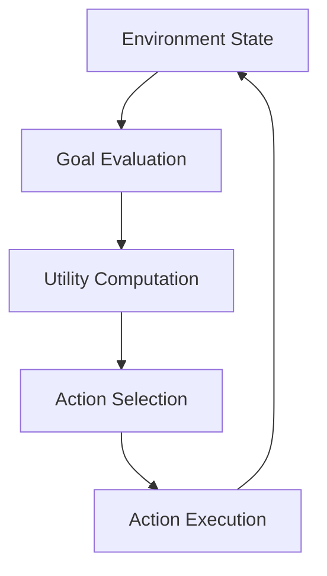
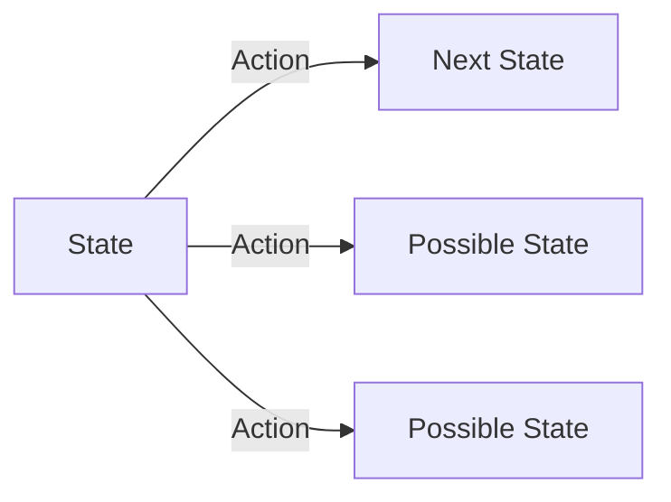
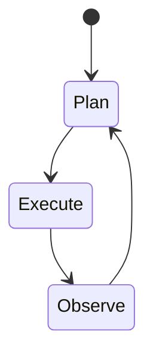
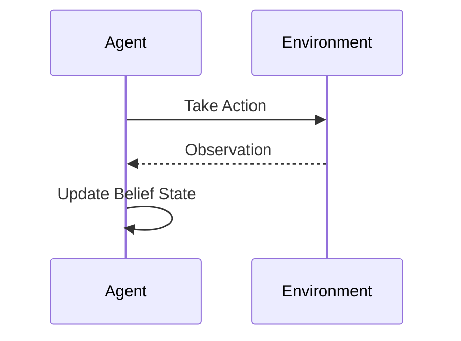

# Foundations of Agentic AI: Decision-Making and Goal Orientation

## Learning Objectives

- Formulate agent goals using utility-based representations
- Compare different decision-making frameworks for agents
- Analyze the impact of uncertainty on agent decisions
- Assess trade-offs in real-world agent implementations

---

## Introduction

This chapter focuses on how agents define goals, make decisions, and select actions. It introduces foundational decision-making models that underpin agentic behavior.

---


---


Agentic AI refers to artificial systems that can **act autonomously in pursuit of goals**, making decisions over time rather than responding passively to inputs. Unlike traditional software systems that follow predefined scripts, agentic systems continuously evaluate their environment, decide what to do next, and adapt their behavior based on outcomes. This capability is at the heart of modern AI applications such as autonomous vehicles, recommender systems, trading bots, robotics, personal assistants, and increasingly, large language model–based agents.

At the core of agentic AI lies **decision-making**: how an agent decides *what it wants*, *what it believes*, and *what it should do next*. These decisions are rarely trivial. Agents must balance competing objectives, operate with incomplete or uncertain information, and act under real-world constraints such as time, cost, and limited computational resources. A navigation agent must choose between speed and safety. A customer service agent must balance user satisfaction with operational cost. A robotic arm must decide whether to replan or continue executing a potentially flawed plan.

This chapter focuses on the **foundational models and concepts that underpin agentic decision-making**. We explore how agents define goals using utilities and preferences, how different decision models shape behavior, how planning enables goal-directed action, how uncertainty complicates decisions, and why real-world systems often trade optimality for efficiency. Rather than treating these topics in isolation, we will emphasize how they interconnect to form a coherent framework for agentic behavior.

By the end of this chapter, you should not only understand *what* these concepts are, but also *why* they matter, *how* they are implemented in practice, and *when* certain approaches are more appropriate than others.

---


By completing this chapter, you will be able to:

- Formulate agent goals using utility-based representations  
- Compare deterministic and probabilistic decision-making frameworks  
- Explain how planning supports goal-directed behavior in agents  
- Analyze how uncertainty and partial observability affect decisions  
- Assess real-world trade-offs between optimality and computational efficiency  

---

## Goals, Utilities, and Preferences

### Understanding Goals in Agentic Systems

A **goal** is a desired state of the world that an agent aims to achieve. In agentic AI, goals provide *direction* and *purpose* to behavior. Without goals, an agent has no principled way to choose one action over another. Even reactive systems implicitly encode goals through their design, but agentic systems make goals explicit and reason about them directly.

Historically, the idea of goal-directed agents comes from early work in artificial intelligence and control theory. Researchers observed that intelligent behavior could often be explained as the pursuit of objectives under constraints. For example, classical planning systems in the 1970s treated intelligence as the ability to transform an initial state into a goal state using available actions.

Goals can take many forms:

- **Achievement goals**: Reach a specific state (e.g., “deliver the package”)
- **Maintenance goals**: Keep a condition true (e.g., “avoid collisions”)
- **Optimization goals**: Maximize or minimize some quantity (e.g., “maximize profit”)

In real-world systems, agents often pursue *multiple goals simultaneously*, which introduces complexity. For instance, a ride-sharing agent must balance minimizing wait time, maximizing driver utilization, and ensuring fairness across regions.

---

### Utilities as Quantitative Goal Representations

While goals describe *what* an agent wants, **utility functions** describe *how much* the agent prefers different outcomes. A utility function maps states (or state-action trajectories) to numerical values, allowing the agent to compare alternatives quantitatively.

The use of utilities originates from economics and decision theory, where rational agents are assumed to choose actions that maximize expected utility. This framework was adopted by AI because it provides a mathematically precise way to formalize preferences and trade-offs.

Why utilities are so important:

- They enable **comparison** between otherwise incomparable outcomes  
- They support **optimization** and algorithmic decision-making  
- They make trade-offs explicit (e.g., speed vs. safety)

For example, consider a delivery drone:

- Deliver package on time: +100 utility  
- Deliver late: +40 utility  
- Crash drone: −1000 utility  

The drone’s decision-making process becomes a matter of choosing actions that maximize expected utility, considering risks and probabilities.

---

### Preferences and Their Role in Decision-Making

Preferences describe how an agent ranks outcomes relative to one another. Utilities are one way to encode preferences, but not the only one. Preferences can also be ordinal (“A is preferred to B”) or conditional (“prefer A when condition C holds”).

Preferences are especially important when:

- Utilities are hard to quantify precisely  
- Human values or subjective judgments are involved  
- Multiple stakeholders influence decisions  

For example, a personal assistant might learn that a user prefers:

- Fewer notifications during work hours  
- Cheaper travel options over faster ones  
- Explanations over terse answers  

These preferences may evolve over time and may even conflict, requiring the agent to reason about priorities.

---

### Goals, Utilities, and Preferences Compared

| Concept      | Purpose                         | Representation              | Strengths                         | Limitations |
|-------------|----------------------------------|-----------------------------|-----------------------------------|-------------|
| Goals        | Define desired outcomes          | Symbolic or logical states  | Intuitive, human-readable         | Hard to compare alternatives |
| Utilities    | Quantify desirability            | Numeric function            | Enables optimization              | Hard to design correctly |
| Preferences  | Rank outcomes                    | Orders or rules             | Flexible, user-aligned             | Less precise |

---

### Visualizing Goal-Driven Decision Flow



This loop illustrates how goals and utilities continuously shape agent behavior.

---

## Deterministic vs Probabilistic Decision Models

### Deterministic Decision-Making

In **deterministic models**, the agent assumes that the outcome of each action is fully predictable. Given a state and an action, the next state is known with certainty. Early AI planning systems relied heavily on this assumption because it simplified reasoning and computation.

Deterministic models work well when:

- The environment is fully observable  
- The dynamics are stable and predictable  
- Actions have reliable outcomes  

A chess-playing agent is a classic example. When it moves a piece, the result is precisely known. This allows the agent to search deeply through possible futures using algorithms like minimax.

However, determinism breaks down quickly in real-world settings. Sensors are noisy, actuators fail, and other agents behave unpredictably.

---

### Probabilistic Decision-Making

Probabilistic models acknowledge uncertainty by representing outcomes as probability distributions. Instead of assuming a single next state, the agent considers multiple possible outcomes, each with an associated likelihood.

This approach emerged from decision theory, statistics, and control systems, and it underpins modern frameworks such as Markov Decision Processes (MDPs) and Partially Observable Markov Decision Processes (POMDPs).

Why probabilistic models matter:

- They model real-world uncertainty realistically  
- They enable risk-sensitive decision-making  
- They support learning from experience  

For example, a self-driving car may estimate:

- 90% chance the pedestrian stops  
- 10% chance the pedestrian crosses  

The agent must choose actions that maximize *expected utility*, not guaranteed outcomes.

---

### Comparing Deterministic and Probabilistic Models

| Aspect                  | Deterministic Models        | Probabilistic Models |
|-------------------------|-----------------------------|---------------------|
| Outcome certainty       | Guaranteed                  | Uncertain |
| Computational cost      | Lower                        | Higher |
| Realism                 | Limited                      | High |
| Risk handling           | Implicit or absent           | Explicit |
| Typical use cases       | Games, puzzles               | Robotics, finance |

---

### Decision Process Visualization



This graph highlights how probabilistic models branch into multiple futures.

---

## Planning and Action Selection

### What Is Planning?

Planning is the process by which an agent **constructs a sequence of actions** to achieve its goals. Unlike reactive decision-making, planning involves foresight—reasoning about future states before acting.

Planning emerged as a core AI discipline in the mid-20th century, with early systems such as STRIPS formalizing actions in terms of preconditions and effects. These ideas still influence modern planners.

Planning is essential when:

- Goals require multiple coordinated steps  
- Actions have delayed consequences  
- Resources are limited  

For example, a warehouse robot must plan a path that avoids obstacles, respects battery constraints, and minimizes travel time.

---

### Action Selection in Practice

Action selection is the moment-to-moment choice of what the agent does next. While planning may generate a long-term strategy, action selection often adapts plans based on current observations.

Common approaches include:

- **Policy-based selection**: Precomputed mapping from states to actions  
- **Plan-based selection**: Execute the next step of a plan  
- **Reactive overrides**: Interrupt plans when safety is at risk  

An autonomous vehicle, for instance, may follow a route plan but immediately brake if a hazard appears.

---

### Planning vs Reactive Behavior

| Dimension        | Planning-Based Agents | Reactive Agents |
|------------------|----------------------|-----------------|
| Foresight        | Long-term             | Short-term |
| Flexibility      | Moderate              | High |
| Computational cost | High                | Low |
| Robustness       | Sensitive to model errors | Good in dynamic environments |

---

### Planning Loop Visualization



This diagram shows how planning and execution continuously interact.

---

## Case Study: Autonomous Warehouse Robot Optimization

## Context

In the late 2010s, a large e-commerce company faced growing challenges in its fulfillment centers. These warehouses handled millions of items daily, with tight delivery deadlines and increasing labor costs. To remain competitive, the company invested heavily in autonomous mobile robots designed to transport shelves of products to human pickers.

Initially, these robots followed relatively simple rules: move along predefined paths, avoid collisions, and respond to central commands. As warehouse complexity grew, these rules proved insufficient. Congestion increased, robots blocked each other, and small delays cascaded into significant productivity losses.

The company decided to redesign the robot control system using agentic AI principles, focusing on goal-oriented decision-making and planning under uncertainty.

---

## Problem

The core problem was **coordination under uncertainty**. Each robot had local goals—such as delivering a shelf quickly—but global objectives like minimizing congestion and energy use were not explicitly encoded.

Traditional deterministic planning failed because:

- Human workers introduced unpredictability  
- Network delays caused outdated information  
- Mechanical wear changed robot performance over time  

Robots often committed to plans that were optimal locally but harmful globally. For example, multiple robots would choose the same “shortest” route, causing traffic jams.

---

## Solution

The engineering team redefined robot behavior around **utility-based decision-making**. Each robot was modeled as an agent with a utility function combining:

- Task completion speed  
- Energy consumption  
- Collision risk  
- Congestion penalties  

Probabilistic models estimated travel times and collision likelihoods. Robots planned routes using these estimates, constantly updating their beliefs based on sensor data.

A hierarchical planning approach was adopted:

1. High-level planner assigned tasks and priorities  
2. Mid-level planner generated routes  
3. Low-level controller handled real-time obstacle avoidance  

---

## Results

After deployment, the warehouse observed measurable improvements:

- Average task completion time dropped by 18%  
- Energy consumption per robot decreased by 12%  
- Traffic congestion incidents were reduced by over 30%  

Importantly, the system proved robust. When robots failed or conditions changed, others adapted their plans without central intervention.

---

## Lessons Learned

The case demonstrated that **explicit goal and utility modeling** enables better coordination in complex environments. It also highlighted the importance of probabilistic reasoning: uncertainty was not an obstacle but a fundamental part of effective decision-making.

However, the team also learned that perfectly optimal planning was impractical. Approximations and heuristics were essential to keep computation tractable, reinforcing the trade-offs discussed later in this chapter.

---

## Handling Uncertainty and Partial Observability

### Nature of Uncertainty

Uncertainty arises when agents lack complete or accurate information about the environment. This can stem from noisy sensors, hidden variables, or unpredictable external actors.

Partial observability means the agent never sees the full state directly. Instead, it maintains a **belief state**, a probability distribution over possible states.

---

### Belief Updates and Reasoning

Agents update beliefs using observations and models of how the world evolves. This process is central to frameworks like POMDPs.

Key steps include:

- Predicting how states evolve  
- Incorporating new observations  
- Revising action choices accordingly  

---

### Uncertainty Handling Strategies

| Strategy           | Description | Trade-offs |
|-------------------|-------------|------------|
| Ignore uncertainty | Assume certainty | Fast but brittle |
| Worst-case planning | Plan for worst | Safe but conservative |
| Probabilistic planning | Optimize expected utility | Computationally heavy |

---

### Belief Update Visualization



---

## Trade-offs Between Optimality and Efficiency

### Why Optimality Is Hard

In theory, agents should always choose actions that maximize expected utility. In practice, computing the optimal policy is often infeasible due to:

- Large state spaces  
- Long planning horizons  
- Real-time constraints  

This is known as the **computational complexity barrier**.

---

### Approximation and Heuristics

To cope, agents rely on approximations:

- Heuristic search  
- Limited lookahead  
- Simplified models  

These approaches sacrifice optimality for speed and scalability.

---

### Optimality vs Efficiency Comparison

| Criterion       | Optimal Solutions | Approximate Solutions |
|----------------|------------------|-----------------------|
| Solution quality | Highest | Good enough |
| Computation time | High | Low |
| Scalability | Poor | Good |
| Real-world use | Rare | Common |

---

### Decision Trade-off Visualization

```mermaid
quadrantChart
    title Optimality vs Efficiency
    x-axis Low Efficiency --> High Efficiency
    y-axis Low Optimality --> High Optimality
    Quadrant1: Optimal but Slow
    Quadrant2: Optimal and Fast
    Quadrant3: Fast but Suboptimal
    Quadrant4: Slow and Suboptimal
```

---

## Summary

This chapter explored the foundations of agentic AI decision-making. We began with goals, utilities, and preferences, showing how agents formalize what they want. We compared deterministic and probabilistic decision models, highlighting the importance of uncertainty. We examined planning and action selection as mechanisms for goal-directed behavior, and we analyzed how real-world constraints force trade-offs between optimality and efficiency.

Together, these concepts form a coherent framework for understanding how intelligent agents act in complex, uncertain environments.

---

## Reflection Questions

1. How would you design a utility function for an AI assistant that balances helpfulness and privacy?  
2. In what situations might deterministic decision-making still be preferable to probabilistic models?  
3. How does partial observability change the way an agent should plan?  
4. When is it acceptable to sacrifice optimality for efficiency in real-world systems?