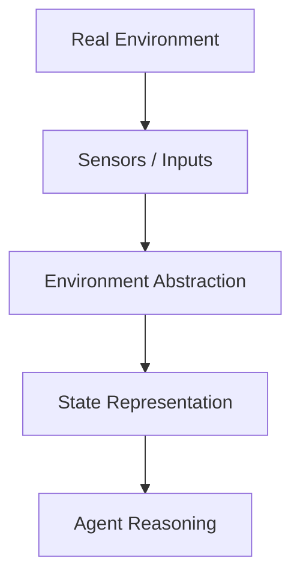
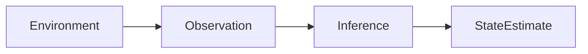
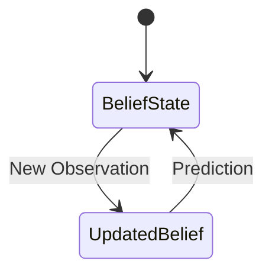
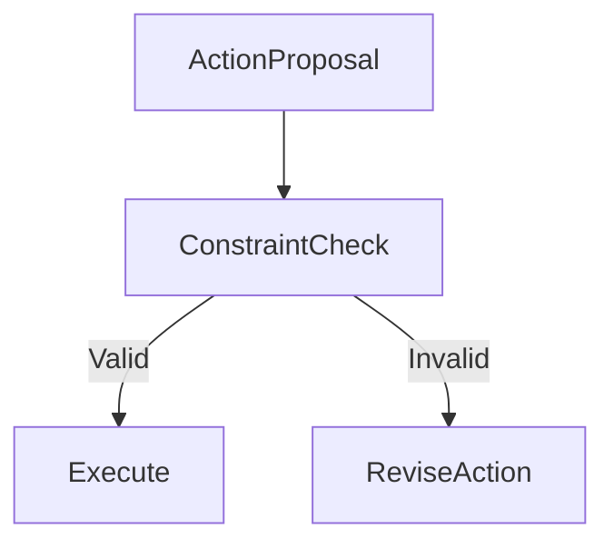
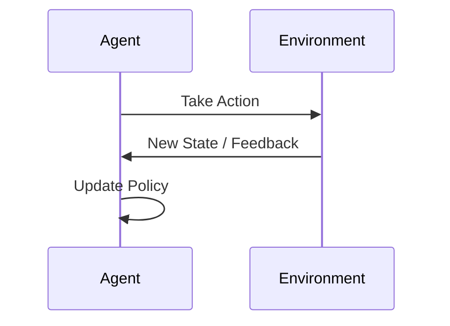
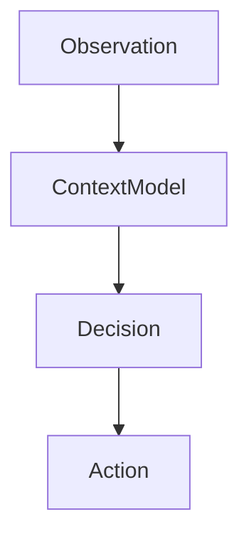

# Foundations of Agentic AI: Environment, Context, and Interaction

## Learning Objectives

- Model environments relevant to agentic systems
- Evaluate how uncertainty affects agent perception and action
- Design interaction loops that support adaptive behavior

---

## Introduction

This chapter examines how agentic systems perceive, interpret, and interact with their environments. It emphasizes context-awareness as a critical enabler of intelligent action.

---

---

Agentic AI systems differ from traditional software because they **exist within environments**, perceive signals, make decisions, take actions, and adapt over time. Whether it is a virtual assistant navigating user intent, a robot moving through a physical space, or an autonomous trading agent responding to market fluctuations, the intelligence of an agent is deeply tied to how well it understands and interacts with its environment.

This chapter explores the **foundational elements that enable agentic behavior**: how environments are modeled, how agents perceive and represent state under uncertainty, how actions are defined and constrained, how feedback loops drive adaptation, and why context-awareness is essential for intelligent decision-making. Rather than treating intelligence as a static property, we focus on intelligence as an **ongoing interaction** between agent and environment.

By the end of this chapter, you should understand not only *what* these components are, but *why* they matter and *how* they work together to produce adaptive, goal-directed behavior.

---

By completing this chapter, you will be able to:

- Model environments relevant to agentic systems using appropriate abstractions  
- Evaluate how uncertainty influences agent perception, state representation, and action  
- Design interaction and feedback loops that support adaptive and context-aware behavior  

---

## Environment Modeling and Abstraction

An environment is everything **external to the agent** that it can perceive, influence, or be influenced by. In agentic AI, the environment is not just a backdrop—it defines the rules of interaction and the limits of intelligence. Modeling an environment well is often the difference between a system that behaves robustly and one that fails in unexpected ways.

### Why Environment Modeling Matters

Real-world environments are complex, continuous, noisy, and partially observable. Directly representing all details is usually infeasible. Instead, agent designers rely on **abstraction**, simplifying the environment while retaining features that matter for decision-making. The challenge is deciding *what to keep* and *what to ignore*.

Consider a navigation agent:

- A **self-driving car** must model roads, lanes, traffic signals, and other vehicles  
- A **warehouse robot** may only need to model shelves, obstacles, and pickup points  
- A **game-playing agent** operates in a fully defined, symbolic environment  

The abstraction level determines:
- Computational cost  
- Learning efficiency  
- Risk of blind spots  

### Types of Environments

Agentic AI literature often categorizes environments along several dimensions. These dimensions help designers reason about difficulty and appropriate techniques.

| Dimension | Description | Example |
|---|---|---|
| Observable | Fully vs. partially observable | Chess vs. Poker |
| Deterministic | Predictable vs. stochastic outcomes | Board games vs. weather |
| Episodic | Independent episodes vs. continuous | Image classification vs. robotics |
| Static | Unchanging vs. dynamic | Crossword puzzle vs. traffic |
| Discrete | Finite states/actions vs. continuous | Gridworld vs. drone flight |

Each property influences how an agent reasons and learns.

### Environment Abstraction Layers

Agents rarely interact with raw reality. Instead, environments are modeled in layers:

| Layer | Purpose | Example |
|---|---|---|
| Physical layer | Raw signals and dynamics | Sensor readings |
| State layer | Structured representation | Position, velocity |
| Semantic layer | Meaningful concepts | “Obstacle”, “Goal” |
| Task layer | Goals and rules | “Deliver package” |

Abstraction allows agents to operate at the **highest meaningful level**, reducing complexity without sacrificing performance.

### Environment Modeling Flow

This flow highlights how environment modeling acts as a bridge between raw reality and intelligent reasoning.

---

## Perception, State Representation, and Uncertainty

Perception is how an agent **acquires information** about its environment. However, perception is never perfect. Noise, ambiguity, delays, and missing data introduce uncertainty, making state representation one of the most challenging problems in agentic AI.

### From Observation to State

Agents do not directly observe the “true” state of the world. Instead, they receive observations and must infer state.

- A robot’s camera provides pixels, not object identities  
- A financial agent sees price movements, not market intent  
- A dialogue agent receives text, not user goals  

This inference step is critical and often probabilistic.

### Representing State

State representations can vary in complexity:

| Representation | Description | Use Case |
|---|---|---|
| Symbolic | Discrete variables and rules | Planning systems |
| Numeric | Vectors of features | Machine learning agents |
| Probabilistic | Distributions over states | Robotics, tracking |
| Latent | Learned hidden representations | Deep RL |

The choice depends on uncertainty, scale, and learning requirements.

### Understanding Uncertainty

Uncertainty arises from multiple sources:

- **Sensor noise** (imperfect measurements)  
- **Partial observability** (hidden variables)  
- **Environmental randomness** (stochastic dynamics)  
- **Model mismatch** (incorrect assumptions)  

Rather than eliminating uncertainty, intelligent agents **manage** it.

### Managing Uncertainty in Practice

| Technique | How It Helps |
|---|---|
| Bayesian inference | Maintains belief distributions |
| Filtering (Kalman, Particle) | Tracks evolving states |
| Redundant sensors | Reduces noise |
| Active perception | Chooses actions to gain info |

This belief-update loop allows agents to reason despite imperfect information.

---

## Action Spaces and Constraints

Actions are how agents **influence their environment**. Defining an action space is not just about listing possible moves—it involves understanding feasibility, cost, safety, and consequences.

### What Is an Action Space?

An action space defines:
- What actions are possible  
- How actions are represented  
- When actions can be executed  

| Action Space Type | Description | Example |
|---|---|---|
| Discrete | Finite set of actions | Move left/right |
| Continuous | Real-valued controls | Steering angle |
| Parameterized | Discrete + continuous | Pick object with force |
| Hierarchical | High-level + low-level | “Navigate to room” |

### Constraints on Actions

Actions are rarely unconstrained. Constraints come from:

- Physical limits (speed, torque)  
- Safety requirements  
- Ethical or legal rules  
- Task-specific rules  

Ignoring constraints often leads to brittle or dangerous behavior.

### Cost, Risk, and Trade-offs

Actions often have associated costs:

| Cost Type | Example |
|---|---|
| Energy | Battery consumption |
| Time | Delays |
| Risk | Collision probability |
| Opportunity | Missed alternatives |

Agents must balance **immediate reward** against **long-term outcomes**, which is central to intelligent decision-making.

### Case Example: Delivery Drone

- Action space: move in 3D space  
- Constraints: no-fly zones, battery limits  
- Costs: energy usage, delay penalties  
- Result: agent must plan safe, efficient routes  

---

## Feedback Loops and Environmental Dynamics

Agentic behavior emerges through **continuous interaction**. Actions change the environment, which produces new perceptions, closing the loop.

### Understanding Feedback Loops

A feedback loop consists of:
1. Perception  
2. Decision  
3. Action  
4. Environmental change  

This loop is the heartbeat of agentic AI.

### Positive vs. Negative Feedback

| Feedback Type | Effect |
|---|---|
| Positive | Reinforces behavior |
| Negative | Corrects behavior |

Both are necessary:
- Positive feedback drives learning  
- Negative feedback stabilizes behavior  

### Dynamic Environments

In dynamic environments:
- Other agents act simultaneously  
- Conditions change independently  
- Past experience may become outdated  

This requires agents to continuously adapt rather than rely on static plans.

### Learning Through Interaction

Reinforcement learning formalizes this interaction:

| Component | Role |
|---|---|
| State | Situation |
| Action | Decision |
| Reward | Feedback |
| Policy | Behavior strategy |

---

## Context-Aware Decision-Making

Context is the **interpretive layer** that gives meaning to perception and guides action selection. Two identical observations can require different actions depending on context.

### What Is Context?

Context includes:
- Temporal information (past and future)  
- Goals and priorities  
- Social, cultural, or organizational norms  
- Environmental conditions  

For humans, context is intuitive. For agents, it must be explicitly modeled or learned.

### Why Context Awareness Is Critical

Without context:
- Agents behave rigidly  
- Actions appear inappropriate  
- Adaptation is limited  

Example:
- A virtual assistant responds differently to “Schedule a meeting” depending on time, user role, and calendar state.

### Modeling Context

| Approach | Description |
|---|---|
| Rule-based | Explicit conditions |
| Feature-based | Context variables |
| Memory-based | Historical interaction |
| Learned | Neural representations |

### Case Study: Smart Home Agent

- Context: time of day, user presence, energy prices  
- Decision: adjust heating  
- Outcome: comfort + efficiency  

Context-aware agents shift from **reactive** to **situationally intelligent** behavior.

---

## Summary

Agentic AI systems derive their intelligence not from isolated algorithms, but from **ongoing interaction with environments**. This chapter explored how environments are modeled through abstraction, how agents perceive and represent state under uncertainty, how action spaces and constraints shape behavior, how feedback loops enable adaptation, and why context-awareness is essential for meaningful decision-making.

Key takeaways:
- Abstraction is necessary for scalable environment modeling  
- Uncertainty is unavoidable and must be managed, not ignored  
- Actions are defined by both possibilities and constraints  
- Feedback loops drive learning and adaptation  
- Context transforms raw perception into intelligent action  

Together, these foundations enable agents to operate effectively in complex, changing worlds.

---

## Reflection Questions

1. How does environment abstraction influence an agent’s ability to generalize across tasks?  
2. What are the risks of ignoring uncertainty in state representation?  
3. How would you design action constraints for a safety-critical agent?  
4. In what ways does context-awareness differentiate intelligent behavior from simple automation?  
5. How do feedback loops enable long-term adaptation in dynamic environments?