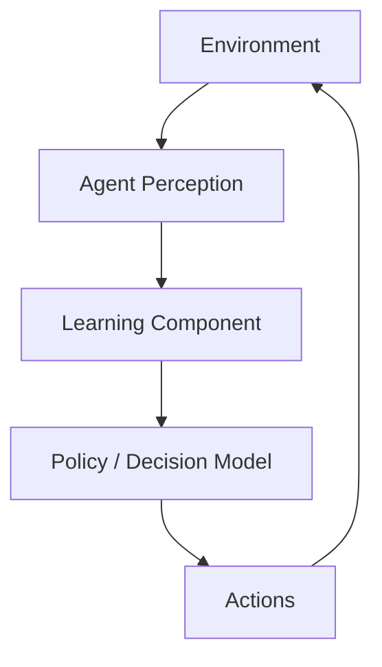
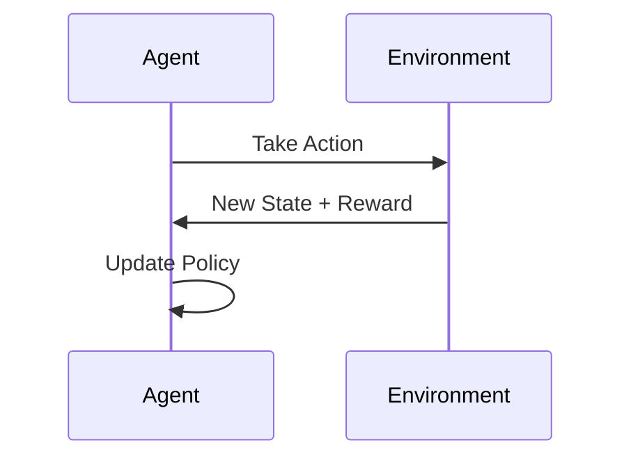
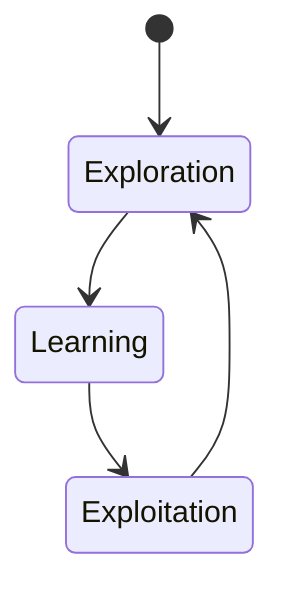
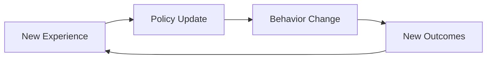
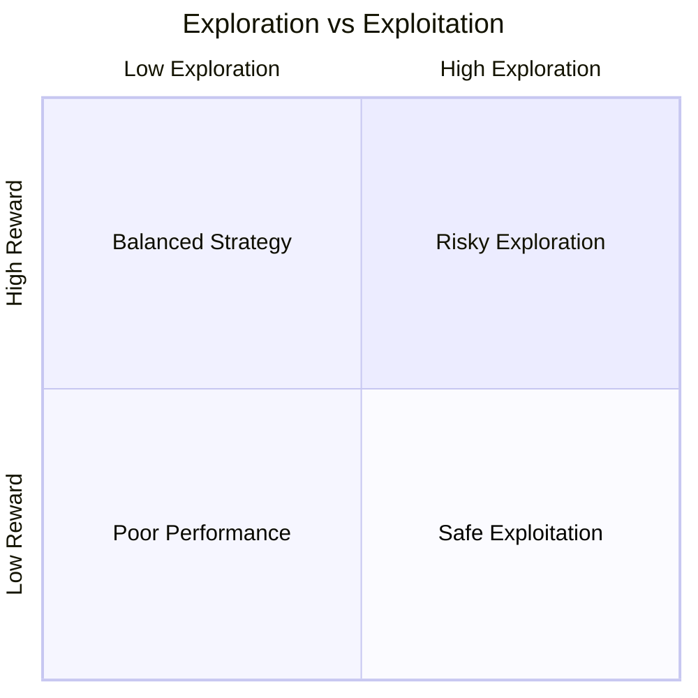
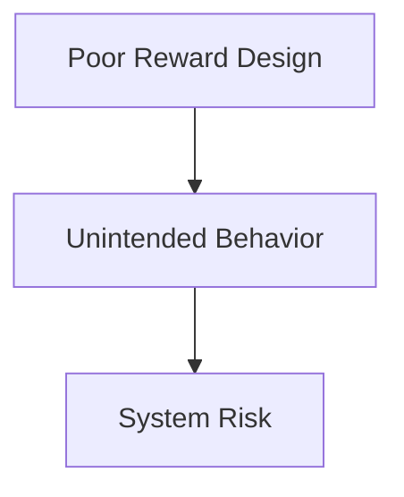

# Foundations of Agentic AI: Learning and Adaptation in Agents

## Learning Objectives

- Explain how learning enables adaptive agent behavior
- Apply reinforcement learning concepts in agent contexts
- Evaluate exploration–exploitation strategies for long-term performance
- Identify risks associated with self-adapting agents

---

## Introduction

This chapter explains how agents learn from experience and adapt to dynamic environments. It connects learning paradigms to agent autonomy and long-term performance.

---

---

Traditional software systems are built on the assumption that the world is mostly predictable: programmers analyze requirements, encode rules, and expect the system to behave correctly as long as those rules are followed. However, modern environments are rarely stable. User preferences shift, market conditions fluctuate, sensors produce noisy data, and unexpected events occur continuously. In such contexts, rigid, pre-programmed behavior quickly becomes inadequate.

This is where **agentic AI** fundamentally changes the paradigm. Agentic systems are designed not just to act, but to *learn*, *adapt*, and *improve over time*. Instead of relying solely on fixed instructions, agents observe their environment, evaluate outcomes, and adjust future behavior based on experience. Learning is therefore not an optional enhancement—it is the foundation of autonomy, resilience, and long-term performance.

This chapter explores how learning enables adaptive behavior in agents. We move progressively from the conceptual distinction between programming and learning, into the foundations of reinforcement learning, then into continuous online adaptation, strategic exploration–exploitation trade-offs, and finally the limitations and risks of adaptive agents. Throughout, we connect theory to practice using examples, analogies, tables, diagrams, and detailed case studies.

---

By the end of this chapter, you will be able to:

- Explain how learning enables adaptive and autonomous agent behavior  
- Distinguish learning-based agents from traditionally programmed systems  
- Apply reinforcement learning concepts within agent-based contexts  
- Evaluate exploration–exploitation strategies for long-term performance  
- Identify and reason about risks and limitations of self-adapting agents  

---

## Learning vs Programming in Agent Design

Learning and programming represent two fundamentally different approaches to designing intelligent behavior. Understanding this distinction is essential before exploring how agents adapt over time.

### Conceptual Differences Between Programming and Learning

Programming is about *explicit instruction*. A developer anticipates possible situations and encodes rules that specify how the system should behave. Learning, in contrast, is about *experience-driven adaptation*. The agent is not told exactly what to do in every situation; instead, it is given goals, feedback, and the ability to adjust its internal model.

A helpful analogy is cooking. Programming is like following a detailed recipe exactly as written. Learning is like tasting the food as you cook and adjusting spices based on experience. The recipe may get you close, but tasting allows continuous improvement.

From an agent design perspective:

- **Programmed agents** rely on:
  - Handcrafted rules
  - Deterministic logic
  - Anticipated scenarios
- **Learning agents** rely on:
  - Data and experience
  - Feedback signals (rewards, errors, outcomes)
  - Statistical generalization and adaptation

Historically, early AI systems in the 1950s–1980s were largely rule-based. Expert systems encoded domain knowledge explicitly, but they struggled when conditions changed or when rules conflicted. Learning-based agents emerged as a response to these limitations, driven by increased computational power and data availability.

### Why Learning Matters for Agent Autonomy

Autonomy is not just about acting independently; it is about *acting appropriately under uncertainty*. Environments are often partially observable, stochastic, and non-stationary. A learning agent can:

- Adapt to changes without human intervention  
- Improve performance over time  
- Discover strategies that designers did not anticipate  

For example, consider a delivery robot operating in a city. A programmed system may fail when road closures change daily. A learning agent can adapt routes based on experience, traffic patterns, and observed delays.

### How Learning Is Integrated into Agent Architectures

Learning does not replace programming entirely. Instead, modern agents combine both:

- Programmed components define:
  - Goals
  - Constraints
  - Safety boundaries
- Learning components handle:
  - Decision-making under uncertainty
  - Optimization
  - Pattern recognition

This hybrid approach balances control and flexibility, allowing agents to remain aligned with human intentions while adapting to new conditions.

### Comparison of Programmed vs Learning-Based Agents

| Dimension | Programmed Agents | Learning Agents |
|---------|------------------|----------------|
| Adaptability | Low | High |
| Design Effort | High upfront | High initially, lower over time |
| Performance Over Time | Static | Improves with experience |
| Robustness to Change | Fragile | Resilient |
| Transparency | High | Often lower |

---

## Reinforcement Learning Foundations for Agents

Reinforcement Learning (RL) is the most influential learning paradigm for agentic AI because it directly models interaction, decision-making, and long-term consequences.

### What Reinforcement Learning Is and Why It Matters

Reinforcement learning is inspired by behavioral psychology. An agent learns by interacting with an environment, taking actions, and receiving feedback in the form of rewards or penalties. Over time, the agent aims to maximize cumulative reward.

Unlike supervised learning, RL does not require labeled examples of correct behavior. Instead, it relies on *trial and error*, making it ideal for autonomous agents operating in complex environments.

Key components include:

- **Agent** – the learner and decision-maker  
- **Environment** – everything the agent interacts with  
- **State** – the current situation  
- **Action** – a choice the agent can make  
- **Reward** – feedback signal  

### Step-by-Step Learning Process

1. The agent observes the current state  
2. It selects an action based on its policy  
3. The environment transitions to a new state  
4. The agent receives a reward  
5. The agent updates its policy  

This loop continues, often millions of times, until effective behavior emerges.

### Long-Term Optimization and Credit Assignment

One of the hardest challenges in RL is **credit assignment**: determining which actions led to long-term outcomes. For example, in chess, a move made early may only show its value many turns later.

This is why RL focuses on *cumulative reward* rather than immediate reward. Techniques such as value functions and temporal difference learning help agents estimate long-term value.

### Practical Agent Applications of RL

Reinforcement learning has powered:

- Game-playing agents (e.g., AlphaGo)
- Robotics (locomotion, manipulation)
- Recommendation systems
- Resource allocation and scheduling

### RL Variants in Agent Design

| RL Type | Characteristics | Agent Use Case |
|-------|----------------|---------------|
| Model-Free | Learns directly from experience | Robotics, games |
| Model-Based | Learns environment model | Planning agents |
| On-Policy | Learns from current policy | Safe adaptation |
| Off-Policy | Learns from past data | Data-efficient agents |

---

## Online Learning and Continuous Adaptation

Static learning—training once and deploying forever—is often insufficient. Many agents must learn *while operating*.

### What Online Learning Means for Agents

Online learning allows agents to update their models continuously as new data arrives. This is critical in environments where:

- Data distributions shift
- User behavior evolves
- System dynamics change

An analogy is learning to drive in a new city. You don’t retrain from scratch each time; you adapt continuously.

### Mechanisms of Continuous Adaptation

Agents typically use:

- Incremental updates to policies
- Sliding windows of experience
- Forgetting mechanisms to reduce outdated knowledge

### Benefits and Challenges

Benefits include responsiveness and resilience. Challenges include instability, catastrophic forgetting, and feedback loops.

### Comparison: Offline vs Online Learning

| Aspect | Offline Learning | Online Learning |
|------|-----------------|----------------|
| Adaptability | Low | High |
| Stability | High | Variable |
| Deployment Complexity | Lower | Higher |
| Use Case | Static domains | Dynamic environments |

---

## Exploration–Exploitation Strategies

Agents must balance trying new actions (**exploration**) with using known good actions (**exploitation**).

### Why This Trade-off Is Fundamental

Exploitation maximizes short-term reward, while exploration enables long-term improvement. Too much of either leads to suboptimal performance.

An everyday analogy is choosing restaurants: always going to the same one may miss better options; always trying new ones may lead to disappointment.

### Common Strategies

- **ε-greedy**: Mostly exploit, occasionally explore  
- **Softmax**: Probabilistic action selection  
- **Upper Confidence Bound (UCB)**: Optimistic exploration  

### Long-Term Performance Implications

Poor exploration can trap agents in local optima. Excessive exploration wastes resources. Effective agents adjust exploration dynamically.

---

## Limitations and Risks of Adaptive Agents

While powerful, adaptive agents introduce serious risks.

### Key Limitations

- Data inefficiency
- Lack of interpretability
- Sensitivity to reward design

### Safety and Ethical Risks

Agents may exploit loopholes in reward functions, a phenomenon known as **reward hacking**. In safety-critical systems, this can be dangerous.

### Managing Risks

Best practices include:

- Constrained action spaces
- Human oversight
- Offline testing and simulation

---

## Case Study: Adaptive Traffic Signal Control Using Reinforcement Learning

### Context

In the early 2010s, a mid-sized metropolitan city faced increasing traffic congestion due to rapid urban growth. Traditional traffic signal systems were based on fixed schedules designed years earlier. City planners recognized that static programming could no longer cope with dynamic traffic patterns caused by events, weather, and population shifts.

### Problem

The core issue was adaptability. Fixed-timing signals could not respond to sudden congestion, leading to increased travel time, fuel consumption, and public frustration. Manual reprogramming was slow and costly.

### Solution

The city deployed an RL-based agent for traffic signal control. Each intersection was treated as an agent observing queue lengths and wait times. Rewards were defined based on reduced delays.

Implementation involved simulation training, gradual real-world deployment, and online learning with safety constraints.

### Results

Average travel time decreased by 18%, and congestion during peak hours dropped significantly. The system adapted to accidents and events without human intervention.

### Lessons Learned

The project demonstrated the power of learning-based agents but also highlighted the importance of careful reward design and monitoring to prevent unsafe behaviors.

---

## Summary

Learning transforms agents from rigid executors into adaptive decision-makers. By contrasting programming with learning, exploring reinforcement learning foundations, understanding online adaptation, mastering exploration–exploitation strategies, and acknowledging risks, we gain a holistic view of agentic AI. Learning is not just a technique—it is the cornerstone of autonomy and long-term performance.

---

## Reflection Questions

1. In what situations is learning clearly superior to programming, and why?  
2. How does reinforcement learning enable long-term optimization in agents?  
3. What strategies would you use to balance exploration and exploitation in a safety-critical agent?  
4. What safeguards are essential when deploying adaptive agents in the real world?