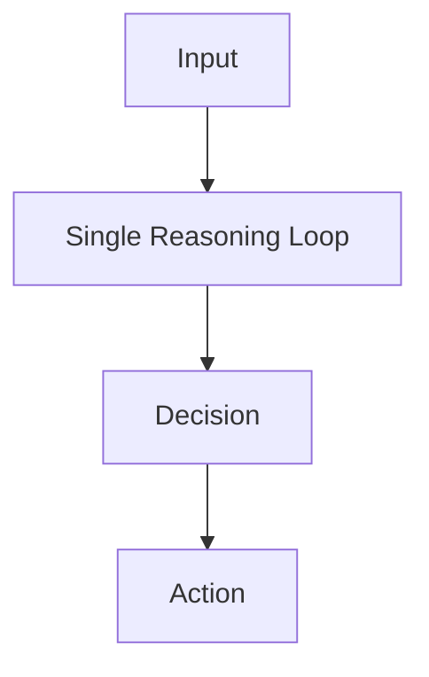
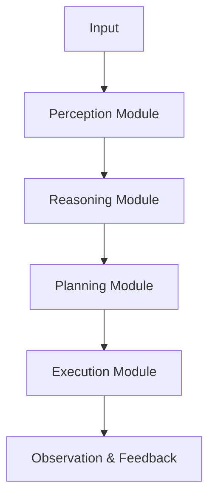
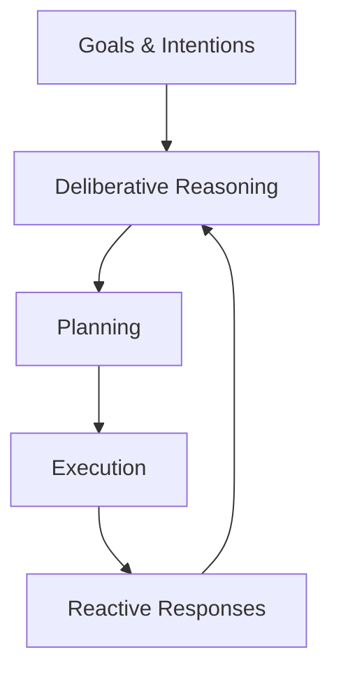
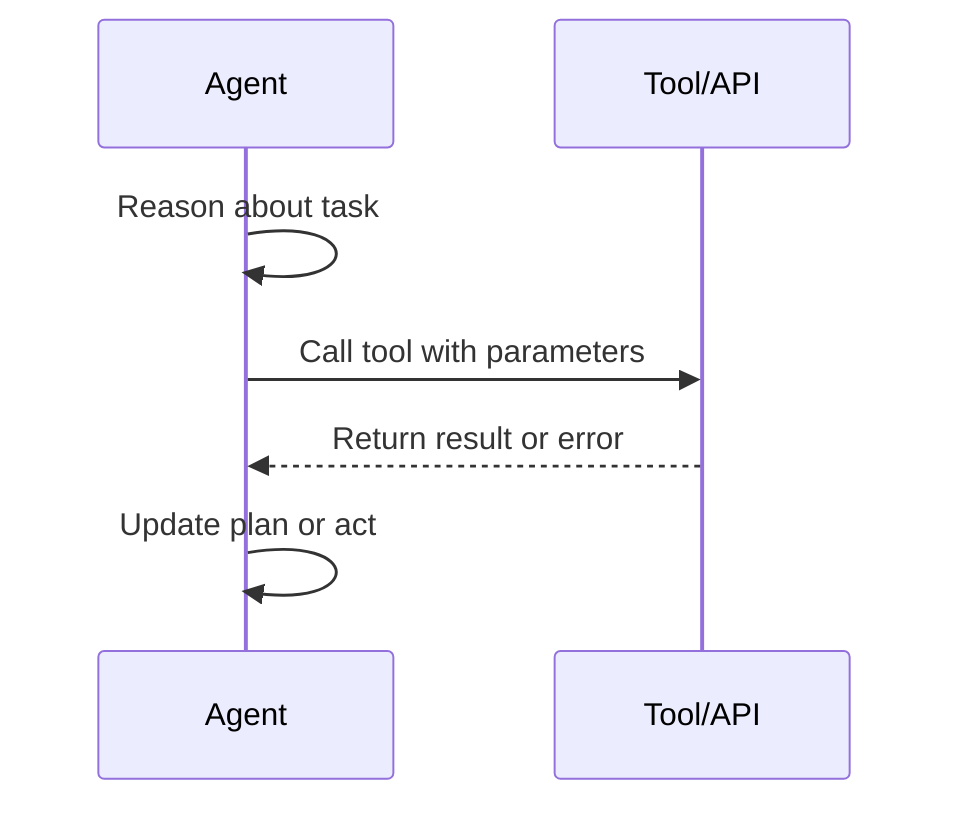
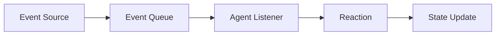
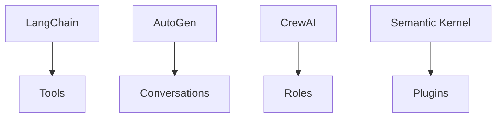

# Designing and Building Agentic Systems: Agent Architectures and Frameworks

## Learning Objectives

- Differentiate between major agent architecture patterns
- Select appropriate architectures based on system requirements
- Evaluate existing frameworks for agentic development

---

## Introduction

This chapter explores common architectural patterns used in Agentic AI, providing a foundation for selecting or designing appropriate system structures.

---

As AI systems evolve from passive models that simply respond to prompts into **active, goal-directed agents**, the way we design their internal structure becomes critically important. These *agentic systems* must reason, plan, act, observe results, and adapt over time—often while interacting with tools, APIs, users, and even other agents. Architecture is what makes this complexity manageable.

In traditional software engineering, architecture choices determine scalability, maintainability, and robustness. The same is true—perhaps even more so—for agentic AI. A poorly structured agent may work for simple demos but quickly collapse under real-world demands such as long-running tasks, error handling, multi-step planning, or parallel decision-making.

This chapter explores **common architectural patterns used in agentic AI systems**. You will learn how agents can be organized internally, how control and cognition are layered, how agents interact with tools and events, and how popular frameworks embody these ideas. Rather than focusing on a single “best” design, this chapter emphasizes *trade-offs*—helping you choose the right architecture for your specific problem.

---

By the end of this chapter, you will be able to:

- Differentiate between major agent architecture patterns and understand their trade-offs
- Explain how cognitive control layers guide agent reasoning and behavior
- Design agents that effectively use tools, APIs, and external systems
- Understand event-driven and reactive agent designs and when to use them
- Evaluate popular agent frameworks and select one based on system requirements

---

## Monolithic vs Modular Agent Architectures

Agent architectures can be broadly divided into **monolithic** and **modular** designs. This distinction shapes how responsibilities are distributed inside an agent and how easily the system can evolve over time.

A **monolithic agent architecture** bundles all functionality—reasoning, planning, memory, tool use, and decision-making—into a single tightly coupled loop. Early agent implementations often follow this pattern because it is conceptually simple: the agent receives input, reasons about it, decides what to do, and acts, all within one continuous flow. For small-scale or experimental systems, this approach can be surprisingly effective.

However, as tasks become more complex, monolithic designs begin to show limitations. Changes in one part of the agent can unintentionally affect others, making debugging difficult. Scaling such agents to support multiple goals, long-term memory, or collaboration with other agents often requires significant refactoring.

In contrast, **modular agent architectures** separate responsibilities into distinct components or sub-agents. Each module focuses on a specific role—such as planning, memory management, perception, or execution—and communicates with others through well-defined interfaces. This mirrors how teams work in organizations: specialists collaborate rather than one person doing everything.

Modular architectures are especially powerful for real-world agentic systems because they support extensibility, testing, and parallel development. You can improve a planning module without touching memory logic, or swap out a tool-use component without redesigning the entire agent.

### Key Differences at a Glance

| Aspect | Monolithic Architecture | Modular Architecture |
|------|-------------------------|----------------------|
| Structure | Single unified control loop | Multiple interacting components |
| Complexity | Simple to start, hard to scale | More complex initially, scalable |
| Maintainability | Low for large systems | High due to separation of concerns |
| Debugging | Difficult to isolate issues | Easier to trace component behavior |
| Best for | Prototypes, demos, small tasks | Production systems, complex agents |

### Architectural Flow Comparison

### Real-World Analogy

Think of a monolithic agent as a **solo freelancer** handling sales, design, accounting, and delivery. It works for small jobs but struggles as workload grows. A modular agent, on the other hand, resembles a **company with departments**, where each team specializes and collaborates efficiently.

---

## Cognitive Architectures and Control Layers

At the heart of any agentic system lies its **cognitive architecture**—the blueprint that determines how the agent thinks, decides, and acts. Cognitive architectures define *control flow*: when the agent reflects, when it plans, when it acts, and when it learns from feedback.

Most modern agentic systems use **layered control architectures**. Instead of a single decision process, control is divided into layers with different responsibilities. A common pattern includes a high-level deliberative layer, a mid-level planning layer, and a low-level reactive or execution layer.

The **deliberative layer** focuses on reasoning and goal management. It answers questions like: *What am I trying to achieve?* and *Is my current plan still valid?* This layer often involves LLM-based reasoning, long-term memory access, and self-reflection.

The **planning layer** translates goals into concrete steps. It may generate task sequences, choose tools, or allocate subtasks to sub-agents. Planning can be dynamic, adjusting as new information arrives or failures occur.

The **execution and reactive layers** handle immediate actions and responses. These layers prioritize speed and reliability over deep reasoning. For example, reacting to an API error, handling timeouts, or responding to user interrupts typically happens here.

### Layered Control Model

### Why Control Layers Matter

Without clear control layers, agents can become unstable—overthinking simple actions or failing to reflect on long-term consequences. Layering ensures:

- **Efficiency**: Simple reactions don’t require full reasoning cycles
- **Robustness**: Failures are handled locally without collapsing the system
- **Explainability**: Decisions can be traced to specific layers

### Comparing Control Architectures

| Architecture Type | Description | Strengths | Weaknesses |
|------------------|-------------|-----------|------------|
| Flat Control Loop | Single reasoning-action cycle | Simple | Poor scalability |
| Layered Control | Hierarchical decision layers | Balanced, robust | More design effort |
| Hybrid Cognitive | Combines symbolic + neural | Flexible, powerful | Complex to implement |

---

## Tool-Using and API-Driven Agents

One defining characteristic of agentic systems is their ability to **act on the world**, not just generate text. Tool-using and API-driven agents extend language models with the power to search databases, call services, manipulate files, and trigger workflows.

At a conceptual level, tools act as **external affordances**—capabilities the agent can invoke when reasoning alone is insufficient. Examples include web search APIs, calculators, code execution environments, CRMs, or robotic actuators.

Tool-using agents typically follow a **reason–select–act–observe loop**. The agent reasons about the task, decides whether a tool is needed, selects the appropriate tool with parameters, executes it, and then observes the result. This observation feeds back into the next reasoning step.

Designing tool-using agents requires careful attention to **tool abstraction**. Tools should expose clear inputs, outputs, and failure modes. Poorly designed tools confuse the agent, leading to brittle or unsafe behavior.

### Tool Invocation Flow

### Tool Design Considerations

- Tools should be **deterministic** where possible
- Errors must be explicit and machine-readable
- Outputs should be concise and structured
- Side effects must be clearly documented

### Tool-Based Agent Examples

| Use Case | Tools Used | Agent Behavior |
|--------|------------|----------------|
| Travel Assistant | Flight APIs, Maps | Searches, compares, books |
| Data Analyst Agent | SQL, Python | Queries, analyzes, visualizes |
| DevOps Agent | CI/CD APIs | Deploys, monitors, rolls back |

---

## Event-Driven and Reactive Architectures

Not all agents operate in a request-response mode. Many real-world environments are **event-driven**, where agents must react to external signals such as messages, sensor updates, or system events.

In **event-driven architectures**, agents subscribe to event sources and respond when specific conditions are met. This design is common in monitoring systems, conversational agents, trading bots, and IoT-based agents.

Reactive agents prioritize **speed and responsiveness** over deep deliberation. Instead of planning extensively, they rely on predefined rules or lightweight policies to respond immediately to events. This makes them ideal for time-sensitive domains.

However, purely reactive agents can struggle with long-term goals. As a result, many systems combine reactive components with higher-level deliberative agents, creating **hybrid reactive-deliberative systems**.

### Event-Driven Flow

### When to Use Reactive Designs

- High-frequency events (e.g., sensor data)
- Low-latency requirements
- Clear stimulus–response mappings
- Systems with many concurrent agents

### Reactive vs Deliberative Comparison

| Dimension | Reactive Agents | Deliberative Agents |
|---------|-----------------|---------------------|
| Response Time | Very fast | Slower |
| Reasoning Depth | Shallow | Deep |
| Adaptability | Limited | High |
| Use Cases | Monitoring, alerts | Planning, strategy |

---

## Comparing Popular Agent Frameworks

Agent frameworks provide **pre-built abstractions** for common architectural patterns, reducing the effort required to build agentic systems from scratch. However, frameworks differ significantly in philosophy, flexibility, and maturity.

Some frameworks emphasize **simplicity and rapid prototyping**, offering opinionated designs with minimal configuration. Others focus on **composability and scalability**, allowing developers to assemble complex agent systems with fine-grained control.

Understanding the underlying architecture of a framework is essential. A framework optimized for single-agent workflows may struggle with multi-agent coordination. Similarly, a highly modular framework may introduce unnecessary complexity for simple use cases.

### Framework Comparison Table

| Framework | Core Focus | Architecture Style | Best For |
|---------|-----------|--------------------|----------|
| LangChain | Tool-using agents | Modular pipelines | Rapid prototyping |
| AutoGen | Multi-agent systems | Conversational agents | Agent collaboration |
| CrewAI | Role-based agents | Modular teams | Task delegation |
| Semantic Kernel | Enterprise integration | Plugin-driven | Production systems |

### Architectural Emphasis

### Choosing the Right Framework

When selecting a framework, consider:

- System complexity and scale
- Need for multi-agent coordination
- Integration with existing infrastructure
- Long-term maintainability

---

## Summary

Designing agentic systems is fundamentally an architectural challenge. The choices you make—monolithic or modular, deliberative or reactive, tool-driven or event-based—shape how your agent behaves, scales, and evolves.

This chapter introduced key architectural patterns, explained how cognitive control layers organize agent behavior, explored tool-using and event-driven designs, and compared popular frameworks. Rather than prescribing a single solution, the goal is to equip you with **architectural intuition**—the ability to match design patterns to real-world requirements.

Well-designed agent architectures turn powerful models into reliable systems. As agentic AI continues to mature, architectural thinking will remain one of the most valuable skills for practitioners.

---

## Reflection Questions

1. For a long-running customer support agent, which architectural patterns would you combine and why?
2. What risks arise when a tool-using agent lacks clear error handling?
3. How might reactive and deliberative agents collaborate in a smart city system?
4. Which agent framework best fits your current or future projects, and what trade-offs does it impose?