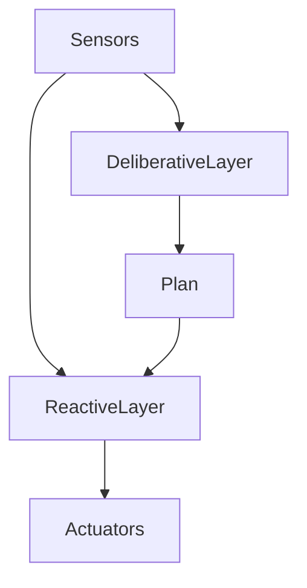
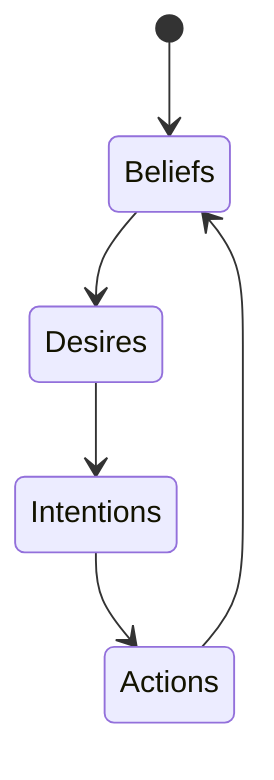
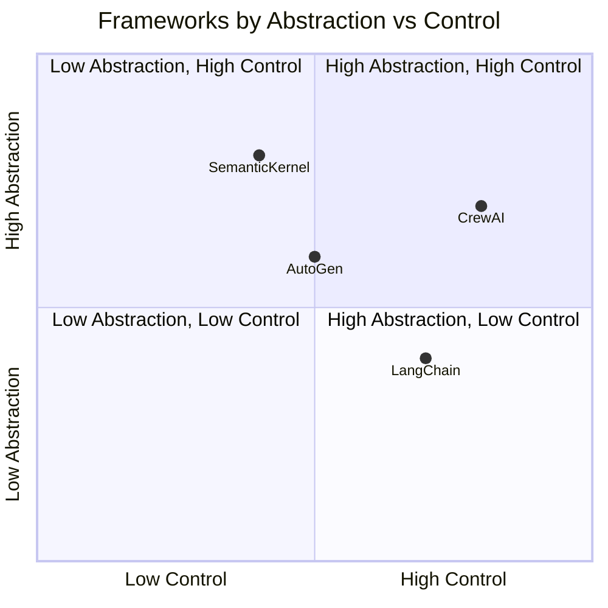

# Designing and Building Agentic Systems: Agent Architectures and Frameworks

## Learning Objectives

- Differentiate between major agent architecture patterns
- Explain the BDI model and its practical implications
- Select appropriate architectures for given problem domains
- Assess scalability and maintainability of agent frameworks

---

## Introduction

This chapter examines common architectural patterns used in agentic systems and evaluates popular frameworks used in practice.

---

---

As artificial intelligence systems evolve from single-purpose models into autonomous, goal-directed entities, **agentic systems** have become a central design paradigm. An agentic system is not just a model that produces outputs; it is a system that *perceives*, *decides*, and *acts* over time in pursuit of objectives, often under uncertainty and resource constraints. Examples range from virtual personal assistants and game-playing bots to autonomous trading agents, robotics fleets, and multi-agent scientific discovery platforms.

Designing such systems is fundamentally an **architectural challenge**. The architecture you choose determines how an agent reasons, how flexible it is in the face of change, how well it scales, and how maintainable it remains as complexity grows. Over decades of AI research and practice, several architectural patterns have emerged—reactive, deliberative, hybrid, BDI-based, modular, layered—each reflecting different assumptions about intelligence, environment dynamics, and computational trade-offs.

In parallel, modern software frameworks such as LangChain, AutoGen, CrewAI, and semantic-agent platforms have made agentic systems accessible to practitioners. However, these frameworks embody architectural choices—sometimes implicitly—that strongly influence system behavior. Without understanding the underlying architectures, it is easy to misuse frameworks or build brittle systems that fail in real-world conditions.

This chapter provides a **deep, structured exploration of agent architectures and frameworks**, moving from foundational concepts to practical evaluation and trade-offs. You will learn not only *what* these architectures are, but *why* they exist, *how* they work internally, and *when* each is appropriate.

---

By the end of this chapter, you will be able to:

- Differentiate between major agent architecture patterns and explain their design rationale
- Explain the Belief–Desire–Intention (BDI) model and its practical implications
- Select appropriate agent architectures for specific problem domains
- Evaluate modern agent frameworks in terms of scalability, maintainability, and architectural fit
- Reason about architectural trade-offs when designing large-scale agentic systems

---

## Reactive, Deliberative, and Hybrid Architectures

Agent architectures historically emerged as responses to a core tension in AI: **speed versus reasoning depth**. Early AI systems struggled to balance fast reactions with thoughtful planning, leading to the development of distinct architectural paradigms.

### Reactive Architectures

Reactive architectures are built on the idea that intelligent behavior can emerge from **direct mappings between perception and action**, without explicit symbolic reasoning or long-term planning. This approach was popularized in the late 1980s and early 1990s by researchers such as Rodney Brooks, who argued that traditional planning-based AI was too slow and brittle for real-world environments.

In a reactive agent, the system continuously senses its environment and selects actions based on predefined rules or learned policies. There is no internal model of the world in the classical sense; instead, behavior arises from stimulus–response loops. A household thermostat is a simple example: it senses temperature and switches heating on or off based on thresholds.

Reactive architectures are powerful because they are:
- Extremely fast and computationally lightweight
- Robust in dynamic or noisy environments
- Easy to implement and debug at small scales

However, their simplicity is also their limitation. Without memory or planning, reactive agents cannot reason about long-term consequences or abstract goals. For instance, a reactive trading bot may respond to price changes but fail to anticipate broader market trends.

**Everyday analogy:** A reactive agent is like a human reflex. Touching a hot surface triggers immediate withdrawal—no planning, no deliberation, just fast action.

### Deliberative Architectures

Deliberative architectures represent the opposite philosophy. These agents maintain an **explicit internal model of the world**, reason symbolically about goals, and generate plans before acting. Classical AI planners, expert systems, and early robotics controllers fall into this category.

A deliberative agent typically follows a cycle:
1. Perceive the environment
2. Update an internal world model
3. Generate or revise a plan
4. Execute actions from the plan

This approach excels in domains where:
- The environment is relatively stable
- Goals are complex and long-term
- Correctness is more important than speed

For example, an automated logistics planner that schedules deliveries across a city benefits from deliberation, as it must consider constraints, dependencies, and optimization objectives.

The main drawbacks are computational cost and brittleness. When environments change rapidly or unpredictably, plans can become obsolete before execution completes.

**Analogy:** Deliberative agents resemble a chess player carefully planning several moves ahead, considering multiple contingencies before acting.

### Hybrid Architectures

Hybrid architectures emerged as a pragmatic response to the limitations of purely reactive or purely deliberative systems. They combine **fast reactive layers** with **slower deliberative layers**, allowing agents to respond immediately to urgent stimuli while still pursuing long-term goals.

A typical hybrid agent might:
- Use reactive behaviors for obstacle avoidance or safety
- Use deliberative reasoning for mission planning or strategy

This structure is common in robotics, game AI, and autonomous vehicles, where safety-critical reactions must coexist with strategic reasoning.

Hybrid architectures reflect an important insight: **intelligence is layered**, not monolithic. Humans, for example, react instinctively to danger while simultaneously pursuing long-term plans.

### Comparative Overview

| Architecture Type | Core Idea | Strengths | Limitations | Typical Use Cases |
|------------------|-----------|-----------|-------------|------------------|
| Reactive | Direct perception-action mapping | Speed, robustness | No planning, no memory | Robotics reflexes, game NPCs |
| Deliberative | Explicit reasoning and planning | Goal optimization, explainability | Slow, brittle | Scheduling, planning systems |
| Hybrid | Layered combination | Balanced performance | Increased complexity | Autonomous vehicles, robotics |

---

## Belief–Desire–Intention (BDI) Model

The Belief–Desire–Intention (BDI) model is one of the most influential conceptual frameworks for **intentional agents**. Rooted in philosophy of mind and cognitive science, BDI provides a human-inspired way of structuring agent reasoning.

### Conceptual Foundations

The BDI model draws from philosopher Michael Bratman’s theory of human practical reasoning. Humans, according to this view, act based on:
- **Beliefs** about the world
- **Desires** representing objectives or goals
- **Intentions** representing committed plans of action

In agent systems, these components become explicit data structures that guide decision-making. Unlike classical planners, BDI agents continuously reconsider their intentions as beliefs change.

### How the BDI Cycle Works

A BDI agent operates in an ongoing loop:
1. **Perception:** Update beliefs based on new information
2. **Deliberation:** Select desires that are relevant and achievable
3. **Intention Formation:** Commit to specific plans
4. **Execution:** Carry out actions while monitoring outcomes

This cycle allows BDI agents to be both goal-directed and adaptive.

### Practical Implications

BDI architectures are particularly well-suited for:
- Multi-agent systems where coordination matters
- Domains requiring explainable decision-making
- Systems where goals may conflict or change over time

For example, a customer support agent may believe that a user is frustrated, desire to resolve the issue quickly, and intend to escalate the case to a human operator.

However, BDI systems can become complex to implement, especially when scaling to many agents or highly dynamic environments. Managing belief consistency and intention revision is non-trivial.

### Strengths and Limitations

| Aspect | Advantages | Challenges |
|------|------------|------------|
| Reasoning | Human-like, explainable | Computational overhead |
| Flexibility | Dynamic goal handling | Complex intention management |
| Coordination | Natural for multi-agent systems | Hard to scale |

---

## Modular and Layered Agent Designs

As agentic systems grow in complexity, **software engineering principles** become just as important as AI algorithms. Modular and layered designs address maintainability, extensibility, and team collaboration.

### Modular Design Principles

In a modular agent, functionality is divided into **independent components** such as perception, memory, planning, and action. Each module has clear responsibilities and interfaces.

Benefits include:
- Easier debugging and testing
- Independent evolution of components
- Reuse across projects

A language-model-based agent might separate:
- Prompt construction
- Tool selection
- Memory retrieval
- Action execution

### Layered Architectures

Layered designs organize modules into hierarchical layers, often aligned with abstraction levels. A common pattern is:
- Reactive layer (fast responses)
- Cognitive layer (reasoning and planning)
- Meta layer (self-monitoring and learning)

Layering clarifies responsibilities and prevents tight coupling between fast and slow processes.

### Real-World Example

In autonomous drones, the lowest layer handles stabilization and collision avoidance, while higher layers manage navigation and mission objectives. This separation allows safety-critical functions to remain simple and reliable.

### Design Trade-offs

| Design Choice | Benefit | Cost |
|--------------|---------|------|
| High modularity | Flexibility | Performance overhead |
| Deep layering | Clear abstraction | Increased latency |
| Tight coupling | Speed | Fragility |

---

## Evaluation of Modern Agent Frameworks

Modern frameworks aim to operationalize agent architectures, especially in the context of large language models (LLMs).

### Overview of Popular Frameworks

| Framework | Core Focus | Architectural Style |
|---------|------------|---------------------|
| LangChain | Tool orchestration | Modular pipelines |
| AutoGen | Multi-agent dialogue | Conversational BDI-like |
| CrewAI | Role-based agents | Layered coordination |
| Semantic Kernel | Skills and planners | Deliberative |

These frameworks differ not just in APIs, but in **implicit architectural assumptions**.

### Strengths and Weaknesses

LangChain excels at modular composition but can lead to tangled control flows if overused. AutoGen shines in collaborative reasoning but may struggle with determinism. CrewAI emphasizes roles and workflows, making it intuitive for business processes. Semantic Kernel integrates planning deeply but requires careful design to avoid over-planning.

---

## Case Study: Building a Multi-Agent Research Assistant Platform

## Context

In 2024, a mid-sized AI startup set out to build an internal research assistant platform to support analysts, product managers, and engineers. The company operated in a highly competitive market where speed of insight was critical. Teams were overwhelmed by technical papers, market reports, and internal documentation scattered across tools and repositories.

Leadership envisioned an agentic system that could autonomously gather information, synthesize insights, and coordinate tasks across multiple specialized agents. The platform needed to support continuous interaction, evolving goals, and collaboration between human users and AI agents.

## Problem

Initial prototypes relied on a single, monolithic LLM prompt that attempted to handle search, summarization, and reasoning. While impressive in demos, the system quickly became brittle. Small changes in requirements led to prompt explosion, unpredictable outputs, and debugging nightmares.

Scalability was another concern. As more users joined, latency increased and costs ballooned. The team realized that the core issue was architectural: the system lacked clear separation of concerns and intentional reasoning structure.

## Solution

The team redesigned the platform using a **hybrid, modular BDI-inspired architecture**. They introduced distinct agents: a Research Agent, a Critique Agent, and a Synthesis Agent. Each agent maintained beliefs (retrieved documents), desires (user goals), and intentions (task plans).

A layered approach was adopted. Reactive components handled quick clarifications and tool calls, while deliberative layers managed research planning. LangChain was used for tool orchestration, while AutoGen facilitated inter-agent dialogue.

Implementation occurred in phases:
1. Modularizing core capabilities
2. Introducing explicit agent roles
3. Adding intention tracking and revision
4. Optimizing execution paths for performance

## Results

The new system reduced average task completion time by 40%. Users reported more coherent outputs and greater trust in the system’s reasoning. Importantly, developers could now modify or replace individual agents without breaking the entire platform.

However, challenges remained. Debugging inter-agent interactions required new observability tools, and maintaining belief consistency across agents was non-trivial.

## Lessons Learned

The project demonstrated that **architecture matters more than model size** in complex agentic systems. Hybrid and modular designs enabled both adaptability and control. The team also learned that frameworks are enablers, not solutions; understanding their architectural assumptions was key to success.

---

## Architectural Trade-offs and Scalability

As agentic systems scale, architectural decisions amplify in impact. Choices that seem minor at small scales can become bottlenecks or failure points.

### Key Trade-offs

- **Centralized vs Distributed Control:** Centralized agents are easier to manage but limit scalability.
- **Memory Depth vs Performance:** Rich memory improves reasoning but increases latency.
- **Autonomy vs Predictability:** Highly autonomous agents may behave unpredictably.

### Scalability Strategies

| Challenge | Strategy |
|---------|----------|
| Agent explosion | Role specialization |
| Latency | Asynchronous execution |
| Maintenance | Strong modular boundaries |

Designing for scalability requires anticipating growth, not reacting to it.

---

## Summary

In this chapter, we explored the architectural foundations of agentic systems. We examined reactive, deliberative, and hybrid architectures, understanding their historical roots and practical implications. We delved into the BDI model as a powerful framework for intentional agents and explored modular and layered designs as essential tools for maintainability. We evaluated modern agent frameworks through an architectural lens and reflected on trade-offs and scalability through a real-world case study.

Ultimately, designing agentic systems is about **aligning architecture with purpose**. There is no single best design—only informed choices grounded in understanding.

---

## Reflection Questions

1. In what scenarios would a purely reactive agent outperform a hybrid agent?
2. How does the BDI model improve explainability compared to black-box approaches?
3. What architectural risks arise when scaling from one agent to hundreds?
4. How would you evaluate whether a framework’s implicit architecture fits your problem?
5. If redesigning the case study system, what architectural change would you explore next?