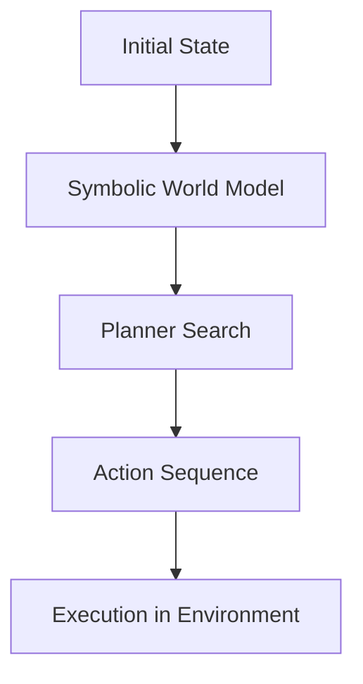
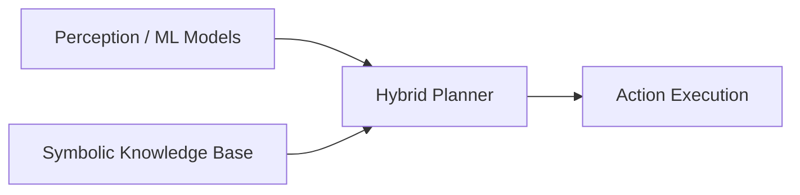
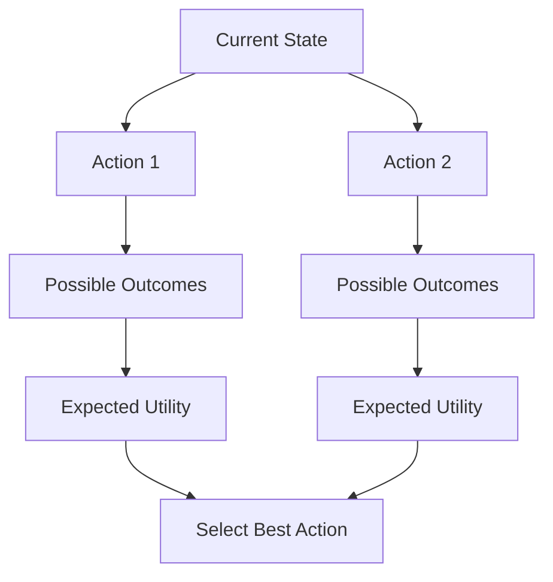
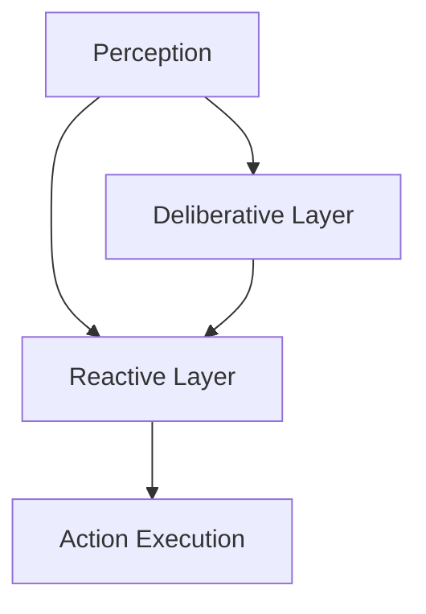
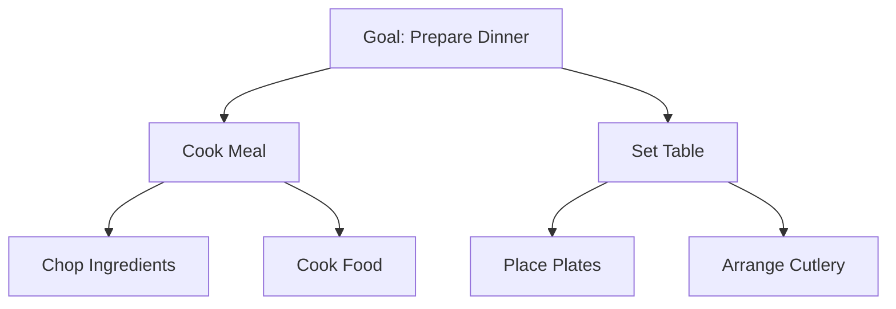
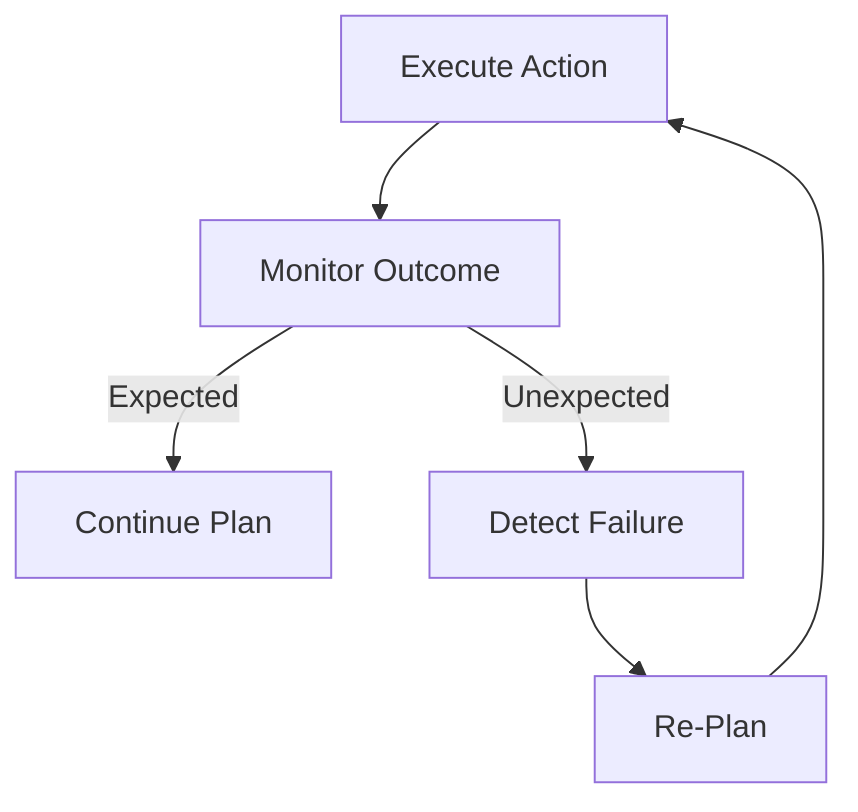

# Designing and Building Agentic Systems: Planning, Reasoning, and Decision-Making

## Learning Objectives

- Implement planning and reasoning strategies in agentic systems
- Analyze trade-offs between reactive and deliberative approaches
- Evaluate planning performance under uncertainty

---

## Introduction

This chapter dives into the mechanisms agents use to decide what to do, covering planning algorithms, reasoning strategies, and decision policies.

---

---

Modern agentic systems—such as autonomous robots, intelligent assistants, and AI-driven decision platforms—are no longer passive tools that simply react to user input. Instead, they are expected to **decide what to do**, **plan how to do it**, and **adapt when things go wrong**. This ability to act autonomously and intelligently lies at the heart of *planning, reasoning, and decision-making*.

At a high level, designing agentic systems means answering questions like: *What actions are available to the agent?* *How should it choose between them?* *How far into the future should it plan?* and *What happens when the environment changes unexpectedly?* These questions are not only technical but also deeply conceptual, drawing from symbolic AI, probabilistic reasoning, control theory, and cognitive science.

This chapter explores the core mechanisms agents use to decide what to do. We move progressively from foundational planning approaches to advanced topics like long-horizon reasoning and failure recovery. Along the way, we will compare different strategies, analyze trade-offs, and ground abstract ideas in concrete examples. By the end, you should have a clear mental model of how intelligent agents plan, reason, and make decisions in uncertain, dynamic environments.

---

By the end of this chapter, you will be able to:

- Implement planning and reasoning strategies in agentic systems  
- Analyze trade-offs between reactive and deliberative approaches  
- Evaluate planning performance under uncertainty and changing conditions  

---

## Symbolic and Hybrid Planning Approaches

Planning is the process by which an agent decides **a sequence of actions** to move from its current state to a desired goal state. Historically, planning in AI began with *symbolic approaches*, where the world is represented using logical symbols, rules, and explicit state transitions. In these systems, planning is treated almost like solving a puzzle: given a formal description of the world, the agent searches for a sequence of valid moves that achieves its goal.

Symbolic planning approaches, such as STRIPS or PDDL-based planners, rely on three core elements:  
1. A symbolic representation of the world (states and objects)  
2. Actions defined by preconditions and effects  
3. A goal condition that defines success  

For example, a warehouse robot might have symbolic actions like *pick(box)* or *move(robot, locationA, locationB)*. The planner searches through possible action sequences to find one that leads to the goal state, such as “all boxes are on the correct shelf.” This explicit reasoning makes symbolic planners interpretable and reliable—but also brittle when the real world does not match the model perfectly.

To overcome these limitations, **hybrid planning approaches** combine symbolic reasoning with data-driven or probabilistic methods. Instead of relying solely on predefined rules, hybrid planners integrate machine learning, perception models, or continuous control. A self-driving car, for instance, may use symbolic planning to decide *when to change lanes*, while using learned models to control *how* to steer smoothly.

Hybrid approaches are especially valuable in real-world environments where uncertainty, noise, and partial observability are unavoidable. They allow agents to reason abstractly at a high level while still adapting to sensory data and learned patterns at a low level.

### Symbolic vs Hybrid Planning Comparison

| Aspect | Symbolic Planning | Hybrid Planning |
|------|------------------|----------------|
| World representation | Discrete, symbolic states | Mixed symbolic + continuous |
| Interpretability | Very high | Medium |
| Robustness to noise | Low | High |
| Adaptability | Limited | Strong |
| Typical use cases | Puzzles, games, formal tasks | Robotics, autonomous systems |

### Planning Workflow Overview

### Hybrid Planning Architecture

**Why this matters:** Choosing between symbolic and hybrid planning affects scalability, robustness, and real-world usability. Symbolic planning offers clarity and guarantees, while hybrid planning offers flexibility and realism. Most modern agentic systems combine both to get the best of each world.

---

## Decision-Theoretic Models and Utilities

While planning focuses on *how* to achieve a goal, decision-theoretic models focus on *which action is best* when outcomes are uncertain. In many environments, actions do not have guaranteed results. An agent might succeed, fail, or produce side effects, each with different probabilities. Decision theory provides a formal framework to handle such uncertainty.

At the core of decision-theoretic reasoning is the concept of **utility**—a numerical measure of how desirable an outcome is. Instead of simply asking “Did I reach the goal?”, agents ask “How good is this outcome compared to others?” Utilities allow agents to trade off competing objectives, such as speed vs safety or cost vs accuracy.

A classic example is route planning in navigation apps. The agent must choose between routes that differ in travel time, toll cost, and reliability. By assigning utilities to each outcome and probabilities to uncertainties (like traffic jams), the agent can compute the **expected utility** of each option and select the best one.

Decision-theoretic models are often formalized using structures like **Markov Decision Processes (MDPs)** or **Partially Observable MDPs (POMDPs)**. These models define states, actions, transition probabilities, and reward (utility) functions. They provide a principled way to plan under uncertainty—but they can be computationally expensive for large state spaces.

### Deterministic vs Decision-Theoretic Planning

| Feature | Deterministic Planning | Decision-Theoretic Planning |
|-------|-----------------------|-----------------------------|
| Outcome uncertainty | None | Explicitly modeled |
| Objective | Goal satisfaction | Utility maximization |
| Environment | Fully predictable | Stochastic |
| Typical models | STRIPS, classical planners | MDPs, POMDPs |

### Utility Trade-Off Example

| Option | Time (min) | Cost ($) | Risk | Utility Score |
|------|------------|----------|------|---------------|
| Route A | 30 | 5 | Low | 80 |
| Route B | 20 | 10 | Medium | 75 |
| Route C | 40 | 0 | Very Low | 70 |

### Expected Utility Decision Flow

**Why this matters:** Decision-theoretic models allow agents to behave rationally in uncertain environments. They are essential for systems where outcomes matter more than simply achieving a predefined goal, such as finance, healthcare, and autonomous navigation.

---

## Reactive vs Deliberative Reasoning

Not all agents reason in the same way or on the same timescale. A key distinction in agent design is between **reactive** and **deliberative** reasoning. Understanding this trade-off is crucial for building systems that are both responsive and intelligent.

Reactive reasoning focuses on *immediate response*. The agent maps perceptions directly to actions using rules or policies, without explicit planning. For example, a thermostat reacts to temperature changes by turning heating on or off. This approach is fast, robust, and simple—but it lacks foresight.

Deliberative reasoning, on the other hand, involves constructing internal models, simulating future states, and choosing actions based on predicted outcomes. A chess-playing AI deliberates by exploring future move sequences before acting. This enables sophisticated behavior but requires more computation and time.

In practice, most real-world agents use a **hybrid approach**, combining reactive layers for fast responses and deliberative layers for strategic planning. A robot may reflexively avoid obstacles (reactive) while planning a long-term path to its destination (deliberative).

### Reactive vs Deliberative Comparison

| Dimension | Reactive | Deliberative |
|--------|----------|--------------|
| Response time | Very fast | Slower |
| Planning horizon | None | Medium to long |
| Computational cost | Low | High |
| Flexibility | Limited | High |
| Example | Obstacle avoidance | Route planning |

### Layered Agent Architecture

**Why this matters:** Overly reactive agents may act shortsightedly, while purely deliberative agents may be too slow. Balancing the two allows agents to operate effectively in real-time environments while still pursuing long-term goals.

---

## Long-Horizon and Hierarchical Planning

Many agentic tasks cannot be solved by short-term reasoning alone. **Long-horizon planning** addresses problems where actions taken now affect outcomes far in the future. Examples include project management, multi-stage games, or lifelong learning agents.

However, planning far into the future dramatically increases complexity. To manage this, agents often use **hierarchical planning**, where decisions are made at multiple levels of abstraction. High-level plans define *what* to do, while low-level plans define *how* to do it.

Consider a household robot tasked with “prepare dinner.” At a high level, this goal is broken into subgoals like “cook main dish” and “set table.” Each subgoal is then further decomposed into concrete actions. This hierarchy allows the agent to reason efficiently without being overwhelmed by detail.

Hierarchical planning also improves robustness. If a low-level action fails, the agent can re-plan locally without abandoning the entire high-level plan.

### Flat vs Hierarchical Planning

| Aspect | Flat Planning | Hierarchical Planning |
|------|--------------|----------------------|
| Planning depth | Single level | Multiple levels |
| Scalability | Poor | Good |
| Reusability | Low | High |
| Interpretability | Medium | High |

### Hierarchical Plan Structure

**Why this matters:** Long-horizon and hierarchical planning enable agents to tackle complex, real-world tasks by structuring decisions in a manageable and meaningful way.

---

## Failure Handling and Re-Planning

No matter how well an agent plans, **failures are inevitable**. Sensors may be noisy, actions may not have the intended effect, and the environment may change unexpectedly. Effective agentic systems are defined not by avoiding failure, but by how well they respond to it.

Failure handling starts with **monitoring**. The agent continuously compares expected outcomes with actual outcomes. When a discrepancy is detected—such as an action failing or a goal becoming unreachable—the agent must decide how to respond.

One common response is **re-planning**, where the agent updates its world model and generates a new plan. In simple cases, this might involve choosing an alternative action. In more complex scenarios, the agent may need to revise its goals or adopt a fallback strategy.

Advanced agents may also use **contingency planning**, where alternative plans are prepared in advance, or **learning-based adaptation**, where repeated failures lead to improved future behavior.

### Failure Types and Responses

| Failure Type | Example | Typical Response |
|-------------|---------|------------------|
| Action failure | Robot drops object | Retry or choose alternative |
| Model mismatch | Unexpected obstacle | Update model and re-plan |
| Goal infeasible | Resource unavailable | Revise goal |

### Failure Detection and Re-Planning Loop

**Why this matters:** Robust failure handling transforms agents from brittle systems into adaptive ones. It is essential for long-term autonomy in real-world environments.

---

## Summary

In this chapter, we explored how agentic systems decide what to do through planning, reasoning, and decision-making mechanisms. We began with symbolic and hybrid planning approaches, highlighting the balance between interpretability and adaptability. We then examined decision-theoretic models, showing how utilities and probabilities guide rational choices under uncertainty.

We compared reactive and deliberative reasoning, emphasizing the importance of combining fast responses with thoughtful planning. Next, we explored long-horizon and hierarchical planning as tools for managing complexity and achieving long-term goals. Finally, we addressed failure handling and re-planning, underscoring the importance of adaptability in dynamic environments.

Together, these concepts form the backbone of intelligent, autonomous agents capable of operating effectively in the real world.

---

## Reflection Questions

1. In what types of environments would symbolic planning fail, and how could hybrid planning address those failures?  
2. How would you design a utility function for an agent that must balance safety, speed, and cost?  
3. Can you think of a real-world system that relies heavily on reactive reasoning? What are its limitations?  
4. How does hierarchical planning reduce computational complexity in long-horizon tasks?  
5. What strategies would you use to ensure safe and reliable re-planning in safety-critical systems?