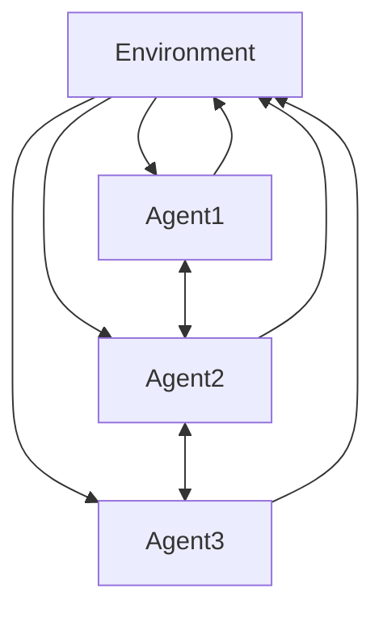
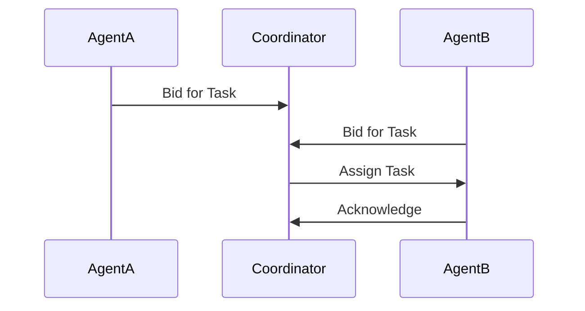
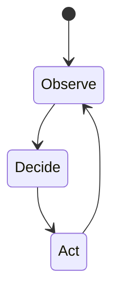
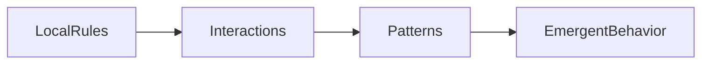

# Designing and Building Agentic Systems: Multi-Agent Systems and Coordination

## Learning Objectives

- Explain core principles of multi-agent systems
- Design coordination mechanisms for multiple agents
- Analyze emergent behaviors in agent populations
- Evaluate trade-offs in centralized vs decentralized control

---

## Introduction

This chapter introduces systems composed of multiple interacting agents and explores coordination, cooperation, and competition mechanisms.

---

---

As artificial intelligence systems grow more capable and are deployed in increasingly complex environments, a single autonomous agent is often no longer sufficient. Many real-world problems—such as coordinating fleets of delivery robots, managing financial trading strategies, optimizing traffic flow in smart cities, or simulating social and economic systems—require **multiple autonomous entities** that interact with one another. These entities, known as *agents*, must perceive their environment, make decisions, and act, all while accounting for the presence and behavior of other agents.

This chapter introduces **multi-agent systems (MAS)**, a foundational paradigm for designing agentic systems composed of multiple interacting agents. Unlike single-agent systems, where intelligence is centralized and decisions are made in isolation, multi-agent systems emphasize **interaction, coordination, cooperation, and sometimes competition**. The behavior of the overall system emerges from the collective actions of individual agents, often in ways that are difficult to predict or fully control.

Understanding how to design and build such systems is essential for anyone working with advanced AI, robotics, distributed systems, or complex adaptive systems. In this chapter, we will move progressively from core concepts to advanced design considerations, exploring how agents communicate, coordinate, and make decisions collectively. We will also examine how large-scale behaviors emerge from simple local rules, and how designers can analyze and guide these behaviors toward desired outcomes.

---

By the end of this chapter, you will be able to:

- Explain the core principles and defining characteristics of multi-agent systems  
- Design communication and coordination mechanisms for interacting agents  
- Distinguish between cooperative and competitive agent dynamics and understand when each is appropriate  
- Evaluate centralized versus decentralized approaches to distributed decision-making  
- Analyze emergent behaviors in large populations of agents and assess system-level outcomes  

---

## Foundations of Multi-Agent Systems

Multi-agent systems (MAS) are systems composed of **multiple autonomous agents** that interact within a shared environment. Each agent is typically capable of perceiving its surroundings, making decisions based on internal logic or learned policies, and acting to achieve certain goals. What distinguishes MAS from traditional distributed software systems is not just the presence of multiple components, but the **autonomy, adaptability, and intentionality** of those components.

Historically, the concept of multi-agent systems emerged at the intersection of artificial intelligence, distributed computing, and social sciences in the late 20th century. Early inspirations came from observing social insects such as ants and bees, whose colonies exhibit sophisticated collective behaviors without any central controller. Researchers realized that similar principles could be applied to computational systems, allowing complex problem-solving to emerge from simple interacting units.

A key reason MAS are important is that many real-world problems are **inherently decentralized**. There may be no single point of control, or centralized control may be impractical due to scale, latency, robustness, or organizational constraints. For example, internet routing protocols, peer-to-peer networks, and autonomous vehicle fleets all require local decision-making combined with global coordination.

At the heart of any multi-agent system are several defining characteristics:

- **Autonomy**: Each agent operates without direct intervention from others  
- **Local perception**: Agents typically have limited, partial views of the environment  
- **Decentralized control**: No single agent has complete authority or knowledge  
- **Interaction**: Agents influence each other through communication or shared environments  
- **Adaptation**: Agents may learn or adjust behavior over time  

To better understand how MAS differ from related paradigms, consider the comparison below.

### Table: Single-Agent vs Multi-Agent Systems

| Aspect | Single-Agent Systems | Multi-Agent Systems |
|------|----------------------|---------------------|
| Control | Centralized | Distributed |
| Complexity | Lower system interaction | High interaction complexity |
| Scalability | Limited | Often highly scalable |
| Robustness | Single point of failure | Failure-tolerant |
| Behavior | Predictable | Often emergent and non-linear |

Another foundational concept is the **environment** in which agents operate. Environments can be static or dynamic, fully observable or partially observable, deterministic or stochastic. The nature of the environment heavily influences agent design. For instance, in a dynamic and partially observable environment, agents must continuously update their beliefs and adapt to changes caused by other agents.

### Example Analogy: A Classroom Project

Imagine a group of students working on a group project without a designated leader. Each student has their own skills, preferences, and understanding of the task. They communicate, divide responsibilities, sometimes disagree, and adjust their plans as the project evolves. The final outcome—the quality of the project—depends not just on individual abilities, but on how well the group coordinates. This is a classic real-world analogy of a multi-agent system.

### Visualizing a Basic Multi-Agent System

This diagram highlights a fundamental idea: agents interact both **with the environment** and **with each other**, creating feedback loops that drive system behavior.

---

## Communication and Coordination Protocols

For a multi-agent system to function effectively, agents must be able to **communicate and coordinate**. Communication allows agents to share information, intentions, or requests, while coordination ensures that their actions are aligned in a way that avoids conflict and inefficiency. Without these mechanisms, agents may work at cross purposes, leading to redundant actions or even system failure.

Communication in MAS can take many forms, ranging from explicit message passing to implicit signaling through environmental changes. Explicit communication might involve structured messages with well-defined semantics, such as “task completed” or “resource unavailable.” Implicit communication, often called **stigmergy**, occurs when agents modify the environment in a way that other agents can observe, such as ants leaving pheromone trails.

Historically, early MAS research focused on defining **agent communication languages (ACLs)**, such as KQML and FIPA-ACL. These languages aimed to standardize how agents express beliefs, desires, and intentions. While modern systems often use simpler or more pragmatic protocols, the underlying idea remains: communication must be interpretable and reliable.

Coordination mechanisms answer the question: *How do agents align their actions over time?* Common approaches include:

- **Centralized coordination**: A coordinator assigns tasks and resolves conflicts  
- **Decentralized coordination**: Agents negotiate or self-organize  
- **Market-based mechanisms**: Agents bid for tasks or resources  
- **Consensus protocols**: Agents agree on shared values or plans  

### Table: Coordination Mechanisms and Trade-offs

| Mechanism | Advantages | Limitations | Typical Use Cases |
|---------|------------|-------------|------------------|
| Centralized | Simple, globally optimal | Single point of failure | Small teams, stable environments |
| Decentralized | Robust, scalable | Harder to design | Robot swarms, IoT |
| Market-based | Efficient resource allocation | Requires pricing model | Cloud computing |
| Consensus | Strong consistency | Communication overhead | Distributed databases |

Coordination protocols often rely on **interaction patterns**, such as request–response, broadcast, or publish–subscribe. Choosing the right pattern depends on factors like system scale, latency tolerance, and reliability requirements.

### Example: Warehouse Robots

In an automated warehouse, hundreds of robots move goods between shelves and packing stations. Each robot must communicate its location and intentions to avoid collisions. Some systems use centralized traffic control, while others rely on local negotiation between robots. The latter approach scales better and continues functioning even if some robots fail.

### Sequence Diagram: Task Allocation via Bidding

This illustrates a simple market-based coordination protocol where agents compete for tasks through bidding.

---

## Cooperative vs Competitive Agent Dynamics

Not all multi-agent systems are designed around harmony. Some agents are meant to **cooperate**, sharing goals and rewards, while others **compete**, pursuing individual objectives that may conflict. Understanding this spectrum is crucial for designing effective agentic systems.

In cooperative systems, agents share a common goal or utility function. Success is measured at the system level rather than the individual level. Examples include swarm robotics, distributed sensor networks, and collaborative filtering systems. Cooperation allows agents to divide labor, share information, and achieve outcomes that would be impossible individually.

Competitive systems, on the other hand, involve agents with opposing or partially aligned goals. Classic examples include trading agents in financial markets, game-playing AI, and security simulations. Competition can drive efficiency and innovation but also introduces risks such as instability or adversarial behavior.

Between these extremes lie **mixed-motive systems**, where agents cooperate in some contexts and compete in others. Human societies are a prime example: individuals cooperate within organizations while competing in markets.

### Table: Cooperative vs Competitive Dynamics

| Dimension | Cooperative | Competitive |
|---------|-------------|-------------|
| Goals | Shared | Conflicting |
| Information Sharing | High | Limited or strategic |
| Stability | Generally stable | Can be volatile |
| Examples | Swarm robots | Trading bots |

Designing for cooperation often involves mechanisms like shared rewards, reputation systems, and trust modeling. Competitive systems, by contrast, require robust strategies to handle deception, exploitation, and strategic behavior.

### Analogy: Team Sports vs Individual Sports

A soccer team succeeds only if players cooperate—passing, positioning, and coordinating. In contrast, a tennis tournament pits players against one another, and success depends on outperforming opponents. Both involve skillful agents, but the dynamics are fundamentally different.

---

## Distributed Decision-Making

Distributed decision-making refers to situations where **no single agent has complete control or information**, yet the system must still arrive at coherent actions. This is one of the most challenging aspects of multi-agent system design.

In centralized systems, decision-making is straightforward: gather information, compute an optimal plan, and execute it. In distributed systems, agents must make decisions based on partial information and local interactions. This often leads to suboptimal individual decisions that nonetheless produce good global outcomes.

Key approaches to distributed decision-making include:

- **Local policies**: Simple rules based on local observations  
- **Consensus algorithms**: Agreement on shared variables  
- **Voting mechanisms**: Collective choice among alternatives  

### Table: Centralized vs Distributed Decision-Making

| Aspect | Centralized | Distributed |
|------|-------------|-------------|
| Information | Global | Local |
| Scalability | Limited | High |
| Robustness | Low | High |
| Complexity | Lower design | Higher design effort |

### State Diagram: Agent Decision Loop

Each agent continuously cycles through observing, deciding, and acting, with decisions influenced by other agents’ actions.

---

## Emergent Behavior and System-Level Analysis

One of the most fascinating—and challenging—features of multi-agent systems is **emergent behavior**. Emergence occurs when complex, system-level patterns arise from simple local interactions among agents, without being explicitly programmed.

Classic examples include flocking behavior in birds, traffic jams without accidents, and market bubbles. In MAS, emergence can be beneficial or harmful. Desired emergence might include efficient resource allocation or robust collective exploration. Undesired emergence might include deadlocks, oscillations, or unfair outcomes.

Analyzing emergent behavior requires shifting perspective from individual agents to the system as a whole. Tools such as simulation, statistical analysis, and visualization are commonly used. Designers often run many simulations with varied parameters to observe patterns and identify tipping points.

### Graph: Emergence from Local Rules

### Example: Traffic Flow

Each driver follows simple rules—maintain distance, adjust speed—but traffic jams can still emerge spontaneously. Similarly, in MAS, even well-intentioned agent rules can lead to unintended global outcomes.

---

## Case Study: Coordinating Autonomous Delivery Drones in a Smart City

### Context

In the late 2020s, a major metropolitan city partnered with a logistics company to deploy a fleet of autonomous delivery drones. The goal was to reduce road congestion and speed up last-mile delivery. Hundreds of drones operated simultaneously, sharing airspace, weather conditions, and delivery deadlines.

The city environment was dynamic and unpredictable. Weather changed rapidly, temporary no-fly zones appeared due to emergencies, and demand fluctuated throughout the day. A traditional centralized control system quickly became a bottleneck, struggling to process real-time data for every drone.

### Problem

The core challenge was coordination. Drones needed to avoid collisions, respect airspace regulations, and optimize delivery routes—all while operating autonomously. Early prototypes suffered from inefficiencies: drones clustered in popular areas, some deliveries were delayed, and system-wide performance degraded during peak hours.

A purely competitive approach led drones to prioritize their own deliveries, causing congestion. A purely cooperative approach, on the other hand, reduced responsiveness to local conditions.

### Solution

The designers implemented a **multi-agent system with mixed-motive dynamics**. Each drone acted as an autonomous agent with local decision-making capabilities. Communication protocols allowed drones to broadcast position and intent within a limited radius.

Coordination was achieved using a market-based mechanism. Delivery tasks were auctioned, and drones bid based on current location, battery level, and workload. A lightweight consensus protocol ensured agreement on temporary airspace usage.

### Results

After deployment, delivery times decreased by 25%, and collision incidents dropped to near zero. The system scaled effectively as more drones were added. Importantly, the system remained operational even when individual drones failed.

### Lessons Learned

The project demonstrated the power of decentralized coordination and emergent behavior. Designers learned that simplicity in local rules often leads to robustness at scale. However, extensive simulation was essential to identify and mitigate undesirable emergent patterns.

---

## Summary

In this chapter, we explored the foundations and design principles of multi-agent systems. We examined how agents communicate, coordinate, cooperate, and compete, and how decisions can be made in a distributed manner. Perhaps most importantly, we saw how complex system-level behaviors can emerge from simple local interactions. Designing effective agentic systems requires not only technical skill, but also a systems-level mindset that anticipates interaction effects and embraces emergence.

---

## Reflection Questions

1. When would you prefer a centralized approach over a decentralized one in a multi-agent system?  
2. How can designers encourage beneficial emergent behavior while minimizing harmful outcomes?  
3. What trade-offs arise when agents are allowed to compete rather than cooperate?  
4. How might communication constraints shape the design of coordination protocols?  
5. Can you think of a real-world system that could be improved using a multi-agent approach?