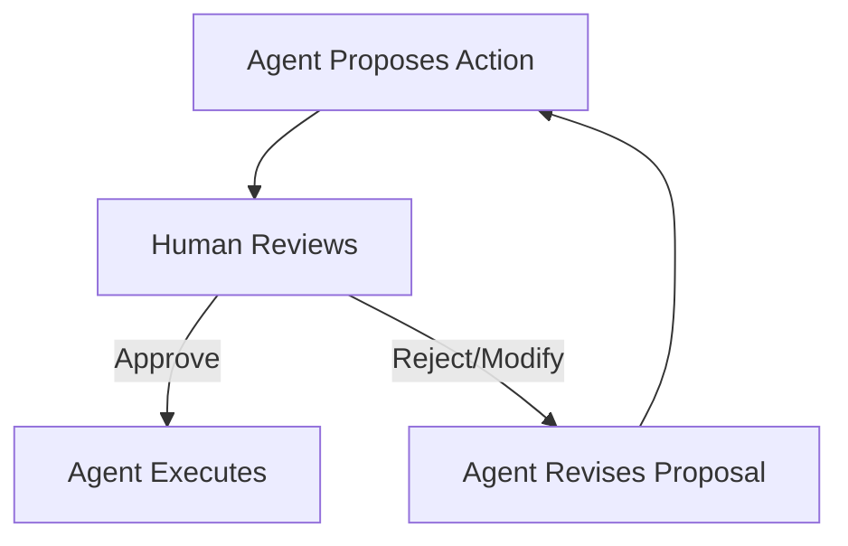
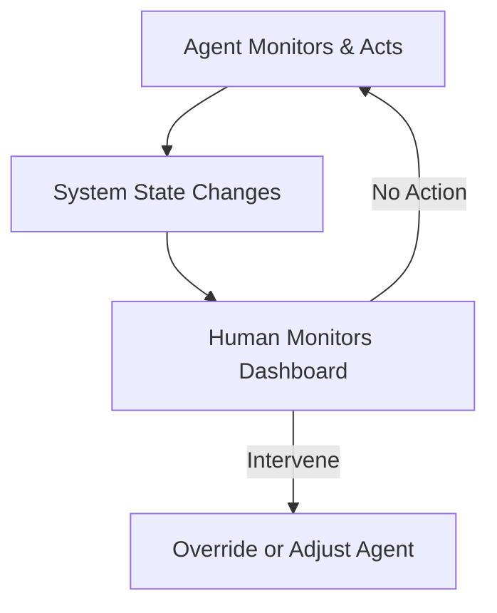
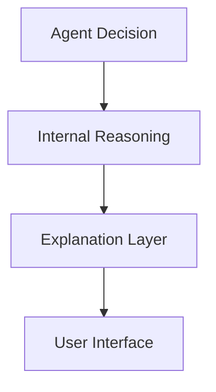
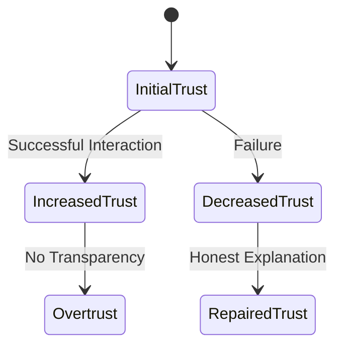
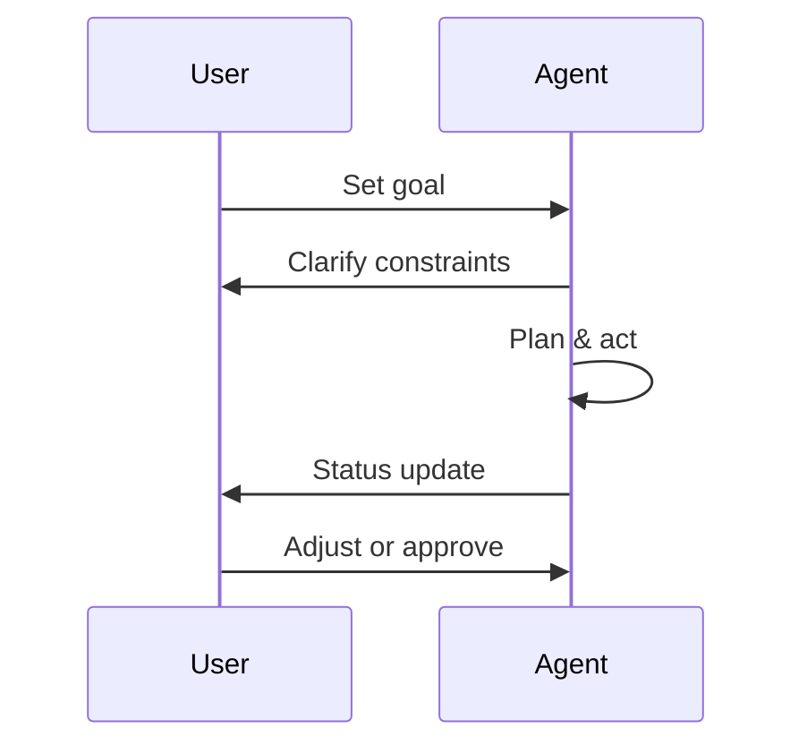

# Designing and Building Agentic Systems: Human-Agent Interaction

## Learning Objectives

- Distinguish levels of human involvement in agent systems
- Design agent behaviors that improve user trust
- Apply explainability principles to agentic decisions
- Evaluate effectiveness of human-agent collaboration

---

## Introduction

This chapter focuses on how humans interact with agentic systems, emphasizing trust, transparency, and usability.

---

# Designing and Building Agentic Systems: Human–Agent Interaction

---

As agentic systems move from research labs into everyday products—virtual assistants, autonomous vehicles, clinical decision-support tools, and enterprise copilots—the quality of **human–agent interaction** becomes just as important as the intelligence of the agent itself. An agent that can reason, plan, and act autonomously is only truly useful if humans can **understand it, trust it, and work with it effectively**. Poor interaction design can lead to misuse, disuse, overreliance, or even dangerous outcomes, regardless of how advanced the underlying algorithms are.

Historically, human–computer interaction (HCI) focused on deterministic software: buttons, menus, and predictable workflows. Agentic systems fundamentally change this relationship. They exhibit autonomy, adapt over time, make probabilistic decisions, and sometimes surprise their users. This shift introduces new challenges: How much control should humans have? How do we explain decisions that emerge from complex reasoning or learned behavior? How do users form accurate mental models of what an agent can and cannot do?

This chapter explores these questions through the lens of **trust, transparency, and usability**. We will move progressively from foundational concepts—such as levels of human involvement—to advanced design and evaluation practices for human–agent collaboration. Along the way, we will ground theory in real-world examples, detailed case studies, visual diagrams, and practical design guidance.

---

By the end of this chapter, you will be able to:

- Distinguish different levels of human involvement in agentic systems and understand when each is appropriate  
- Design agent behaviors and interactions that support appropriate user trust  
- Apply principles of explainability and transparency to agentic decision-making  
- Design effective interfaces tailored to autonomous and semi-autonomous agents  
- Evaluate the effectiveness of human–agent collaboration using qualitative and quantitative methods  

---

## Human-in-the-Loop vs Human-on-the-Loop

Human involvement in agentic systems exists on a spectrum rather than a binary choice. Two foundational concepts—**Human-in-the-Loop (HITL)** and **Human-on-the-Loop (HOTL)**—emerged from early work in automation, aviation, and safety-critical systems. Understanding their differences is essential for designing interactions that balance autonomy with accountability.

### Understanding the Core Concepts

In **Human-in-the-Loop** systems, the agent cannot complete critical actions without explicit human input or approval. The human is an active participant in the decision-making loop. This approach traces its roots to early expert systems and decision-support tools in medicine and finance, where human judgment was considered indispensable due to ethical, legal, and contextual complexity.

By contrast, **Human-on-the-Loop** systems allow the agent to act autonomously while a human supervises the process and can intervene if necessary. This model became prominent with the rise of autonomous vehicles, industrial robotics, and large-scale monitoring systems, where constant human input would be impractical but oversight remains crucial.

An everyday analogy helps clarify the distinction:

- HITL is like a **GPS that asks you to confirm every turn** before proceeding.
- HOTL is like **cruise control**: the system operates on its own, but you are ready to brake or steer if conditions change.

### Why the Distinction Matters

The choice between HITL and HOTL has profound implications for:

- **Safety**: HITL reduces risk in uncertain or high-stakes environments, while HOTL scales better in fast or complex systems.
- **Cognitive load**: HITL can overwhelm users with constant decisions; HOTL risks disengagement and complacency.
- **Responsibility and accountability**: Clear role definition is essential to avoid ambiguity when errors occur.

A common mistake in agent design is assuming that more autonomy is always better. In reality, **misaligned autonomy**—too much or too little—often leads to worse outcomes than a carefully calibrated approach.

### How These Models Work in Practice

In HITL systems, interaction typically follows a step-by-step loop:

HOTL systems shift the loop:

These diagrams highlight a critical design insight: **interaction frequency and timing** differ dramatically between the two models.

### Comparative Overview

| Dimension | Human-in-the-Loop | Human-on-the-Loop |
|---------|------------------|------------------|
| Human role | Active decision-maker | Supervisor/intervenor |
| Agent autonomy | Limited | High |
| Typical domains | Medicine, law, finance | Robotics, logistics, monitoring |
| Risk tolerance | Low | Medium to high |
| Scalability | Low to medium | High |

### Practical Examples

- **Medical diagnosis tools** often use HITL: an AI suggests diagnoses, but clinicians make final decisions.
- **Content moderation at scale** often uses HOTL: agents flag content and act automatically, with human reviewers auditing edge cases.
- **Autonomous drones** may combine both: HOTL during routine flight, HITL for mission-critical decisions.

### Limitations and Trade-offs

Neither model is universally superior. HITL systems can slow down workflows and frustrate users, while HOTL systems risk **automation bias**, where humans over-trust the agent and fail to intervene when necessary. Modern agentic systems increasingly adopt **adaptive autonomy**, dynamically shifting between HITL and HOTL based on context, confidence, and risk.

---

## Explainability and Transparency in Agents

As agentic systems become more autonomous, users increasingly ask a simple but powerful question: **“Why did it do that?”** Explainability and transparency address this need, forming the backbone of accountable and trustworthy human–agent interaction.

### Defining Explainability and Transparency

**Explainability** refers to the agent’s ability to provide understandable reasons for its actions or recommendations. **Transparency** is broader, encompassing visibility into the agent’s goals, limitations, data sources, and decision boundaries. While related, they are not identical: a system can be transparent about its processes without being easily explainable to non-experts.

Historically, early rule-based systems were inherently explainable because decisions followed explicit rules. Modern learning-based agents, especially those using deep learning or large language models, reintroduced opacity—often described as the “black box” problem.

### Why Explainability Matters

Explainability is not merely a technical feature; it is a **social and cognitive bridge** between humans and agents. It supports:

- **Trust calibration**: Users adjust reliance based on understanding.
- **Error detection**: Explanations help users catch mistakes.
- **Learning and adoption**: Users learn how to work with the agent effectively.
- **Ethical and legal compliance**: Many domains require justifications for decisions.

Without explanations, users may either blindly trust the agent or reject it entirely—both undesirable outcomes.

### Types of Explanations

Explanations can be delivered at different levels and times:

| Explanation Type | Description | Example |
|------------------|-------------|---------|
| Global | How the agent works in general | “This agent prioritizes safety over speed.” |
| Local | Why a specific decision was made | “I rerouted due to heavy traffic ahead.” |
| Process-based | Steps taken during reasoning | “I evaluated three options, then chose the lowest risk.” |
| Outcome-based | Focus on results, not reasoning | “This option reduces cost by 12%.” |

A critical design principle is **audience alignment**: explanations should match the user’s expertise and goals.

### How to Design Effective Explanations

Effective explanations are:

- **Selective**: Not every detail is useful.
- **Contextual**: Triggered when users need them.
- **Actionable**: Help users decide what to do next.
- **Honest**: Acknowledge uncertainty and limitations.

An analogy helps: good explanations are like a skilled teacher, not a raw data dump.

### Visualizing Explainability Layers

This layered view emphasizes that explainability is often an **interface and interaction problem**, not just a model problem.

### Common Pitfalls

- Over-explaining and overwhelming users  
- Providing post-hoc rationalizations that don’t reflect real reasoning  
- Using technical jargon instead of user-centered language  

---

## Trust Calibration and User Mental Models

Trust in agentic systems is not about maximizing trust—it is about **calibrating trust appropriately**. Users should rely on agents when they are competent and remain cautious when they are not.

### What Is Trust Calibration?

Trust calibration refers to the alignment between an agent’s actual capabilities and the user’s perceived capabilities of that agent. Miscalibration occurs in two forms:

- **Overtrust**: Users rely on the agent beyond its competence.
- **Undertrust**: Users ignore or override a capable agent.

Both lead to suboptimal outcomes.

### Mental Models: How Users Understand Agents

A **mental model** is the internal representation users form about how a system works. These models are shaped by:

- Past experiences with similar systems  
- Interface cues and metaphors  
- Explanations and feedback from the agent  

For example, if an agent speaks confidently and never expresses uncertainty, users may assume it is always correct.

### Why Mental Models Matter

Accurate mental models enable users to:

- Predict agent behavior  
- Detect anomalies  
- Decide when to intervene  

Inaccurate models, by contrast, lead to frustration, misuse, or blind trust.

### Designing for Proper Trust Calibration

Effective strategies include:

- **Communicating uncertainty** (“I’m 60% confident in this result.”)
- **Progressive disclosure** of capabilities and limits
- **Consistent behavior** across similar situations
- **Feedback loops** that show consequences of actions

### Trust Dynamics Over Time

Trust is not static; it evolves through interaction. Early failures are particularly damaging, while transparent recovery from errors can actually strengthen trust.

### Everyday Analogies

- A new colleague: trust builds through reliable collaboration.
- A weather app: users learn when to rely on it and when to double-check.

---

## Interface Design for Agentic Systems

Interfaces are the **primary touchpoint** between humans and agents. Designing them requires rethinking traditional UI principles to accommodate autonomy, uncertainty, and dialogue.

### How Agent Interfaces Differ from Traditional UIs

Traditional interfaces assume:

- Predictable system behavior  
- User-driven actions  
- Static workflows  

Agentic interfaces must support:

- Proactive behavior  
- Mixed initiative (both human and agent can start actions)  
- Ongoing conversations  

### Core Design Principles

Key principles for agentic interfaces include:

- **Visibility of agent intent**: What is the agent trying to do?
- **Interruptibility**: Users must be able to pause or override.
- **Progress awareness**: Show what the agent is doing now and next.
- **Graceful failure handling**: Errors should be understandable and recoverable.

### Interaction Modalities

Agentic systems often combine multiple modalities:

| Modality | Strengths | Challenges |
|--------|-----------|------------|
| Text | Precise, searchable | Slower, cognitive load |
| Voice | Natural, hands-free | Ambiguity, privacy |
| Visual dashboards | Overview, monitoring | Complexity |
| Embodied agents | Social cues | Uncanny valley |

### Designing for Different User Roles

An engineer monitoring an agent needs different information than an end user. Role-based interfaces help manage complexity and prevent overload.

### Example Interface Flow

---

## Evaluating Human–Agent Collaboration

Evaluation closes the design loop. Without rigorous assessment, teams cannot know whether an agent truly improves human performance.

### Why Evaluation Is Hard

Human–agent collaboration involves:

- Subjective perceptions (trust, satisfaction)
- Objective performance (speed, accuracy)
- Long-term adaptation and learning

Single metrics are insufficient.

### Key Evaluation Dimensions

| Dimension | Example Metrics |
|---------|----------------|
| Task performance | Time, error rate |
| Trust | Survey scales, reliance behavior |
| Usability | SUS, task success |
| Collaboration quality | Intervention frequency, coordination |

### Methods and Approaches

Common approaches include:

- **Controlled experiments** comparing agent vs non-agent workflows  
- **Longitudinal studies** observing trust over time  
- **Simulation-based testing** for rare or dangerous scenarios  

### Interpreting Results Thoughtfully

High automation may improve speed but reduce situational awareness. Evaluation must consider trade-offs and unintended consequences.

---

## Case Study: Human–Agent Collaboration in Clinical Decision Support

### Context

In a large urban hospital network, clinicians faced increasing diagnostic complexity due to rising patient volumes and multimorbidity. Leadership introduced an AI-driven clinical decision-support agent designed to assist physicians during patient intake and diagnosis.

The agent analyzed patient records, lab results, and medical literature in real time, proposing potential diagnoses and treatment options. The system was deployed across emergency departments, where speed and accuracy were critical.

### Problem

Early pilots revealed mixed results. While the agent improved diagnostic coverage, clinicians reported discomfort and skepticism. Some followed recommendations blindly; others ignored them entirely. Errors occurred when the agent’s confidence masked uncertainty.

The core issue was not algorithmic accuracy but **human–agent interaction breakdown**. Clinicians lacked clear explanations and struggled to understand when the agent was reliable.

### Solution

The design team restructured the system around HITL principles for high-risk decisions and HOTL for routine cases. They added layered explanations, uncertainty indicators, and a redesigned interface emphasizing collaboration.

Training sessions focused on building accurate mental models, using real cases to demonstrate strengths and limitations.

### Results

Within six months, diagnostic accuracy improved by 18%, and clinician-reported trust stabilized at appropriate levels. Intervention rates aligned with risk profiles, indicating better calibration.

Importantly, clinicians reported feeling “supported rather than replaced.”

### Lessons Learned

- Interaction design mattered more than raw intelligence  
- Transparent uncertainty improved trust more than confident assertions  
- Trust is earned through consistent, honest collaboration  

---

## Summary

Human–agent interaction is the linchpin of effective agentic systems. By understanding levels of human involvement, designing for explainability and trust calibration, crafting thoughtful interfaces, and rigorously evaluating collaboration, designers can ensure agents enhance rather than hinder human capabilities. The goal is not autonomy for its own sake, but **productive partnership**.

---

## Reflection Questions

1. When might a system benefit from dynamically shifting between HITL and HOTL?  
2. How can explanations be tailored to different user expertise levels?  
3. What signals might indicate overtrust or undertrust in an agent?  
4. How would you evaluate long-term trust in an agentic system you design?