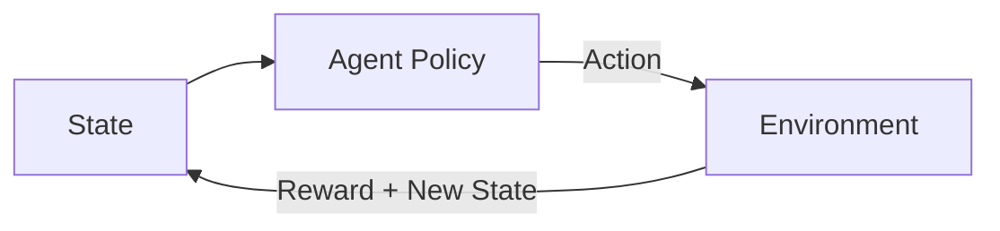
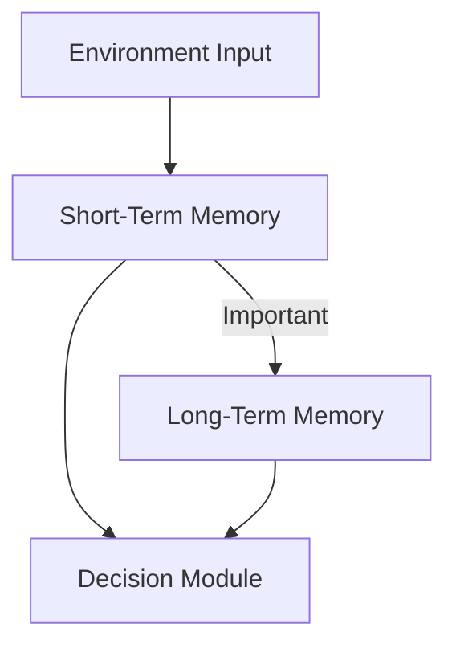
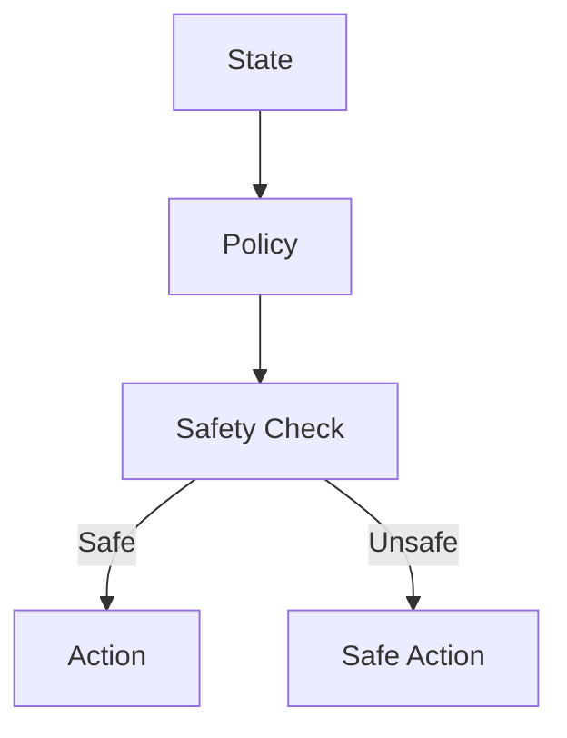
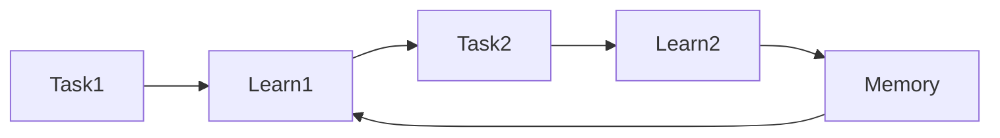

# Designing and Building Agentic Systems: Learning Mechanisms in Agentic AI

## Learning Objectives

- Apply learning techniques to improve agent performance
- Design memory and feedback systems for agents
- Assess risks associated with autonomous learning

---

## Introduction

This chapter focuses on how agents learn from experience and improve over time, integrating reinforcement learning, memory, and feedback mechanisms.

---

Agentic systems are designed to act autonomously in dynamic environments, making decisions, taking actions, and adapting their behavior over time. Unlike static software systems that follow predefined rules, agentic AI systems are expected to *learn from experience*, improve their performance, and handle uncertainty in the real world. This capability is what allows an AI agent to become more helpful, efficient, and aligned with its goals as it operates.

Learning mechanisms are therefore at the heart of agentic AI. Whether it is a customer support agent learning which responses lead to higher user satisfaction, a robotic agent learning to navigate safely, or a planning agent learning how to allocate resources more efficiently, learning enables agents to evolve. However, enabling learning also introduces complexity and risk: agents may learn the wrong behaviors, forget important knowledge, or act unsafely if not properly constrained.

This chapter explores how learning is designed and implemented in agentic systems. We focus on reinforcement learning, memory and state tracking, feedback loops, and the challenges of continual learning. By the end, you should understand not only *how* agents learn, but *why* different learning mechanisms are chosen and *when* they should be applied.

---

By the end of this chapter, you will be able to:

- Apply reinforcement learning concepts to improve agent decision-making
- Design memory and state-tracking systems that support long-term learning
- Compare online and offline learning approaches for agentic systems
- Balance exploration and exploitation while maintaining safety
- Assess risks and design strategies for continual and lifelong learning

---

## Reinforcement Learning for Agents

Reinforcement Learning (RL) is one of the most influential learning paradigms in agentic AI. At its core, RL is about learning through interaction: an agent takes actions in an environment, receives feedback in the form of rewards or penalties, and updates its behavior to maximize long-term reward. This mirrors how humans and animals learn many skills—by trying, observing outcomes, and adjusting behavior.

An RL-based agent operates within a feedback loop. The agent observes the current state of the environment, chooses an action based on its policy, and then receives a reward signal along with a new state. Over time, the agent learns which actions tend to produce better outcomes. This is especially powerful for agentic systems because it does not require explicit programming of every behavior; instead, the agent discovers effective strategies through experience.

In agentic systems, reinforcement learning is often combined with planning, reasoning, and symbolic logic. For example, an AI assistant may use RL to decide *how* to ask clarifying questions, while using a symbolic planner to decide *what* task it is trying to accomplish. This hybrid approach allows agents to be both adaptive and interpretable.

### Core Components of Reinforcement Learning

| Component | Description | Role in Agentic Systems |
|---------|-------------|-------------------------|
| Agent | The decision-making entity | Chooses actions autonomously |
| Environment | The external system the agent interacts with | Provides feedback and constraints |
| State | Representation of the current situation | Basis for decision-making |
| Action | Possible choices the agent can take | Determines behavior |
| Reward | Scalar feedback signal | Guides learning objectives |

### Reinforcement Learning Feedback Loop

### Practical Example: Customer Support Agent

Consider an AI customer support agent that learns to respond more effectively over time:

- **State**: Current conversation context, user sentiment
- **Action**: Choosing a response strategy (empathetic, technical, concise)
- **Reward**: User satisfaction score or conversation resolution

Over thousands of interactions, the agent learns which responses lead to better outcomes, even if it was not explicitly programmed with those rules.

### Common Reinforcement Learning Approaches

| Approach | Key Idea | Typical Use Case |
|--------|----------|------------------|
| Q-Learning | Learn value of state-action pairs | Discrete action spaces |
| Policy Gradients | Directly optimize policy | Complex or continuous actions |
| Actor-Critic | Combine value and policy learning | Stable learning in large systems |

---

## Memory, State Tracking, and Knowledge Accumulation

Learning is only useful if an agent can *remember* what it has learned. Memory in agentic systems provides continuity across time, allowing agents to accumulate knowledge, track context, and adapt behavior based on past experiences. Without memory, an agent would behave like a goldfish—reacting only to the present moment.

Memory can be short-term or long-term. Short-term memory tracks the current context, such as recent actions or conversation history. Long-term memory stores learned knowledge, patterns, and preferences that persist across sessions. Effective agentic systems carefully design both types and define how information moves between them.

State tracking is closely related to memory. A “state” is the agent’s internal representation of the world at a given moment. As the environment changes, the agent updates its state. Good state representations capture what is relevant and ignore unnecessary details, enabling more efficient learning.

### Types of Memory in Agentic Systems

| Memory Type | Time Scale | Example |
|------------|-----------|---------|
| Short-term memory | Seconds to minutes | Current task context |
| Episodic memory | Single experiences | Past conversations |
| Semantic memory | Long-term knowledge | Facts, rules, skills |
| Procedural memory | Skills and behaviors | Learned policies |

### Memory Flow in an Agent

### Case Study: Personal Productivity Agent

A productivity agent that schedules meetings and reminders benefits greatly from memory:

- It remembers user preferences (e.g., no meetings on Fridays).
- It tracks past scheduling conflicts.
- It learns which reminders users tend to ignore.

By accumulating this knowledge, the agent becomes more helpful and personalized over time.

### Challenges in Memory Design

- Deciding **what to store** and **what to forget**
- Preventing outdated or incorrect knowledge from dominating decisions
- Balancing memory size with computational efficiency

---

## Online vs Offline Learning

Agentic systems can learn in different modes depending on when and how data is collected and used. The two most common approaches are **offline learning** and **online learning**, each with distinct trade-offs.

Offline learning involves training the agent on a fixed dataset before deployment. This is common when safety, predictability, or regulatory compliance is critical. The agent does not update its behavior in real time but relies on pre-learned knowledge.

Online learning, in contrast, allows agents to update their models continuously while interacting with the environment. This enables rapid adaptation but also introduces risks, such as learning undesirable behaviors from noisy or malicious feedback.

### Comparison of Learning Modes

| Aspect | Offline Learning | Online Learning |
|------|-----------------|----------------|
| Adaptability | Low after deployment | High and continuous |
| Safety | Easier to control | Requires safeguards |
| Data Source | Historical datasets | Live interaction data |
| Use Case | Medical AI, finance | Recommendation systems |

### Hybrid Learning Pipeline

### Real-World Example

A navigation agent for autonomous delivery vehicles may:

- Train offline using simulated traffic data.
- Fine-tune online to adapt to new routes or construction.

This hybrid approach balances safety and adaptability.

---

## Exploration, Exploitation, and Safety

One of the central dilemmas in learning agents is the **exploration–exploitation trade-off**. Exploration involves trying new actions to discover potentially better strategies. Exploitation involves using known strategies that already work well. Too much exploration can be dangerous; too much exploitation can lead to stagnation.

In agentic systems, this trade-off has real-world consequences. A recommendation agent that explores too aggressively may show irrelevant content, while one that exploits too much may reinforce narrow user preferences. Safety-aware design ensures that exploration does not violate constraints or cause harm.

### Exploration Strategies

| Strategy | Description | Risk Level |
|--------|-------------|------------|
| ε-greedy | Random actions with small probability | Moderate |
| Softmax | Probabilistic action selection | Lower |
| Safe exploration | Constrained exploration | Lowest |

### Exploration with Safety Constraints

### Practical Example: Healthcare Triage Agent

A healthcare triage agent must explore carefully:

- It can experiment with phrasing questions differently.
- It must never explore actions that could risk patient safety.

This is achieved by combining exploration policies with strict safety filters.

---

## Continual and Lifelong Learning

Continual learning refers to an agent’s ability to learn new tasks without forgetting old ones. Lifelong learning extends this idea across the entire operational life of the agent. This is particularly important for long-lived agentic systems such as personal assistants or enterprise automation agents.

A major challenge in continual learning is **catastrophic forgetting**, where learning new information degrades previously learned knowledge. Agentic systems must therefore use techniques like memory replay, modular architectures, or regularization to preserve past skills.

### Lifelong Learning Techniques

| Technique | Purpose | Example |
|---------|---------|---------|
| Experience replay | Retain past knowledge | Storing old interactions |
| Modular learning | Isolate skills | Task-specific modules |
| Regularization | Prevent forgetting | Weight constraints |

### Continual Learning Lifecycle

### Long-Term Agent Example

A virtual assistant that operates for years must:

- Learn new user preferences.
- Adapt to new tools and APIs.
- Retain core communication skills.

Designing for lifelong learning ensures the agent remains useful rather than obsolete.

---

## Summary

Learning mechanisms transform agentic systems from static tools into adaptive, intelligent collaborators. Reinforcement learning provides a foundation for decision-making through feedback, while memory and state tracking enable continuity and personalization. Online and offline learning offer different trade-offs between safety and adaptability, and exploration strategies must be carefully balanced to avoid harm. Finally, continual and lifelong learning ensure that agents remain effective over long periods without forgetting essential knowledge.

Together, these mechanisms define how agentic AI systems grow, adapt, and improve—making learning not just a feature, but a defining characteristic of intelligent agents.

---

## Reflection Questions

1. When would you prefer offline learning over online learning for an agentic system, and why?
2. How might poor memory design negatively impact an autonomous agent?
3. What safeguards would you introduce to ensure safe exploration in high-risk domains?
4. How can continual learning be balanced with the need for system stability?