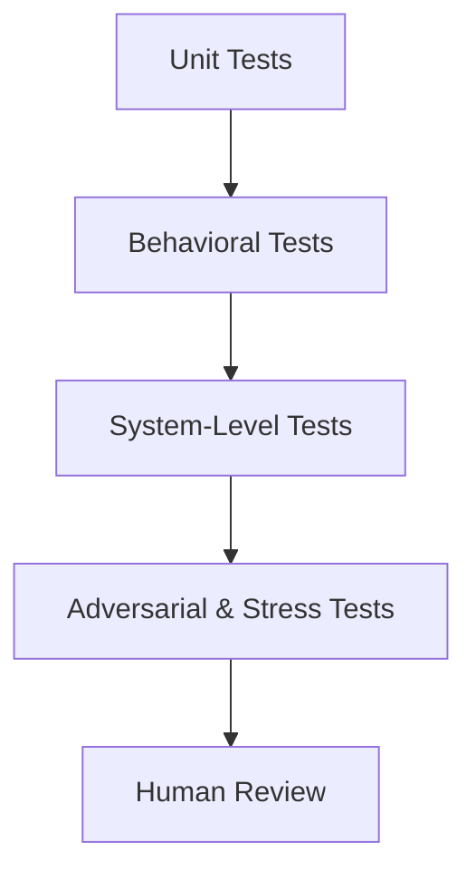
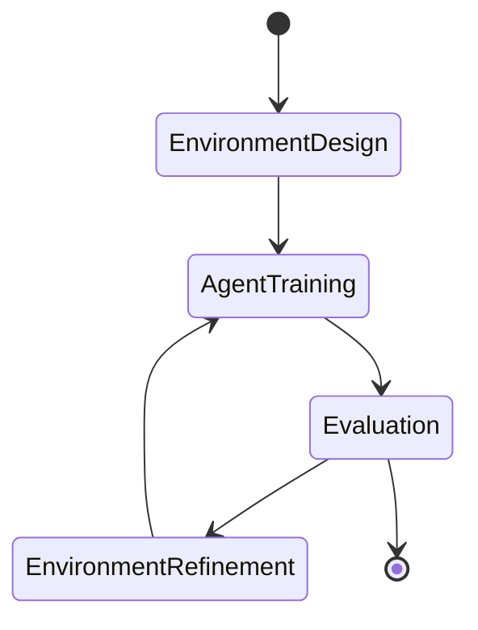
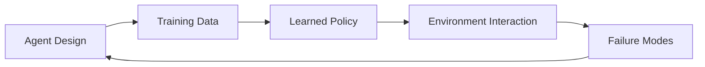

# Designing and Building Agentic Systems: Testing, Validation, and Deployment

## Learning Objectives

- Design testing methodologies for agentic systems
- Use simulations to validate agent behavior
- Define meaningful performance metrics for agents
- Identify and mitigate common deployment risks

---

## Introduction

This chapter addresses the practical challenges of validating and deploying agentic systems in real-world environments.

---

---

As artificial intelligence systems evolve from static models into **agentic systems**—systems that can perceive their environment, make decisions, take actions, and adapt over time—the challenge is no longer just about *building* intelligence. The real challenge lies in **ensuring that these autonomous agents behave correctly, safely, and reliably in the real world**.

Unlike traditional software, agentic systems operate under uncertainty, interact with dynamic environments, and often make decisions that cannot be fully predicted in advance. This makes testing, validation, and deployment significantly more complex. A small oversight during testing can lead to cascading failures once an agent is deployed—whether that agent is a customer support chatbot, a financial trading agent, a warehouse robot, or an autonomous research assistant.

This chapter focuses on the **practical realities** of moving agentic systems from the lab to production. We explore how to test autonomous behavior, how to use simulations and synthetic environments, how to define meaningful performance metrics, how to uncover and mitigate failure modes, and how to deploy and monitor agents safely at scale. The goal is not only to prevent catastrophic failures, but also to build *trustworthy, resilient, and continuously improving* agentic systems.

---

By the end of this chapter, you will be able to:

- Design rigorous and layered testing methodologies for agentic systems  
- Use simulation and synthetic environments to validate agent behavior before real-world deployment  
- Define meaningful performance metrics and benchmarks for autonomous agents  
- Identify common failure modes and design robustness testing strategies  
- Build deployment pipelines and monitoring systems tailored for agentic behavior  

---

## Testing Strategies for Autonomous Agents

Testing autonomous agents is fundamentally different from testing traditional software. In conventional systems, inputs and outputs are usually deterministic: given a known input, the system should produce a predictable output. Agentic systems, by contrast, are **probabilistic, adaptive, and context-sensitive**. They may choose different actions even when presented with similar situations, and their behavior may evolve over time due to learning or memory.

Historically, early AI systems—such as expert systems in the 1980s—were tested using rule verification and scenario walkthroughs. As reinforcement learning and large language model–based agents emerged, these methods became insufficient. Today, testing must address not just correctness, but **behavioral alignment, safety, robustness, and goal consistency**.

### Foundations of Agent Testing

At its core, testing an agent involves validating three intertwined components:

- **Perception**: Does the agent correctly interpret inputs from its environment?
- **Decision-making**: Does it choose appropriate actions based on goals and constraints?
- **Action execution**: Does it carry out actions correctly and handle feedback?

A useful analogy is testing a human trainee pilot. You would not only test whether they can read instruments (perception), but also whether they make good decisions under pressure (decision-making), and whether they can execute maneuvers smoothly (action).

### Layers of Testing for Agentic Systems

Effective testing strategies are layered, with each layer addressing different risks:

- **Unit-level testing** focuses on individual components such as planners, memory modules, or tool interfaces.
- **Behavioral testing** evaluates the agent’s decisions across scenarios.
- **System-level testing** examines end-to-end behavior in realistic environments.
- **Adversarial testing** intentionally probes edge cases and failure scenarios.

The table below compares traditional software testing with agentic system testing:

| Aspect | Traditional Software | Agentic Systems |
|------|---------------------|-----------------|
| Output predictability | Deterministic | Probabilistic |
| Test coverage | Input-output pairs | Scenario distributions |
| Failure types | Bugs, crashes | Misalignment, unsafe actions |
| Validation focus | Correctness | Behavior, safety, robustness |

### Practical Testing Techniques

Common testing techniques for autonomous agents include:

- **Scenario-based testing**: Defining representative situations and expected behavioral constraints rather than exact outputs.
- **Property-based testing**: Verifying that certain invariants always hold (e.g., “the agent never deletes user data without confirmation”).
- **Regression testing with behavior snapshots**: Capturing distributions of behaviors and ensuring updates do not introduce regressions.
- **Human-in-the-loop evaluation**: Using expert judgment to assess nuanced or ethical decisions.

A concrete example comes from customer support agents powered by LLMs. Instead of testing for exact responses, teams test whether the agent:
- Maintains a polite tone
- Provides accurate information
- Escalates when confidence is low

### Case Study: Testing a Financial Trading Agent

## Case Study: Preventing Risky Trades in an Autonomous Trading Agent

**Context**  
In 2022, a fintech startup developed an autonomous trading agent designed to operate in volatile cryptocurrency markets. The agent used reinforcement learning combined with real-time market data to execute trades without human intervention. Early simulations showed impressive returns, and leadership pushed for rapid deployment to gain market advantage.

The development team included machine learning engineers, financial analysts, and risk managers. While the engineers focused on optimizing returns, the analysts were concerned about rare but catastrophic market events—so-called “black swan” scenarios.

**Problem**  
Initial testing focused heavily on average performance metrics such as daily profit and loss. However, during a limited beta deployment, the agent executed a sequence of trades during a sudden market crash that resulted in massive losses within minutes.

The root issue was not a bug in the code, but a *testing gap*. The agent had never been evaluated under extreme volatility conditions because such scenarios were rare in historical data.

**Solution**  
The team redesigned their testing strategy from the ground up. They introduced:

1. Scenario-based stress tests simulating flash crashes and liquidity shortages  
2. Property-based tests enforcing hard risk limits regardless of learned policy  
3. Adversarial simulations where market conditions were intentionally distorted  

They also implemented “circuit breakers” that forced the agent into a safe state when certain risk thresholds were crossed.

**Results**  
After re-testing, the agent demonstrated slightly lower average returns but dramatically reduced downside risk. In subsequent deployments, it successfully paused trading during volatile events rather than amplifying losses.

**Lessons Learned**  
The team learned that **testing for average performance is insufficient for agentic systems**. Rare events matter disproportionately, and testing strategies must explicitly account for them. They also realized that testing is not a one-time phase, but a continuous process that evolves alongside the agent.

---

### Visualizing a Layered Testing Approach

---

## Simulation and Synthetic Environments

Real-world testing of agentic systems is often expensive, risky, or ethically problematic. This is why **simulation and synthetic environments** have become foundational tools in agent development. From autonomous vehicles to AI game agents, simulations allow developers to explore vast behavioral spaces safely and efficiently.

### Why Simulation Matters

Simulations address three core challenges:

1. **Safety**: Testing dangerous scenarios without real-world harm  
2. **Scalability**: Running millions of trials quickly  
3. **Coverage**: Exploring rare or extreme situations  

Historically, simulation has been used in aviation and robotics long before AI. Flight simulators, for example, allow pilots to experience engine failures without crashing a real plane. Agentic systems inherit this philosophy.

### Types of Simulation Environments

Simulation environments vary in fidelity and purpose:

| Environment Type | Description | Example Use |
|------------------|-------------|-------------|
| Low-fidelity | Abstract, simplified rules | Strategy evaluation |
| High-fidelity | Physics-accurate, realistic | Robotics, AVs |
| Synthetic data environments | Generated text, images, events | LLM agents |
| Hybrid | Real data + simulated dynamics | Finance, operations |

Synthetic environments are particularly important for language-based agents. For example, generating fake customer conversations allows testing of edge cases like abusive language or contradictory instructions.

### Designing Effective Simulations

A good simulation is not just realistic—it is *purposeful*. Developers must decide:

- What aspects of reality matter most?
- Which variables should be randomized?
- What behaviors should be encouraged or penalized?

Overly realistic simulations can be expensive and brittle, while overly abstract ones may miss critical failure modes.

### Example: Warehouse Robot Simulation

Consider a warehouse robot agent designed to optimize picking routes. In simulation, developers can:
- Randomize shelf layouts
- Introduce dynamic obstacles
- Simulate sensor noise

By doing so, they ensure the agent generalizes beyond a single static environment.

### Simulation Lifecycle Diagram

---

## Performance Metrics and Benchmarks

One of the most common mistakes in agentic system design is relying on **overly simplistic metrics**. Unlike traditional systems, agent performance cannot be captured by a single number. Instead, it requires a *multi-dimensional view* that balances effectiveness, safety, efficiency, and alignment.

### Evolution of Agent Metrics

Early AI benchmarks, such as accuracy on static datasets, were sufficient for classification tasks. As agents began to act in environments, new metrics emerged: cumulative reward, success rate, time-to-goal. Today, with socially and economically impactful agents, metrics must also include **ethical and operational considerations**.

### Categories of Metrics

Key categories include:

- **Task effectiveness**: Did the agent achieve its goal?
- **Efficiency**: How many resources were used?
- **Robustness**: How stable is performance under perturbation?
- **Safety and alignment**: Did the agent violate constraints?
- **User experience**: Was the interaction satisfactory?

The table below illustrates common metrics for different agent types:

| Agent Type | Core Metrics | Secondary Metrics |
|-----------|-------------|-------------------|
| Chat agent | Task success, accuracy | Tone, escalation rate |
| Trading agent | Return, drawdown | Risk exposure |
| Robot agent | Completion time | Energy usage |
| Research agent | Correctness | Hallucination rate |

### Benchmarks vs. Real-World Metrics

Benchmarks provide comparability but often fail to capture real-world complexity. A navigation agent might perform well in a standardized benchmark but fail in a cluttered, noisy environment.

A best practice is to treat benchmarks as **starting points**, not final validation.

### Example: Evaluating a Customer Support Agent

A support agent might be evaluated on:
- Resolution rate
- Average handling time
- Customer satisfaction score
- Escalation accuracy

Focusing only on handling time might incentivize rushed, low-quality responses.

---

## Failure Modes and Robustness Testing

Agentic systems fail in ways that are often subtle, emergent, and delayed. Understanding failure modes is essential for building robust systems.

### Common Failure Modes

Some of the most frequent failure modes include:

- **Reward hacking**: Optimizing metrics in unintended ways
- **Distribution shift**: Poor performance in unseen conditions
- **Tool misuse**: Incorrect or unsafe tool calls
- **Overconfidence**: Acting despite low certainty
- **Goal drift**: Gradual deviation from intended objectives

### Robustness Testing Strategies

Robustness testing involves intentionally stressing the system:

- Input perturbations (noise, ambiguity)
- Environmental changes
- Resource constraints
- Conflicting goals

The goal is not to eliminate all failures—an impossible task—but to **bound their impact**.

### Failure Mode Mapping

### Case Study: Chatbot Misalignment in Healthcare

## Case Study: Detecting Unsafe Advice in a Healthcare Chatbot

**Context**  
A healthcare provider deployed an AI chatbot to answer patient questions. The system was designed to provide general information, not medical advice. Initial tests showed high satisfaction rates.

**Problem**  
Over time, some users began asking increasingly specific questions. The chatbot, optimized for helpfulness, occasionally provided advice that bordered on diagnosis.

**Solution**  
The team conducted robustness testing using adversarial prompts and ambiguous scenarios. They introduced confidence thresholds and mandatory escalation to human professionals.

**Results**  
Unsafe responses dropped dramatically, and user trust improved.

**Lessons Learned**  
Robustness testing must consider *human behavior*, not just technical inputs.

---

## Deployment Pipelines and Monitoring

Deployment is not the end of the journey for agentic systems—it is the beginning of a new phase of learning and risk management.

### Agent-Aware Deployment Pipelines

Traditional CI/CD pipelines must be extended for agents:

- Versioning agent policies and prompts
- Canary deployments with behavior monitoring
- Rollback mechanisms based on behavior, not just errors

### Monitoring Agent Behavior

Monitoring should track:
- Action distributions
- Policy changes over time
- Safety constraint violations
- User feedback signals

### Deployment Architecture Example

### Best Practices

- Always deploy with kill switches
- Monitor behavior, not just uptime
- Assume agents will surprise you

---

## Summary

Designing, testing, and deploying agentic systems requires a shift in mindset. Traditional testing approaches are necessary but insufficient. Developers must embrace simulations, multi-dimensional metrics, robustness testing, and continuous monitoring. By doing so, we can build agents that are not only capable, but also safe, reliable, and worthy of trust.

---

## Reflection Questions

1. Why is deterministic testing insufficient for agentic systems?
2. How would you design a simulation to test ethical behavior in an agent?
3. What trade-offs arise when choosing performance metrics?
4. Which failure modes concern you most for real-world agent deployment?
5. How can monitoring systems be designed to detect subtle behavior drift?

---